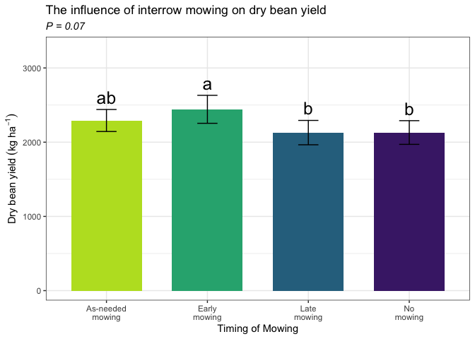
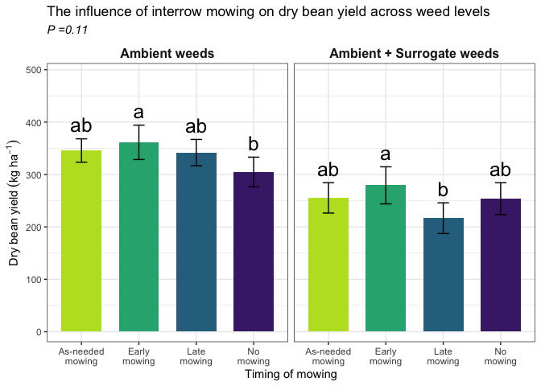
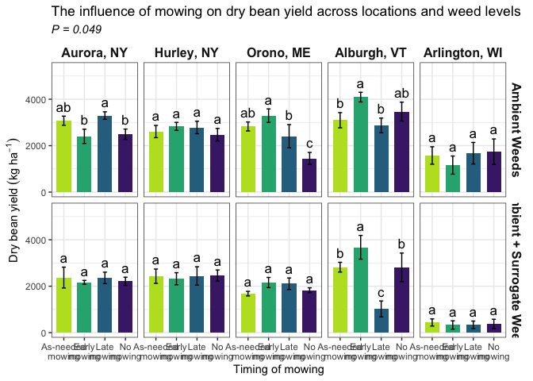

dry_bean_yield_2023
================

# **Load libraries**

``` r
#Set work directory
setwd("/Users/ey239/Github/IMT/rmarkdowns")

#Load packages 
library(tidyverse) ##install.packages("tidyverse")
library(knitr)
library(patchwork) ##install.packages("patchwork")
library(skimr)     ##install.packages("skimr")
library(readxl)
library(janitor) ##install.packages("janitor")

library(kableExtra) ##install.packages("kableExtra")
library(webshot) ##install.packages("webshot")
webshot::install_phantomjs()
library(viridis) ##install.packages("viridis")
library(lme4) ##install.packages("lme4")
library(lmerTest) ##install.packages("lmerTest")
library(emmeans) ##install.packages("emmeans")
library(rstatix) ##install.packages("rstatix")
#library(Matrix) ##install.packages("Matrix")
library(multcomp) ##install.packages("multcomp")
library(multcompView) ##install.packages("multcompView")
library(ggResidpanel) ##install.packages("ggResidpanel")
#library(car)
#library(TMB)  ##install.packages("TMB")
#library(glmmTMB)  ##install.packages("glmmTMB")
#library(DHARMa)  ##install.packages("DHARMa")

#Load Functions
MeanPlusSe<-function(x) mean(x)+plotrix::std.error(x)

find_logw0=function(x){c=trunc(log(min(x[x>0],na.rm=T)))
d=exp(c)
return(d)}
```

<br>

# **Load and Clean Data**

### **Load individual datasets**

``` r
fh_raw_2023 <- read_excel("~/Github/IMT/raw-data/farmhub_raw_2023.xlsx")
kable(head(fh_raw_2023))
```

| ID | LOC | TRT | BLOCK | PLOT | MICROPLOT | EMERG | BBM | INTRAWBM | INTERWBM | WBM | DEN | BEANYD |
|:---|:---|:---|---:|---:|:---|---:|---:|---:|---:|---:|---:|---:|
| FH_B1_P101 | FH | EWC | 1 | 101 | M | 21 | 87.18 | 0.75 | 16.50 | 17.25 | 44 | 367.79 |
| FH_B1_P101_SW | FH | EWC | 1 | 101 | SW | 24 | 40.32 | 3.54 | 37.65 | 41.19 | 45 | 218.00 |
| FH_B1_P102 | FH | LWC | 1 | 102 | M | 24 | 72.37 | 6.47 | 12.71 | 19.18 | 52 | 268.00 |
| FH_B1_P102_SW | FH | LWC | 1 | 102 | SW | 24 | 63.33 | 7.54 | 11.33 | 18.87 | 49 | 177.30 |
| FH_B1_P103 | FH | AWC | 1 | 103 | M | 23 | 148.62 | 4.22 | 0.00 | 4.22 | 43 | 290.00 |
| FH_B1_P103_SW | FH | AWC | 1 | 103 | SW | 26 | 84.27 | 2.90 | 8.13 | 11.03 | 39 | 236.00 |

``` r
cu_raw_2023 <- read_excel("~/Github/IMT/raw-data/cornell_raw_2023.xlsx")
kable(head(cu_raw_2023))
```

| ID | LOC | TRT | BLOCK | PLOT | MICROPLOT | EMERG | BBM | INTRABM | INTERBM | TOTWBM | BEANDEN | BEANYD |
|:---|:---|:---|---:|---:|:---|---:|---:|---:|---:|---:|---:|---:|
| CU_B1_P101 | CU | EWC | 1 | 101 | M | 22 | 91.99 | 9.39 | 20.64 | 30.03 | 19.0 | 222 |
| CU_B1_P101_SW | CU | EWC | 1 | 101 | SW | 19 | 71.80 | 22.33 | 19.62 | 41.95 | 15.5 | 299 |
| CU_B1_P102 | CU | LWC | 1 | 102 | M | 22 | 83.84 | 7.23 | 14.75 | 21.98 | 22.0 | 472 |
| CU_B1_P102_SW | CU | LWC | 1 | 102 | SW | 26 | 81.23 | 13.07 | 9.65 | 22.72 | 16.5 | 307 |
| CU_B1_P103 | CU | AWC | 1 | 103 | M | 21 | 109.21 | 6.67 | 11.28 | 17.95 | 24.5 | 456 |
| CU_B1_P103_SW | CU | AWC | 1 | 103 | SW | 28 | 152.43 | 10.51 | 3.54 | 14.05 | 21.5 | 446 |

``` r
me_raw_2023 <- read_excel("~/Github/IMT/raw-data/maine_raw_2023.xlsx", 
                          na = c("na")) # convert na to NA
kable(head(me_raw_2023))
```

| ID | LOC | TRT | BLOCK | PLOT | MICROPLOT | EMERG | BBM | INTRAWBM | INTERWBM | WBM | DEN | BEANYD |
|:---|:---|:---|---:|---:|:---|---:|---:|:---|:---|---:|---:|---:|
| ME_B1_P101 | ME | NWC | 1 | 101 | M | 16 | 140.8 | NA | NA | 31.2 | 16 | 224 |
| ME_B1_P101_SW | ME | NWC | 1 | 101 | SW | NA | 154.4 | NA | NA | 67.0 | 29 | 244 |
| ME_B1_P101_WF | ME | NWC | 1 | 101 | WF | NA | 166.4 | NA | NA | 47.6 | 13 | 212 |
| ME_B1_P102 | ME | EWC | 1 | 102 | M | 16 | 87.2 | NA | NA | 70.7 | 30 | 429 |
| ME_B1_P102_SW | ME | EWC | 1 | 102 | SW | NA | 144.6 | NA | NA | 15.5 | 28 | 257 |
| ME_B1_P103 | ME | LWC | 1 | 103 | M | 18 | 155.5 | NA | NA | 22.2 | 36 | 399 |

``` r
vt_raw_2023 <- read_excel("~/Github/IMT/raw-data/vermont_raw_2023.xlsx")
kable(head(vt_raw_2023))
```

| ID | LOC | TRT | BLOCK | PLOT | MICROPLOT | EMERG | BBM | INTRAWBM | INTERWBM | WBM | DEN | BEANYD |
|:---|:---|:---|---:|---:|:---|---:|---:|---:|---:|---:|---:|---:|
| VT_B1_P101 | VT | LWC | 1 | 101 | M | 31 | 192.1 | 0.0 | 0.1 | 0.1 | 42 | 353.808 |
| VT_B1_P101_SW | VT | LWC | 1 | 101 | SW | 34 | 115.6 | 0.9 | 0.2 | 1.1 | 39 | 127.008 |
| VT_B1_P102 | VT | NWC | 1 | 102 | M | 23 | 234.9 | 0.0 | 0.9 | 0.9 | 64 | 317.520 |
| VT_B1_P102_SW | VT | NWC | 1 | 102 | SW | 30 | 177.3 | 0.0 | 21.5 | 21.5 | 65 | 285.768 |
| VT_B1_P102_WF | VT | NWC | 1 | 102 | WF | 24 | 316.1 | 0.0 | 0.0 | 0.0 | 40 | 535.248 |
| VT_B1_P103 | VT | EWC | 1 | 103 | M | 34 | 187.8 | 0.0 | 2.7 | 2.7 | 66 | 512.568 |

``` r
wi_raw_2023 <- read_excel("~/Github/IMT/raw-data/wisconsin_raw_2023.xlsx")
kable(head(wi_raw_2023))
```

| ID | LOC | TRT | BLOCK | PLOT | MICROPLOT | EMERG | BBM | INTRAWBM | INTERWBM | WBM | DEN | BEANYD |
|:---|:---|:---|---:|---:|:---|---:|---:|---:|---:|---:|---:|---:|
| WI_B1_P101 | WI | NWC | 1 | 101 | M | 23 | 233.3 | 0.00 | 2.00 | 1.84 | 38 | 295.66 |
| WI_B1_P101_SW | WI | NWC | 1 | 101 | SW | 24 | 61.7 | 31.66 | 155.90 | 187.56 | 28 | 88.81 |
| WI_B1_P101_WF | WI | NWC | 1 | 101 | WF | 14 | 210.3 | 0.00 | 0.00 | 0.00 | 38 | 273.51 |
| WI_B1_P102 | WI | LWC | 1 | 102 | M | 14 | 248.4 | 0.00 | 0.00 | 0.00 | 27 | 321.16 |
| WI_B1_P102_SW | WI | LWC | 1 | 102 | SW | 16 | 65.6 | 28.76 | 50.00 | 78.76 | 32 | 97.45 |
| WI_B1_P103 | WI | AWC | 1 | 103 | M | 17 | 279.3 | 0.00 | 0.21 | 0.21 | 34 | 302.72 |

<br>

### **Combine all datasets and clean**

``` r
all_raw_2023 <- bind_rows(fh_raw_2023, cu_raw_2023, me_raw_2023, vt_raw_2023, wi_raw_2023)


#Standardaze column names, convert to factors, check for outliers of variable**
all_clean_2023 <- clean_names(all_raw_2023) |>  
  rename ('mowing'= trt,'weeds'= microplot) |> 
  mutate(across(c(mowing, block, plot, weeds, loc), as.factor)) |> 
  mutate(is_outlier = beanyd < (quantile(beanyd, 0.25) - 1.5 * IQR(beanyd)) |
                       beanyd > (quantile(beanyd, 0.75) + 1.5 * IQR(beanyd)))


#select and convert data for Yield analysis
  
all_yield_clean_2023 <-all_clean_2023 |>              
  filter(is_outlier == FALSE) |>              # Keep rows where beanyd is not an outlier
  filter(weeds %in% c("SW", "M")) |>       # Keep rows where SW and M are microplots
  mutate(beanyd_adj_bu_acre = (((beanyd/454)/(16.4/43560))/60)* ((100-0.00001)/(100-14))) |> 
  mutate(beanyd_adj_lbs_acre = ((beanyd/454)/(16.4/43560))* ((100-0.00001)/(100-14))) |>
  mutate(beanyd_adj_kg_ha = ((beanyd/454)/(16.4/43560))* 1.12085 *((100-0.00001)/(100-14)))
kable(head(all_yield_clean_2023)) 
```

| id | loc | mowing | block | plot | weeds | emerg | bbm | intrawbm | interwbm | wbm | den | beanyd | intrabm | interbm | totwbm | beanden | is_outlier | beanyd_adj_bu_acre | beanyd_adj_lbs_acre | beanyd_adj_kg_ha |
|:---|:---|:---|:---|:---|:---|---:|---:|---:|---:|---:|---:|---:|---:|---:|---:|---:|:---|---:|---:|---:|
| FH_B1_P101 | FH | EWC | 1 | 101 | M | 21 | 87.18 | 0.75 | 16.50 | 17.25 | 44 | 367.79 | NA | NA | NA | NA | FALSE | 41.70022 | 2502.013 | 2804.381 |
| FH_B1_P101_SW | FH | EWC | 1 | 101 | SW | 24 | 40.32 | 3.54 | 37.65 | 41.19 | 45 | 218.00 | NA | NA | NA | NA | FALSE | 24.71695 | 1483.017 | 1662.240 |
| FH_B1_P102 | FH | LWC | 1 | 102 | M | 24 | 72.37 | 6.47 | 12.71 | 19.18 | 52 | 268.00 | NA | NA | NA | NA | FALSE | 30.38598 | 1823.159 | 2043.487 |
| FH_B1_P102_SW | FH | LWC | 1 | 102 | SW | 24 | 63.33 | 7.54 | 11.33 | 18.87 | 49 | 177.30 | NA | NA | NA | NA | FALSE | 20.10237 | 1206.142 | 1351.904 |
| FH_B1_P103 | FH | AWC | 1 | 103 | M | 23 | 148.62 | 4.22 | 0.00 | 4.22 | 43 | 290.00 | NA | NA | NA | NA | FALSE | 32.88035 | 1972.821 | 2211.236 |
| FH_B1_P103_SW | FH | AWC | 1 | 103 | SW | 26 | 84.27 | 2.90 | 8.13 | 11.03 | 39 | 236.00 | NA | NA | NA | NA | FALSE | 26.75780 | 1605.468 | 1799.489 |

<br>

# **Assumptions**

## **Levene’s test**

``` r
levene_test((beanyd_adj_kg_ha) ~ loc, data = all_yield_clean_2023)
```

    ## # A tibble: 1 × 4
    ##     df1   df2 statistic       p
    ##   <int> <int>     <dbl>   <dbl>
    ## 1     4   155      4.01 0.00400

# **Model Testing**

### **location random**

``` r
all_yield_random_2023  <- lmer(beanyd_adj_kg_ha ~  mowing*weeds + (1|loc) + (1|loc:block)+  (1|loc:block:mowing)  , data = all_yield_clean_2023)

resid_panel(all_yield_random_2023)
```

<!-- -->

### **location fixed**

``` r
all_yield_fixed_2023 <- lmer(beanyd_adj_kg_ha ~ loc*mowing*weeds + (1|loc:block)+  (1|loc:block:mowing), data = all_yield_clean_2023)


resid_panel(all_yield_fixed_2023)
```

<!-- -->

The residuals apppear better with location as a fixed effect

# **ANOVA table**

``` r
 all_yield_fixed_2023 |> 
  joint_tests() |> 
  kable()  
```

|     | model term       | df1 | df2 | F.ratio |   p.value |
|:----|:-----------------|----:|----:|--------:|----------:|
| 1   | loc              |   4 |  15 |  19.832 | 0.0000075 |
| 5   | mowing           |   3 |  45 |   2.518 | 0.0700345 |
| 7   | weeds            |   1 |  60 |  67.467 | 0.0000000 |
| 2   | loc:mowing       |  12 |  45 |   4.556 | 0.0000902 |
| 4   | loc:weeds        |   4 |  60 |   3.547 | 0.0115664 |
| 6   | mowing:weeds     |   3 |  60 |   2.072 | 0.1134361 |
| 3   | loc:mowing:weeds |  12 |  60 |   1.923 | 0.0492676 |

# **Means comparison of yield**

``` r
all_yield_means_2023 <- 
 emmeans(all_yield_fixed_2023, ~ loc * mowing * weeds)
# Optional: Adjust for multiple comparisons (e.g., using Tukey's method)

pairwise_comparisons<- pairs(all_yield_means_2023) 
kable(head(pairwise_comparisons))
```

| contrast            |   estimate |       SE |       df |    t.ratio |   p.value |
|:--------------------|-----------:|---------:|---------:|-----------:|----------:|
| CU AWC M - FH AWC M |  466.34213 | 439.2701 | 89.99946 |  1.0616295 | 0.8732410 |
| CU AWC M - ME AWC M |  247.81097 | 439.2701 | 89.99946 |  0.5641426 | 0.9940284 |
| CU AWC M - VT AWC M |  -20.75512 | 439.2701 | 89.99946 | -0.0472491 | 1.0000000 |
| CU AWC M - WI AWC M | 1497.08327 | 439.2701 | 89.99946 |  3.4081154 | 0.0058667 |
| CU AWC M - CU EWC M |  672.90210 | 393.9844 | 96.14213 |  1.7079412 | 0.4353967 |
| CU AWC M - FH EWC M |  244.57037 | 439.2701 | 89.99946 |  0.5567653 | 0.9944376 |

### **Tukey method for comparing means**

``` r
#Tukey method for comparing means
#mowing
cld_mowing_tukey <-cld(emmeans(all_yield_fixed_2023, ~  mowing, type="response"), Letters = letters, sort = FALSE, reversed = TRUE)
```

    ## NOTE: Results may be misleading due to involvement in interactions

``` r
cld_mowing_tukey
```

    ##  mowing emmean  SE   df lower.CL upper.CL .group
    ##  AWC      2292 113 47.5     2065     2519  a    
    ##  EWC      2443 113 47.5     2216     2670  a    
    ##  LWC      2129 113 47.5     1902     2356  a    
    ##  NWC      2130 113 47.5     1903     2357  a    
    ## 
    ## Results are averaged over the levels of: loc, weeds 
    ## Degrees-of-freedom method: kenward-roger 
    ## Confidence level used: 0.95 
    ## P value adjustment: tukey method for comparing a family of 4 estimates 
    ## significance level used: alpha = 0.05 
    ## NOTE: If two or more means share the same grouping symbol,
    ##       then we cannot show them to be different.
    ##       But we also did not show them to be the same.

``` r
#weeds
cld_weeds_tukey <-cld(emmeans(all_yield_fixed_2023, ~  weeds, type = "response"), Letters = letters, sort = FALSE, reversed = FALSE)
```

    ## NOTE: Results may be misleading due to involvement in interactions

``` r
cld_weeds_tukey
```

    ##  weeds emmean   SE   df lower.CL upper.CL .group
    ##  M       2581 87.5 23.8     2400     2761  a    
    ##  SW      1916 87.5 23.8     1736     2097   b   
    ## 
    ## Results are averaged over the levels of: loc, mowing 
    ## Degrees-of-freedom method: kenward-roger 
    ## Confidence level used: 0.95 
    ## significance level used: alpha = 0.05 
    ## NOTE: If two or more means share the same grouping symbol,
    ##       then we cannot show them to be different.
    ##       But we also did not show them to be the same.

``` r
#mowing|weeds
cld_weeds_mowing_tukey <-cld(emmeans(all_yield_fixed_2023, ~  weeds|mowing, type = "response"), Letters = letters, sort = FALSE, reversed = FALSE)
```

    ## NOTE: Results may be misleading due to involvement in interactions

``` r
cld_weeds_mowing_tukey
```

    ## mowing = AWC:
    ##  weeds emmean  SE df lower.CL upper.CL .group
    ##  M       2637 139 90     2361     2913  a    
    ##  SW      1948 139 90     1672     2224   b   
    ## 
    ## mowing = EWC:
    ##  weeds emmean  SE df lower.CL upper.CL .group
    ##  M       2756 139 90     2480     3032  a    
    ##  SW      2130 139 90     1854     2406   b   
    ## 
    ## mowing = LWC:
    ##  weeds emmean  SE df lower.CL upper.CL .group
    ##  M       2606 139 90     2330     2882  a    
    ##  SW      1652 139 90     1376     1928   b   
    ## 
    ## mowing = NWC:
    ##  weeds emmean  SE df lower.CL upper.CL .group
    ##  M       2324 139 90     2048     2600  a    
    ##  SW      1936 139 90     1661     2212   b   
    ## 
    ## Results are averaged over the levels of: loc 
    ## Degrees-of-freedom method: kenward-roger 
    ## Confidence level used: 0.95 
    ## significance level used: alpha = 0.05 
    ## NOTE: If two or more means share the same grouping symbol,
    ##       then we cannot show them to be different.
    ##       But we also did not show them to be the same.

``` r
#loc|weeds
cld_weeds_loc_tukey <-cld(emmeans(all_yield_fixed_2023, ~  weeds|loc, type = "response"), Letters = letters, sort = FALSE, reversed = FALSE)
```

    ## NOTE: Results may be misleading due to involvement in interactions

``` r
cld_weeds_loc_tukey
```

    ## loc = CU:
    ##  weeds emmean  SE   df lower.CL upper.CL .group
    ##  M       2816 196 23.8   2412.1     3220  a    
    ##  SW      2276 196 23.8   1872.1     2680   b   
    ## 
    ## loc = FH:
    ##  weeds emmean  SE   df lower.CL upper.CL .group
    ##  M       2673 196 23.8   2269.5     3077  a    
    ##  SW      2413 196 23.8   2008.9     2817  a    
    ## 
    ## loc = ME:
    ##  weeds emmean  SE   df lower.CL upper.CL .group
    ##  M       2494 196 23.8   2090.4     2898  a    
    ##  SW      1942 196 23.8   1538.5     2346   b   
    ## 
    ## loc = VT:
    ##  weeds emmean  SE   df lower.CL upper.CL .group
    ##  M       3381 196 23.8   2976.9     3785  a    
    ##  SW      2581 196 23.8   2177.1     2985   b   
    ## 
    ## loc = WI:
    ##  weeds emmean  SE   df lower.CL upper.CL .group
    ##  M       1539 196 23.8   1134.7     1943  a    
    ##  SW       370 196 23.8    -33.9      774   b   
    ## 
    ## Results are averaged over the levels of: mowing 
    ## Degrees-of-freedom method: kenward-roger 
    ## Confidence level used: 0.95 
    ## significance level used: alpha = 0.05 
    ## NOTE: If two or more means share the same grouping symbol,
    ##       then we cannot show them to be different.
    ##       But we also did not show them to be the same.

``` r
#loc|weeds|loc
cld_mowing_weeds_loc_tukey <-cld(emmeans(all_yield_fixed_2023, ~  mowing|weeds|loc, type = "response"), Letters = letters, sort = FALSE, reversed = FALSE)
cld_mowing_weeds_loc_tukey
```

    ## weeds = M, loc = CU:
    ##  mowing emmean  SE df lower.CL upper.CL .group
    ##  AWC      3075 311 90     2458     3692  a    
    ##  EWC      2402 311 90     1785     3019  a    
    ##  LWC      3296 311 90     2679     3913  a    
    ##  NWC      2491 311 90     1874     3109  a    
    ## 
    ## weeds = SW, loc = CU:
    ##  mowing emmean  SE df lower.CL upper.CL .group
    ##  AWC      2371 311 90     1754     2988  a    
    ##  EWC      2165 311 90     1548     2783  a    
    ##  LWC      2356 311 90     1739     2973  a    
    ##  NWC      2211 311 90     1594     2828  a    
    ## 
    ## weeds = M, loc = FH:
    ##  mowing emmean  SE df lower.CL upper.CL .group
    ##  AWC      2608 311 90     1991     3226  a    
    ##  EWC      2830 311 90     2213     3447  a    
    ##  LWC      2784 311 90     2167     3401  a    
    ##  NWC      2471 311 90     1854     3088  a    
    ## 
    ## weeds = SW, loc = FH:
    ##  mowing emmean  SE df lower.CL upper.CL .group
    ##  AWC      2430 311 90     1813     3047  a    
    ##  EWC      2321 311 90     1704     2938  a    
    ##  LWC      2441 311 90     1824     3058  a    
    ##  NWC      2459 311 90     1842     3076  a    
    ## 
    ## weeds = M, loc = ME:
    ##  mowing emmean  SE df lower.CL upper.CL .group
    ##  AWC      2827 311 90     2210     3444  a    
    ##  EWC      3294 311 90     2677     3911  a    
    ##  LWC      2406 311 90     1789     3023  ab   
    ##  NWC      1451 311 90      834     2068   b   
    ## 
    ## weeds = SW, loc = ME:
    ##  mowing emmean  SE df lower.CL upper.CL .group
    ##  AWC      1679 311 90     1062     2296  a    
    ##  EWC      2158 311 90     1541     2775  a    
    ##  LWC      2106 311 90     1489     2723  a    
    ##  NWC      1826 311 90     1209     2443  a    
    ## 
    ## weeds = M, loc = VT:
    ##  mowing emmean  SE df lower.CL upper.CL .group
    ##  AWC      3096 311 90     2478     3713  ab   
    ##  EWC      4090 311 90     3473     4707  a    
    ##  LWC      2871 311 90     2254     3488   b   
    ##  NWC      3467 311 90     2850     4084  ab   
    ## 
    ## weeds = SW, loc = VT:
    ##  mowing emmean  SE df lower.CL upper.CL .group
    ##  AWC      2819 311 90     2202     3436  a    
    ##  EWC      3675 311 90     3058     4292  a    
    ##  LWC      1020 311 90      403     1637   b   
    ##  NWC      2810 311 90     2193     3427  a    
    ## 
    ## weeds = M, loc = WI:
    ##  mowing emmean  SE df lower.CL upper.CL .group
    ##  AWC      1578 311 90      961     2195  a    
    ##  EWC      1163 311 90      546     1780  a    
    ##  LWC      1674 311 90     1057     2291  a    
    ##  NWC      1740 311 90     1123     2357  a    
    ## 
    ## weeds = SW, loc = WI:
    ##  mowing emmean  SE df lower.CL upper.CL .group
    ##  AWC       438 311 90     -179     1055  a    
    ##  EWC       330 311 90     -287      947  a    
    ##  LWC       337 311 90     -281      954  a    
    ##  NWC       375 311 90     -242      993  a    
    ## 
    ## Degrees-of-freedom method: kenward-roger 
    ## Confidence level used: 0.95 
    ## P value adjustment: tukey method for comparing a family of 4 estimates 
    ## significance level used: alpha = 0.05 
    ## NOTE: If two or more means share the same grouping symbol,
    ##       then we cannot show them to be different.
    ##       But we also did not show them to be the same.

<br>

### **Fisher’s method for comparing means**

``` r
#Fisher's method for comparing means

#mowing
cld_mowing_fisher <-cld(emmeans(all_yield_fixed_2023, ~  mowing, type = "response"), Letters = letters, sort = FALSE, adjust="none", reversed=FALSE)
```

    ## NOTE: Results may be misleading due to involvement in interactions

``` r
cld_mowing_fisher
```

    ##  mowing emmean  SE   df lower.CL upper.CL .group
    ##  AWC      2292 113 47.5     2065     2519  ab   
    ##  EWC      2443 113 47.5     2216     2670  a    
    ##  LWC      2129 113 47.5     1902     2356   b   
    ##  NWC      2130 113 47.5     1903     2357   b   
    ## 
    ## Results are averaged over the levels of: loc, weeds 
    ## Degrees-of-freedom method: kenward-roger 
    ## Confidence level used: 0.95 
    ## significance level used: alpha = 0.05 
    ## NOTE: If two or more means share the same grouping symbol,
    ##       then we cannot show them to be different.
    ##       But we also did not show them to be the same.

``` r
#weeds
cld_weeds_fisher <- cld(emmeans(all_yield_fixed_2023, ~  weeds, type = "response"), Letters = letters, sort = FALSE, adjust="none", reversed=FALSE)
```

    ## NOTE: Results may be misleading due to involvement in interactions

``` r
cld_weeds_fisher
```

    ##  weeds emmean   SE   df lower.CL upper.CL .group
    ##  M       2581 87.5 23.8     2400     2761  a    
    ##  SW      1916 87.5 23.8     1736     2097   b   
    ## 
    ## Results are averaged over the levels of: loc, mowing 
    ## Degrees-of-freedom method: kenward-roger 
    ## Confidence level used: 0.95 
    ## significance level used: alpha = 0.05 
    ## NOTE: If two or more means share the same grouping symbol,
    ##       then we cannot show them to be different.
    ##       But we also did not show them to be the same.

``` r
#mowing|weeds
cld_mowing_weeds_fisher <-cld(emmeans(all_yield_fixed_2023, ~  mowing|weeds, 
                              type = "response"), Letters = letters, 
                              sort = FALSE, adjust="none", reversed=FALSE)
```

    ## NOTE: Results may be misleading due to involvement in interactions

``` r
cld_mowing_weeds_fisher
```

    ## weeds = M:
    ##  mowing emmean  SE df lower.CL upper.CL .group
    ##  AWC      2637 139 90     2361     2913  ab   
    ##  EWC      2756 139 90     2480     3032  a    
    ##  LWC      2606 139 90     2330     2882  ab   
    ##  NWC      2324 139 90     2048     2600   b   
    ## 
    ## weeds = SW:
    ##  mowing emmean  SE df lower.CL upper.CL .group
    ##  AWC      1948 139 90     1672     2224  ab   
    ##  EWC      2130 139 90     1854     2406  a    
    ##  LWC      1652 139 90     1376     1928   b   
    ##  NWC      1936 139 90     1661     2212  ab   
    ## 
    ## Results are averaged over the levels of: loc 
    ## Degrees-of-freedom method: kenward-roger 
    ## Confidence level used: 0.95 
    ## significance level used: alpha = 0.05 
    ## NOTE: If two or more means share the same grouping symbol,
    ##       then we cannot show them to be different.
    ##       But we also did not show them to be the same.

``` r
#mowing|weeds|loc
cld_mowing_weeds_loc_fisher <-cld(emmeans(all_yield_fixed_2023, ~  mowing|weeds|loc, type = "respons"), Letters = letters, sort = TRUE, adjust="none", reversed=TRUE)
cld_mowing_weeds_loc_fisher
```

    ## weeds = M, loc = CU:
    ##  mowing emmean  SE df lower.CL upper.CL .group
    ##  LWC      3296 311 90     2679     3913  a    
    ##  AWC      3075 311 90     2458     3692  ab   
    ##  NWC      2491 311 90     1874     3109   b   
    ##  EWC      2402 311 90     1785     3019   b   
    ## 
    ## weeds = SW, loc = CU:
    ##  mowing emmean  SE df lower.CL upper.CL .group
    ##  AWC      2371 311 90     1754     2988  a    
    ##  LWC      2356 311 90     1739     2973  a    
    ##  NWC      2211 311 90     1594     2828  a    
    ##  EWC      2165 311 90     1548     2783  a    
    ## 
    ## weeds = M, loc = FH:
    ##  mowing emmean  SE df lower.CL upper.CL .group
    ##  EWC      2830 311 90     2213     3447  a    
    ##  LWC      2784 311 90     2167     3401  a    
    ##  AWC      2608 311 90     1991     3226  a    
    ##  NWC      2471 311 90     1854     3088  a    
    ## 
    ## weeds = SW, loc = FH:
    ##  mowing emmean  SE df lower.CL upper.CL .group
    ##  NWC      2459 311 90     1842     3076  a    
    ##  LWC      2441 311 90     1824     3058  a    
    ##  AWC      2430 311 90     1813     3047  a    
    ##  EWC      2321 311 90     1704     2938  a    
    ## 
    ## weeds = M, loc = ME:
    ##  mowing emmean  SE df lower.CL upper.CL .group
    ##  EWC      3294 311 90     2677     3911  a    
    ##  AWC      2827 311 90     2210     3444  ab   
    ##  LWC      2406 311 90     1789     3023   b   
    ##  NWC      1451 311 90      834     2068    c  
    ## 
    ## weeds = SW, loc = ME:
    ##  mowing emmean  SE df lower.CL upper.CL .group
    ##  EWC      2158 311 90     1541     2775  a    
    ##  LWC      2106 311 90     1489     2723  a    
    ##  NWC      1826 311 90     1209     2443  a    
    ##  AWC      1679 311 90     1062     2296  a    
    ## 
    ## weeds = M, loc = VT:
    ##  mowing emmean  SE df lower.CL upper.CL .group
    ##  EWC      4090 311 90     3473     4707  a    
    ##  NWC      3467 311 90     2850     4084  ab   
    ##  AWC      3096 311 90     2478     3713   b   
    ##  LWC      2871 311 90     2254     3488   b   
    ## 
    ## weeds = SW, loc = VT:
    ##  mowing emmean  SE df lower.CL upper.CL .group
    ##  EWC      3675 311 90     3058     4292  a    
    ##  AWC      2819 311 90     2202     3436   b   
    ##  NWC      2810 311 90     2193     3427   b   
    ##  LWC      1020 311 90      403     1637    c  
    ## 
    ## weeds = M, loc = WI:
    ##  mowing emmean  SE df lower.CL upper.CL .group
    ##  NWC      1740 311 90     1123     2357  a    
    ##  LWC      1674 311 90     1057     2291  a    
    ##  AWC      1578 311 90      961     2195  a    
    ##  EWC      1163 311 90      546     1780  a    
    ## 
    ## weeds = SW, loc = WI:
    ##  mowing emmean  SE df lower.CL upper.CL .group
    ##  AWC       438 311 90     -179     1055  a    
    ##  NWC       375 311 90     -242      993  a    
    ##  LWC       337 311 90     -281      954  a    
    ##  EWC       330 311 90     -287      947  a    
    ## 
    ## Degrees-of-freedom method: kenward-roger 
    ## Confidence level used: 0.95 
    ## significance level used: alpha = 0.05 
    ## NOTE: If two or more means share the same grouping symbol,
    ##       then we cannot show them to be different.
    ##       But we also did not show them to be the same.

<br>

# **FIGURES**

## **Mowing**

``` r
all_yield_clean_2023 |> 
  left_join(cld_mowing_fisher) |> 
  ggplot(aes(x = mowing, y = beanyd_adj_kg_ha, fill = mowing)) +
  stat_summary(geom = "bar", fun = "mean", width = 0.7) +
  stat_summary(geom = "errorbar", fun.data = "mean_se", width = 0.2) +
  stat_summary(geom="text", fun = "MeanPlusSe", aes(label= trimws(.group)),size=6.5,vjust=-0.5) +
  labs(
    x = "Timing of Mowing",
    y = expression("Dry bean yield" ~ (kg ~ ha^{-1})),
    title = str_c("The influence of interrow mowing on dry bean yield"),
    subtitle = expression(italic("P = 0.07"))) +
  
  scale_x_discrete(labels = c("As-needed\nmowing", "Early\nmowing", "Late\nmowing", "No\nmowing")) +
  scale_y_continuous(expand = expansion(mult = c(0.05, 0.3))) +
  scale_fill_viridis(discrete = TRUE, option = "D", direction = -1, end = 0.9, begin = 0.1) +
   theme_bw() +
  theme(
    legend.position = "none",
    strip.background = element_blank(),
    strip.text = element_text(face = "bold", size = 12)
  )
```

<!-- -->

``` r
ggsave("yield_plot_mowing.png", width = 8, height = 6, dpi = 300)
```

<br>

## **weeds**

``` r
all_yield_clean_2023 |> 
  left_join(cld_weeds_fisher) |> 
  ggplot(aes(x = weeds, y = beanyd_adj_kg_ha, fill = weeds)) +
  stat_summary(geom = "bar", fun = "mean", width = 0.7) +
  stat_summary(geom = "errorbar", fun.data = "mean_se", width = 0.2) +
  stat_summary(geom="text", fun = "MeanPlusSe", aes(label= trimws(.group)),size=6.5,vjust=-0.5) +
  labs(
    x = "Weediness",
    y = expression("Dry bean yield" ~ (kg ~ ha^{-1})),
    title = str_c("The influence of weed level on dry bean yield"),
    subtitle = expression(italic("P < .005"))) +
  scale_x_discrete(labels = c("Ambient weeds", "Ambient + Surrogate weeds")) +
  scale_y_continuous(expand = expansion(mult = c(0.05, 0.3))) +
  scale_fill_viridis(discrete = TRUE, option = "D", direction = -1, end = 0.9, begin = 0.1) +
   theme_bw() +
  theme(
    legend.position = "none",
    strip.background = element_blank(),
    strip.text = element_text(face = "bold", size = 12)
  )
```

<!-- -->

``` r
ggsave("yield_plot_weeds.png", width = 8, height = 6, dpi = 300)
```

<br>

## **mowing\|weeds**

``` r
all_yield_clean_2023 |> 
  left_join(cld_mowing_weeds_fisher) |> 
  ggplot(aes(x = mowing, y = beanyd, fill = mowing)) +
  facet_wrap(~weeds, labeller = labeller(weeds = c("M" = "Ambient weeds", "SW" = "Ambient + Surrogate weeds"))) +
  stat_summary(geom = "bar", fun = "mean", width = 0.7) +
  stat_summary(geom = "errorbar", fun.data = "mean_se", width = 0.2) +
  stat_summary(geom="text", fun = "MeanPlusSe", aes(label= trimws(.group)),size=6.5,vjust=-0.5) +
  labs(
    x = "Timing of mowing",
    y = expression("Dry bean yield" ~ (kg ~ ha^{-1})),
    title = str_c("The influence of interrow mowing on dry bean yield across weed levels"),
    subtitle = expression(italic("P =0.11"))) +
  scale_x_discrete(labels = c("As-needed\nmowing", "Early\nmowing", "Late\nmowing", "No\nmowing")) +
  scale_y_continuous(expand = expansion(mult = c(0.05, 0.3))) +
  scale_fill_viridis(discrete = TRUE, option = "D", direction = -1, end = 0.9, begin = 0.1) +
   theme_bw() +
  theme(
    legend.position = "none",
    strip.background = element_blank(),
    strip.text = element_text(face = "bold", size = 12)
  )
```

<!-- -->

``` r
ggsave("yield_plot_mowing_weeds.png", width = 8, height = 6, dpi = 300)
```

<br>

## **mowing\|weeds\|loc**

``` r
all_yield_clean_2023 |> 
  left_join(cld_mowing_weeds_loc_fisher) |> 
  ggplot(aes(x = mowing, y = beanyd_adj_kg_ha, fill = mowing)) +
  facet_grid(weeds ~ loc, labeller = labeller(
    loc = c("CU" = "Aurora, NY", "FH" = "Hurley, NY", "ME" = "Orono, ME", "VT" = "Alburgh, VT", "WI" = "Arlington, WI"),
    weeds = c("M" = "Ambient Weeds", "SW" = "Ambient + Surrogate Weeds")
  )) +
  stat_summary(geom = "bar", fun = "mean", width = 0.7) +
  stat_summary(geom = "errorbar", fun.data = "mean_se", width = 0.2) +
  stat_summary(geom="text", fun = "MeanPlusSe", aes(label= trimws(.group)),size=4.5,vjust=-0.5) +
  labs(
    x = "Timing of mowing",
    y = expression("Dry bean yield" ~ (kg ~ ha^{-1})),
    title = str_c("The influence of mowing on dry bean yield across locations and weed levels"),
    subtitle = expression(italic("P = 0.049"))) +
  scale_x_discrete(labels = c("As-needed\nmowing", "Early\nmowing", "Late\nmowing", "No\nmowing")) +
  scale_y_continuous(expand = expansion(mult = c(0.05, 0.3))) +
  scale_fill_viridis(discrete = TRUE, option = "D", direction = -1, end = 0.9, begin = 0.1) +
   theme_bw() +
  theme(
    legend.position = "none",
    strip.background = element_blank(),
    strip.text = element_text(face = "bold", size = 12)
  )
```

<!-- -->

``` r
ggsave("yield_plot_mowing_weeds_loc.png", width = 30, height = 15, dpi = 300)
```

\`\`\`
