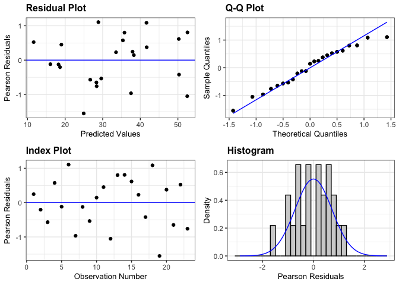

IMT Bean yield
================

# Load libraries

``` r
#Set work directory
setwd("/Users/ey239/Github/IMT/rmarkdowns")

#Load packages 
library(tidyverse) ##install.packages("tidyverse")
library(knitr)
library(patchwork) ##install.packages("patchwork")
library(skimr)     ##install.packages("skimr")
library(readxl)
library(janitor) ##install.packages("janitor")

library(kableExtra) ##install.packages("kableExtra")
library(webshot) ##install.packages("webshot")
webshot::install_phantomjs()
library(viridis) ##install.packages("viridis")
library(lme4) ##install.packages("lme4")
library(lmerTest) ##install.packages("lmerTest")
library(emmeans) ##install.packages("emmeans")
library(rstatix) ##install.packages("rstatix")
#library(Matrix) ##install.packages("Matrix")
library(multcomp) ##install.packages("multcomp")
library(multcompView) ##install.packages("multcompView")
library(ggResidpanel) ##install.packages("ggResidpanel")
#library(car)
#library(TMB)  ##install.packages("TMB")
library(glmmTMB)  ##install.packages("glmmTMB")
library(DHARMa)  ##install.packages("DHARMa")
library(performance) ##install.packages("performance")
library(WrensBookshelf)##install.packages("WrensBookshelf")
#Load Functions
MeanPlusSe<-function(x) mean(x)+plotrix::std.error(x)

find_logw0=function(x){c=trunc(log(min(x[x>0],na.rm=T)))
d=exp(c)
return(d)}
```

<br>

# Load and clean data

## Load data

``` r
combined_raw <- read_excel("~/Github/IMT/raw-data/combined_raw.xlsx")
kable(head(combined_raw))
```

| id | year | location | site_year | treatment | block | plot | microplot | bean_emergence | bean_biomass | intrarow_weed_biomass | interrow_weed_biomass | weed_biomass | bean_population | bean_yield |
|:---|---:|:---|:---|:---|---:|---:|:---|:---|---:|:---|:---|---:|:---|:---|
| WI_B1_P101 | 2023 | WI | WI_2023 | NWC | 1 | 101 | M | 23 | 233.3 | 0 | 2 | 1.84 | 38 | 295.66000000000003 |
| WI_B1_P101_SW | 2023 | WI | WI_2023 | NWC | 1 | 101 | SW | 24 | 61.7 | 31.66 | 155.9 | 187.56 | 28 | 88.81 |
| WI_B1_P101_WF | 2023 | WI | WI_2023 | NWC | 1 | 101 | WF | 14 | 210.3 | 0 | 0 | 0.00 | 38 | 273.51 |
| WI_B1_P102 | 2023 | WI | WI_2023 | LWC | 1 | 102 | M | 14 | 248.4 | 0 | 0 | 0.00 | 27 | 321.16000000000003 |
| WI_B1_P102_SW | 2023 | WI | WI_2023 | LWC | 1 | 102 | SW | 16 | 65.6 | 28.76 | 50 | 78.76 | 32 | 97.45 |
| WI_B1_P103 | 2023 | WI | WI_2023 | AWC | 1 | 103 | M | 17 | 279.3 | 0 | 0.21 | 0.21 | 34 | 302.72000000000003 |

\##Clean data \###ECOBEAN (all sites)

``` r
## Standardize column names and convert variables
clean_combined <- combined_raw |>  
  clean_names() |>  
  rename(mowing = treatment, weeds = microplot) |> 
  mutate(
    across(c(year, location, site_year, mowing, block, plot, weeds), as.factor),
    bean_yield = as.numeric(bean_yield)  # Convert to numeric safely
  )
```

    ## Warning: There was 1 warning in `mutate()`.
    ## ℹ In argument: `bean_yield = as.numeric(bean_yield)`.
    ## Caused by warning:
    ## ! NAs introduced by coercion

``` r
# Define constants for yield conversion
moisture_correction <- (100 - 0.00001) / (100 - 14)
kg_to_lb <- 2.20462
sqft_per_acre <- 43560
sample_area_sqft <- 16.4
grams_per_lb <- 454

# Filter relevant data and compute adjusted yields
bean_yield_clean <- clean_combined |>  
  filter(
    weeds %in% c("SW", "M"), 
    !is.na(bean_yield)
  ) |>  
  mutate(
    bean_yield_adj_bu_acre = (((bean_yield / grams_per_lb) / (sample_area_sqft / sqft_per_acre)) / 60) * moisture_correction,
    bean_yield_adj_lbs_acre = ((bean_yield / grams_per_lb) / (sample_area_sqft / sqft_per_acre)) * moisture_correction,
    bean_yield_adj_kg_ha = bean_yield_adj_lbs_acre / kg_to_lb
  )

# Display cleaned dataset
kable(head(bean_yield_clean))
```

| id | year | location | site_year | mowing | block | plot | weeds | bean_emergence | bean_biomass | intrarow_weed_biomass | interrow_weed_biomass | weed_biomass | bean_population | bean_yield | bean_yield_adj_bu_acre | bean_yield_adj_lbs_acre | bean_yield_adj_kg_ha |
|:---|:---|:---|:---|:---|:---|:---|:---|:---|---:|:---|:---|---:|:---|---:|---:|---:|---:|
| WI_B1_P101 | 2023 | WI | WI_2023 | NWC | 1 | 101 | M | 23 | 233.3 | 0 | 2 | 1.84 | 38 | 295.66 | 33.52208 | 2011.3250 | 912.3228 |
| WI_B1_P101_SW | 2023 | WI | WI_2023 | NWC | 1 | 101 | SW | 24 | 61.7 | 31.66 | 155.9 | 187.56 | 28 | 88.81 | 10.06932 | 604.1594 | 274.0424 |
| WI_B1_P102 | 2023 | WI | WI_2023 | LWC | 1 | 102 | M | 14 | 248.4 | 0 | 0 | 0.00 | 27 | 321.16 | 36.41329 | 2184.7972 | 991.0085 |
| WI_B1_P102_SW | 2023 | WI | WI_2023 | LWC | 1 | 102 | SW | 16 | 65.6 | 28.76 | 50 | 78.76 | 32 | 97.45 | 11.04893 | 662.9359 | 300.7030 |
| WI_B1_P103 | 2023 | WI | WI_2023 | AWC | 1 | 103 | M | 17 | 279.3 | 0 | 0.21 | 0.21 | 34 | 302.72 | 34.32255 | 2059.3530 | 934.1079 |
| WI_B1_P103_SW | 2023 | WI | WI_2023 | AWC | 1 | 103 | SW | 15 | 80.1 | 27.56 | 22.26 | 49.82 | 32 | 118.17 | 13.39818 | 803.8905 | 364.6390 |

\###FARMHUB 2024 REPORT (Musgrave and Farmhub)

``` r
## Standardize column names, convert to factors, and check for outliers
clean_combined <- combined_raw |>  
  clean_names() |>  
  rename(mowing = treatment, weeds = microplot) |> 
  mutate(
    across(c(year, location, site_year, mowing, block, plot, weeds), as.factor),
    bean_yield = as.numeric(bean_yield) # Convert to numeric safely
  ) 
```

    ## Warning: There was 1 warning in `mutate()`.
    ## ℹ In argument: `bean_yield = as.numeric(bean_yield)`.
    ## Caused by warning:
    ## ! NAs introduced by coercion

``` r
# Define constants for yield conversion
moisture_correction <- (100 - 0.00001) / (100 - 14)
kg_to_lb <- 2.20462
sqft_per_acre <- 43560
sample_area_sqft <- 16.4
grams_per_lb <- 454

# Filter relevant data and compute adjusted yields
bean_yield_clean_fh <- clean_combined |>  
  filter(
    weeds %in% c("SW", "M"), 
    location %in% c("FH", "CU"), 
    year == "2024", 
    !is.na(bean_yield)
  ) |>  
  mutate(
    bean_yield_adj_bu_acre_fh = (((bean_yield / grams_per_lb) / (sample_area_sqft / sqft_per_acre)) / 60) * moisture_correction,
    bean_yield_adj_lbs_acre_fh = ((bean_yield / grams_per_lb) / (sample_area_sqft / sqft_per_acre)) * moisture_correction,
    bean_yield_adj_kg_ha_fh = bean_yield_adj_lbs_acre_fh / kg_to_lb
  )

# Display cleaned dataset
kable(bean_yield_clean_fh)
```

| id | year | location | site_year | mowing | block | plot | weeds | bean_emergence | bean_biomass | intrarow_weed_biomass | interrow_weed_biomass | weed_biomass | bean_population | bean_yield | bean_yield_adj_bu_acre_fh | bean_yield_adj_lbs_acre_fh | bean_yield_adj_kg_ha_fh |
|:---|:---|:---|:---|:---|:---|:---|:---|:---|---:|:---|:---|---:|:---|---:|---:|---:|---:|
| FH_B1_P101 | 2024 | FH | FH_2024 | EWC | 1 | 101 | M | 32 | 120.37 | 10.08 | 68.430000000000007 | 78.51 | 18 | 139.85 | 15.856265 | 951.3759 | 431.5374 |
| FH_B1_P102 | 2024 | FH | FH_2024 | LWC | 1 | 102 | M | 31 | 193.20 | 0 | 10.130000000000001 | 10.13 | 23 | 192.95 | 21.876770 | 1312.6062 | 595.3889 |
| FH_B1_P102_SW | 2024 | FH | FH_2024 | LWC | 1 | 102 | SW | 21 | 75.42 | 5.49 | 58.71 | 64.20 | 24 | 217.43 | 24.652325 | 1479.1395 | 670.9272 |
| FH_B1_P103 | 2024 | FH | FH_2024 | AWC | 1 | 103 | M | 20 | 185.88 | 0.05 | 14.08 | 14.13 | 21 | 276.42 | 31.340642 | 1880.4385 | 852.9536 |
| FH_B1_P103_SW | 2024 | FH | FH_2024 | AWC | 1 | 103 | SW | 24 | 85.61 | 41.91 | 38.229999999999997 | 80.14 | 17 | 73.44 | 8.326665 | 499.5999 | 226.6150 |
| FH_B1_P104_SW | 2024 | FH | FH_2024 | NWC | 1 | 104 | SW | 27 | 80.31 | 9.09 | 130.19999999999999 | 139.29 | 20.5 | 157.39 | 17.844959 | 1070.6976 | 485.6608 |
| FH_B1_P201 | 2024 | FH | FH_2024 | AWC | 2 | 201 | M | 30 | 179.00 | 0 | 1.8 | 1.80 | 25 | 216.82 | 24.583163 | 1474.9898 | 669.0449 |
| FH_B1_P201_SW | 2024 | FH | FH_2024 | AWC | 2 | 201 | SW | 29 | 108.09 | 42.64 | 12.16 | 54.80 | 23 | 194.05 | 22.001489 | 1320.0893 | 598.7832 |
| FH_B1_P202 | 2024 | FH | FH_2024 | NWC | 2 | 202 | M | 27 | 105.23 | 11.11 | 60 | 71.11 | 16 | 215.58 | 24.442571 | 1466.5543 | 665.2186 |
| FH_B1_P202_SW | 2024 | FH | FH_2024 | NWC | 2 | 202 | SW | 28 | 96.10 | 21.22 | 106.53 | 127.75 | 21 | 137.70 | 15.612497 | 936.7498 | 424.9031 |
| FH_B1_P203_SW | 2024 | FH | FH_2024 | EWC | 2 | 203 | SW | 24 | 103.03 | 31.09 | 88.9 | 119.99 | 28 | 210.98 | 23.921021 | 1435.2613 | 651.0243 |
| FH_B1_P204 | 2024 | FH | FH_2024 | LWC | 2 | 204 | M | 33 | 130.06 | 0 | 14.31 | 14.31 | 24 | 249.07 | 28.239685 | 1694.3811 | 768.5592 |
| FH_B1_P204_SW | 2024 | FH | FH_2024 | LWC | 2 | 204 | SW | 26 | 103.73 | 56.24 | 2.2200000000000002 | 58.46 | 20 | 155.42 | 17.621600 | 1057.2960 | 479.5820 |
| FH_B1_P301 | 2024 | FH | FH_2024 | NWC | 3 | 301 | M | 23 | 186.51 | 0 | 180.1 | 180.10 | 17 | 292.85 | 33.203484 | 1992.2090 | 903.6519 |
| FH_B1_P301_SW | 2024 | FH | FH_2024 | NWC | 3 | 301 | SW | 21 | 122.54 | 18.670000000000002 | 99.54 | 118.21 | 20 | 156.55 | 17.749720 | 1064.9832 | 483.0688 |
| FH_B1_P302 | 2024 | FH | FH_2024 | EWC | 3 | 302 | M | 29 | 130.39 | 0 | 52.65 | 52.65 | 27 | 363.11 | 41.169599 | 2470.1759 | 1120.4543 |
| FH_B1_P302_SW | 2024 | FH | FH_2024 | EWC | 3 | 302 | SW | 20 | 134.20 | 3.76 | 94.85 | 98.61 | 26 | 223.24 | 25.311066 | 1518.6640 | 688.8552 |
| FH_B1_P304 | 2024 | FH | FH_2024 | AWC | 3 | 304 | M | 29 | 219.83 | 0 | 0.05 | 0.05 | 24 | 260.26 | 29.508413 | 1770.5048 | 803.0884 |
| FH_B1_P304_SW | 2024 | FH | FH_2024 | AWC | 3 | 304 | SW | 26 | 71.56 | 36.39 | 33.03 | 69.42 | 21 | 148.23 | 16.806394 | 1008.3836 | 457.3957 |
| FH_B1_P401 | 2024 | FH | FH_2024 | LWC | 4 | 401 | M | 29 | 154.23 | 16.09 | 34.47 | 50.56 | 24 | 328.71 | 37.269309 | 2236.1585 | 1014.3057 |
| FH_B1_P401_SW | 2024 | FH | FH_2024 | LWC | 4 | 401 | SW | 21 | 197.69 | 26.45 | 0 | 26.45 | 28 | 269.58 | 30.565119 | 1833.9072 | 831.8473 |
| FH_B1_P402 | 2024 | FH | FH_2024 | AWC | 4 | 402 | M | 27 | 152.50 | 0 | 5.46 | 5.46 | 20 | 259.56 | 29.429046 | 1765.7428 | 800.9284 |
| FH_B1_P402_SW | 2024 | FH | FH_2024 | AWC | 4 | 402 | SW | 24 | 160.32 | 4.8899999999999997 | 18.75 | 23.64 | 17 | 171.35 | 19.427751 | 1165.6651 | 528.7374 |
| FH_B1_P403 | 2024 | FH | FH_2024 | NWC | 4 | 403 | M | 23 | 185.37 | 0 | 95.34 | 95.34 | 24 | 242.45 | 27.489106 | 1649.3464 | 748.1318 |
| FH_B1_P403_SW | 2024 | FH | FH_2024 | NWC | 4 | 403 | SW | 19 | 119.05 | 11.54 | 121.29 | 132.83 | 20 | 183.22 | 20.773578 | 1246.4147 | 565.3649 |
| FH_B1_P404 | 2024 | FH | FH_2024 | EWC | 4 | 404 | M | 30 | 194.11 | 0 | 45.72 | 45.72 | 24 | 277.00 | 31.406403 | 1884.3842 | 854.7433 |
| CU_B1_P101 | 2024 | CU | CU_2024 | EWC | 1 | 101 | M | 21 | 194.24 | 0 | 0.1 | 0.10 | 23 | 424.37 | 48.115289 | 2886.9173 | 1309.4852 |
| CU_B1_P101_SW | 2024 | CU | CU_2024 | EWC | 1 | 101 | SW | 22 | 187.31 | 4.25 | 25.47 | 29.72 | 22 | 347.64 | 39.415602 | 2364.9361 | 1072.7183 |
| CU_B1_P102 | 2024 | CU | CU_2024 | LWC | 1 | 102 | M | 23 | 260.63 | 0.31 | 3.43 | 3.74 | 21 | 449.12 | 50.921457 | 3055.2874 | 1385.8567 |
| CU_B1_P102_SW | 2024 | CU | CU_2024 | LWC | 1 | 102 | SW | 22 | 264.81 | 2.89 | 13.44 | 16.33 | 19 | 367.12 | 41.624255 | 2497.4553 | 1132.8280 |
| CU_B1_P103 | 2024 | CU | CU_2024 | AWC | 1 | 103 | M | 24 | 220.66 | 2.66 | 11.82 | 14.48 | 23 | 487.22 | 55.241254 | 3314.4753 | 1503.4225 |
| CU_B1_P103_SW | 2024 | CU | CU_2024 | AWC | 1 | 103 | SW | 31 | 196.63 | 0.23 | 27.51 | 27.74 | 21 | 369.09 | 41.847614 | 2510.8569 | 1138.9069 |
| CU_B1_P104 | 2024 | CU | CU_2024 | NWC | 1 | 104 | M | 21 | 262.91 | 0 | 4.88 | 4.88 | 24 | 426.38 | 48.343184 | 2900.5910 | 1315.6875 |
| CU_B1_P104_SW | 2024 | CU | CU_2024 | NWC | 1 | 104 | SW | 25 | 246.26 | 0.31 | 29.28 | 29.59 | 24 | 343.42 | 38.937136 | 2336.2282 | 1059.6965 |
| CU_B1_P201 | 2024 | CU | CU_2024 | AWC | 2 | 201 | M | 24 | 232.50 | 3.27 | 5.44 | 8.71 | 22 | 381.08 | 43.207047 | 2592.4228 | 1175.9046 |
| CU_B1_P201_SW | 2024 | CU | CU_2024 | AWC | 2 | 201 | SW | 18 | 338.57 | 0 | 6.73 | 6.73 | 17 | 338.95 | 38.430326 | 2305.8195 | 1045.9034 |
| CU_B1_P202 | 2024 | CU | CU_2024 | NWC | 2 | 202 | M | 23 | 191.35 | 0 | 0 | 0.00 | 21 | 464.46 | 52.660714 | 3159.6428 | 1433.1916 |
| CU_B1_P202_SW | 2024 | CU | CU_2024 | NWC | 2 | 202 | SW | 19 | 202.65 | 1.69 | 53.08 | 54.77 | 21 | 303.73 | 34.437064 | 2066.2238 | 937.2245 |
| CU_B1_P203 | 2024 | CU | CU_2024 | EWC | 2 | 203 | M | 27 | 219.71 | 0 | 0.57999999999999996 | 0.58 | 25 | 426.92 | 48.404409 | 2904.2646 | 1317.3538 |
| CU_B1_P203_SW | 2024 | CU | CU_2024 | EWC | 2 | 203 | SW | 19 | 213.33 | 2.29 | 23.94 | 26.23 | 23 | 415.66 | 47.127745 | 2827.6647 | 1282.6087 |
| CU_B1_P204 | 2024 | CU | CU_2024 | LWC | 2 | 204 | M | 21 | 259.74 | 0.61 | 1.28 | 1.89 | 18 | 336.90 | 38.197896 | 2291.8737 | 1039.5777 |
| CU_B1_P204_SW | 2024 | CU | CU_2024 | LWC | 2 | 204 | SW | 19 | 211.28 | 2.68 | 29.02 | 31.70 | 21 | 308.24 | 34.948410 | 2096.9046 | 951.1411 |
| CU_B1_P301 | 2024 | CU | CU_2024 | NWC | 3 | 301 | M | 20 | 335.38 | 0.05 | 8.24 | 8.29 | 25 | 404.96 | 45.914573 | 2754.8744 | 1249.5915 |
| CU_B1_P301_SW | 2024 | CU | CU_2024 | NWC | 3 | 301 | SW | 26 | 104.52 | 6.86 | 43.95 | 50.81 | 20 | 166.04 | 18.825701 | 1129.5420 | 512.3523 |
| CU_B1_P302 | 2024 | CU | CU_2024 | EWC | 3 | 302 | M | 23 | 270.00 | 0 | 10.48 | 10.48 | 19 | 243.14 | 27.567338 | 1654.0403 | 750.2610 |
| CU_B1_P302_SW | 2024 | CU | CU_2024 | EWC | 3 | 302 | SW | 19 | 142.35 | 6.13 | 53.1 | 59.23 | 16 | 280.79 | 31.836115 | 1910.1669 | 866.4382 |
| CU_B1_P303 | 2024 | CU | CU_2024 | LWC | 3 | 303 | M | 20 | 161.83 | 7.83 | 8.23 | 16.06 | 16 | 278.50 | 31.576473 | 1894.5884 | 859.3719 |
| CU_B1_P303_SW | 2024 | CU | CU_2024 | LWC | 3 | 303 | SW | 26 | 175.65 | 6.05 | 34.92 | 40.97 | 18 | 226.56 | 25.687490 | 1541.2494 | 699.0998 |
| CU_B1_P304 | 2024 | CU | CU_2024 | AWC | 3 | 304 | M | 23 | 241.56 | 0.87 | 4.0999999999999996 | 4.97 | 25 | 285.08 | 32.322517 | 1939.3510 | 879.6759 |
| CU_B1_P304_SW | 2024 | CU | CU_2024 | AWC | 3 | 304 | SW | 19 | 139.25 | 12.91 | 7.92 | 20.83 | 24 | 248.29 | 28.151248 | 1689.0749 | 766.1524 |
| CU_B1_P401 | 2024 | CU | CU_2024 | LWC | 4 | 401 | M | 21 | 221.18 | 3.33 | 12.52 | 15.85 | 19 | 177.79 | 20.157922 | 1209.4753 | 548.6094 |
| CU_B1_P401_SW | 2024 | CU | CU_2024 | LWC | 4 | 401 | SW | 24 | 119.84 | 4.67 | 55.67 | 60.34 | 15 | 137.37 | 15.575081 | 934.5049 | 423.8848 |
| CU_B1_P402 | 2024 | CU | CU_2024 | AWC | 4 | 402 | M | 17 | 164.73 | 0.06 | 5.29 | 5.35 | 24 | 292.51 | 33.164934 | 1989.8961 | 902.6027 |
| CU_B1_P402_SW | 2024 | CU | CU_2024 | AWC | 4 | 402 | SW | 22 | 207.86 | 0.05 | 6.98 | 7.03 | 28 | 295.52 | 33.506210 | 2010.3726 | 911.8908 |
| CU_B1_P403 | 2024 | CU | CU_2024 | NWC | 4 | 403 | M | 20 | 245.96 | 0 | 1.91 | 1.91 | 23 | 227.20 | 25.760053 | 1545.6032 | 701.0746 |
| CU_B1_P403_SW | 2024 | CU | CU_2024 | NWC | 4 | 403 | SW | 19 | 155.42 | 2.74 | 64.849999999999994 | 67.59 | 26 | 120.69 | 13.683894 | 821.0337 | 372.4150 |
| CU_B1_P404 | 2024 | CU | CU_2024 | EWC | 4 | 404 | M | 24 | 189.20 | 0 | 4.7699999999999996 | 4.77 | 23 | 313.45 | 35.539122 | 2132.3473 | 967.2176 |
| CU_B1_P404_SW | 2024 | CU | CU_2024 | EWC | 4 | 404 | SW | 25 | 82.14 | 6.43 | 53.68 | 60.11 | 21 | 281.95 | 31.967636 | 1918.0582 | 870.0176 |

\###FARMHUB REPORT (Musgrave and Farm hub, NWC only)

``` r
# Standardize column names and convert variables
clean_combined <- combined_raw |>  
  clean_names() |>  
  rename(mowing = treatment, weeds = microplot) |> 
  mutate(
    across(c(year, location, site_year, mowing, block, plot, weeds), as.factor),
    bean_yield = as.numeric(bean_yield)  # Convert to numeric safely
  )
```

    ## Warning: There was 1 warning in `mutate()`.
    ## ℹ In argument: `bean_yield = as.numeric(bean_yield)`.
    ## Caused by warning:
    ## ! NAs introduced by coercion

``` r
# Define constants for yield conversion
moisture_correction <- (100 - 0.00001) / (100 - 14)
kg_to_lb <- 2.20462
sqft_per_acre <- 43560
sample_area_sqft <- 16.4
grams_per_lb <- 454

# Filter relevant data and compute adjusted yields
bean_yield_clean_fh_wf <- clean_combined |>  
  filter(
    location %in% c("FH", "CU"),
    year == "2024",
    mowing == "NWC",
    !is.na(bean_yield)
  ) |>  
  mutate(
    bean_yield_adj_bu_acre_fh_wf = (((bean_yield / grams_per_lb) / (sample_area_sqft / sqft_per_acre)) / 60) * moisture_correction,
    bean_yield_adj_lbs_acre_fh_wf = ((bean_yield / grams_per_lb) / (sample_area_sqft / sqft_per_acre)) * moisture_correction,
    bean_yield_adj_kg_ha_fh_wf = bean_yield_adj_lbs_acre_fh_wf / kg_to_lb
  )

# Display cleaned dataset
kable(bean_yield_clean_fh_wf)
```

| id | year | location | site_year | mowing | block | plot | weeds | bean_emergence | bean_biomass | intrarow_weed_biomass | interrow_weed_biomass | weed_biomass | bean_population | bean_yield | bean_yield_adj_bu_acre_fh_wf | bean_yield_adj_lbs_acre_fh_wf | bean_yield_adj_kg_ha_fh_wf |
|:---|:---|:---|:---|:---|:---|:---|:---|:---|---:|:---|:---|---:|:---|---:|---:|---:|---:|
| FH_B1_P104_WF | 2024 | FH | FH_2024 | NWC | 1 | 104 | WF | 25 | 263.55 | 0 | 0 | 0.00 | 23 | 343.18 | 38.90993 | 2334.5955 | 1058.9560 |
| FH_B1_P104_SW | 2024 | FH | FH_2024 | NWC | 1 | 104 | SW | 27 | 80.31 | 9.09 | 130.19999999999999 | 139.29 | 20.5 | 157.39 | 17.84496 | 1070.6976 | 485.6608 |
| FH_B1_P202 | 2024 | FH | FH_2024 | NWC | 2 | 202 | M | 27 | 105.23 | 11.11 | 60 | 71.11 | 16 | 215.58 | 24.44257 | 1466.5543 | 665.2186 |
| FH_B1_P202_WF | 2024 | FH | FH_2024 | NWC | 2 | 202 | WF | 23 | 242.35 | 0 | 0 | 0.00 | 20 | 331.85 | 37.62532 | 2257.5194 | 1023.9948 |
| FH_B1_P202_SW | 2024 | FH | FH_2024 | NWC | 2 | 202 | SW | 28 | 96.10 | 21.22 | 106.53 | 127.75 | 21 | 137.70 | 15.61250 | 936.7498 | 424.9031 |
| FH_B1_P301 | 2024 | FH | FH_2024 | NWC | 3 | 301 | M | 23 | 186.51 | 0 | 180.1 | 180.10 | 17 | 292.85 | 33.20348 | 1992.2090 | 903.6519 |
| FH_B1_P301_WF | 2024 | FH | FH_2024 | NWC | 3 | 301 | WF | 30 | 295.02 | 0 | 0 | 0.00 | 31 | 297.42 | 33.72163 | 2023.2980 | 917.7536 |
| FH_B1_P301_SW | 2024 | FH | FH_2024 | NWC | 3 | 301 | SW | 21 | 122.54 | 18.670000000000002 | 99.54 | 118.21 | 20 | 156.55 | 17.74972 | 1064.9832 | 483.0688 |
| FH_B1_P403 | 2024 | FH | FH_2024 | NWC | 4 | 403 | M | 23 | 185.37 | 0 | 95.34 | 95.34 | 24 | 242.45 | 27.48911 | 1649.3464 | 748.1318 |
| FHU_B1_P403_WF | 2024 | FH | FH_2024 | NWC | 4 | 403 | WF | 23 | 296.02 | 0 | 0 | 0.00 | 27 | 342.65 | 38.84983 | 2330.9900 | 1057.3205 |
| FH_B1_P403_SW | 2024 | FH | FH_2024 | NWC | 4 | 403 | SW | 19 | 119.05 | 11.54 | 121.29 | 132.83 | 20 | 183.22 | 20.77358 | 1246.4147 | 565.3649 |
| CU_B1_P104 | 2024 | CU | CU_2024 | NWC | 1 | 104 | M | 21 | 262.91 | 0 | 4.88 | 4.88 | 24 | 426.38 | 48.34318 | 2900.5910 | 1315.6875 |
| CU_B1_P104_SW | 2024 | CU | CU_2024 | NWC | 1 | 104 | SW | 25 | 246.26 | 0.31 | 29.28 | 29.59 | 24 | 343.42 | 38.93714 | 2336.2282 | 1059.6965 |
| CU_B1_P104_WF | 2024 | CU | CU_2024 | NWC | 1 | 104 | WF | 28 | 269.40 | 0 | 0 | 0.00 | 21 | 491.50 | 55.72652 | 3343.5914 | 1516.6293 |
| CU_B1_P202 | 2024 | CU | CU_2024 | NWC | 2 | 202 | M | 23 | 191.35 | 0 | 0 | 0.00 | 21 | 464.46 | 52.66071 | 3159.6428 | 1433.1916 |
| CU_B1_P202_SW | 2024 | CU | CU_2024 | NWC | 2 | 202 | SW | 19 | 202.65 | 1.69 | 53.08 | 54.77 | 21 | 303.73 | 34.43706 | 2066.2238 | 937.2245 |
| CU_B1_P202_WF | 2024 | CU | CU_2024 | NWC | 2 | 202 | WF | 24 | 260.89 | 0 | 0 | 0.00 | 17 | 428.99 | 48.63911 | 2918.3464 | 1323.7412 |
| CU_B1_P301 | 2024 | CU | CU_2024 | NWC | 3 | 301 | M | 20 | 335.38 | 0.05 | 8.24 | 8.29 | 25 | 404.96 | 45.91457 | 2754.8744 | 1249.5915 |
| CU_B1_P301_SW | 2024 | CU | CU_2024 | NWC | 3 | 301 | SW | 26 | 104.52 | 6.86 | 43.95 | 50.81 | 20 | 166.04 | 18.82570 | 1129.5420 | 512.3523 |
| CU_B1_P301_WF | 2024 | CU | CU_2024 | NWC | 3 | 301 | WF | 17 | 216.41 | 0 | 0 | 0.00 | 26 | 380.83 | 43.17870 | 2590.7221 | 1175.1332 |
| CU_B1_P403 | 2024 | CU | CU_2024 | NWC | 4 | 403 | M | 20 | 245.96 | 0 | 1.91 | 1.91 | 23 | 227.20 | 25.76005 | 1545.6032 | 701.0746 |
| CU_B1_P403_SW | 2024 | CU | CU_2024 | NWC | 4 | 403 | SW | 19 | 155.42 | 2.74 | 64.849999999999994 | 67.59 | 26 | 120.69 | 13.68389 | 821.0337 | 372.4150 |
| CU_B1_P403_WF | 2024 | CU | CU_2024 | NWC | 4 | 403 | WF | 26 | 163.49 | 0 | 0 | 0.00 | 19 | 223.91 | 25.38703 | 1523.2219 | 690.9226 |

# Model testing

\##ECOBEAN \### Lmer

``` r
# This is better for providing generalizations and recommendations. Location can be used as a random effect since we have 5 locations, (if need be, we can )

random_eco <- lmer(bean_yield_adj_bu_acre ~ mowing*weeds  + (1|location) + (1|location:block)+  (1|location:block:mowing), data = bean_yield_clean)
```

    ## boundary (singular) fit: see help('isSingular')

``` r
#tyler whats up with uri being random? location*year takes into accoutn if we are concerned about only these years and locations, everything is relative to the ten means from this experiment

#random_uri <- lmer(bean_yield_adj_kg_ha  ~ mowing*weeds + location*year + (1|site_year:block)+  (1|site_year:block:mowing)  , data =  bean_yield_clean)


resid_panel(random_eco)
```

<!-- -->

``` r
simulateResiduals(random_eco,plot = TRUE) # Residuals and normality look good
```

<!-- -->

    ## Object of Class DHARMa with simulated residuals based on 250 simulations with refit = FALSE . See ?DHARMa::simulateResiduals for help. 
    ##  
    ## Scaled residual values: 0.32 0.116 0.404 0.168 0.372 0.152 0.144 0.08 0.536 0.108 0.12 0.052 0.224 0.048 0.108 0.108 0.008 0.036 0.296 0.052 ...

``` r
check_model(random_eco)
```

<!-- -->

### Joint test (anova)

``` r
 random_eco |> 
  joint_tests() |> 
  kable()  
```

|     | model term   | df1 |    df2 | F.ratio |   p.value |
|:----|:-------------|----:|-------:|--------:|----------:|
| 1   | mowing       |   3 |  55.59 |   1.449 | 0.2383294 |
| 3   | weeds        |   1 | 231.79 | 112.900 | 0.0000000 |
| 2   | mowing:weeds |   3 | 230.36 |   0.668 | 0.5726970 |

### Anova table

``` r
options(contrasts = c("contr.sum", "contr.poly"))
Anova(random_eco, type = 3)
```

    ## Analysis of Deviance Table (Type III Wald chisquare tests)
    ## 
    ## Response: bean_yield_adj_bu_acre
    ##                 Chisq Df Pr(>Chisq)    
    ## (Intercept)  112.7103  1  < 2.2e-16 ***
    ## mowing         0.8834  3     0.8294    
    ## weeds         23.4086  1   1.31e-06 ***
    ## mowing:weeds   2.0036  3     0.5717    
    ## ---
    ## Signif. codes:  0 '***' 0.001 '**' 0.01 '*' 0.05 '.' 0.1 ' ' 1

### Fisher compact letter display

#### Weed-control (No significant)

``` r
tukey_mowing <- emmeans(random_eco, list(pairwise ~ mowing), adjust = "tukey")
```

    ## NOTE: Results may be misleading due to involvement in interactions

``` r
tukey_mowing
```

    ## $`emmeans of mowing`
    ##  mowing emmean   SE   df lower.CL upper.CL
    ##  AWC      33.2 3.48 4.85     24.2     42.3
    ##  EWC      35.4 3.49 4.90     26.4     44.4
    ##  LWC      31.8 3.49 4.88     22.7     40.8
    ##  NWC      33.9 3.48 4.87     24.8     42.9
    ## 
    ## Results are averaged over the levels of: weeds 
    ## Degrees-of-freedom method: kenward-roger 
    ## Confidence level used: 0.95 
    ## 
    ## $`pairwise differences of mowing`
    ##  1         estimate   SE   df t.ratio p.value
    ##  AWC - EWC   -2.146 1.75 56.9  -1.226  0.6129
    ##  AWC - LWC    1.476 1.74 55.9   0.846  0.8322
    ##  AWC - NWC   -0.613 1.74 55.6  -0.353  0.9848
    ##  EWC - LWC    3.622 1.76 57.8   2.055  0.1802
    ##  EWC - NWC    1.533 1.76 57.3   0.874  0.8185
    ##  LWC - NWC   -2.089 1.75 56.5  -1.193  0.6336
    ## 
    ## Results are averaged over the levels of: weeds 
    ## Degrees-of-freedom method: kenward-roger 
    ## P value adjustment: tukey method for comparing a family of 4 estimates

``` r
cld_mowing_tukey <- cld(emmeans(random_eco, ~ mowing), adjust = "tukey", Letters = letters, sort = TRUE, reversed = TRUE)
```

    ## NOTE: Results may be misleading due to involvement in interactions

    ## Note: adjust = "tukey" was changed to "sidak"
    ## because "tukey" is only appropriate for one set of pairwise comparisons

``` r
cld_mowing_tukey
```

    ##  mowing emmean   SE   df lower.CL upper.CL .group
    ##  EWC      35.4 3.49 4.90     22.0     48.7  a    
    ##  NWC      33.9 3.48 4.87     20.5     47.2  a    
    ##  AWC      33.2 3.48 4.85     19.8     46.6  a    
    ##  LWC      31.8 3.49 4.88     18.4     45.1  a    
    ## 
    ## Results are averaged over the levels of: weeds 
    ## Degrees-of-freedom method: kenward-roger 
    ## Confidence level used: 0.95 
    ## Conf-level adjustment: sidak method for 4 estimates 
    ## P value adjustment: tukey method for comparing a family of 4 estimates 
    ## significance level used: alpha = 0.05 
    ## NOTE: If two or more means share the same grouping symbol,
    ##       then we cannot show them to be different.
    ##       But we also did not show them to be the same.

#### Weeds (significant)

``` r
tukey_weeds <- emmeans(random_eco, list(pairwise ~ weeds), adjust = "tukey")
```

    ## NOTE: Results may be misleading due to involvement in interactions

``` r
tukey_weeds
```

    ## $`emmeans of weeds`
    ##  weeds emmean   SE   df lower.CL upper.CL
    ##  M       40.1 3.37 4.28     31.0     49.3
    ##  SW      27.0 3.37 4.28     17.9     36.1
    ## 
    ## Results are averaged over the levels of: mowing 
    ## Degrees-of-freedom method: kenward-roger 
    ## Confidence level used: 0.95 
    ## 
    ## $`pairwise differences of weeds`
    ##  1      estimate   SE  df t.ratio p.value
    ##  M - SW     13.1 1.24 232  10.625  <.0001
    ## 
    ## Results are averaged over the levels of: mowing 
    ## Degrees-of-freedom method: kenward-roger

``` r
cld_weeds_tukey <- cld(emmeans(random_eco, ~ weeds), adjust = "tukey", Letters = letters, sort = TRUE, reversed = TRUE)
```

    ## NOTE: Results may be misleading due to involvement in interactions

    ## Note: adjust = "tukey" was changed to "sidak"
    ## because "tukey" is only appropriate for one set of pairwise comparisons

``` r
cld_weeds_tukey
```

    ##  weeds emmean   SE   df lower.CL upper.CL .group
    ##  M       40.1 3.37 4.28     28.8     51.5  a    
    ##  SW      27.0 3.37 4.28     15.6     38.3   b   
    ## 
    ## Results are averaged over the levels of: mowing 
    ## Degrees-of-freedom method: kenward-roger 
    ## Confidence level used: 0.95 
    ## Conf-level adjustment: sidak method for 2 estimates 
    ## significance level used: alpha = 0.05 
    ## NOTE: If two or more means share the same grouping symbol,
    ##       then we cannot show them to be different.
    ##       But we also did not show them to be the same.

\##FARMHUB REPORT \### Lmer Block is random Tyler is under the
impression that block should always be random and that post-hoc
comparisons should use TUKEY rather the Fischer. Fisher is bogus
apparently.

``` r
# This is better for providing generalizatins and reccomendations. 

random_fh <- lmer(bean_yield_adj_bu_acre_fh ~ mowing*weeds*location+ (1|location:block)+  (1|location:block:mowing), data = bean_yield_clean_fh)


#tyler whats up with uri being random? location*year takes into accoutn if we are concerned about only these years and locations, everything is relative to the ten means from this experiment

#random_uri <- lmer(bean_yield_adj_kg_ha  ~ mowing*weeds + location*year + (1|site_year:block)+  (1|site_year:block:mowing)  , data =  bean_yield_clean)


resid_panel(random_fh)
```

<!-- -->

``` r
simulateResiduals(random_fh,plot = TRUE) # Residuals and normality look good
```

<!-- -->

    ## Object of Class DHARMa with simulated residuals based on 250 simulations with refit = FALSE . See ?DHARMa::simulateResiduals for help. 
    ##  
    ## Scaled residual values: 0.044 0.164 0.472 0.628 0.164 0.472 0.3 0.736 0.312 0.388 0.572 0.388 0.196 0.764 0.492 0.904 0.608 0.532 0.512 0.768 ...

``` r
check_model(random_fh)
```

<!-- -->

### Joint test (anova)

``` r
 random_fh |> 
  joint_tests() |> 
  kable()  
```

|     | model term            | df1 |   df2 | F.ratio |   p.value |
|:----|:----------------------|----:|------:|--------:|----------:|
| 1   | mowing                |   3 | 16.46 |   0.781 | 0.5215067 |
| 5   | weeds                 |   1 | 23.05 |  37.505 | 0.0000030 |
| 7   | location              |   1 |  5.98 |   4.901 | 0.0689656 |
| 2   | mowing:weeds          |   3 | 21.51 |   2.183 | 0.1193860 |
| 4   | mowing:location       |   3 | 16.46 |   1.988 | 0.1553170 |
| 6   | weeds:location        |   1 | 23.05 |   0.072 | 0.7910621 |
| 3   | mowing:weeds:location |   3 | 21.51 |   1.568 | 0.2260147 |

### Anova table

``` r
options(contrasts = c("contr.sum", "contr.poly"))
Anova(random_fh, type = 3)
```

    ## Analysis of Deviance Table (Type III Wald chisquare tests)
    ## 
    ## Response: bean_yield_adj_bu_acre_fh
    ##                          Chisq Df Pr(>Chisq)    
    ## (Intercept)           141.8229  1  < 2.2e-16 ***
    ## mowing                  2.3614  3    0.50086    
    ## weeds                  38.1297  1  6.619e-10 ***
    ## location                4.9025  1    0.02682 *  
    ## mowing:weeds            6.6659  3    0.08334 .  
    ## mowing:location         5.9920  3    0.11200    
    ## weeds:location          0.0730  1    0.78697    
    ## mowing:weeds:location   4.7556  3    0.19059    
    ## ---
    ## Signif. codes:  0 '***' 0.001 '**' 0.01 '*' 0.05 '.' 0.1 ' ' 1

### Fisher compact letter display

#### Weed-control (No significant)

``` r
cld_mowing_fisher_fh <-cld(emmeans(random_fh, ~  mowing , type = "response"), Letters = letters, adjust = "none",sort = TRUE, reversed=TRUE)
```

    ## NOTE: Results may be misleading due to involvement in interactions

``` r
cld_mowing_fisher_fh
```

    ##  mowing emmean   SE    df lower.CL upper.CL .group
    ##  EWC      32.3 2.97 10.51     25.7     38.9  a    
    ##  AWC      30.5 2.87  9.30     24.0     36.9  a    
    ##  LWC      30.0 2.96 10.27     23.5     36.6  a    
    ##  NWC      28.7 2.90  9.64     22.2     35.2  a    
    ## 
    ## Results are averaged over the levels of: weeds, location 
    ## Degrees-of-freedom method: kenward-roger 
    ## Confidence level used: 0.95 
    ## significance level used: alpha = 0.05 
    ## NOTE: If two or more means share the same grouping symbol,
    ##       then we cannot show them to be different.
    ##       But we also did not show them to be the same.

#### Weeds (significant)

``` r
cld_weeds_fisher_fh <-cld(emmeans(random_fh, ~  weeds , type = "response"), Letters = letters, adjust = "none",sort = TRUE, reversed=TRUE)
```

    ## NOTE: Results may be misleading due to involvement in interactions

``` r
cld_weeds_fisher_fh
```

    ##  weeds emmean   SE   df lower.CL upper.CL .group
    ##  M       34.3 2.63 6.70     28.1     40.6  a    
    ##  SW      26.4 2.64 6.79     20.2     32.7   b   
    ## 
    ## Results are averaged over the levels of: mowing, location 
    ## Degrees-of-freedom method: kenward-roger 
    ## Confidence level used: 0.95 
    ## significance level used: alpha = 0.05 
    ## NOTE: If two or more means share the same grouping symbol,
    ##       then we cannot show them to be different.
    ##       But we also did not show them to be the same.

#### Weeds by location (significant)

``` r
cld_location_fisher_fh <-cld(emmeans(random_fh, ~ location , type = "response"), Letters = letters, adjust = "none",sort = TRUE, reversed=TRUE)
```

    ## NOTE: Results may be misleading due to involvement in interactions

``` r
cld_location_fisher_fh
```

    ##  location emmean   SE   df lower.CL upper.CL .group
    ##  CU         36.0 3.59 5.85     27.2     44.9  a    
    ##  FH         24.7 3.63 6.10     15.9     33.6  a    
    ## 
    ## Results are averaged over the levels of: mowing, weeds 
    ## Degrees-of-freedom method: kenward-roger 
    ## Confidence level used: 0.95 
    ## significance level used: alpha = 0.05 
    ## NOTE: If two or more means share the same grouping symbol,
    ##       then we cannot show them to be different.
    ##       But we also did not show them to be the same.

#### Mowing by location (not significant)

``` r
cld_mowing_weeds_location_fisher_fh <-cld(emmeans(random_fh, ~  mowing|weeds|location , type = "response"), Letters = letters, adjust = "none",sort = TRUE, reversed=TRUE)
cld_mowing_weeds_location_fisher_fh
```

    ## weeds = M, location = CU:
    ##  mowing emmean   SE   df lower.CL upper.CL .group
    ##  NWC      43.2 4.38 12.5    33.67     52.7  a    
    ##  AWC      41.0 4.38 12.5    31.48     50.5  ab   
    ##  EWC      39.9 4.38 12.5    30.40     49.4  ab   
    ##  LWC      35.2 4.38 12.5    25.71     44.7   b   
    ## 
    ## weeds = SW, location = CU:
    ##  mowing emmean   SE   df lower.CL upper.CL .group
    ##  EWC      37.6 4.38 12.5    28.08     47.1  a    
    ##  AWC      35.5 4.38 12.5    25.98     45.0  ab   
    ##  LWC      29.5 4.38 12.5    19.96     39.0   bc  
    ##  NWC      26.5 4.38 12.5    16.97     36.0    c  
    ## 
    ## weeds = M, location = FH:
    ##  mowing emmean   SE   df lower.CL upper.CL .group
    ##  LWC      30.2 4.72 15.8    20.16     40.2  a    
    ##  EWC      29.3 4.70 15.5    19.27     39.3  a    
    ##  AWC      28.7 4.38 12.5    19.21     38.2  a    
    ##  NWC      27.3 4.69 15.4    17.34     37.3  a    
    ## 
    ## weeds = SW, location = FH:
    ##  mowing emmean   SE   df lower.CL upper.CL .group
    ##  LWC      25.3 4.72 15.8    15.31     35.3  a    
    ##  EWC      22.5 5.29 21.5    11.47     33.4  ab   
    ##  NWC      18.0 4.38 12.5     8.49     27.5  ab   
    ##  AWC      16.6 4.38 12.5     7.14     26.1   b   
    ## 
    ## Degrees-of-freedom method: kenward-roger 
    ## Confidence level used: 0.95 
    ## significance level used: alpha = 0.05 
    ## NOTE: If two or more means share the same grouping symbol,
    ##       then we cannot show them to be different.
    ##       But we also did not show them to be the same.

\##FARMHUB REPORT weed free \### Lmer

``` r
# This is better for providing generalizatins and reccomendations. 

random_fh_wf <- lmer(bean_yield_adj_bu_acre_fh_wf ~ weeds*location+ (1|location:block)+  (1|location:block:mowing), data = bean_yield_clean_fh_wf)


#tyler whats up with uri being random? location*year takes into accoutn if we are concerned about only these years and locations, everything is relative to the ten means from this experiment

#random_uri <- lmer(bean_yield_adj_kg_ha  ~ mowing*weeds + location*year + (1|site_year:block)+  (1|site_year:block:mowing)  , data =  bean_yield_clean)


resid_panel(random_fh_wf)
```

<!-- -->

``` r
simulateResiduals(random_fh_wf,plot = TRUE) # Residuals and normality look good
```

    ## qu = 0.25, log(sigma) = 1.184825 : outer Newton did not converge fully.

    ## 
    ##  DHARMa: qgam was unable to calculate quantile regression for quantile 0.25. Possibly to few (unique) data points / predictions. The quantile will be ommited in plots and significance calculations.

    ## qu = 0.5, log(sigma) = -2.478559 : outer Newton did not converge fully.

    ## We had to increase `err` for some of the quantiles. See fit$calibr$err

    ## qu = 0.75, log(sigma) = -2.478559 : outer Newton did not converge fully.

    ## 
    ##  DHARMa: qgam was unable to calculate quantile regression for quantile 0.75. Possibly to few (unique) data points / predictions. The quantile will be ommited in plots and significance calculations.

<!-- -->

    ## Object of Class DHARMa with simulated residuals based on 250 simulations with refit = FALSE . See ?DHARMa::simulateResiduals for help. 
    ##  
    ## Scaled residual values: 0.548 0.46 0.32 0.512 0.42 0.684 0.32 0.508 0.436 0.516 0.616 0.748 0.944 0.928 0.888 0.856 0.736 0.616 0.156 0.48 ...

``` r
check_model(random_fh_wf)
```

<!-- --> \###
Joint test (anova)

``` r
 random_fh_wf |> 
  joint_tests() |> 
  kable()  
```

|     | model term     | df1 |   df2 | F.ratio |   p.value |
|:----|:---------------|----:|------:|--------:|----------:|
| 1   | weeds          |   2 | 11.03 |  45.059 | 0.0000049 |
| 3   | location       |   1 |  6.00 |   2.613 | 0.1571514 |
| 2   | weeds:location |   2 | 11.03 |   2.198 | 0.1572719 |

#### Weeds (Significant)

``` r
cld_weeds_fisher_fh_wf <-cld(emmeans(random_fh_wf, ~  weeds , type = "response"), Letters = letters, adjust = "none",sort = TRUE, reversed=TRUE)
```

    ## NOTE: Results may be misleading due to involvement in interactions

``` r
cld_weeds_fisher_fh_wf
```

    ##  weeds emmean   SE   df lower.CL upper.CL .group
    ##  WF      40.3 3.19 7.70     32.8     47.7  a    
    ##  M       35.9 3.27 8.32     28.4     43.4  a    
    ##  SW      22.2 3.19 7.70     14.8     29.6   b   
    ## 
    ## Results are averaged over the levels of: location 
    ## Degrees-of-freedom method: kenward-roger 
    ## Confidence level used: 0.95 
    ## significance level used: alpha = 0.05 
    ## NOTE: If two or more means share the same grouping symbol,
    ##       then we cannot show them to be different.
    ##       But we also did not show them to be the same.

#### Weeds by location (not significant)

``` r
cld_weeds_location_fisher_fh_wf <-cld(emmeans(random_fh_wf, ~  weeds|location , type = "response"), Letters = letters, adjust = "none",sort = TRUE, reversed=TRUE)
cld_weeds_location_fisher_fh_wf
```

    ## location = CU:
    ##  weeds emmean   SE   df lower.CL upper.CL .group
    ##  WF      43.2 4.51 7.70    32.76     53.7  a    
    ##  M       43.2 4.51 7.70    32.69     53.6  a    
    ##  SW      26.5 4.51 7.70    15.99     36.9   b   
    ## 
    ## location = FH:
    ##  weeds emmean   SE   df lower.CL upper.CL .group
    ##  WF      37.3 4.51 7.70    26.80     47.8  a    
    ##  M       28.6 4.72 8.93    17.90     39.3   b   
    ##  SW      18.0 4.51 7.70     7.52     28.5    c  
    ## 
    ## Degrees-of-freedom method: kenward-roger 
    ## Confidence level used: 0.95 
    ## significance level used: alpha = 0.05 
    ## NOTE: If two or more means share the same grouping symbol,
    ##       then we cannot show them to be different.
    ##       But we also did not show them to be the same.

#### Weeds by location (not significant)

``` r
cld_location_weeds_fisher_fh_wf <-cld(emmeans(random_fh_wf, ~  location|weeds , type = "response"), Letters = letters, adjust = "none",sort = TRUE, reversed=TRUE)
cld_location_weeds_fisher_fh_wf
```

    ## weeds = M:
    ##  location emmean   SE   df lower.CL upper.CL .group
    ##  CU         43.2 4.51 7.70    32.69     53.6  a    
    ##  FH         28.6 4.72 8.93    17.90     39.3  a    
    ## 
    ## weeds = SW:
    ##  location emmean   SE   df lower.CL upper.CL .group
    ##  CU         26.5 4.51 7.70    15.99     36.9  a    
    ##  FH         18.0 4.51 7.70     7.52     28.5  a    
    ## 
    ## weeds = WF:
    ##  location emmean   SE   df lower.CL upper.CL .group
    ##  CU         43.2 4.51 7.70    32.76     53.7  a    
    ##  FH         37.3 4.51 7.70    26.80     47.8  a    
    ## 
    ## Degrees-of-freedom method: kenward-roger 
    ## Confidence level used: 0.95 
    ## significance level used: alpha = 0.05 
    ## NOTE: If two or more means share the same grouping symbol,
    ##       then we cannot show them to be different.
    ##       But we also did not show them to be the same.

\#Figures \##ECOBEAN

### Mowing on yield (not significant)

``` r
bean_yield_clean |> 
  left_join(cld_mowing_tukey) |> 
  ggplot(aes(x = factor(mowing, levels = c("NWC", "EWC", "LWC", "AWC")), y = bean_yield_adj_bu_acre, fill = mowing)) +
  stat_summary(geom = "bar", fun = "mean", width = 0.7) +
  stat_summary(geom = "errorbar", fun.data = "mean_se", width = 0.2) +
  #stat_summary(geom="text", fun = "MeanPlusSe", aes(label= trimws(.group)),size=6.5,vjust=-0.5) +
  #geom_bar(stat="identity", position=position_dodge()) + 
  #geom_errorbar(aes(ymin=response-SE, ymax=response+SE), width=.2,
                 #position=position_dodge(.9))+
#geom_text(aes(label = trimws(.group), y = response + (SE + 30)), size = 7) +
  labs(
    x = "",
       y = expression(paste("Dry bean yield (", bu/a, " at 14% moisture)")),
    subtitle = expression(italic("Not significant"))) +
  
  scale_x_discrete(labels = c("No\nmowing", "Early\nmowing", "Late\nmowing", "As-needed\nmowing")) +
  scale_y_continuous(expand = expansion(mult = c(0.05, 0.3))) +
  scale_fill_WB_d(name = "BlueberriesForSal", direction = 1) +
   theme_bw() +
  theme(
    legend.position = "none",
    strip.background = element_blank(),
    strip.text = element_text(face = "bold", size = 12),
    axis.title = element_text(size = 24),  # Increase font size of axis titles
    axis.text = element_text(size = 24),   # Increase font size of axis labels
    plot.title = element_text(size = 24, face = "bold"),  # Increase font size of title
    plot.subtitle = element_text(size = 24, face = "italic")  # Increase font size of subtitle
  
  )
```

<!-- -->

``` r
ggsave("bean_yield_mowing_buac_eco.png", width = 10, height = 8, dpi = 300)
```

### Weed level of yield (significant)

``` r
bean_yield_clean |> 
  left_join(cld_weeds_tukey) |> 
  ggplot(aes(x = weeds, y = bean_yield_adj_bu_acre, fill = weeds)) +  # Fill added
  stat_summary(geom = "bar", fun = "mean", width = 0.6, position = position_dodge(width = 0.7)) +
  stat_summary(geom = "errorbar", fun.data = "mean_se", width = 0.2, position = position_dodge(width = 0.7)) +
  stat_summary(geom = "text", fun = "MeanPlusSe", aes(label = trimws(.group)), 
               size = 6.5, vjust = -0.5, position = position_dodge(width = 0.7)) +
  labs(
    x = "",
    y = expression(paste("Dry bean yield (", bu/a, " at 14% moisture)")),
  subtitle = expression(italic("P < 0.001"))
  ) +
  scale_x_discrete(labels = c("Ambient weeds", "Surrogate + ambient weeds")) +
  scale_y_continuous(expand = expansion(mult = c(0.05, 0.3))) +
  scale_fill_WB_d(name = "BlueberriesForSal", direction = 1) +  # Ensure correct function use
  theme_bw() +
  theme(
    legend.position = "none",
    strip.background = element_blank(),
    strip.text = element_text(face = "bold", size = 20),
    axis.title = element_text(size = 24),
    axis.text = element_text(size = 20),
    plot.title = element_text(size = 24, face = "bold"),
    plot.subtitle = element_text(size = 24, face = "italic")
  )
```

<!-- -->

``` r
ggsave("bean_yield_weeds_buac_eco.png", width = 10, height = 8, dpi = 300)
```

## FARMHUB REPORT

### Mowing on yield

``` r
bean_yield_clean_fh |> 
  left_join(cld_mowing_fisher_fh) |> 
  ggplot(aes(x = factor(mowing, levels = c("NWC", "EWC", "LWC", "AWC")), 
             y = bean_yield_adj_bu_acre_fh, fill = mowing)) + 
  stat_summary(geom = "bar", fun = "mean", width = 0.6) +
  stat_summary(geom = "errorbar", fun.data = "mean_se", width = 0.2) +
  labs(
    x = "",
    y = expression(paste("Dry bean yield (", "bu/a", " at 14% moisture)"))) +
  scale_x_discrete(labels = c("No\nmowing", "Early\nmowing", "Late\nmowing", "As-needed\nmowing")) +
  scale_y_continuous(expand = expansion(mult = c(0.05, 0.3))) +
  scale_fill_WB_d(name = "BlueberriesForSal", direction = 1) +  
  theme_bw() +
  theme(
    legend.position = "none",
    strip.background = element_blank(),
    strip.text = element_text(face = "bold", size = 12),
    axis.title = element_text(size = 24),
    axis.text = element_text(size = 24),
    plot.title = element_text(size = 24, face = "bold"),
    plot.subtitle = element_text(size = 24, face = "italic")
  )
```

<!-- -->

``` r
ggsave("bean_yield_mowing_bua_fh.png", width = 10, height = 8, dpi = 300)
```

### Weed level on yield (significant)

``` r
bean_yield_clean_fh_wf |> 
  left_join(cld_weeds_fisher_fh_wf) |> 
  ggplot(aes(x = factor(weeds, levels = c("WF", "M", "SW")), y = bean_yield_adj_bu_acre_fh_wf, fill = weeds)) +  # Fill added
  stat_summary(geom = "bar", fun = "mean", width = 0.6, position = position_dodge(width = 0.7)) +
  stat_summary(geom = "errorbar", fun.data = "mean_se", width = 0.2, position = position_dodge(width = 0.7)) +
  stat_summary(geom = "text", fun = "MeanPlusSe", aes(label = trimws(.group)), 
               size = 6.5, vjust = -0.5, position = position_dodge(width = 0.7)) +
  labs(
    x = "",
   y = expression(paste("Dry bean yield (", "bu/a", " at 14% moisture)"))) +
  scale_x_discrete(labels = c("Weed free", "Ambient weeds", "Surrogate + ambient weeds")) +
  scale_y_continuous(expand = expansion(mult = c(0.05, 0.3))) +
  scale_fill_WB_d(name = "BlueberriesForSal", direction = 1) +  # Ensure correct function use
  theme_bw() +
  theme(
    legend.position = "none",
    strip.background = element_blank(),
    strip.text = element_text(face = "bold", size = 20),
    axis.title = element_text(size = 24),
    axis.text = element_text(size = 20),
    plot.title = element_text(size = 24, face = "bold"),
    plot.subtitle = element_text(size = 24, face = "italic")
  )
```

<!-- -->

``` r
ggsave("bean_yield_weeds_bhac_fh.png", width = 10, height = 8, dpi = 300)
```

### Weed level and location (not significant)

``` r
bean_yield_clean_fh_wf |> 
  left_join(cld_weeds_location_fisher_fh_wf) |> 
  ggplot(aes(x = factor(weeds, levels = c("WF", "M", "SW")), y = bean_yield_adj_bu_acre_fh_wf, fill = weeds)) + facet_wrap(~location, ncol= 2, labeller = labeller(location = c("CU" = "Cornell Musgrave Research Farm", "FH" = "Hudson Valley Farm Hub"))) + # Fill added
  stat_summary(geom = "bar", fun = "mean", width = 0.6, position = position_dodge(width = 0.7)) +
  stat_summary(geom = "errorbar", fun.data = "mean_se", width = 0.2, position = position_dodge(width = 0.7)) +
  stat_summary(geom = "text", fun = "MeanPlusSe", aes(label = trimws(.group)), 
               size = 6.5, vjust = -0.5, position = position_dodge(width = 0.7)) +
  labs(
    x = "",
   y = expression(paste("Dry bean yield (", "bu/a", " at 14% moisture)")),
  subtitle = expression(italic("P < 0.005"))
  ) +
  scale_x_discrete(labels = c("Weed free", "Ambient \nweeds", "Surrogate + \nambient weeds")) +
  scale_y_continuous(expand = expansion(mult = c(0.05, 0.3))) +
  scale_fill_WB_d(name = "BlueberriesForSal", direction = 1) +  # Ensure correct function use
  theme_bw() +
  theme(
    legend.position = "none",
    strip.background = element_blank(),
    strip.text = element_text(face = "bold", size = 20),
    axis.title = element_text(size = 24),
    axis.text = element_text(size = 20),
    plot.title = element_text(size = 24, face = "bold"),
    plot.subtitle = element_text(size = 24, face = "italic")
  )
```

<!-- -->

``` r
ggsave("bean_yield_weeds_location_bhac_fh.png", width = 10, height = 10, dpi = 300)
```
