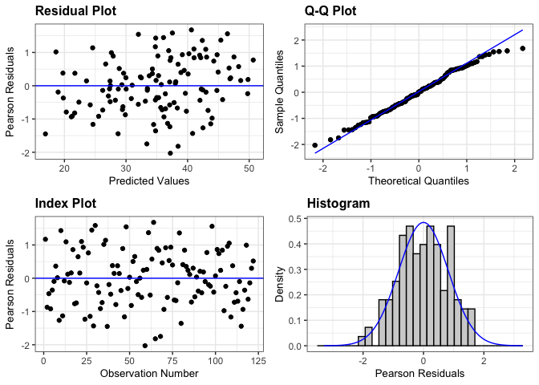

IMT Bean yield
================

# Load libraries

``` r
#Set work directory
setwd("/Users/ey239/Github/IMT/rmarkdowns")

#Load packages 
library(tidyverse) ##install.packages("tidyverse")
library(knitr)
library(patchwork) ##install.packages("patchwork")
library(skimr)     ##install.packages("skimr")
library(readxl)
library(janitor) ##install.packages("janitor")

library(kableExtra) ##install.packages("kableExtra")
library(webshot) ##install.packages("webshot")
webshot::install_phantomjs()
library(viridis) ##install.packages("viridis")
library(lme4) ##install.packages("lme4")
library(lmerTest) ##install.packages("lmerTest")
library(emmeans) ##install.packages("emmeans")
library(rstatix) ##install.packages("rstatix")
#library(Matrix) ##install.packages("Matrix")
library(multcomp) ##install.packages("multcomp")
library(multcompView) ##install.packages("multcompView")
library(ggResidpanel) ##install.packages("ggResidpanel")
#library(car)
#library(TMB)  ##install.packages("TMB")
library(glmmTMB)  ##install.packages("glmmTMB")
library(DHARMa)  ##install.packages("DHARMa")
library(performance) ##install.packages("performance")
library(WrensBookshelf)##install.packages("WrensBookshelf")
#Load Functions
MeanPlusSe<-function(x) mean(x)+plotrix::std.error(x)

find_logw0=function(x){c=trunc(log(min(x[x>0],na.rm=T)))
d=exp(c)
return(d)}
```

<br>

# Load and clean data

## Load data

``` r
combined_raw <- read_excel("~/Github/IMT/raw-data/combined_raw.xlsx")
kable(head(combined_raw))
```

| id | year | location | site_year | treatment | block | plot | microplot | bean_emergence | bean_biomass | intrarow_weed_biomass | interrow_weed_biomass | weed_biomass | bean_population | bean_yield |
|:---|---:|:---|:---|:---|---:|---:|:---|:---|---:|:---|:---|---:|:---|:---|
| WI_B1_P101 | 2023 | WI | WI_2023 | NWC | 1 | 101 | M | 23 | 233.3 | 0 | 2 | 1.84 | 38 | 295.66000000000003 |
| WI_B1_P101_SW | 2023 | WI | WI_2023 | NWC | 1 | 101 | SW | 24 | 61.7 | 31.66 | 155.9 | 187.56 | 28 | 88.81 |
| WI_B1_P101_WF | 2023 | WI | WI_2023 | NWC | 1 | 101 | WF | 14 | 210.3 | 0 | 0 | 0.00 | 38 | 273.51 |
| WI_B1_P102 | 2023 | WI | WI_2023 | LWC | 1 | 102 | M | 14 | 248.4 | 0 | 0 | 0.00 | 27 | 321.16000000000003 |
| WI_B1_P102_SW | 2023 | WI | WI_2023 | LWC | 1 | 102 | SW | 16 | 65.6 | 28.76 | 50 | 78.76 | 32 | 97.45 |
| WI_B1_P103 | 2023 | WI | WI_2023 | AWC | 1 | 103 | M | 17 | 279.3 | 0 | 0.21 | 0.21 | 34 | 302.72000000000003 |

\##Clean data

``` r
#Standardaze column names, convert to factors, check for outliers of variable**
clean_combined <- clean_names(combined_raw) |>  
  rename(mowing = treatment, weeds = microplot) |> 
  mutate(across(c(year, location, site_year, mowing, block, plot, weeds), as.factor),
         bean_yield = as.numeric(as.character(bean_yield))) |>  # Convert to numeric
  mutate(is_outlier = bean_yield < (quantile(bean_yield, 0.25, na.rm = TRUE) - 1.5 * IQR(bean_yield, na.rm = TRUE)) |
                     bean_yield > (quantile(bean_yield, 0.75, na.rm = TRUE) + 1.5 * IQR(bean_yield, na.rm = TRUE))) |> 
  mutate(is_outlier = replace_na(is_outlier, FALSE))  # Ensure logical values
```

    ## Warning: There was 1 warning in `mutate()`.
    ## ℹ In argument: `bean_yield = as.numeric(as.character(bean_yield))`.
    ## Caused by warning:
    ## ! NAs introduced by coercion

``` r
bean_yield_clean <- clean_combined |>  
  filter(weeds %in% c("SW", "M")) |> # Keep only SW and M microplots
  filter(location %in% c("FH", "CU")) |>
  filter(!is.na(bean_yield)) |>  # Remove NA values
  filter(is_outlier == FALSE) |>  # Remove outliers
  mutate(
    bean_yield_adj_bu_acre = (((bean_yield / 454) / (16.4 / 43560)) / 60) * ((100 - 0.00001) / (100 - 14)),
    bean_yield_adj_lbs_acre = ((bean_yield / 454) / (16.4 / 43560)) * ((100 - 0.00001) / (100 - 14)),
    bean_yield_adj_kg_ha = ((bean_yield / 454) / (16.4 / 43560)) * 1.12085 * ((100 - 0.00001) / (100 - 14))
  )
kable(bean_yield_clean)
```

| id | year | location | site_year | mowing | block | plot | weeds | bean_emergence | bean_biomass | intrarow_weed_biomass | interrow_weed_biomass | weed_biomass | bean_population | bean_yield | is_outlier | bean_yield_adj_bu_acre | bean_yield_adj_lbs_acre | bean_yield_adj_kg_ha |
|:---|:---|:---|:---|:---|:---|:---|:---|:---|---:|:---|:---|---:|:---|---:|:---|---:|---:|---:|
| FH_B1_P101 | 2023 | FH | FH_2023 | EWC | 1 | 101 | M | 21 | 87.18 | 0.75 | 16.5 | 17.25 | 22 | 367.79 | FALSE | 41.700220 | 2502.0132 | 2804.3815 |
| FH_B1_P101_SW | 2023 | FH | FH_2023 | EWC | 1 | 101 | SW | 24 | 40.32 | 3.54 | 37.65 | 41.19 | 23 | 218.00 | FALSE | 24.716952 | 1483.0171 | 1662.2398 |
| FH_B1_P102 | 2023 | FH | FH_2023 | LWC | 1 | 102 | M | 24 | 72.37 | 6.47 | 12.71 | 19.18 | 26 | 268.00 | FALSE | 30.385978 | 1823.1587 | 2043.4874 |
| FH_B1_P102_SW | 2023 | FH | FH_2023 | LWC | 1 | 102 | SW | 24 | 63.33 | 7.54 | 11.33 | 18.87 | 25 | 177.30 | FALSE | 20.102365 | 1206.1419 | 1351.9042 |
| FH_B1_P103 | 2023 | FH | FH_2023 | AWC | 1 | 103 | M | 23 | 148.62 | 4.22 | 0 | 4.22 | 22 | 290.00 | FALSE | 32.880349 | 1972.8210 | 2211.2364 |
| FH_B1_P103_SW | 2023 | FH | FH_2023 | AWC | 1 | 103 | SW | 26 | 84.27 | 2.9 | 8.1300000000000008 | 11.03 | 20 | 236.00 | FALSE | 26.757801 | 1605.4681 | 1799.4889 |
| FH_B1_P104 | 2023 | FH | FH_2023 | NWC | 1 | 104 | M | 25 | 189.99 | 0 | 5.45 | 5.45 | 24 | 321.38 | FALSE | 36.438230 | 2186.2938 | 2450.5074 |
| FH_B1_P104_SW | 2023 | FH | FH_2023 | NWC | 1 | 104 | SW | 24 | 67.15 | 2.04 | 8.4499999999999993 | 10.49 | 25 | 274.25 | FALSE | 31.094606 | 1865.6764 | 2091.1434 |
| FH_B1_P201 | 2023 | FH | FH_2023 | AWC | 2 | 201 | M | 25 | 112.48 | 0.9 | 1.33 | 2.23 | 27 | 308.62 | FALSE | 34.991495 | 2099.4897 | 2353.2130 |
| FH_B1_P201_SW | 2023 | FH | FH_2023 | AWC | 2 | 201 | SW | 29 | 108.85 | 2.85 | 3.46 | 6.31 | 28 | 382.00 | FALSE | 43.311357 | 2598.6814 | 2912.7321 |
| FH_B1_P202 | 2023 | FH | FH_2023 | NWC | 2 | 202 | M | 25 | 63.74 | 0 | 0 | 0.00 | 23 | 265.00 | FALSE | 30.045837 | 1802.7502 | 2020.6125 |
| FH_B1_P202_SW | 2023 | FH | FH_2023 | NWC | 2 | 202 | SW | 26 | 109.70 | 5.56 | 37.28 | 42.84 | 25 | 291.00 | FALSE | 32.993730 | 1979.6238 | 2218.8613 |
| FH_B1_P203 | 2023 | FH | FH_2023 | EWC | 2 | 203 | M | 30 | 170.66 | 0 | 0 | 0.00 | 27 | 436.00 | FALSE | 49.433904 | 2966.0343 | 3324.4795 |
| FH_B1_P203_SW | 2023 | FH | FH_2023 | EWC | 2 | 203 | SW | 26 | 100.61 | 0.42 | 50.46 | 50.88 | 22 | 342.20 | FALSE | 38.798812 | 2327.9287 | 2609.2589 |
| FH_B1_P204 | 2023 | FH | FH_2023 | LWC | 2 | 204 | M | 32 | 109.51 | 0 | 2.34 | 2.34 | 22 | 368.00 | FALSE | 41.724030 | 2503.4418 | 2805.9827 |
| FH_B1_P204_SW | 2023 | FH | FH_2023 | LWC | 2 | 204 | SW | 28 | 88.85 | 2.42 | 8.4600000000000009 | 10.88 | 11 | 316.00 | FALSE | 35.828243 | 2149.6946 | 2409.4852 |
| FH_B1_P301 | 2023 | FH | FH_2023 | NWC | 3 | 301 | M | 23 | 140.47 | 0 | 8.35 | 8.35 | 24 | 425.00 | FALSE | 48.186719 | 2891.2031 | 3240.6050 |
| FH_B1_P301_SW | 2023 | FH | FH_2023 | NWC | 3 | 301 | SW | 33 | 60.15 | 14.99 | 40.22 | 55.21 | 22 | 311.00 | FALSE | 35.261340 | 2115.6804 | 2371.3604 |
| FH_B1_P302 | 2023 | FH | FH_2023 | EWC | 3 | 302 | M | 23 | 121.94 | 2.44 | 29.69 | 32.13 | 23 | 343.28 | FALSE | 38.921263 | 2335.2758 | 2617.4939 |
| FH_B1_P302_SW | 2023 | FH | FH_2023 | EWC | 3 | 302 | SW | 28 | 123.37 | NA | 16.89 | 16.89 | 25 | 372.91 | FALSE | 42.280728 | 2536.8437 | 2843.4212 |
| FH_B1_P303 | 2023 | FH | FH_2023 | LWC | 3 | 303 | M | 28 | 121.44 | 0.31 | 3.92 | 4.23 | 28 | 437.00 | FALSE | 49.547285 | 2972.8371 | 3332.1045 |
| FH_B1_P303_SW | 2023 | FH | FH_2023 | LWC | 3 | 303 | SW | 31 | 131.51 | 0 | 3.94 | 3.94 | 24 | 419.55 | FALSE | 47.568795 | 2854.1277 | 3199.0490 |
| FH_B1_P304 | 2023 | FH | FH_2023 | AWC | 3 | 304 | M | 27 | 148.91 | 0 | 0 | 0.00 | 25 | 443.74 | FALSE | 50.311470 | 3018.6882 | 3383.4966 |
| FH_B1_P304_SW | 2023 | FH | FH_2023 | AWC | 3 | 304 | SW | 29 | 60.13 | 9.8800000000000008 | 0 | 9.88 | 21 | 262.99 | FALSE | 29.817942 | 1789.0765 | 2005.2864 |
| FH_B1_P401 | 2023 | FH | FH_2023 | LWC | 4 | 401 | M | 28 | 141.74 | 0 | 0 | 0.00 | 21 | 387.33 | FALSE | 43.915675 | 2634.9405 | 2953.3730 |
| FH_B1_P401_SW | 2023 | FH | FH_2023 | LWC | 4 | 401 | SW | 28 | 138.35 | 8.1 | 0 | 8.10 | 24 | 367.62 | FALSE | 41.680945 | 2500.8567 | 2803.0852 |
| FH_B1_P402 | 2023 | FH | FH_2023 | AWC | 4 | 402 | M | 30 | 102.87 | 0 | 0 | 0.00 | 25 | 326.00 | FALSE | 36.962048 | 2217.7229 | 2485.7347 |
| FH_B1_P402_SW | 2023 | FH | FH_2023 | AWC | 4 | 402 | SW | 29 | 69.97 | 1.31 | 6.29 | 7.60 | 28 | 393.92 | FALSE | 44.662852 | 2679.7711 | 3003.6215 |
| FH_B1_P403 | 2023 | FH | FH_2023 | NWC | 4 | 403 | M | 23 | 78.64 | 0 | 2.79 | 2.79 | 23 | 285.00 | FALSE | 32.313447 | 1938.8068 | 2173.1116 |
| FH_B1_P403_SW | 2023 | FH | FH_2023 | NWC | 4 | 403 | SW | 23 | 97.12 | 1.38 | 11.09 | 12.47 | 18 | 413.90 | FALSE | 46.928195 | 2815.6917 | 3155.9681 |
| FH_B1_P404 | 2023 | FH | FH_2023 | EWC | 4 | 404 | M | 25 | 97.21 | 0.49 | 0.56999999999999995 | 1.06 | 31 | 337.63 | FALSE | 38.280663 | 2296.8398 | 2574.4129 |
| FH_B1_P404_SW | 2023 | FH | FH_2023 | EWC | 4 | 404 | SW | 28 | 82.50 | 3.21 | 22.11 | 25.32 | 22 | 284.30 | FALSE | 32.234080 | 1934.0448 | 2167.7741 |
| FH_B1_P101 | 2024 | FH | FH_2024 | EWC | 1 | 101 | M | 32 | 120.37 | 10.08 | 68.430000000000007 | 78.51 | 18 | 139.85 | FALSE | 15.856265 | 951.3759 | 1066.3497 |
| FH_B1_P102 | 2024 | FH | FH_2024 | LWC | 1 | 102 | M | 31 | 193.20 | 0 | 10.130000000000001 | 10.13 | 23 | 192.95 | FALSE | 21.876770 | 1312.6062 | 1471.2347 |
| FH_B1_P102_SW | 2024 | FH | FH_2024 | LWC | 1 | 102 | SW | 21 | 75.42 | 5.49 | 58.71 | 64.20 | 24 | 217.43 | FALSE | 24.652325 | 1479.1395 | 1657.8935 |
| FH_B1_P103 | 2024 | FH | FH_2024 | AWC | 1 | 103 | M | 20 | 185.88 | 0.05 | 14.08 | 14.13 | 21 | 276.42 | FALSE | 31.340642 | 1880.4385 | 2107.6895 |
| FH_B1_P103_SW | 2024 | FH | FH_2024 | AWC | 1 | 103 | SW | 24 | 85.61 | 41.91 | 38.229999999999997 | 80.14 | 17 | 73.44 | FALSE | 8.326665 | 499.5999 | 559.9765 |
| FH_B1_P104_SW | 2024 | FH | FH_2024 | NWC | 1 | 104 | SW | 27 | 80.31 | 9.09 | 130.19999999999999 | 139.29 | 20.5 | 157.39 | FALSE | 17.844959 | 1070.6976 | 1200.0914 |
| FH_B1_P201 | 2024 | FH | FH_2024 | AWC | 2 | 201 | M | 30 | 179.00 | 0 | 1.8 | 1.80 | 25 | 216.82 | FALSE | 24.583163 | 1474.9898 | 1653.2423 |
| FH_B1_P201_SW | 2024 | FH | FH_2024 | AWC | 2 | 201 | SW | 29 | 108.09 | 42.64 | 12.16 | 54.80 | 23 | 194.05 | FALSE | 22.001489 | 1320.0893 | 1479.6221 |
| FH_B1_P202 | 2024 | FH | FH_2024 | NWC | 2 | 202 | M | 27 | 105.23 | 11.11 | 60 | 71.11 | 16 | 215.58 | FALSE | 24.442571 | 1466.5543 | 1643.7874 |
| FH_B1_P202_SW | 2024 | FH | FH_2024 | NWC | 2 | 202 | SW | 28 | 96.10 | 106.53 | 106.53 | 213.06 | 21 | 137.70 | FALSE | 15.612497 | 936.7498 | 1049.9560 |
| FH_B1_P203_SW | 2024 | FH | FH_2024 | EWC | 2 | 203 | SW | 24 | 103.03 | 31.09 | 88.9 | 119.99 | 28 | 210.98 | FALSE | 23.921021 | 1435.2613 | 1608.7126 |
| FH_B1_P204 | 2024 | FH | FH_2024 | LWC | 2 | 204 | M | 33 | 130.06 | 0 | 14.31 | 14.31 | 24 | 249.07 | FALSE | 28.239685 | 1694.3811 | 1899.1470 |
| FH_B1_P204_SW | 2024 | FH | FH_2024 | LWC | 2 | 204 | SW | 26 | 103.73 | 56.24 | 2.2200000000000002 | 58.46 | 20 | 155.42 | FALSE | 17.621600 | 1057.2960 | 1185.0702 |
| FH_B1_P301 | 2024 | FH | FH_2024 | NWC | 3 | 301 | M | 23 | 186.51 | 0 | 180.1 | 180.10 | 17 | 292.85 | FALSE | 33.203484 | 1992.2090 | 2232.9675 |
| FH_B1_P301_SW | 2024 | FH | FH_2024 | NWC | 3 | 301 | SW | 21 | 122.54 | 18.670000000000002 | 99.54 | 118.21 | 20 | 156.55 | FALSE | 17.749720 | 1064.9832 | 1193.6864 |
| FH_B1_P302 | 2024 | FH | FH_2024 | EWC | 3 | 302 | M | 29 | 130.39 | 0 | 52.65 | 52.65 | 27 | 363.11 | FALSE | 41.169599 | 2470.1759 | 2768.6967 |
| FH_B1_P302_SW | 2024 | FH | FH_2024 | EWC | 3 | 302 | SW | 20 | 134.20 | 3.76 | 94.85 | 98.61 | 26 | 223.24 | FALSE | 25.311066 | 1518.6640 | 1702.1945 |
| FH_B1_P304 | 2024 | FH | FH_2024 | AWC | 3 | 304 | M | 29 | 219.83 | 0 | 0.05 | 0.05 | 24 | 260.26 | FALSE | 29.508413 | 1770.5048 | 1984.4703 |
| FH_B1_P304_SW | 2024 | FH | FH_2024 | AWC | 3 | 304 | SW | 26 | 71.56 | 36.39 | 33.03 | 69.42 | 21 | 148.23 | FALSE | 16.806394 | 1008.3836 | 1130.2468 |
| FH_B1_P401 | 2024 | FH | FH_2024 | LWC | 4 | 401 | M | 29 | 154.23 | 16.09 | 34.47 | 50.56 | 24 | 328.71 | FALSE | 37.269309 | 2236.1585 | 2506.3983 |
| FH_B1_P401_SW | 2024 | FH | FH_2024 | LWC | 4 | 401 | SW | 21 | 197.69 | 26.45 | 0 | 26.45 | 28 | 269.58 | FALSE | 30.565119 | 1833.9072 | 2055.5348 |
| FH_B1_P402 | 2024 | FH | FH_2024 | AWC | 4 | 402 | M | 27 | 152.50 | 0 | 5.46 | 5.46 | 20 | 259.56 | FALSE | 29.429046 | 1765.7428 | 1979.1328 |
| FH_B1_P402_SW | 2024 | FH | FH_2024 | AWC | 4 | 402 | SW | 24 | 160.32 | 4.8899999999999997 | 18.75 | 23.64 | 17 | 171.35 | FALSE | 19.427751 | 1165.6651 | 1306.5357 |
| FH_B1_P403 | 2024 | FH | FH_2024 | NWC | 4 | 403 | M | 23 | 185.37 | 0 | 95.34 | 95.34 | 24 | 242.45 | FALSE | 27.489106 | 1649.3464 | 1848.6699 |
| FH_B1_P403_SW | 2024 | FH | FH_2024 | NWC | 4 | 403 | SW | 19 | 119.05 | 11.54 | 121.29 | 132.83 | 20 | 183.22 | FALSE | 20.773578 | 1246.4147 | 1397.0439 |
| FH_B1_P404 | 2024 | FH | FH_2024 | EWC | 4 | 404 | M | 30 | 194.11 | 0 | 45.72 | 45.72 | 24 | 277.00 | FALSE | 31.406403 | 1884.3842 | 2112.1120 |
| CU_B1_P101 | 2023 | CU | CU_2023 | EWC | 1 | 101 | M | 22 | 91.99 | 9.39 | 20.64 | 30.03 | 19 | 222.00 | FALSE | 25.170474 | 1510.2285 | 1692.7396 |
| CU_B1_P101_SW | 2023 | CU | CU_2023 | EWC | 1 | 101 | SW | 19 | 71.80 | 22.33 | 19.62 | 41.95 | 16 | 299.00 | FALSE | 33.900774 | 2034.0464 | 2279.8610 |
| CU_B1_P102 | 2023 | CU | CU_2023 | LWC | 1 | 102 | M | 22 | 83.84 | 7.23 | 14.75 | 21.98 | 22 | 472.00 | FALSE | 53.515603 | 3210.9362 | 3598.9778 |
| CU_B1_P102_SW | 2023 | CU | CU_2023 | LWC | 1 | 102 | SW | 26 | 81.23 | 13.07 | 9.65 | 22.72 | 17 | 307.00 | FALSE | 34.807818 | 2088.4691 | 2340.8606 |
| CU_B1_P103 | 2023 | CU | CU_2023 | AWC | 1 | 103 | M | 21 | 109.21 | 6.67 | 11.28 | 17.95 | 25 | 456.00 | FALSE | 51.701515 | 3102.0909 | 3476.9786 |
| CU_B1_P103_SW | 2023 | CU | CU_2023 | AWC | 1 | 103 | SW | 28 | 152.43 | 10.51 | 3.54 | 14.05 | 22 | 446.00 | FALSE | 50.567710 | 3034.0626 | 3400.7290 |
| CU_B1_P104 | 2023 | CU | CU_2023 | NWC | 1 | 104 | M | 28 | 122.15 | 5.52 | 21.38 | 26.90 | 18 | 244.00 | FALSE | 27.664846 | 1659.8907 | 1860.4885 |
| CU_B1_P104_SW | 2023 | CU | CU_2023 | NWC | 1 | 104 | SW | 15 | 78.65 | 18.02 | 50.58 | 68.60 | 21 | 357.00 | FALSE | 40.476844 | 2428.6106 | 2722.1082 |
| CU_B1_P201 | 2023 | CU | CU_2023 | AWC | 2 | 201 | M | 25 | 152.65 | 6.06 | 0.24 | 6.30 | 18 | 406.00 | FALSE | 46.032489 | 2761.9493 | 3095.7309 |
| CU_B1_P201_SW | 2023 | CU | CU_2023 | AWC | 2 | 201 | SW | 15 | 52.27 | 20.09 | 4.62 | 24.71 | 19 | 203.00 | FALSE | 23.016244 | 1380.9747 | 1547.8655 |
| CU_B1_P202 | 2023 | CU | CU_2023 | NWC | 2 | 202 | M | 24 | 137.92 | 3.45 | 14.88 | 18.33 | 17 | 372.00 | FALSE | 42.177552 | 2530.6531 | 2836.4825 |
| CU_B1_P202_SW | 2023 | CU | CU_2023 | NWC | 2 | 202 | SW | 19 | 70.96 | 16.07 | 27.49 | 43.56 | 19 | 270.00 | FALSE | 30.612739 | 1836.7643 | 2058.7373 |
| CU_B1_P203 | 2023 | CU | CU_2023 | EWC | 2 | 203 | M | 19 | 98.47 | 3.53 | 9.9700000000000006 | 13.50 | 18 | 418.00 | FALSE | 47.393055 | 2843.5833 | 3187.2304 |
| CU_B1_P203_SW | 2023 | CU | CU_2023 | EWC | 2 | 203 | SW | 15 | 28.82 | 43.18 | 50.41 | 93.59 | 13 | 297.00 | FALSE | 33.674013 | 2020.4408 | 2264.6110 |
| CU_B1_P204 | 2023 | CU | CU_2023 | LWC | 2 | 204 | M | 22 | 123.71 | 13.25 | 2.37 | 15.62 | 18 | 440.00 | FALSE | 49.887427 | 2993.2456 | 3354.9793 |
| CU_B1_P204_SW | 2023 | CU | CU_2023 | LWC | 2 | 204 | SW | 18 | 92.96 | 21.66 | 20.350000000000001 | 42.01 | 21 | 394.00 | FALSE | 44.671923 | 2680.3154 | 3004.2315 |
| CU_B1_P301 | 2023 | CU | CU_2023 | NWC | 3 | 301 | M | 25 | 189.87 | 2.35 | 2.56 | 4.91 | 21 | 364.00 | FALSE | 41.270507 | 2476.2304 | 2775.4829 |
| CU_B1_P301_SW | 2023 | CU | CU_2023 | NWC | 3 | 301 | SW | 25 | 72.63 | 19.84 | 35.159999999999997 | 55.00 | 20 | 280.00 | FALSE | 31.746544 | 1904.7927 | 2134.9868 |
| CU_B1_P302 | 2023 | CU | CU_2023 | EWC | 3 | 302 | M | 22 | 106.52 | 9.2799999999999994 | 22.69 | 31.97 | 20 | 303.00 | FALSE | 34.354296 | 2061.2578 | 2310.3608 |
| CU_B1_P302_SW | 2023 | CU | CU_2023 | EWC | 3 | 302 | SW | 28 | 108.71 | 20.41 | 35.78 | 56.19 | 16 | 288.00 | FALSE | 32.653588 | 1959.2153 | 2195.9865 |
| CU_B1_P303 | 2023 | CU | CU_2023 | LWC | 3 | 303 | M | 19 | 123.60 | 0.7 | 3.05 | 3.75 | 23 | 445.00 | FALSE | 50.454329 | 3027.2597 | 3393.1041 |
| CU_B1_P303_SW | 2023 | CU | CU_2023 | LWC | 3 | 303 | SW | 15 | 74.73 | 17.260000000000002 | 20.399999999999999 | 37.66 | 15 | 236.00 | FALSE | 26.757801 | 1605.4681 | 1799.4889 |
| CU_B1_P304 | 2023 | CU | CU_2023 | AWC | 3 | 304 | M | 27 | 115.82 | 2.0499999999999998 | 7.62 | 9.67 | 20 | 418.00 | FALSE | 47.393055 | 2843.5833 | 3187.2304 |
| CU_B1_P304_SW | 2023 | CU | CU_2023 | AWC | 3 | 304 | SW | 15 | 150.55 | 16.03 | 6.91 | 22.94 | 21 | 373.00 | FALSE | 42.290932 | 2537.4559 | 2844.1075 |
| CU_B1_P401 | 2023 | CU | CU_2023 | LWC | 4 | 401 | M | 25 | 146.13 | 9.11 | 14.5 | 23.61 | 15 | 372.00 | FALSE | 42.177552 | 2530.6531 | 2836.4825 |
| CU_B1_P401_SW | 2023 | CU | CU_2023 | LWC | 4 | 401 | SW | 23 | 86.23 | 5.84 | 4.32 | 10.16 | 19 | 299.00 | FALSE | 33.900774 | 2034.0464 | 2279.8610 |
| CU_B1_P402 | 2023 | CU | CU_2023 | AWC | 4 | 402 | M | 21 | 79.72 | 10.57 | 40.96 | 51.53 | 20 | 333.00 | FALSE | 37.755711 | 2265.3427 | 2539.1094 |
| CU_B1_P402_SW | 2023 | CU | CU_2023 | AWC | 4 | 402 | SW | 18 | 92.61 | 45.45 | 3.4 | 48.85 | 11 | 222.00 | FALSE | 25.170474 | 1510.2285 | 1692.7396 |
| CU_B1_P403 | 2023 | CU | CU_2023 | NWC | 4 | 403 | M | 19 | 85.78 | 0.05 | 31.06 | 31.11 | 17 | 327.00 | FALSE | 37.075428 | 2224.5257 | 2493.3596 |
| CU_B1_P403_SW | 2023 | CU | CU_2023 | NWC | 4 | 403 | SW | 19 | 61.73 | 11.63 | 38.799999999999997 | 50.43 | 23.5 | 253.00 | FALSE | 28.685270 | 1721.1162 | 1929.1131 |
| CU_B1_P404 | 2023 | CU | CU_2023 | EWC | 4 | 404 | M | 22 | 100.60 | 0.65 | 4.96 | 5.61 | 26.5 | 317.00 | FALSE | 35.941623 | 2156.4974 | 2417.1101 |
| CU_B1_P404_SW | 2023 | CU | CU_2023 | EWC | 4 | 404 | SW | 21 | 62.23 | 35.43 | 45.86 | 81.29 | 16 | 252.00 | FALSE | 28.571890 | 1714.3134 | 1921.4882 |
| CU_B1_P101 | 2024 | CU | CU_2024 | EWC | 1 | 101 | M | 21 | 194.24 | 0 | 0.1 | 0.10 | 23 | 424.37 | FALSE | 48.115289 | 2886.9173 | 3235.8013 |
| CU_B1_P101_SW | 2024 | CU | CU_2024 | EWC | 1 | 101 | SW | 22 | 187.31 | 4.25 | 25.47 | 29.72 | 22 | 347.64 | FALSE | 39.415602 | 2364.9361 | 2650.7387 |
| CU_B1_P102 | 2024 | CU | CU_2024 | LWC | 1 | 102 | M | 23 | 260.63 | 0.31 | 3.43 | 3.74 | 21 | 449.12 | FALSE | 50.921457 | 3055.2874 | 3424.5189 |
| CU_B1_P102_SW | 2024 | CU | CU_2024 | LWC | 1 | 102 | SW | 22 | 264.81 | 2.89 | 13.44 | 16.33 | 19 | 367.12 | FALSE | 41.624255 | 2497.4553 | 2799.2727 |
| CU_B1_P103 | 2024 | CU | CU_2024 | AWC | 1 | 103 | M | 24 | 220.66 | 2.66 | 11.82 | 14.48 | 23 | 487.22 | FALSE | 55.241254 | 3314.4753 | 3715.0296 |
| CU_B1_P103_SW | 2024 | CU | CU_2024 | AWC | 1 | 103 | SW | 31 | 196.63 | 0.23 | 27.51 | 27.74 | 21 | 369.09 | FALSE | 41.847614 | 2510.8569 | 2814.2939 |
| CU_B1_P104 | 2024 | CU | CU_2024 | NWC | 1 | 104 | M | 21 | 262.91 | 0 | 4.88 | 4.88 | 24 | 426.38 | FALSE | 48.343184 | 2900.5910 | 3251.1275 |
| CU_B1_P104_SW | 2024 | CU | CU_2024 | NWC | 1 | 104 | SW | 25 | 246.26 | 0.31 | 29.28 | 29.59 | 24 | 491.50 | FALSE | 55.726523 | 3343.5914 | 3747.6644 |
| CU_B1_P201 | 2024 | CU | CU_2024 | AWC | 2 | 201 | M | 24 | 232.50 | 3.27 | 5.44 | 8.71 | 22 | 381.08 | FALSE | 43.207047 | 2592.4228 | 2905.7171 |
| CU_B1_P201_SW | 2024 | CU | CU_2024 | AWC | 2 | 201 | SW | 18 | 338.57 | 0 | 6.73 | 6.73 | 17 | 338.95 | FALSE | 38.430326 | 2305.8195 | 2584.4778 |
| CU_B1_P202 | 2024 | CU | CU_2024 | NWC | 2 | 202 | M | 23 | 191.35 | 0 | 0 | 0.00 | 21 | 464.46 | FALSE | 52.660714 | 3159.6428 | 3541.4857 |
| CU_B1_P202_SW | 2024 | CU | CU_2024 | NWC | 2 | 202 | SW | 19 | 202.65 | 1.69 | 53.08 | 54.77 | 21 | 428.99 | FALSE | 48.639107 | 2918.3464 | 3271.0286 |
| CU_B1_P203 | 2024 | CU | CU_2024 | EWC | 2 | 203 | M | 27 | 219.71 | 0 | 0.57999999999999996 | 0.58 | 25 | 426.92 | FALSE | 48.404409 | 2904.2646 | 3255.2449 |
| CU_B1_P203_SW | 2024 | CU | CU_2024 | EWC | 2 | 203 | SW | 19 | 213.33 | 2.29 | 23.94 | 26.23 | 23 | 415.66 | FALSE | 47.127745 | 2827.6647 | 3169.3880 |
| CU_B1_P204 | 2024 | CU | CU_2024 | LWC | 2 | 204 | M | 21 | 259.74 | 0.61 | 1.28 | 1.89 | 18 | 336.90 | FALSE | 38.197896 | 2291.8737 | 2568.8467 |
| CU_B1_P204_SW | 2024 | CU | CU_2024 | LWC | 2 | 204 | SW | 19 | 211.28 | 2.68 | 29.02 | 31.70 | 21 | 308.24 | FALSE | 34.948410 | 2096.9046 | 2350.3155 |
| CU_B1_P301 | 2024 | CU | CU_2024 | NWC | 3 | 301 | M | 20 | 335.38 | 0.05 | 8.24 | 8.29 | 25 | 404.96 | FALSE | 45.914573 | 2754.8744 | 3087.8010 |
| CU_B1_P301_SW | 2024 | CU | CU_2024 | NWC | 3 | 301 | SW | 26 | 104.52 | 6.86 | 43.95 | 50.81 | 20 | 380.83 | FALSE | 43.178702 | 2590.7221 | 2903.8109 |
| CU_B1_P302 | 2024 | CU | CU_2024 | EWC | 3 | 302 | M | 23 | 270.00 | 0 | 10.48 | 10.48 | 19 | 243.14 | FALSE | 27.567338 | 1654.0403 | 1853.9311 |
| CU_B1_P302_SW | 2024 | CU | CU_2024 | EWC | 3 | 302 | SW | 19 | 142.35 | 6.13 | 53.1 | 59.23 | 16 | 280.79 | FALSE | 31.836115 | 1910.1669 | 2141.0106 |
| CU_B1_P303 | 2024 | CU | CU_2024 | LWC | 3 | 303 | M | 20 | 161.83 | 7.83 | 8.23 | 16.06 | 16 | 278.50 | FALSE | 31.576473 | 1894.5884 | 2123.5494 |
| CU_B1_P303_SW | 2024 | CU | CU_2024 | LWC | 3 | 303 | SW | 26 | 175.65 | 6.05 | 34.92 | 40.97 | 18 | 226.56 | FALSE | 25.687490 | 1541.2494 | 1727.5094 |
| CU_B1_P304 | 2024 | CU | CU_2024 | AWC | 3 | 304 | M | 23 | 241.56 | 0.87 | 4.0999999999999996 | 4.97 | 25 | 285.08 | FALSE | 32.322517 | 1939.3510 | 2173.7216 |
| CU_B1_P304_SW | 2024 | CU | CU_2024 | AWC | 3 | 304 | SW | 19 | 139.25 | 12.91 | 7.92 | 20.83 | 24 | 248.29 | FALSE | 28.151248 | 1689.0749 | 1893.1996 |
| CU_B1_P401 | 2024 | CU | CU_2024 | LWC | 4 | 401 | M | 21 | 221.18 | 3.33 | 12.52 | 15.85 | 19 | 177.79 | FALSE | 20.157922 | 1209.4753 | 1355.6404 |
| CU_B1_P401_SW | 2024 | CU | CU_2024 | LWC | 4 | 401 | SW | 24 | 119.84 | 4.67 | 55.67 | 60.34 | 15 | 137.37 | FALSE | 15.575081 | 934.5049 | 1047.4398 |
| CU_B1_P402 | 2024 | CU | CU_2024 | AWC | 4 | 402 | M | 17 | 164.73 | 0.06 | 5.29 | 5.35 | 24 | 292.51 | FALSE | 33.164934 | 1989.8961 | 2230.3750 |
| CU_B1_P402_SW | 2024 | CU | CU_2024 | AWC | 4 | 402 | SW | 22 | 207.86 | 0.05 | 6.98 | 7.03 | 28 | 295.52 | FALSE | 33.506210 | 2010.3726 | 2253.3261 |
| CU_B1_P403 | 2024 | CU | CU_2024 | NWC | 4 | 403 | M | 20 | 245.96 | 0 | 1.91 | 1.91 | 23 | 227.20 | FALSE | 25.760053 | 1545.6032 | 1732.3893 |
| CU_B1_P403_SW | 2024 | CU | CU_2024 | NWC | 4 | 403 | SW | 19 | 155.42 | 2.74 | 64.849999999999994 | 67.59 | 26 | 223.91 | FALSE | 25.387031 | 1523.2219 | 1707.3032 |
| CU_B1_P404 | 2024 | CU | CU_2024 | EWC | 4 | 404 | M | 24 | 189.20 | 0 | 4.7699999999999996 | 4.77 | 23 | 313.45 | FALSE | 35.539122 | 2132.3473 | 2390.0415 |
| CU_B1_P404_SW | 2024 | CU | CU_2024 | EWC | 4 | 404 | SW | 25 | 82.14 | 6.43 | 53.68 | 60.11 | 21 | 281.95 | FALSE | 31.967636 | 1918.0582 | 2149.8555 |

# Model testing

## Lmer

Block is random Tyler is under the impression that block should always
be random and that post-hoc comparisons should use TUKEY rather the
Fischer. Fisher is bogus apparently.

``` r
# This is better for providing generalizatins and reccomendations. 

random <- lmer(   bean_yield_adj_bu_acre ~ mowing*weeds + (1|site_year) + (1|site_year:block)+  (1|site_year:block:mowing), data = bean_yield_clean)


#tyler whats up with uri being random? location*year takes into accoutn if we are concerned about only these years and locations, everything is relative to the ten means from this experiment

#random_uri <- lmer(bean_yield_adj_kg_ha  ~ mowing*weeds + location*year + (1|site_year:block)+  (1|site_year:block:mowing)  , data =  bean_yield_clean)


resid_panel(random)
```

<!-- -->

``` r
simulateResiduals(random,plot = TRUE) # Residuals and normality look good
```

<!-- -->

    ## Object of Class DHARMa with simulated residuals based on 250 simulations with refit = FALSE . See ?DHARMa::simulateResiduals for help. 
    ##  
    ## Scaled residual values: 0.72 0.248 0.232 0.184 0.328 0.344 0.548 0.456 0.352 0.848 0.304 0.444 0.872 0.728 0.616 0.664 0.896 0.62 0.58 0.86 ...

``` r
check_model(random)
```

<!-- -->

``` r
#tyler whats up with uri being random?
#random_uri <- lmer(bean_yield_adj_kg_ha  ~ mowing*weeds + site*year + (1|site_year) + (1|site_year:block)+  (1|site_year:block:mowing)  , data =  bean_yield_clean)
```

## Joint test (anova)

``` r
 random |> 
  joint_tests() |> 
  kable()  
```

|     | model term   | df1 |   df2 | F.ratio |   p.value |
|:----|:-------------|----:|------:|--------:|----------:|
| 1   | mowing       |   3 | 42.23 |   0.073 | 0.9742231 |
| 3   | weeds        |   1 | 57.24 |  29.290 | 0.0000013 |
| 2   | mowing:weeds |   3 | 55.38 |   1.009 | 0.3958540 |

#### Anova table

``` r
options(contrasts = c("contr.sum", "contr.poly"))
Anova(random, type = 3)
```

    ## Analysis of Deviance Table (Type III Wald chisquare tests)
    ## 
    ## Response: bean_yield_adj_bu_acre
    ##                 Chisq Df Pr(>Chisq)    
    ## (Intercept)  106.4035  1  < 2.2e-16 ***
    ## mowing         1.8836  3  0.5969034    
    ## weeds         13.4020  1  0.0002514 ***
    ## mowing:weeds   3.0299  3  0.3870430    
    ## ---
    ## Signif. codes:  0 '***' 0.001 '**' 0.01 '*' 0.05 '.' 0.1 ' ' 1

# Fisher compact letter display

### Weed-control (No significant)

``` r
cld_mowing_fisher <-cld(emmeans(random, ~  mowing , type = "response"), Letters = letters, adjust = "none",sort = TRUE, reversed=TRUE)
```

    ## NOTE: Results may be misleading due to involvement in interactions

``` r
cld_mowing_fisher
```

    ##  mowing emmean   SE   df lower.CL upper.CL .group
    ##  LWC      35.0 3.61 3.89     24.9     45.2  a    
    ##  AWC      34.7 3.59 3.79     24.5     44.9  a    
    ##  NWC      34.3 3.59 3.82     24.1     44.5  a    
    ##  EWC      34.2 3.61 3.89     24.0     44.3  a    
    ## 
    ## Results are averaged over the levels of: weeds 
    ## Degrees-of-freedom method: kenward-roger 
    ## Confidence level used: 0.95 
    ## significance level used: alpha = 0.05 
    ## NOTE: If two or more means share the same grouping symbol,
    ##       then we cannot show them to be different.
    ##       But we also did not show them to be the same.

### Weed-control by site_year (No significant)

### weeds (significant)

``` r
cld_weeds_fisher <-cld(emmeans(random, ~  weeds , type = "response"), Letters = letters, adjust = "none",sort = TRUE, reversed=TRUE)
```

    ## NOTE: Results may be misleading due to involvement in interactions

``` r
cld_weeds_fisher
```

    ##  weeds emmean   SE   df lower.CL upper.CL .group
    ##  M       37.5 3.42 3.15     26.9     48.1  a    
    ##  SW      31.6 3.43 3.16     21.0     42.2   b   
    ## 
    ## Results are averaged over the levels of: mowing 
    ## Degrees-of-freedom method: kenward-roger 
    ## Confidence level used: 0.95 
    ## significance level used: alpha = 0.05 
    ## NOTE: If two or more means share the same grouping symbol,
    ##       then we cannot show them to be different.
    ##       But we also did not show them to be the same.

\#Figures \## Weed-control (not sifnificant) \###All sites

``` r
bean_yield_clean |> 
  left_join(cld_mowing_fisher) |> 
  ggplot(aes(x = factor(mowing, levels = c("NWC", "EWC", "LWC", "AWC")), y = bean_yield_adj_bu_acre, fill = mowing)) +
  stat_summary(geom = "bar", fun = "mean", width = 0.7) +
  stat_summary(geom = "errorbar", fun.data = "mean_se", width = 0.2) +
  #stat_summary(geom="text", fun = "MeanPlusSe", aes(label= trimws(.group)),size=6.5,vjust=-0.5) +
  #geom_bar(stat="identity", position=position_dodge()) + 
  #geom_errorbar(aes(ymin=response-SE, ymax=response+SE), width=.2,
                 #position=position_dodge(.9))+
#geom_text(aes(label = trimws(.group), y = response + (SE + 30)), size = 7) +
  labs(
    x = "",
       y = expression(paste("Dry bean yield (", bu~a^{-1}, " at 13% moisture)")),
    #title = str_c("Influence of interrow weed control on weed biomass"),
    subtitle = expression(italic("Not signficant"))) +
  
  scale_x_discrete(labels = c("No\nmowing", "Early\nmowing", "Late\nmowing", "As-needed\nmowing")) +
  scale_y_continuous(expand = expansion(mult = c(0.05, 0.3))) +
  scale_fill_viridis(discrete = TRUE, option = "D", direction = -1, end = 0.9, begin = 0.1) +
   theme_bw() +
  theme(
    legend.position = "none",
    strip.background = element_blank(),
    strip.text = element_text(face = "bold", size = 12),
    axis.title = element_text(size = 24),  # Increase font size of axis titles
    axis.text = element_text(size = 24),   # Increase font size of axis labels
    plot.title = element_text(size = 24, face = "bold"),  # Increase font size of title
    plot.subtitle = element_text(size = 24, face = "italic")  # Increase font size of subtitle
  
  )
```

<!-- -->

``` r
ggsave("bean_yield_mowing_kgha.png", width = 10, height = 8, dpi = 300)
```

### Single site

``` r
bean_yield_clean |> 
  left_join(cld_mowing_fisher) |> 
  ggplot(aes(x = factor(mowing, levels = c("NWC", "EWC", "LWC", "AWC")), 
             y = bean_yield_adj_bu_acre, fill = mowing)) + 
  stat_summary(geom = "bar", fun = "mean", width = 0.6) +
  stat_summary(geom = "errorbar", fun.data = "mean_se", width = 0.2) +
  labs(
    x = "",
    y = expression(paste("Dry bean yield (", bu~a^{-1}, " at 13% moisture)"))
  ) +
  scale_x_discrete(labels = c("No\nmowing", "Early\nmowing", "Late\nmowing", "As-needed\nmowing")) +
  scale_y_continuous(expand = expansion(mult = c(0.05, 0.3))) +
  scale_fill_WB_d(name = "BlueberriesForSal", direction = 1) +  
  theme_bw() +
  theme(
    legend.position = "none",
    strip.background = element_blank(),
    strip.text = element_text(face = "bold", size = 12),
    axis.title = element_text(size = 24),
    axis.text = element_text(size = 24),
    plot.title = element_text(size = 24, face = "bold"),
    plot.subtitle = element_text(size = 24, face = "italic")
  )
```

<!-- -->

``` r
ggsave("bean_yield_mowing_kgha_FH.png", width = 10, height = 8, dpi = 300)
```

## Weeds (S)

``` r
bean_yield_clean |> 
  left_join(cld_weeds_fisher) |> 
  ggplot(aes(x = weeds, y = bean_yield_adj_bu_acre, fill = weeds)) +  # Fill added
  stat_summary(geom = "bar", fun = "mean", width = 0.6, position = position_dodge(width = 0.7)) +
  stat_summary(geom = "errorbar", fun.data = "mean_se", width = 0.2, position = position_dodge(width = 0.7)) +
  stat_summary(geom = "text", fun = "MeanPlusSe", aes(label = trimws(.group)), 
               size = 6.5, vjust = -0.5, position = position_dodge(width = 0.7)) +
  labs(
    x = "",
    y = expression(paste("Dry bean yield (", bu~a^{-1}, " at 13% moisture)")),
    fill = "Weed Treatment"
  ) +
  scale_x_discrete(labels = c("Ambient weeds", "Surrogate + ambient weeds")) +
  scale_y_continuous(expand = expansion(mult = c(0.05, 0.3))) +
  scale_fill_WB_d(name = "BlueberriesForSal", direction = 1) +  # Ensure correct function use
  theme_bw() +
  theme(
    legend.position = "none",
    strip.background = element_blank(),
    strip.text = element_text(face = "bold", size = 20),
    axis.title = element_text(size = 24),
    axis.text = element_text(size = 20),
    plot.title = element_text(size = 24, face = "bold"),
    plot.subtitle = element_text(size = 24, face = "italic")
  )
```

<!-- -->

``` r
ggsave("bean_yield_weeds_kgha_FH.png", width = 25, height = 10, dpi = 300)
```
