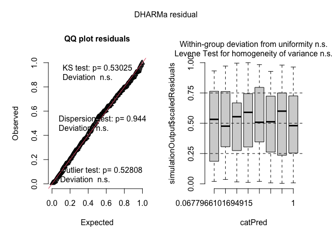
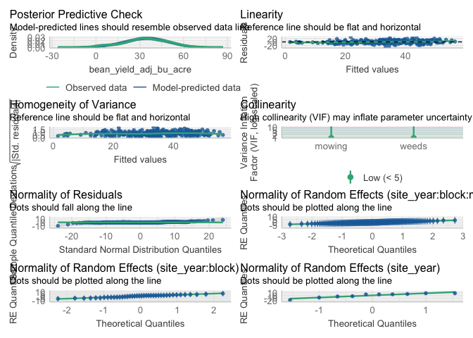
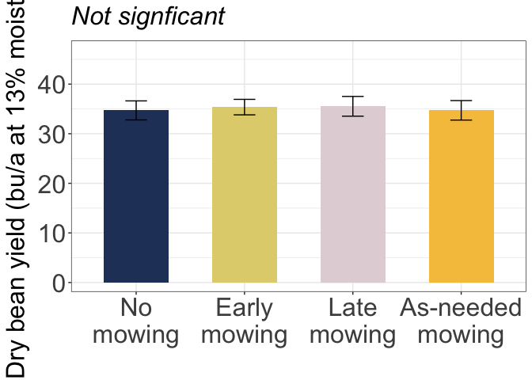

IMT Bean yield
================

# Load libraries

``` r
#Set work directory
setwd("/Users/ey239/Github/IMT/rmarkdowns")

#Load packages 
library(tidyverse) ##install.packages("tidyverse")
library(knitr)
library(patchwork) ##install.packages("patchwork")
library(skimr)     ##install.packages("skimr")
library(readxl)
library(janitor) ##install.packages("janitor")

library(kableExtra) ##install.packages("kableExtra")
library(webshot) ##install.packages("webshot")
webshot::install_phantomjs()
library(viridis) ##install.packages("viridis")
library(lme4) ##install.packages("lme4")
library(lmerTest) ##install.packages("lmerTest")
library(emmeans) ##install.packages("emmeans")
library(rstatix) ##install.packages("rstatix")
#library(Matrix) ##install.packages("Matrix")
library(multcomp) ##install.packages("multcomp")
library(multcompView) ##install.packages("multcompView")
library(ggResidpanel) ##install.packages("ggResidpanel")
#library(car)
#library(TMB)  ##install.packages("TMB")
library(glmmTMB)  ##install.packages("glmmTMB")
library(DHARMa)  ##install.packages("DHARMa")
library(performance) ##install.packages("performance")
library(WrensBookshelf)##install.packages("WrensBookshelf")
#Load Functions
MeanPlusSe<-function(x) mean(x)+plotrix::std.error(x)

find_logw0=function(x){c=trunc(log(min(x[x>0],na.rm=T)))
d=exp(c)
return(d)}
```

<br>

# Load and clean data

## Load data

``` r
combined_raw <- read_excel("~/Github/IMT/raw-data/combined_raw.xlsx")
kable(head(combined_raw))
```

| id | year | location | site_year | treatment | block | plot | microplot | bean_emergence | bean_biomass | intrarow_weed_biomass | interrow_weed_biomass | weed_biomass | bean_population | bean_yield |
|:---|---:|:---|:---|:---|---:|---:|:---|:---|---:|:---|:---|---:|:---|:---|
| WI_B1_P101 | 2023 | WI | WI_2023 | NWC | 1 | 101 | M | 23 | 233.3 | 0 | 2 | 1.84 | 38 | 295.66000000000003 |
| WI_B1_P101_SW | 2023 | WI | WI_2023 | NWC | 1 | 101 | SW | 24 | 61.7 | 31.66 | 155.9 | 187.56 | 28 | 88.81 |
| WI_B1_P101_WF | 2023 | WI | WI_2023 | NWC | 1 | 101 | WF | 14 | 210.3 | 0 | 0 | 0.00 | 38 | 273.51 |
| WI_B1_P102 | 2023 | WI | WI_2023 | LWC | 1 | 102 | M | 14 | 248.4 | 0 | 0 | 0.00 | 27 | 321.16000000000003 |
| WI_B1_P102_SW | 2023 | WI | WI_2023 | LWC | 1 | 102 | SW | 16 | 65.6 | 28.76 | 50 | 78.76 | 32 | 97.45 |
| WI_B1_P103 | 2023 | WI | WI_2023 | AWC | 1 | 103 | M | 17 | 279.3 | 0 | 0.21 | 0.21 | 34 | 302.72000000000003 |

\##Clean data \###ECOBEAN

``` r
#Standardaze column names, convert to factors, check for outliers of variable**
clean_combined <- clean_names(combined_raw) |>  
  rename(mowing = treatment, weeds = microplot) |> 
  mutate(across(c(year, location, site_year, mowing, block, plot, weeds), as.factor),
         bean_yield = as.numeric(as.character(bean_yield))) |>  # Convert to numeric
  mutate(is_outlier = bean_yield < (quantile(bean_yield, 0.25, na.rm = TRUE) - 1.5 * IQR(bean_yield, na.rm = TRUE)) |
                     bean_yield > (quantile(bean_yield, 0.75, na.rm = TRUE) + 1.5 * IQR(bean_yield, na.rm = TRUE))) |> 
  mutate(is_outlier = replace_na(is_outlier, FALSE))  # Ensure logical values
```

    ## Warning: There was 1 warning in `mutate()`.
    ## ℹ In argument: `bean_yield = as.numeric(as.character(bean_yield))`.
    ## Caused by warning:
    ## ! NAs introduced by coercion

``` r
bean_yield_clean <- clean_combined |>  
  filter(weeds %in% c("SW", "M")) |> # Keep only SW and M microplots
  filter(!is.na(bean_yield)) |>  # Remove NA values
  filter(is_outlier == FALSE) |>  # Remove outliers
  mutate(
    bean_yield_adj_bu_acre = (((bean_yield / 454) / (16.4 / 43560)) / 60) * ((100 - 0.00001) / (100 - 14)),
    bean_yield_adj_lbs_acre = ((bean_yield / 454) / (16.4 / 43560)) * ((100 - 0.00001) / (100 - 14)),
    bean_yield_adj_kg_ha = ((bean_yield / 454) / (16.4 / 43560)) * 1.12085 * ((100 - 0.00001) / (100 - 14))
  )
kable(bean_yield_clean)
```

| id | year | location | site_year | mowing | block | plot | weeds | bean_emergence | bean_biomass | intrarow_weed_biomass | interrow_weed_biomass | weed_biomass | bean_population | bean_yield | is_outlier | bean_yield_adj_bu_acre | bean_yield_adj_lbs_acre | bean_yield_adj_kg_ha |
|:---|:---|:---|:---|:---|:---|:---|:---|:---|---:|:---|:---|---:|:---|---:|:---|---:|---:|---:|
| WI_B1_P101 | 2023 | WI | WI_2023 | NWC | 1 | 101 | M | 23 | 233.30 | 0 | 2 | 1.84 | 38 | 295.660000 | FALSE | 33.5220830 | 2011.32498 | 2254.39361 |
| WI_B1_P101_SW | 2023 | WI | WI_2023 | NWC | 1 | 101 | SW | 24 | 61.70 | 31.66 | 155.9 | 187.56 | 28 | 88.810000 | FALSE | 10.0693235 | 604.15941 | 677.17208 |
| WI_B1_P102 | 2023 | WI | WI_2023 | LWC | 1 | 102 | M | 14 | 248.40 | 0 | 0 | 0.00 | 27 | 321.160000 | FALSE | 36.4132862 | 2184.79717 | 2448.82991 |
| WI_B1_P102_SW | 2023 | WI | WI_2023 | LWC | 1 | 102 | SW | 16 | 65.60 | 28.76 | 50 | 78.76 | 32 | 97.450000 | FALSE | 11.0489312 | 662.93587 | 743.05167 |
| WI_B1_P103 | 2023 | WI | WI_2023 | AWC | 1 | 103 | M | 17 | 279.30 | 0 | 0.21 | 0.21 | 34 | 302.720000 | FALSE | 34.3225495 | 2059.35297 | 2308.22578 |
| WI_B1_P103_SW | 2023 | WI | WI_2023 | AWC | 1 | 103 | SW | 15 | 80.10 | 27.56 | 22.26 | 49.82 | 32 | 118.170000 | FALSE | 13.3981755 | 803.89053 | 901.04070 |
| WI_B1_P104 | 2023 | WI | WI_2023 | EWC | 1 | 104 | M | 16 | 190.20 | 0 | 0.23 | 0.23 | 32 | 247.850000 | FALSE | 28.1013606 | 1686.08164 | 1889.84460 |
| WI_B1_P104_SW | 2023 | WI | WI_2023 | EWC | 1 | 104 | SW | 18 | 138.70 | 2.96 | 83.7 | 86.66 | 32 | 97.420000 | FALSE | 11.0455298 | 662.73179 | 742.82292 |
| WI_B1_P201 | 2023 | WI | WI_2023 | NWC | 2 | 201 | M | 18 | 292.00 | 0 | 0 | 0.00 | 27 | 380.140000 | FALSE | 43.1004690 | 2586.02814 | 2898.54964 |
| WI_B1_P201_SW | 2023 | WI | WI_2023 | NWC | 2 | 201 | SW | 13 | 77.70 | 35.06 | 50.8 | 85.86 | 38 | 100.870000 | FALSE | 11.4366925 | 686.20155 | 769.12901 |
| WI_B1_P202 | 2023 | WI | WI_2023 | EWC | 2 | 202 | M | 19 | 166.90 | 0.25999999999999979 | 3.66 | 3.92 | 42 | 234.370000 | FALSE | 26.5729913 | 1594.37948 | 1787.06024 |
| WI_B1_P202_SW | 2023 | WI | WI_2023 | EWC | 2 | 202 | SW | 20 | 80.60 | 5.36 | 89.3 | 94.66 | 24 | 68.100000 | FALSE | 7.7212131 | 463.27278 | 519.25930 |
| WI_B1_P203 | 2023 | WI | WI_2023 | AWC | 2 | 203 | M | 15 | 56.10 | 0 | 0 | 0.00 | 29 | 255.680000 | FALSE | 28.9891301 | 1739.34780 | 1949.54799 |
| WI_B1_P203_SW | 2023 | WI | WI_2023 | AWC | 2 | 203 | SW | 12 | 238.60 | 63.400000000000006 | 10.76 | 74.16 | 27 | 37.630000 | FALSE | 4.2665088 | 255.99053 | 286.92698 |
| WI_B1_P204 | 2023 | WI | WI_2023 | LWC | 2 | 204 | M | 14 | 146.20 | 0 | 0 | 0.00 | 31 | 200.880000 | FALSE | 22.7758778 | 1366.55267 | 1531.70056 |
| WI_B1_P204_SW | 2023 | WI | WI_2023 | LWC | 2 | 204 | SW | 11 | 75.90 | 7.7599999999999989 | 22.96 | 30.72 | 23 | 58.890000 | FALSE | 6.6769785 | 400.61871 | 449.03348 |
| WI_B1_P301 | 2023 | WI | WI_2023 | AWC | 3 | 301 | M | 21 | 210.70 | 0.30999999999999961 | 3.06 | 3.37 | 28 | 75.210000 | FALSE | 8.5273485 | 511.64091 | 573.47272 |
| WI_B1_P301_SF | 2023 | WI | WI_2023 | AWC | 3 | 301 | SW | 16 | 129.30 | 4.8600000000000003 | 14.86 | 19.72 | 23 | 42.440000 | FALSE | 4.8118691 | 288.71214 | 323.60301 |
| WI_B1_P302 | 2023 | WI | WI_2023 | LWC | 3 | 302 | M | 22 | 199.70 | 0 | 0 | 0.00 | 40 | 301.370000 | FALSE | 34.1694858 | 2050.16915 | 2297.93209 |
| WIj_B1_P302_SW | 2023 | WI | WI_2023 | LWC | 3 | 302 | SW | 17 | 129.80 | 5.6599999999999993 | 3.86 | 9.52 | 26 | 13.730000 | FALSE | 1.5567145 | 93.40287 | 104.69060 |
| WI_B1_P303 | 2023 | WI | WI_2023 | EWC | 3 | 303 | M | 19 | 233.40 | 0 | 1.41 | 1.41 | 29 | 67.300000 | FALSE | 7.6305087 | 457.83052 | 513.15934 |
| WI_B1_P303_SW | 2023 | WI | WI_2023 | EWC | 3 | 303 | SW | 15 | 107.20 | 21.16 | 10.46 | 31.62 | 23 | 1.690000 | FALSE | 0.1916131 | 11.49678 | 12.88617 |
| WI_B1_P304 | 2023 | WI | WI_2023 | NWC | 3 | 304 | M | 21 | 194.70 | 0 | 0 | 0.00 | 33 | 46.060000 | FALSE | 5.2223065 | 313.33839 | 351.20534 |
| WI_B1_P304_SW | 2023 | WI | WI_2023 | NWC | 3 | 304 | SW | 21 | 117.50 | 12.959999999999997 | 58.4 | 71.36 | 27 | 2.250000 | FALSE | 0.2551062 | 15.30637 | 17.15614 |
| WI_B1_P401 | 2023 | WI | WI_2023 | AWC | 4 | 401 | M | 13 | 177.40 | 0 | 1.57 | 1.57 | 39 | 194.030000 | FALSE | 21.9992213 | 1319.95328 | 1479.46963 |
| WI_B1_P401_SW | 2023 | WI | WI_2023 | AWC | 4 | 401 | SW | 18 | 35.60 | 32.660000000000004 | 38.700000000000003 | 71.36 | 31 | 31.610000 | FALSE | 3.5839581 | 215.03748 | 241.02476 |
| WI_B1_P402 | 2023 | WI | WI_2023 | NWC | 4 | 402 | M | 18 | 181.70 | 0 | 0 | 0.00 | 36 | 190.890000 | FALSE | 21.6432065 | 1298.59239 | 1455.52728 |
| WI_B1_P402_SW | 2023 | WI | WI_2023 | NWC | 4 | 402 | SW | 15 | 79.20 | 3.0599999999999996 | 128 | 131.06 | 37 | 5.020000 | FALSE | 0.5691702 | 34.15021 | 38.27726 |
| WI_B1_P403 | 2023 | WI | WI_2023 | LWC | 4 | 403 | M | 15 | 151.70 | 0 | 0 | 0.00 | 35 | 54.910000 | FALSE | 6.2257241 | 373.54344 | 418.68617 |
| WI_B1_P403_SW | 2023 | WI | WI_2023 | LWC | 4 | 403 | SW | 13 | 78.10 | 20.959999999999997 | 15.36 | 36.32 | 19 | 6.480000 | FALSE | 0.7347057 | 44.08234 | 49.40970 |
| WI_B1_P404 | 2023 | WI | WI_2023 | EWC | 4 | 404 | M | 18 | 139.40 | 0.12999999999999989 | 15.66 | 15.79 | 33 | 60.370000 | FALSE | 6.8447817 | 410.68690 | 460.31841 |
| WI_B1_P404_SW | 2023 | WI | WI_2023 | EWC | 4 | 404 | SW | 15 | 137.90 | 31.16 | 41 | 72.16 | 30 | 5.840000 | FALSE | 0.6621422 | 39.72853 | 44.52973 |
| WI_B1_P101 | 2024 | WI | WI_2024 | NWC | 1 | 101 | M | 20 | 177.58 | 0 | 14.97 | 14.97 | 20 | 436.000000 | FALSE | 49.4339045 | 2966.03427 | 3324.47951 |
| WI_B1_P101_SW | 2024 | WI | WI_2024 | NWC | 1 | 101 | SW | 18 | 61.84 | 44.1 | 25.32 | 69.42 | 18 | 202.700000 | FALSE | 22.9822304 | 1378.93382 | 1545.57798 |
| WI_B1_P102 | 2024 | WI | WI_2024 | AWC | 1 | 102 | M | 13 | 158.71 | 7.07 | 0.26 | 7.33 | 15.5 | 327.300000 | FALSE | 37.1094425 | 2226.56655 | 2495.64712 |
| WI_B1_P102_SW | 2024 | WI | WI_2024 | AWC | 1 | 102 | SW | 20 | 112.39 | 8 | 9.33 | 17.33 | 7 | 123.700000 | FALSE | 14.0251697 | 841.51018 | 943.20669 |
| WI_B1_P103 | 2024 | WI | WI_2024 | EWC | 1 | 103 | M | 21 | 188.63 | 0.28000000000000003 | 1.26 | 1.54 | 12.5 | 240.000000 | FALSE | 27.2113236 | 1632.67942 | 1829.98872 |
| WI_B1_P103_SW | 2024 | WI | WI_2024 | EWC | 1 | 103 | SW | 19 | 61.55 | 35.15 | 19.95 | 55.10 | 9.5 | 130.300000 | FALSE | 14.7734811 | 886.40887 | 993.53138 |
| WI_B1_P104 | 2024 | WI | WI_2024 | LWC | 1 | 104 | M | 26 | 146.63 | 0.35 | 0.17 | 0.52 | 16.5 | 328.700000 | FALSE | 37.2681753 | 2236.09052 | 2506.32205 |
| WI_B1_P104_SW | 2024 | WI | WI_2024 | LWC | 1 | 104 | SW | 17 | 134.41 | 9.02 | 8.81 | 17.83 | 16.5 | 291.900000 | FALSE | 33.0957723 | 1985.74634 | 2225.72378 |
| WI_B1_P201 | 2024 | WI | WI_2024 | EWC | 2 | 201 | M | 13 | 169.65 | 0.15 | 1.35 | 1.50 | 19.5 | 397.800000 | FALSE | 45.1027688 | 2706.16613 | 3033.20631 |
| WI_B1_P201_SW | 2024 | WI | WI_2024 | EWC | 2 | 201 | SW | 16 | 122.05 | 44.3 | 37.049999999999997 | 81.35 | 15 | 182.000000 | FALSE | 20.6352537 | 1238.11522 | 1387.74145 |
| WI_B1_P202 | 2024 | WI | WI_2024 | AWC | 2 | 202 | M | 16 | 102.19 | 0.22 | 5.84 | 6.06 | 19.5 | 447.200000 | FALSE | 50.7037663 | 3042.22598 | 3409.87899 |
| WI_B1_P202_SW | 2024 | WI | WI_2024 | AWC | 2 | 202 | SW | 18 | 126.88 | 19.87 | 0.64 | 20.51 | 19.5 | 303.900000 | FALSE | 34.4563385 | 2067.38031 | 2317.22322 |
| WI_B1_P203 | 2024 | WI | WI_2024 | LWC | 2 | 203 | M | 21 | 208.61 | 0.28999999999999998 | 1.37 | 1.66 | 18.5 | 318.500000 | FALSE | 36.1116940 | 2166.70164 | 2428.54753 |
| WI_B1_P203_SW | 2024 | WI | WI_2024 | LWC | 2 | 203 | SW | 18 | 53.86 | 54.16 | 33.64 | 87.80 | 16.5 | 80.800000 | FALSE | 9.1611456 | 549.66874 | 616.09620 |
| WI_B1_P204 | 2024 | WI | WI_2024 | NWC | 2 | 204 | M | 16 | 150.29 | 0 | 0 | 0.00 | 22.5 | 437.500000 | FALSE | 49.6039753 | 2976.23852 | 3335.91694 |
| WI_B1_P204_SW | 2024 | WI | WI_2024 | NWC | 2 | 204 | SW | 23 | 83.42 | 23.94 | 40.9 | 64.84 | 15.5 | 153.500000 | FALSE | 17.4039090 | 1044.23454 | 1170.43029 |
| WI_B1_P301 | 2024 | WI | WI_2024 | AWC | 3 | 301 | M | 18 | 133.10 | 13.600000000000001 | 0 | 13.60 | 22.5 | 378.600000 | FALSE | 42.9258630 | 2575.55178 | 2886.80721 |
| WI_B1_P301_SW | 2024 | WI | WI_2024 | AWC | 3 | 301 | SW | 17 | 107.80 | 12.5 | 22.300000000000004 | 34.80 | 17.5 | 232.700000 | FALSE | 26.3836458 | 1583.01875 | 1774.32657 |
| WI_B1_P302 | 2024 | WI | WI_2024 | NWC | 3 | 302 | M | 12 | 187.80 | 0 | 6.02 | 6.02 | 21 | 409.000000 | FALSE | 46.3726306 | 2782.35784 | 3118.60578 |
| WIj_B1_P302_SW | 2024 | WI | WI_2024 | NWC | 3 | 302 | SW | 19 | 73.90 | 23.7 | 54.9 | 78.60 | 15.5 | 150.100000 | FALSE | 17.0184153 | 1021.10492 | 1144.50545 |
| WI_B1_P303 | 2024 | WI | WI_2024 | LWC | 3 | 303 | M | 15 | 103.90 | 4.3 | 4.2699999999999996 | 8.57 | 14.5 | 330.300000 | FALSE | 37.4495841 | 2246.97505 | 2518.52198 |
| WI_B1_P303_SW | 2024 | WI | WI_2024 | LWC | 3 | 303 | SW | 9 | 39.10 | 17 | 8.5500000000000007 | 25.55 | 11 | 30.900000 | FALSE | 3.5034579 | 210.20747 | 235.61105 |
| WI_B1_P304 | 2024 | WI | WI_2024 | EWC | 3 | 304 | M | 9 | 213.30 | 0 | 1.62 | 1.62 | 20.5 | 388.800000 | FALSE | 44.0823442 | 2644.94065 | 2964.58173 |
| WI_B1_P304_SW | 2024 | WI | WI_2024 | EWC | 3 | 304 | SW | 13 | 119.30 | 50.9 | 36.699999999999996 | 87.60 | 14.5 | 117.100000 | FALSE | 13.2768583 | 796.61150 | 892.88200 |
| WI_B1_P401 | 2024 | WI | WI_2024 | AWC | 4 | 401 | M | 13 | 113.61 | 0.1 | 0.13 | 0.23 | 15 | 237.100000 | FALSE | 26.8825201 | 1612.95121 | 1807.87636 |
| WI_B1_P401_SW | 2024 | WI | WI_2024 | AWC | 4 | 401 | SW | 8 | 87.45 | 30.38 | 20.43 | 50.81 | 13 | 189.600000 | FALSE | 21.4969456 | 1289.81674 | 1445.69109 |
| WI_B1_P402 | 2024 | WI | WI_2024 | LWC | 4 | 402 | M | 12 | 165.00 | 0.71 | 1.19 | 1.90 | 14 | 244.600000 | FALSE | 27.7328740 | 1663.97244 | 1865.06351 |
| WI_B1_P402_SW | 2024 | WI | WI_2024 | LWC | 4 | 402 | SW | 12 | 28.28 | 16.100000000000001 | 20.6 | 36.70 | 4 | 30.300000 | FALSE | 3.4354296 | 206.12578 | 231.03608 |
| WI_B1_P403 | 2024 | WI | WI_2024 | EWC | 4 | 403 | M | 11 | 79.99 | 1.02 | 0.81 | 1.83 | 14 | 381.300000 | FALSE | 43.2319903 | 2593.91942 | 2907.39458 |
| WI_B1_P403_SW | 2024 | WI | WI_2024 | EWC | 4 | 403 | SW | 14 | 81.17 | 57.31 | 111.5 | 168.81 | 14 | 150.800000 | FALSE | 17.0977817 | 1025.86690 | 1149.84291 |
| WI_B1_P404 | 2024 | WI | WI_2024 | NWC | 4 | 404 | M | 8 | 259.01 | 0.03 | 6.13 | 6.16 | 17.5 | 80.900000 | FALSE | 9.1724837 | 550.34902 | 616.85870 |
| WI_B1_P404_SW | 2024 | WI | WI_2024 | NWC | 4 | 404 | SW | 12 | 62.49 | 38.93 | 84.52 | 123.45 | 7.5 | 443.500000 | FALSE | 50.2842584 | 3017.05550 | 3381.66666 |
| VT_B1_P101 | 2023 | VT | VT_2023 | LWC | 1 | 101 | M | 31 | 192.10 | 0 | 0.1 | 0.10 | 21 | 348.048335 | FALSE | 39.4618994 | 2367.71397 | 2653.85220 |
| VT_B1_P101_SW | 2023 | VT | VT_2023 | LWC | 1 | 101 | SW | 34 | 115.60 | 0.9 | 0.2 | 1.10 | 20 | 109.285954 | FALSE | 12.3908977 | 743.45386 | 833.30026 |
| VT_B1_P102 | 2023 | VT | VT_2023 | NWC | 1 | 102 | M | 23 | 234.90 | 0 | 0.9 | 0.90 | 32 | 294.998233 | FALSE | 33.4470515 | 2006.82309 | 2249.34766 |
| VT_B1_P102_SW | 2023 | VT | VT_2023 | NWC | 1 | 102 | SW | 30 | 177.30 | 0 | 21.5 | 21.50 | 33 | 271.811888 | FALSE | 30.8181719 | 1849.09031 | 2072.55288 |
| VT_B1_P103 | 2023 | VT | VT_2023 | EWC | 1 | 103 | M | 34 | 187.80 | 0 | 2.7 | 2.70 | 33 | 481.575516 | FALSE | 54.6012800 | 3276.07680 | 3671.99068 |
| VT_B1_P103_SW | 2023 | VT | VT_2023 | EWC | 1 | 103 | SW | 29 | 336.70 | 0 | 4.2 | 4.20 | 18 | 434.427488 | FALSE | 49.2556123 | 2955.33674 | 3312.48919 |
| VT_B1_P104 | 2023 | VT | VT_2023 | AWC | 1 | 104 | M | 33 | 204.00 | 7.2 | 0.4 | 7.60 | 23 | 451.179042 | FALSE | 51.1549121 | 3069.29473 | 3440.21899 |
| VT_B1_P104_SW | 2023 | VT | VT_2023 | AWC | 1 | 104 | SW | 29 | 257.80 | 0 | 13.1 | 13.10 | 30 | 403.176558 | FALSE | 45.7123658 | 2742.74195 | 3074.20231 |
| VT_B2_P201 | 2023 | VT | VT_2023 | LWC | 2 | 201 | M | 32 | 139.80 | 0 | 3.2 | 3.20 | 17 | 319.176167 | FALSE | 36.1883582 | 2171.30149 | 2433.70328 |
| VT_B2_P201_SW | 2023 | VT | VT_2023 | LWC | 2 | 201 | SW | 39 | 196.00 | 4 | 1.9 | 5.90 | 21 | 184.087758 | FALSE | 20.8719648 | 1252.31789 | 1403.66051 |
| VT_B2_P202 | 2023 | VT | VT_2023 | EWC | 2 | 201 | M | 20 | 248.60 | 0 | 12.5 | 12.50 | 27 | 568.118177 | FALSE | 64.4135314 | 3864.81189 | 4331.87440 |
| VT_B2_P202_SW | 2023 | VT | VT_2023 | EWC | 2 | 202 | SW | 39 | 204.40 | 49 | 0 | 49.00 | 24 | 543.054140 | FALSE | 61.5717580 | 3694.30548 | 4140.76230 |
| VT_B2_P203 | 2023 | VT | VT_2023 | AWC | 2 | 202 | M | 34 | 218.90 | 0 | 0.9 | 0.90 | 23 | 309.212791 | FALSE | 35.0587054 | 2103.52233 | 2357.73300 |
| VT_B2_P203_SW | 2023 | VT | VT_2023 | AWC | 2 | 203 | SW | 22 | 255.60 | 1.7 | 12.8 | 14.50 | 13 | 315.895479 | FALSE | 35.8163921 | 2148.98353 | 2408.68818 |
| VT_B2_P204 | 2023 | VT | VT_2023 | NWC | 2 | 203 | M | 38 | 177.80 | 0 | 1.3 | 1.30 | 20 | 582.163954 | FALSE | 66.0060488 | 3960.36293 | 4438.97279 |
| VT_B2_P204_SW | 2023 | VT | VT_2023 | NWC | 2 | 204 | SW | 28 | 91.20 | 28.2 | 19.3 | 47.50 | 23 | 395.423163 | FALSE | 44.8332818 | 2689.99691 | 3015.08304 |
| VT_B3_P301 | 2023 | VT | VT_2023 | LWC | 3 | 301 | M | 28 | 245.70 | 0.4 | 0 | 0.40 | 29 | 452.455451 | FALSE | 51.2996320 | 3077.97792 | 3449.95155 |
| VT_B3_P301_SW | 2023 | VT | VT_2023 | LWC | 3 | 301 | SW | 22 | 48.70 | 11.1 | 13.3 | 24.40 | 2 | 9.304074 | FALSE | 1.0549007 | 63.29404 | 70.94313 |
| VT_B3_P302 | 2023 | VT | VT_2023 | EWC | 3 | 302 | M | 31 | 173.20 | 1.1000000000000001 | 26.1 | 27.20 | 15 | 516.845554 | FALSE | 58.6002150 | 3516.01290 | 3940.92306 |
| VT_B3_P302_SW | 2023 | VT | VT_2023 | EWC | 3 | 302 | SW | 28 | 224.20 | 0 | 2.1 | 2.10 | 31 | 606.853507 | FALSE | 68.8053631 | 4128.32179 | 4627.22948 |
| VT_B3_P303 | 2023 | VT | VT_2023 | AWC | 3 | 302 | M | 29 | 255.20 | 1.4 | 0 | 1.40 | 42 | 403.725098 | FALSE | 45.7745595 | 2746.47357 | 3078.38490 |
| VT_B3_P303_SW | 2023 | VT | VT_2023 | AWC | 3 | 303 | SW | 28 | 241.10 | 13 | 29.9 | 42.90 | 22 | 339.820242 | FALSE | 38.5289940 | 2311.73964 | 2591.11338 |
| VT_B3_P304 | 2023 | VT | VT_2023 | NWC | 3 | 303 | M | 33 | 412.30 | 0 | 4.0999999999999996 | 4.10 | 18 | 470.710214 | FALSE | 53.3693664 | 3202.16199 | 3589.14326 |
| VT_B3_P304_SW | 2023 | VT | VT_2023 | NWC | 3 | 304 | SW | 19 | 247.70 | 0 | 97.8 | 97.80 | 9 | 553.297061 | FALSE | 62.7331056 | 3763.98634 | 4218.86409 |
| VT_B4_P401 | 2023 | VT | VT_2023 | LWC | 4 | 401 | M | 33 | 209.80 | 0 | 3.3 | 3.30 | 9 | 286.147758 | FALSE | 32.4435802 | 1946.61481 | 2181.86321 |
| VT_B4_P401_SW | 2023 | VT | VT_2023 | LWC | 4 | 401 | SW | 31 | 87.00 | 0.6 | 0 | 0.60 | 22 | 188.760893 | FALSE | 21.4018073 | 1284.10844 | 1439.29294 |
| VT_B4_P402 | 2023 | VT | VT_2023 | NWC | 4 | 402 | M | 28 | 210.90 | 0 | 41.8 | 41.80 | 39 | 401.356884 | FALSE | 45.5060502 | 2730.36301 | 3060.32738 |
| VT_B4_P402_SW | 2023 | VT | VT_2023 | NWC | 4 | 402 | SW | 25 | 124.20 | 7.8 | 75.900000000000006 | 83.70 | 26 | 202.458558 | FALSE | 22.9548556 | 1377.29133 | 1543.73699 |
| VT_B4_P403 | 2023 | VT | VT_2023 | EWC | 4 | 403 | M | 28 | 207.50 | 0 | 14.8 | 14.80 | 20 | 525.279349 | FALSE | 59.5564431 | 3573.38658 | 4005.23035 |
| VT_B4_P403_SW | 2023 | VT | VT_2023 | EWC | 4 | 404 | SW | 23 | 217.80 | 4.4000000000000004 | 11.4 | 15.80 | 29 | 318.996837 | FALSE | 36.1680257 | 2170.08154 | 2432.33589 |
| VT_B4_P404 | 2023 | VT | VT_2023 | AWC | 4 | 404 | M | 38 | 147.10 | 13.8 | 24.1 | 37.90 | 15 | 387.374400 | FALSE | 43.9207089 | 2635.24254 | 2953.71160 |
| VT_B4_P404_SW | 2023 | VT | VT_2023 | AWC | 4 | 404 | SW | 14 | 101.90 | 3.6 | 53.7 | 57.30 | 15 | 354.171935 | FALSE | 40.1561964 | 2409.37178 | 2700.54436 |
| VT_B1_P101 | 2024 | VT | VT_2024 | NWC | 1 | 101 | M | 10 | 68.60 | 4.8 | 3.4 | 8.20 | 29 | 440.912093 | FALSE | 49.9908402 | 2999.45041 | 3361.93399 |
| VT_B1_P101_SW | 2024 | VT | VT_2024 | NWC | 1 | 101 | SW | 15 | 40.00 | 11.3 | 99.9 | 111.20 | 22 | 184.632279 | FALSE | 20.9337029 | 1256.02217 | 1407.81245 |
| VT_B1_P102 | 2024 | VT | VT_2024 | AWC | 1 | 102 | M | 7 | 46.70 | 0.6 | 5.2 | 5.80 | 17 | 167.340093 | FALSE | 18.9731059 | 1138.38636 | 1275.96035 |
| VT_B1_P102_SW | 2024 | VT | VT_2024 | AWC | 1 | 102 | SW | 1 | 69.50 | 11.4 | 52.2 | 63.60 | 10 | 110.433384 | FALSE | 12.5209939 | 751.25963 | 842.04936 |
| VT_B1_P103 | 2024 | VT | VT_2024 | EWC | 1 | 103 | M | 4 | 76.10 | 0.3 | 2.7 | 3.00 | 22 | 372.073674 | FALSE | 42.1859048 | 2531.15429 | 2837.04428 |
| VT_B1_P103_SW | 2024 | VT | VT_2024 | EWC | 1 | 103 | SW | 5 | 43.70 | 12.7 | 22.6 | 35.30 | 25 | 181.538512 | FALSE | 20.5829299 | 1234.97580 | 1384.22262 |
| VT_B1_P104 | 2024 | VT | VT_2024 | LWC | 1 | 104 | M | 16 | 64.70 | 0 | 0 | 0.00 | 36 | 290.839663 | FALSE | 32.9755507 | 1978.53304 | 2217.63876 |
| VT_B1_P104_SW | 2024 | VT | VT_2024 | LWC | 1 | 104 | SW | 10 | 12.20 | 3.1 | 11.4 | 14.50 | 14 | 53.365395 | FALSE | 6.0505960 | 363.03576 | 406.90863 |
| VT_B2_P201 | 2024 | VT | VT_2024 | LWC | 2 | 201 | M | 15 | 85.10 | 0.9 | 3.3 | 4.20 | 29 | 255.781465 | FALSE | 29.0006342 | 1740.03805 | 1950.32165 |
| VT_B2_P201_SW | 2024 | VT | VT_2024 | LWC | 2 | 201 | SW | 18 | 32.40 | 20.100000000000001 | 22.6 | 42.70 | 15 | 44.152349 | FALSE | 5.0060160 | 300.36096 | 336.65959 |
| VT_B2_P202 | 2024 | VT | VT_2024 | EWC | 2 | 201 | M | 9 | 61.80 | 0 | 7.4 | 7.40 | 19 | 305.346139 | FALSE | 34.6203025 | 2077.21815 | 2328.24997 |
| VT_B2_P202_SW | 2024 | VT | VT_2024 | EWC | 2 | 202 | SW | 10 | 65.80 | 14.3 | 59.3 | 73.60 | 15 | 99.136686 | FALSE | 11.2401685 | 674.41011 | 755.91257 |
| VT_B2_P203 | 2024 | VT | VT_2024 | AWC | 2 | 202 | M | 11 | 28.70 | 7.5 | 19.100000000000001 | 26.60 | 8 | 227.426233 | FALSE | 25.7857034 | 1547.14220 | 1734.11434 |
| VT_B2_P203_SW | 2024 | VT | VT_2024 | AWC | 2 | 203 | SW | 4 | 34.70 | 15.3 | 45.8 | 61.10 | 14 | 157.589453 | FALSE | 17.8675734 | 1072.05440 | 1201.61218 |
| VT_B2_P204 | 2024 | VT | VT_2024 | NWC | 2 | 203 | M | 6 | 10.20 | 0 | 0 | 0.00 | 9 | 513.143349 | FALSE | 58.1804571 | 3490.82743 | 3912.69392 |
| VT_B2_P204_SW | 2024 | VT | VT_2024 | NWC | 2 | 204 | SW | 5 | 26.30 | 12.2 | 8.1 | 20.30 | 11 | 62.928535 | FALSE | 7.1348697 | 428.09218 | 479.82712 |
| VT_B3_P301 | 2024 | VT | VT_2024 | EWC | 3 | 301 | M | 11 | 66.70 | 0 | 8.1 | 8.10 | 27 | 349.477907 | FALSE | 39.6239851 | 2377.43910 | 2664.75262 |
| VT_B3_P301_SW | 2024 | VT | VT_2024 | EWC | 3 | 301 | SW | 6 | 56.50 | 31.8 | 71 | 102.80 | 20 | 214.991093 | FALSE | 24.3758008 | 1462.54805 | 1639.29698 |
| VT_B3_P302 | 2024 | VT | VT_2024 | NWC | 3 | 302 | M | 15 | 68.10 | 0 | 1 | 1.00 | 32 | 421.652442 | FALSE | 47.8071710 | 2868.43026 | 3215.08006 |
| VT_B3_P302_SW | 2024 | VT | VT_2024 | NWC | 3 | 302 | SW | 4 | 66.00 | 10.5 | 80.099999999999994 | 90.60 | 27 | 161.832837 | FALSE | 18.3486904 | 1100.92143 | 1233.96778 |
| VT_B3_P303 | 2024 | VT | VT_2024 | AWC | 3 | 303 | M | 10 | 49.10 | 0.6 | 2.5 | 3.10 | 27 | 366.176930 | FALSE | 41.5173289 | 2491.03973 | 2792.08189 |
| VT_B3_P303_SW | 2024 | VT | VT_2024 | AWC | 3 | 303 | SW | 16 | 54.20 | 17.2 | 19.399999999999999 | 36.60 | 27 | 211.187116 | FALSE | 23.9445040 | 1436.67024 | 1610.29184 |
| VT_B3_P304 | 2024 | VT | VT_2024 | LWC | 3 | 304 | M | 15 | 58.40 | 0 | 0.9 | 0.90 | 31 | 365.831140 | FALSE | 41.4781230 | 2488.68738 | 2789.44525 |
| VT_B3_P304_SW | 2024 | VT | VT_2024 | LWC | 3 | 304 | SW | 18 | 69.50 | 10 | 9.6 | 19.60 | 31 | 264.741279 | FALSE | 30.0165025 | 1800.99015 | 2018.63981 |
| VT_B4_P401 | 2024 | VT | VT_2024 | EWC | 4 | 401 | M | 11 | 42.70 | 0 | 9.3000000000000007 | 9.30 | 14 | 488.802395 | FALSE | 55.4206673 | 3325.24004 | 3727.09530 |
| VT_B4_P401_SW | 2024 | VT | VT_2024 | EWC | 4 | 401 | SW | 12 | 50.90 | 21 | 83.5 | 104.50 | 23 | 291.648663 | FALSE | 33.0672756 | 1984.03653 | 2223.80735 |
| VT_B4_P402 | 2024 | VT | VT_2024 | LWC | 4 | 402 | M | 8 | 102.80 | 0 | 0 | 0.00 | 8 | 517.599593 | FALSE | 58.6857084 | 3521.14250 | 3946.67258 |
| VT_B4_P402_SW | 2024 | VT | VT_2024 | LWC | 4 | 402 | SW | 13 | 49.50 | 27.2 | 65.900000000000006 | 93.10 | 26 | 170.744314 | FALSE | 19.3590782 | 1161.54469 | 1301.91737 |
| VT_B4_P403 | 2024 | VT | VT_2024 | AWC | 4 | 403 | M | 6 | 60.90 | 1.6 | 24.4 | 26.00 | 24 | 320.117512 | FALSE | 36.2950883 | 2177.70530 | 2440.88098 |
| VT_B4_P403_SW | 2024 | VT | VT_2024 | AWC | 4 | 403 | SW | 15 | 75.40 | 6.3 | 24.5 | 30.80 | 22 | 227.663721 | FALSE | 25.8126299 | 1548.75779 | 1735.92517 |
| VT_B4_P404 | 2024 | VT | VT_2024 | NWC | 4 | 404 | M | 16 | 54.00 | 2.1 | 9.1999999999999993 | 11.30 | 26 | 463.873988 | FALSE | 52.5942717 | 3155.65630 | 3537.01736 |
| VT_B4_P404_SW | 2024 | VT | VT_2024 | NWC | 4 | 404 | SW | 15 | 64.70 | 2.6 | 52.9 | 55.50 | 29 | 216.543279 | FALSE | 24.5517885 | 1473.10731 | 1651.13233 |
| ME_B1_P101 | 2023 | ME | ME_2023 | NWC | 1 | 101 | M | 16 | 140.80 | na | na | 31.20 | 32 | 481.339535 | FALSE | 54.5745243 | 3274.47146 | 3670.19134 |
| ME_B1_P101_SW | 2023 | ME | ME_2023 | NWC | 1 | 101 | SW | na | 154.40 | na | na | 67.00 | 29 | 274.641861 | FALSE | 31.1390356 | 1868.34213 | 2094.13128 |
| ME_B1_P102 | 2023 | ME | ME_2023 | EWC | 1 | 102 | M | 16 | 87.20 | na | na | 70.70 | 30 | 449.452326 | FALSE | 50.9591361 | 3057.54817 | 3427.05286 |
| ME_B1_P102_SW | 2023 | ME | ME_2023 | EWC | 1 | 102 | SW | na | 144.60 | na | na | 15.50 | 28 | 288.676744 | FALSE | 32.7303179 | 1963.81907 | 2201.14661 |
| ME_B1_P103 | 2023 | ME | ME_2023 | LWC | 1 | 103 | M | 18 | 155.50 | na | na | 22.20 | 36 | 447.251163 | FALSE | 50.7095671 | 3042.57403 | 3410.26910 |
| ME_B1_P103_SW | 2023 | ME | ME_2023 | LWC | 1 | 103 | SW | na | 219.20 | na | na | 5.20 | 26 | 349.730233 | FALSE | 39.6525939 | 2379.15563 | 2666.67659 |
| ME_B1_P104 | 2023 | ME | ME_2023 | AWC | 1 | 104 | M | 12 | 77.90 | na | na | 68.80 | 26 | 374.127907 | FALSE | 42.4188147 | 2545.12889 | 2852.70771 |
| ME_B1_P104_SW | 2023 | ME | ME_2023 | AWC | 1 | 104 | SW | na | 144.70 | na | na | 12.70 | 29 | 240.053488 | FALSE | 27.2173881 | 1633.04329 | 1830.39657 |
| ME_B2_P201 | 2023 | ME | ME_2023 | EWC | 2 | 201 | M | 15 | 108.70 | na | na | 99.70 | 37 | 307.130233 | FALSE | 34.8225839 | 2089.35504 | 2341.85359 |
| ME_B2_P201_SW | 2023 | ME | ME_2023 | EWC | 2 | 201 | SW | na | 216.20 | na | na | 58.20 | 23 | 252.130233 | FALSE | 28.5866556 | 1715.19934 | 1922.48118 |
| ME_B2_P202 | 2023 | ME | ME_2023 | AWC | 2 | 202 | M | 12 | 199.00 | na | na | 11.80 | 28 | 429.097674 | FALSE | 48.6513153 | 2919.07892 | 3271.84960 |
| ME_B2_P202_SW | 2023 | ME | ME_2023 | AWC | 2 | 202 | SW | na | 77.20 | na | na | 90.10 | 24 | 288.079070 | FALSE | 32.6625533 | 1959.75320 | 2196.58937 |
| ME_B2_P203 | 2023 | ME | ME_2023 | NWC | 2 | 203 | M | 20 | 168.90 | na | na | 4.90 | 36 | 293.860465 | FALSE | 33.3180509 | 1999.08305 | 2240.67224 |
| ME_B2_P203_SW | 2023 | ME | ME_2023 | NWC | 2 | 203 | SW | na | 171.30 | na | na | 15.60 | 29 | 223.953488 | FALSE | 25.3919618 | 1523.51771 | 1707.63483 |
| ME_B2_P204 | 2023 | ME | ME_2023 | LWC | 2 | 204 | M | 21 | 182.20 | na | na | 20.70 | 29 | 155.953488 | FALSE | 17.6820868 | 1060.92521 | 1189.13802 |
| ME_B2_P204_SW | 2023 | ME | ME_2023 | LWC | 2 | 204 | SW | na | 115.10 | na | na | 38.30 | 44 | 244.130233 | FALSE | 27.6796115 | 1660.77669 | 1861.48155 |
| ME_B3_P301 | 2023 | ME | ME_2023 | NWC | 3 | 301 | M | 15 | 152.50 | na | na | 7.00 | 26 | 606.188372 | FALSE | 68.7299498 | 4123.79699 | 4622.15785 |
| ME_B3_P301_SW | 2023 | ME | ME_2023 | NWC | 3 | 301 | SW | na | 74.80 | na | na | 109.60 | 23 | 280.232558 | FALSE | 31.7729117 | 1906.37470 | 2136.76009 |
| ME_B3_P302 | 2023 | ME | ME_2023 | EWC | 3 | 302 | M | 19 | 177.30 | na | na | 32.70 | 31 | 472.593023 | FALSE | 53.5828403 | 3214.97042 | 3603.49960 |
| ME_B3_P302_SW | 2023 | ME | ME_2023 | EWC | 3 | 302 | SW | na | 129.40 | na | na | 111.40 | 32 | 404.206977 | FALSE | 45.8291952 | 2749.75171 | 3082.05920 |
| ME_B3_P303 | 2023 | ME | ME_2023 | AWC | 3 | 303 | M | 15 | 159.80 | na | na | 15.10 | 36 | 365.586047 | FALSE | 41.4503342 | 2487.02005 | 2787.57643 |
| ME_B3_P303_SW | 2023 | ME | ME_2023 | AWC | 3 | 303 | SW | na | 125.60 | na | na | 121.00 | 23 | 224.246512 | FALSE | 25.4251850 | 1525.51110 | 1709.86911 |
| ME_B3_P304 | 2023 | ME | ME_2023 | LWC | 3 | 304 | M | 12 | 150.10 | na | na | 19.70 | 24 | 326.190698 | FALSE | 36.9836693 | 2219.02016 | 2487.18874 |
| ME_B3_P304_SW | 2023 | ME | ME_2023 | LWC | 3 | 304 | SW | na | 90.60 | na | na | 111.80 | 27 | 256.826744 | FALSE | 29.1191485 | 1747.14891 | 1958.29186 |
| ME_B4_P401 | 2023 | ME | ME_2023 | AWC | 4 | 401 | M | 11 | 110.40 | na | na | 113.80 | 30 | 496.960465 | FALSE | 56.3456334 | 3380.73801 | 3789.30019 |
| ME_B4_P401_SW | 2023 | ME | ME_2023 | AWC | 4 | 401 | SW | na | 68.30 | na | na | 38.30 | 18 | 237.506977 | FALSE | 26.9286633 | 1615.71980 | 1810.97954 |
| ME_B4_P402 | 2023 | ME | ME_2023 | LWC | 4 | 402 | M | 13 | 117.70 | na | na | 118.00 | 27 | 481.730233 | FALSE | 54.6188218 | 3277.12931 | 3673.17039 |
| ME_B4_P402_SW | 2023 | ME | ME_2023 | LWC | 4 | 402 | SW | na | 161.80 | na | na | 11.60 | 23 | 316.627907 | FALSE | 35.8994351 | 2153.96611 | 2414.27291 |
| ME_B4_P403 | 2023 | ME | ME_2023 | EWC | 4 | 403 | M | 16 | 122.80 | na | na | 117.00 | 35 | 595.716279 | FALSE | 67.5426185 | 4052.55711 | 4542.30864 |
| ME_B4_P403_SW | 2023 | ME | ME_2023 | EWC | 4 | 403 | SW | na | 149.40 | na | na | 19.40 | 19 | 330.476744 | FALSE | 37.4696234 | 2248.17741 | 2519.86965 |
| ME_B4_P404 | 2023 | ME | ME_2023 | NWC | 4 | 404 | M | 21 | 146.10 | na | na | 120.10 | 26 | 311.302326 | FALSE | 35.2956180 | 2117.73708 | 2373.66560 |
| ME_B4_P3404_SW | 2023 | ME | ME_2023 | NWC | 4 | 404 | SW | na | 183.60 | na | na | 16.40 | 34 | 298.688372 | FALSE | 33.8654414 | 2031.92649 | 2277.48480 |
| ME_B1_P101 | 2024 | ME | ME_2024 | LWC | 1 | 101 | M | 29 | 232.50 | Na | Na | 3.60 | 33 | 496.744295 | FALSE | 56.3211239 | 3379.26744 | 3787.65191 |
| ME_B1_P101_SW | 2024 | ME | ME_2024 | LWC | 1 | 101 | SW | 30 | 211.80 | Na | Na | 60.00 | 29 | 304.773772 | FALSE | 34.5554073 | 2073.32444 | 2323.88569 |
| ME_B1_P102 | 2024 | ME | ME_2024 | EWC | 1 | 101 | M | 27 | 228.00 | Na | Na | 3.10 | 27 | 533.231456 | FALSE | 60.4580571 | 3627.48343 | 4065.86480 |
| ME_B1_P102_SW | 2024 | ME | ME_2024 | EWC | 1 | 102 | SW | 25 | 108.30 | Na | Na | 132.80 | 20 | 188.376642 | FALSE | 21.3582407 | 1281.49444 | 1436.36304 |
| ME_B1_P103 | 2024 | ME | ME_2024 | AWC | 1 | 102 | M | 25 | 244.10 | Na | Na | 5.50 | 29 | 444.774229 | FALSE | 50.4287311 | 3025.72386 | 3391.38259 |
| ME_B1_P103_SW | 2024 | ME | ME_2024 | AWC | 1 | 103 | SW | 32.5 | 163.10 | Na | Na | 66.30 | 28 | 278.876586 | FALSE | 31.6191709 | 1897.15026 | 2126.42086 |
| ME_B1_P104 | 2024 | ME | ME_2024 | NWC | 1 | 103 | M | 34.5 | 252.70 | Na | Na | 20.60 | 36 | 390.337706 | FALSE | 44.2566901 | 2655.40140 | 2976.30666 |
| ME_B1_P104_SW | 2024 | ME | ME_2024 | NWC | 1 | 104 | SW | 33 | 255.00 | Na | Na | 73.60 | 34 | 276.182050 | FALSE | 31.3136631 | 1878.81978 | 2105.87516 |
| ME_B1_P201 | 2024 | ME | ME_2024 | AWC | 2 | 201 | M | 23.5 | 257.80 | Na | Na | 23.20 | 22 | 479.905515 | FALSE | 54.4119344 | 3264.71606 | 3659.25700 |
| ME_B1_P201_SW | 2024 | ME | ME_2024 | AWC | 2 | 201 | SW | 12 | 185.60 | Na | Na | 66.20 | 11 | 218.429693 | FALSE | 24.7656711 | 1485.94026 | 1665.51615 |
| ME_B1_P202 | 2024 | ME | ME_2024 | EWC | 2 | 202 | M | 28 | 237.20 | Na | Na | 44.40 | 30 | 287.118082 | FALSE | 32.5535960 | 1953.21576 | 2189.26188 |
| ME_B1_P202_SW | 2024 | ME | ME_2024 | EWC | 2 | 202 | SW | 22 | 205.10 | Na | Na | 96.30 | 24 | 287.249485 | FALSE | 32.5684946 | 1954.10967 | 2190.26383 |
| ME_B1_P203 | 2024 | ME | ME_2024 | LWC | 2 | 203 | M | 31.5 | 306.60 | Na | Na | 6.10 | 34 | 484.243858 | FALSE | 54.9038180 | 3294.22908 | 3692.33666 |
| ME_B1_P203_SW | 2024 | ME | ME_2024 | LWC | 2 | 203 | SW | 29.5 | 214.50 | Na | Na | 37.30 | 29 | 315.835846 | FALSE | 35.8096308 | 2148.57785 | 2408.23348 |
| ME_B1_P204 | 2024 | ME | ME_2024 | NWC | 2 | 203 | M | 40 | 258.50 | Na | Na | 20.60 | 33 | 384.883756 | FALSE | 43.6383185 | 2618.29911 | 2934.72055 |
| ME_B1_P204_SW | 2024 | ME | ME_2024 | NWC | 2 | 204 | SW | 31.5 | 95.10 | Na | Na | 117.80 | 32 | 258.827122 | FALSE | 29.3459524 | 1760.75714 | 1973.54464 |
| ME_B1_P301 | 2024 | ME | ME_2024 | NWC | 3 | 301 | M | 30 | 252.30 | Na | Na | 24.90 | 24 | 426.874276 | FALSE | 48.3992252 | 2903.95351 | 3254.89629 |
| ME_B1_P301_SW | 2024 | ME | ME_2024 | NWC | 3 | 301 | SW | 27.5 | 162.80 | Na | Na | 123.10 | 25 | 304.778662 | FALSE | 34.5559617 | 2073.35770 | 2323.92298 |
| ME_B1_P302 | 2024 | ME | ME_2024 | EWC | 3 | 302 | M | 35.5 | 189.90 | Na | Na | 0.90 | 27 | 441.885670 | FALSE | 50.1012248 | 3006.07349 | 3369.35747 |
| ME_B1_P302_SW | 2024 | ME | ME_2024 | EWC | 3 | 302 | SW | 34 | 227.30 | Na | Na | 88.30 | 31 | 334.686783 | FALSE | 37.9469598 | 2276.81759 | 2551.97099 |
| ME_B1_P303 | 2024 | ME | ME_2024 | LWC | 3 | 303 | M | 57.5 | 227.20 | Na | Na | 1.20 | 39 | 540.701257 | FALSE | 61.3049869 | 3678.29922 | 4122.82168 |
| ME_B1_P303_SW | 2024 | ME | ME_2024 | LWC | 3 | 303 | SW | 42.5 | 141.30 | Na | Na | 66.10 | 30 | 356.446061 | FALSE | 40.4140380 | 2424.84228 | 2717.88447 |
| ME_B1_P304 | 2024 | ME | ME_2024 | AWC | 3 | 304 | M | 44.5 | 318.50 | Na | Na | 1.10 | 43 | 529.251046 | FALSE | 60.0067561 | 3600.40537 | 4035.51436 |
| ME_B1_P304_SW | 2024 | ME | ME_2024 | AWC | 3 | 304 | SW | 48.5 | 154.80 | Na | Na | 116.30 | 31 | 341.514985 | FALSE | 38.7211449 | 2323.26869 | 2604.03571 |
| ME_B1_P401 | 2024 | ME | ME_2024 | LWC | 4 | 401 | M | 29.5 | 251.00 | Na | Na | 27.60 | 27 | 498.153741 | FALSE | 56.4809277 | 3388.85566 | 3798.39887 |
| ME_B1_P401_SW | 2024 | ME | ME_2024 | LWC | 4 | 401 | SW | 33 | 211.90 | Na | Na | 103.90 | 31 | 290.043718 | FALSE | 32.8853061 | 1973.11837 | 2211.56972 |
| ME_B1_P402 | 2024 | ME | ME_2024 | AWC | 4 | 402 | M | 26.5 | 329.80 | Na | Na | 2.10 | 29 | 407.074180 | FALSE | 46.1542802 | 2769.25681 | 3103.92150 |
| ME_B1_P402_SW | 2024 | ME | ME_2024 | AWC | 4 | 402 | SW | 33 | 151.10 | Na | Na | 81.80 | 29 | 250.100588 | FALSE | 28.3565335 | 1701.39201 | 1907.00523 |
| ME_B1_P403 | 2024 | ME | ME_2024 | EWC | 4 | 403 | M | 29 | 255.00 | Na | Na | 1.60 | 13 | 447.314851 | FALSE | 50.7167881 | 3043.00729 | 3410.75472 |
| ME_B1_P403_SW | 2024 | ME | ME_2024 | EWC | 4 | 403 | SW | 28.5 | 210.70 | Na | Na | 54.10 | 27 | 409.417327 | FALSE | 46.4199474 | 2785.19684 | 3121.78788 |
| ME_B1_P404 | 2024 | ME | ME_2024 | NWC | 4 | 404 | M | 35 | 255.70 | Na | Na | 9.30 | 31 | 501.361514 | FALSE | 56.8446266 | 3410.67760 | 3822.85799 |
| ME_B1_P404_SW | 2024 | ME | ME_2024 | NWC | 4 | 404 | SW | 36 | 263.50 | Na | Na | 55.40 | 27 | 299.492171 | FALSE | 33.9565765 | 2037.39459 | 2283.61373 |
| FH_B1_P101 | 2023 | FH | FH_2023 | EWC | 1 | 101 | M | 21 | 87.18 | 0.75 | 16.5 | 17.25 | 22 | 367.790000 | FALSE | 41.7002196 | 2502.01318 | 2804.38147 |
| FH_B1_P101_SW | 2023 | FH | FH_2023 | EWC | 1 | 101 | SW | 24 | 40.32 | 3.54 | 37.65 | 41.19 | 23 | 218.000000 | FALSE | 24.7169523 | 1483.01714 | 1662.23976 |
| FH_B1_P102 | 2023 | FH | FH_2023 | LWC | 1 | 102 | M | 24 | 72.37 | 6.47 | 12.71 | 19.18 | 26 | 268.000000 | FALSE | 30.3859780 | 1823.15868 | 2043.48741 |
| FH_B1_P102_SW | 2023 | FH | FH_2023 | LWC | 1 | 102 | SW | 24 | 63.33 | 7.54 | 11.33 | 18.87 | 25 | 177.300000 | FALSE | 20.1023653 | 1206.14192 | 1351.90417 |
| FH_B1_P103 | 2023 | FH | FH_2023 | AWC | 1 | 103 | M | 23 | 148.62 | 4.22 | 0 | 4.22 | 22 | 290.000000 | FALSE | 32.8803493 | 1972.82096 | 2211.23637 |
| FH_B1_P103_SW | 2023 | FH | FH_2023 | AWC | 1 | 103 | SW | 26 | 84.27 | 2.9 | 8.1300000000000008 | 11.03 | 20 | 236.000000 | FALSE | 26.7578015 | 1605.46809 | 1799.48891 |
| FH_B1_P104 | 2023 | FH | FH_2023 | NWC | 1 | 104 | M | 25 | 189.99 | 0 | 5.45 | 5.45 | 24 | 321.380000 | FALSE | 36.4382299 | 2186.29379 | 2450.50740 |
| FH_B1_P104_SW | 2023 | FH | FH_2023 | NWC | 1 | 104 | SW | 24 | 67.15 | 2.04 | 8.4499999999999993 | 10.49 | 25 | 274.250000 | FALSE | 31.0946062 | 1865.67637 | 2091.14336 |
| FH_B1_P201 | 2023 | FH | FH_2023 | AWC | 2 | 201 | M | 25 | 112.48 | 0.9 | 1.33 | 2.23 | 27 | 308.620000 | FALSE | 34.9914945 | 2099.48967 | 2353.21300 |
| FH_B1_P201_SW | 2023 | FH | FH_2023 | AWC | 2 | 201 | SW | 29 | 108.85 | 2.85 | 3.46 | 6.31 | 28 | 382.000000 | FALSE | 43.3113567 | 2598.68140 | 2912.73205 |
| FH_B1_P202 | 2023 | FH | FH_2023 | NWC | 2 | 202 | M | 25 | 63.74 | 0 | 0 | 0.00 | 23 | 265.000000 | FALSE | 30.0458365 | 1802.75019 | 2020.61255 |
| FH_B1_P202_SW | 2023 | FH | FH_2023 | NWC | 2 | 202 | SW | 26 | 109.70 | 5.56 | 37.28 | 42.84 | 25 | 291.000000 | FALSE | 32.9937298 | 1979.62379 | 2218.86133 |
| FH_B1_P203 | 2023 | FH | FH_2023 | EWC | 2 | 203 | M | 30 | 170.66 | 0 | 0 | 0.00 | 27 | 436.000000 | FALSE | 49.4339045 | 2966.03427 | 3324.47951 |
| FH_B1_P203_SW | 2023 | FH | FH_2023 | EWC | 2 | 203 | SW | 26 | 100.61 | 0.42 | 50.46 | 50.88 | 22 | 342.200000 | FALSE | 38.7988122 | 2327.92873 | 2609.25892 |
| FH_B1_P204 | 2023 | FH | FH_2023 | LWC | 2 | 204 | M | 32 | 109.51 | 0 | 2.34 | 2.34 | 22 | 368.000000 | FALSE | 41.7240295 | 2503.44177 | 2805.98271 |
| FH_B1_P204_SW | 2023 | FH | FH_2023 | LWC | 2 | 204 | SW | 28 | 88.85 | 2.42 | 8.4600000000000009 | 10.88 | 11 | 316.000000 | FALSE | 35.8282427 | 2149.69456 | 2409.48515 |
| FH_B1_P301 | 2023 | FH | FH_2023 | NWC | 3 | 301 | M | 23 | 140.47 | 0 | 8.35 | 8.35 | 24 | 425.000000 | FALSE | 48.1867189 | 2891.20313 | 3240.60503 |
| FH_B1_P301_SW | 2023 | FH | FH_2023 | NWC | 3 | 301 | SW | 33 | 60.15 | 14.99 | 40.22 | 55.21 | 22 | 311.000000 | FALSE | 35.2613401 | 2115.68041 | 2371.36039 |
| FH_B1_P302 | 2023 | FH | FH_2023 | EWC | 3 | 302 | M | 23 | 121.94 | 2.44 | 29.69 | 32.13 | 23 | 343.280000 | FALSE | 38.9212632 | 2335.27579 | 2617.49387 |
| FH_B1_P302_SW | 2023 | FH | FH_2023 | EWC | 3 | 302 | SW | 28 | 123.37 | NA | 16.89 | 16.89 | 25 | 372.910000 | FALSE | 42.2807278 | 2536.84367 | 2843.42123 |
| FH_B1_P303 | 2023 | FH | FH_2023 | LWC | 3 | 303 | M | 28 | 121.44 | 0.31 | 3.92 | 4.23 | 28 | 437.000000 | FALSE | 49.5472850 | 2972.83710 | 3332.10447 |
| FH_B1_P303_SW | 2023 | FH | FH_2023 | LWC | 3 | 303 | SW | 31 | 131.51 | 0 | 3.94 | 3.94 | 24 | 419.550000 | FALSE | 47.5687950 | 2854.12770 | 3199.04904 |
| FH_B1_P304 | 2023 | FH | FH_2023 | AWC | 3 | 304 | M | 27 | 148.91 | 0 | 0 | 0.00 | 25 | 443.740000 | FALSE | 50.3114697 | 3018.68818 | 3383.49665 |
| FH_B1_P304_SW | 2023 | FH | FH_2023 | AWC | 3 | 304 | SW | 29 | 60.13 | 9.8800000000000008 | 0 | 9.88 | 21 | 262.990000 | FALSE | 29.8179416 | 1789.07650 | 2005.28639 |
| FH_B1_P401 | 2023 | FH | FH_2023 | LWC | 4 | 401 | M | 28 | 141.74 | 0 | 0 | 0.00 | 21 | 387.330000 | FALSE | 43.9156749 | 2634.94049 | 2953.37305 |
| FH_B1_P401_SW | 2023 | FH | FH_2023 | LWC | 4 | 401 | SW | 28 | 138.35 | 8.1 | 0 | 8.10 | 24 | 367.620000 | FALSE | 41.6809449 | 2500.85669 | 2803.08523 |
| FH_B1_P402 | 2023 | FH | FH_2023 | AWC | 4 | 402 | M | 30 | 102.87 | 0 | 0 | 0.00 | 25 | 326.000000 | FALSE | 36.9620479 | 2217.72287 | 2485.73468 |
| FH_B1_P402_SW | 2023 | FH | FH_2023 | AWC | 4 | 402 | SW | 29 | 69.97 | 1.31 | 6.29 | 7.60 | 28 | 393.920000 | FALSE | 44.6628524 | 2679.77115 | 3003.62149 |
| FH_B1_P403 | 2023 | FH | FH_2023 | NWC | 4 | 403 | M | 23 | 78.64 | 0 | 2.79 | 2.79 | 23 | 285.000000 | FALSE | 32.3134468 | 1938.80681 | 2173.11161 |
| FH_B1_P403_SW | 2023 | FH | FH_2023 | NWC | 4 | 403 | SW | 23 | 97.12 | 1.38 | 11.09 | 12.47 | 18 | 413.900000 | FALSE | 46.9281951 | 2815.69171 | 3155.96805 |
| FH_B1_P404 | 2023 | FH | FH_2023 | EWC | 4 | 404 | M | 25 | 97.21 | 0.49 | 0.56999999999999995 | 1.06 | 31 | 337.630000 | FALSE | 38.2806633 | 2296.83980 | 2574.41289 |
| FH_B1_P404_SW | 2023 | FH | FH_2023 | EWC | 4 | 404 | SW | 28 | 82.50 | 3.21 | 22.11 | 25.32 | 22 | 284.300000 | FALSE | 32.2340804 | 1934.04482 | 2167.77414 |
| FH_B1_P101 | 2024 | FH | FH_2024 | EWC | 1 | 101 | M | 32 | 120.37 | 10.08 | 68.430000000000007 | 78.51 | 18 | 139.850000 | FALSE | 15.8562650 | 951.37590 | 1066.34968 |
| FH_B1_P102 | 2024 | FH | FH_2024 | LWC | 1 | 102 | M | 31 | 193.20 | 0 | 10.130000000000001 | 10.13 | 23 | 192.950000 | FALSE | 21.8767704 | 1312.60622 | 1471.23468 |
| FH_B1_P102_SW | 2024 | FH | FH_2024 | LWC | 1 | 102 | SW | 21 | 75.42 | 5.49 | 58.71 | 64.20 | 24 | 217.430000 | FALSE | 24.6523254 | 1479.13952 | 1657.89353 |
| FH_B1_P103 | 2024 | FH | FH_2024 | AWC | 1 | 103 | M | 20 | 185.88 | 0.05 | 14.08 | 14.13 | 21 | 276.420000 | FALSE | 31.3406419 | 1880.43852 | 2107.68951 |
| FH_B1_P103_SW | 2024 | FH | FH_2024 | AWC | 1 | 103 | SW | 24 | 85.61 | 41.91 | 38.229999999999997 | 80.14 | 17 | 73.440000 | FALSE | 8.3266650 | 499.59990 | 559.97655 |
| FH_B1_P104_SW | 2024 | FH | FH_2024 | NWC | 1 | 104 | SW | 27 | 80.31 | 9.09 | 130.19999999999999 | 139.29 | 20.5 | 157.390000 | FALSE | 17.8449592 | 1070.69755 | 1200.09135 |
| FH_B1_P201 | 2024 | FH | FH_2024 | AWC | 2 | 201 | M | 30 | 179.00 | 0 | 1.8 | 1.80 | 25 | 216.820000 | FALSE | 24.5831633 | 1474.98980 | 1653.24231 |
| FH_B1_P201_SW | 2024 | FH | FH_2024 | AWC | 2 | 201 | SW | 29 | 108.09 | 42.64 | 12.16 | 54.80 | 23 | 194.050000 | FALSE | 22.0014889 | 1320.08934 | 1479.62213 |
| FH_B1_P202 | 2024 | FH | FH_2024 | NWC | 2 | 202 | M | 27 | 105.23 | 11.11 | 60 | 71.11 | 16 | 215.580000 | FALSE | 24.4425714 | 1466.55428 | 1643.78737 |
| FH_B1_P202_SW | 2024 | FH | FH_2024 | NWC | 2 | 202 | SW | 28 | 96.10 | 106.53 | 106.53 | 213.06 | 21 | 137.700000 | FALSE | 15.6124969 | 936.74981 | 1049.95603 |
| FH_B1_P203_SW | 2024 | FH | FH_2024 | EWC | 2 | 203 | SW | 24 | 103.03 | 31.09 | 88.9 | 119.99 | 28 | 210.980000 | FALSE | 23.9210210 | 1435.26126 | 1608.71259 |
| FH_B1_P204 | 2024 | FH | FH_2024 | LWC | 2 | 204 | M | 33 | 130.06 | 0 | 14.31 | 14.31 | 24 | 249.070000 | FALSE | 28.2396849 | 1694.38109 | 1899.14705 |
| FH_B1_P204_SW | 2024 | FH | FH_2024 | LWC | 2 | 204 | SW | 26 | 103.73 | 56.24 | 2.2200000000000002 | 58.46 | 20 | 155.420000 | FALSE | 17.6215996 | 1057.29598 | 1185.07020 |
| FH_B1_P301 | 2024 | FH | FH_2024 | NWC | 3 | 301 | M | 23 | 186.51 | 0 | 180.1 | 180.10 | 17 | 292.850000 | FALSE | 33.2034838 | 1992.20903 | 2232.96749 |
| FH_B1_P301_SW | 2024 | FH | FH_2024 | NWC | 3 | 301 | SW | 21 | 122.54 | 18.670000000000002 | 99.54 | 118.21 | 20 | 156.550000 | FALSE | 17.7497196 | 1064.98318 | 1193.68639 |
| FH_B1_P302 | 2024 | FH | FH_2024 | EWC | 3 | 302 | M | 29 | 130.39 | 0 | 52.65 | 52.65 | 27 | 363.110000 | FALSE | 41.1695988 | 2470.17593 | 2768.69669 |
| FH_B1_P302_SW | 2024 | FH | FH_2024 | EWC | 3 | 302 | SW | 20 | 134.20 | 3.76 | 94.85 | 98.61 | 26 | 223.240000 | FALSE | 25.3110662 | 1518.66397 | 1702.19451 |
| FH_B1_P304 | 2024 | FH | FH_2024 | AWC | 3 | 304 | M | 29 | 219.83 | 0 | 0.05 | 0.05 | 24 | 260.260000 | FALSE | 29.5084128 | 1770.50477 | 1984.47027 |
| FH_B1_P304_SW | 2024 | FH | FH_2024 | AWC | 3 | 304 | SW | 26 | 71.56 | 36.39 | 33.03 | 69.42 | 21 | 148.230000 | FALSE | 16.8063937 | 1008.38362 | 1130.24678 |
| FH_B1_P401 | 2024 | FH | FH_2024 | LWC | 4 | 401 | M | 29 | 154.23 | 16.09 | 34.47 | 50.56 | 24 | 328.710000 | FALSE | 37.2693091 | 2236.15854 | 2506.39830 |
| FH_B1_P401_SW | 2024 | FH | FH_2024 | LWC | 4 | 401 | SW | 21 | 197.69 | 26.45 | 0 | 26.45 | 28 | 269.580000 | FALSE | 30.5651192 | 1833.90715 | 2055.53483 |
| FH_B1_P402 | 2024 | FH | FH_2024 | AWC | 4 | 402 | M | 27 | 152.50 | 0 | 5.46 | 5.46 | 20 | 259.560000 | FALSE | 29.4290465 | 1765.74279 | 1979.13280 |
| FH_B1_P402_SW | 2024 | FH | FH_2024 | AWC | 4 | 402 | SW | 24 | 160.32 | 4.8899999999999997 | 18.75 | 23.64 | 17 | 171.350000 | FALSE | 19.4277512 | 1165.66507 | 1306.53570 |
| FH_B1_P403 | 2024 | FH | FH_2024 | NWC | 4 | 403 | M | 23 | 185.37 | 0 | 95.34 | 95.34 | 24 | 242.450000 | FALSE | 27.4891058 | 1649.34635 | 1848.66986 |
| FH_B1_P403_SW | 2024 | FH | FH_2024 | NWC | 4 | 403 | SW | 19 | 119.05 | 11.54 | 121.29 | 132.83 | 20 | 183.220000 | FALSE | 20.7735779 | 1246.41468 | 1397.04389 |
| FH_B1_P404 | 2024 | FH | FH_2024 | EWC | 4 | 404 | M | 30 | 194.11 | 0 | 45.72 | 45.72 | 24 | 277.000000 | FALSE | 31.4064026 | 1884.38416 | 2112.11198 |
| CU_B1_P101 | 2023 | CU | CU_2023 | EWC | 1 | 101 | M | 22 | 91.99 | 9.39 | 20.64 | 30.03 | 19 | 222.000000 | FALSE | 25.1704743 | 1510.22846 | 1692.73957 |
| CU_B1_P101_SW | 2023 | CU | CU_2023 | EWC | 1 | 101 | SW | 19 | 71.80 | 22.33 | 19.62 | 41.95 | 16 | 299.000000 | FALSE | 33.9007740 | 2034.04644 | 2279.86095 |
| CU_B1_P102 | 2023 | CU | CU_2023 | LWC | 1 | 102 | M | 22 | 83.84 | 7.23 | 14.75 | 21.98 | 22 | 472.000000 | FALSE | 53.5156031 | 3210.93618 | 3598.97782 |
| CU_B1_P102_SW | 2023 | CU | CU_2023 | LWC | 1 | 102 | SW | 26 | 81.23 | 13.07 | 9.65 | 22.72 | 17 | 307.000000 | FALSE | 34.8078181 | 2088.46909 | 2340.86057 |
| CU_B1_P103 | 2023 | CU | CU_2023 | AWC | 1 | 103 | M | 21 | 109.21 | 6.67 | 11.28 | 17.95 | 25 | 456.000000 | FALSE | 51.7015148 | 3102.09089 | 3476.97857 |
| CU_B1_P103_SW | 2023 | CU | CU_2023 | AWC | 1 | 103 | SW | 28 | 152.43 | 10.51 | 3.54 | 14.05 | 22 | 446.000000 | FALSE | 50.5677097 | 3034.06258 | 3400.72904 |
| CU_B1_P104 | 2023 | CU | CU_2023 | NWC | 1 | 104 | M | 28 | 122.15 | 5.52 | 21.38 | 26.90 | 18 | 244.000000 | FALSE | 27.6648456 | 1659.89074 | 1860.48853 |
| CU_B1_P104_SW | 2023 | CU | CU_2023 | NWC | 1 | 104 | SW | 15 | 78.65 | 18.02 | 50.58 | 68.60 | 21 | 357.000000 | FALSE | 40.4768438 | 2428.61063 | 2722.10822 |
| CU_B1_P201 | 2023 | CU | CU_2023 | AWC | 2 | 201 | M | 25 | 152.65 | 6.06 | 0.24 | 6.30 | 18 | 406.000000 | FALSE | 46.0324891 | 2761.94934 | 3095.73092 |
| CU_B1_P201_SW | 2023 | CU | CU_2023 | AWC | 2 | 201 | SW | 15 | 52.27 | 20.09 | 4.62 | 24.71 | 19 | 203.000000 | FALSE | 23.0162445 | 1380.97467 | 1547.86546 |
| CU_B1_P202 | 2023 | CU | CU_2023 | NWC | 2 | 202 | M | 24 | 137.92 | 3.45 | 14.88 | 18.33 | 17 | 372.000000 | FALSE | 42.1775516 | 2530.65309 | 2836.48252 |
| CU_B1_P202_SW | 2023 | CU | CU_2023 | NWC | 2 | 202 | SW | 19 | 70.96 | 16.07 | 27.49 | 43.56 | 19 | 270.000000 | FALSE | 30.6127390 | 1836.76434 | 2058.73731 |
| CU_B1_P203 | 2023 | CU | CU_2023 | EWC | 2 | 203 | M | 19 | 98.47 | 3.53 | 9.9700000000000006 | 13.50 | 18 | 418.000000 | FALSE | 47.3930552 | 2843.58331 | 3187.23036 |
| CU_B1_P203_SW | 2023 | CU | CU_2023 | EWC | 2 | 203 | SW | 15 | 28.82 | 43.18 | 50.41 | 93.59 | 13 | 297.000000 | FALSE | 33.6740129 | 2020.44078 | 2264.61104 |
| CU_B1_P204 | 2023 | CU | CU_2023 | LWC | 2 | 204 | M | 22 | 123.71 | 13.25 | 2.37 | 15.62 | 18 | 440.000000 | FALSE | 49.8874266 | 2993.24559 | 3354.97932 |
| CU_B1_P204_SW | 2023 | CU | CU_2023 | LWC | 2 | 204 | SW | 18 | 92.96 | 21.66 | 20.350000000000001 | 42.01 | 21 | 394.000000 | FALSE | 44.6719229 | 2680.31537 | 3004.23149 |
| CU_B1_P301 | 2023 | CU | CU_2023 | NWC | 3 | 301 | M | 25 | 189.87 | 2.35 | 2.56 | 4.91 | 21 | 364.000000 | FALSE | 41.2705074 | 2476.23045 | 2775.48290 |
| CU_B1_P301_SW | 2023 | CU | CU_2023 | NWC | 3 | 301 | SW | 25 | 72.63 | 19.84 | 35.159999999999997 | 55.00 | 20 | 280.000000 | FALSE | 31.7465442 | 1904.79265 | 2134.98684 |
| CU_B1_P302 | 2023 | CU | CU_2023 | EWC | 3 | 302 | M | 22 | 106.52 | 9.2799999999999994 | 22.69 | 31.97 | 20 | 303.000000 | FALSE | 34.3542960 | 2061.25776 | 2310.36076 |
| CU_B1_P302_SW | 2023 | CU | CU_2023 | EWC | 3 | 302 | SW | 28 | 108.71 | 20.41 | 35.78 | 56.19 | 16 | 288.000000 | FALSE | 32.6535883 | 1959.21530 | 2195.98647 |
| CU_B1_P303 | 2023 | CU | CU_2023 | LWC | 3 | 303 | M | 19 | 123.60 | 0.7 | 3.05 | 3.75 | 23 | 445.000000 | FALSE | 50.4543292 | 3027.25975 | 3393.10409 |
| CU_B1_P303_SW | 2023 | CU | CU_2023 | LWC | 3 | 303 | SW | 15 | 74.73 | 17.260000000000002 | 20.399999999999999 | 37.66 | 15 | 236.000000 | FALSE | 26.7578015 | 1605.46809 | 1799.48891 |
| CU_B1_P304 | 2023 | CU | CU_2023 | AWC | 3 | 304 | M | 27 | 115.82 | 2.0499999999999998 | 7.62 | 9.67 | 20 | 418.000000 | FALSE | 47.3930552 | 2843.58331 | 3187.23036 |
| CU_B1_P304_SW | 2023 | CU | CU_2023 | AWC | 3 | 304 | SW | 15 | 150.55 | 16.03 | 6.91 | 22.94 | 21 | 373.000000 | FALSE | 42.2909321 | 2537.45592 | 2844.10747 |
| CU_B1_P401 | 2023 | CU | CU_2023 | LWC | 4 | 401 | M | 25 | 146.13 | 9.11 | 14.5 | 23.61 | 15 | 372.000000 | FALSE | 42.1775516 | 2530.65309 | 2836.48252 |
| CU_B1_P401_SW | 2023 | CU | CU_2023 | LWC | 4 | 401 | SW | 23 | 86.23 | 5.84 | 4.32 | 10.16 | 19 | 299.000000 | FALSE | 33.9007740 | 2034.04644 | 2279.86095 |
| CU_B1_P402 | 2023 | CU | CU_2023 | AWC | 4 | 402 | M | 21 | 79.72 | 10.57 | 40.96 | 51.53 | 20 | 333.000000 | FALSE | 37.7557115 | 2265.34269 | 2539.10935 |
| CU_B1_P402_SW | 2023 | CU | CU_2023 | AWC | 4 | 402 | SW | 18 | 92.61 | 45.45 | 3.4 | 48.85 | 11 | 222.000000 | FALSE | 25.1704743 | 1510.22846 | 1692.73957 |
| CU_B1_P403 | 2023 | CU | CU_2023 | NWC | 4 | 403 | M | 19 | 85.78 | 0.05 | 31.06 | 31.11 | 17 | 327.000000 | FALSE | 37.0754284 | 2224.52570 | 2493.35963 |
| CU_B1_P403_SW | 2023 | CU | CU_2023 | NWC | 4 | 403 | SW | 19 | 61.73 | 11.63 | 38.799999999999997 | 50.43 | 23.5 | 253.000000 | FALSE | 28.6852703 | 1721.11622 | 1929.11311 |
| CU_B1_P404 | 2023 | CU | CU_2023 | EWC | 4 | 404 | M | 22 | 100.60 | 0.65 | 4.96 | 5.61 | 26.5 | 317.000000 | FALSE | 35.9416232 | 2156.49739 | 2417.11010 |
| CU_B1_P404_SW | 2023 | CU | CU_2023 | EWC | 4 | 404 | SW | 21 | 62.23 | 35.43 | 45.86 | 81.29 | 16 | 252.000000 | FALSE | 28.5718898 | 1714.31339 | 1921.48816 |
| CU_B1_P101 | 2024 | CU | CU_2024 | EWC | 1 | 101 | M | 21 | 194.24 | 0 | 0.1 | 0.10 | 23 | 424.370000 | FALSE | 48.1152891 | 2886.91735 | 3235.80131 |
| CU_B1_P101_SW | 2024 | CU | CU_2024 | EWC | 1 | 101 | SW | 22 | 187.31 | 4.25 | 25.47 | 29.72 | 22 | 347.640000 | FALSE | 39.4156022 | 2364.93613 | 2650.73866 |
| CU_B1_P102 | 2024 | CU | CU_2024 | LWC | 1 | 102 | M | 23 | 260.63 | 0.31 | 3.43 | 3.74 | 21 | 449.120000 | FALSE | 50.9214569 | 3055.28741 | 3424.51890 |
| CU_B1_P102_SW | 2024 | CU | CU_2024 | LWC | 1 | 102 | SW | 22 | 264.81 | 2.89 | 13.44 | 16.33 | 19 | 367.120000 | FALSE | 41.6242546 | 2497.45528 | 2799.27275 |
| CU_B1_P103 | 2024 | CU | CU_2024 | AWC | 1 | 103 | M | 24 | 220.66 | 2.66 | 11.82 | 14.48 | 23 | 487.220000 | FALSE | 55.2412545 | 3314.47527 | 3715.02961 |
| CU_B1_P103_SW | 2024 | CU | CU_2024 | AWC | 1 | 103 | SW | 31 | 196.63 | 0.23 | 27.51 | 27.74 | 21 | 369.090000 | FALSE | 41.8476143 | 2510.85686 | 2814.29391 |
| CU_B1_P104 | 2024 | CU | CU_2024 | NWC | 1 | 104 | M | 21 | 262.91 | 0 | 4.88 | 4.88 | 24 | 426.380000 | FALSE | 48.3431840 | 2900.59104 | 3251.12746 |
| CU_B1_P104_SW | 2024 | CU | CU_2024 | NWC | 1 | 104 | SW | 25 | 246.26 | 0.31 | 29.28 | 29.59 | 24 | 491.500000 | FALSE | 55.7265231 | 3343.59139 | 3747.66440 |
| CU_B1_P201 | 2024 | CU | CU_2024 | AWC | 2 | 201 | M | 24 | 232.50 | 3.27 | 5.44 | 8.71 | 22 | 381.080000 | FALSE | 43.2070466 | 2592.42280 | 2905.71709 |
| CU_B1_P201_SW | 2024 | CU | CU_2024 | AWC | 2 | 201 | SW | 18 | 338.57 | 0 | 6.73 | 6.73 | 17 | 338.950000 | FALSE | 38.4303255 | 2305.81953 | 2584.47782 |
| CU_B1_P202 | 2024 | CU | CU_2024 | NWC | 2 | 202 | M | 23 | 191.35 | 0 | 0 | 0.00 | 21 | 464.460000 | FALSE | 52.6607140 | 3159.64284 | 3541.48568 |
| CU_B1_P202_SW | 2024 | CU | CU_2024 | NWC | 2 | 202 | SW | 19 | 202.65 | 1.69 | 53.08 | 54.77 | 21 | 428.990000 | FALSE | 48.6391071 | 2918.34643 | 3271.02859 |
| CU_B1_P203 | 2024 | CU | CU_2024 | EWC | 2 | 203 | M | 27 | 219.71 | 0 | 0.57999999999999996 | 0.58 | 25 | 426.920000 | FALSE | 48.4044094 | 2904.26457 | 3255.24494 |
| CU_B1_P203_SW | 2024 | CU | CU_2024 | EWC | 2 | 203 | SW | 19 | 213.33 | 2.29 | 23.94 | 26.23 | 23 | 415.660000 | FALSE | 47.1277448 | 2827.66469 | 3169.38797 |
| CU_B1_P204 | 2024 | CU | CU_2024 | LWC | 2 | 204 | M | 21 | 259.74 | 0.61 | 1.28 | 1.89 | 18 | 336.900000 | FALSE | 38.1978955 | 2291.87373 | 2568.84667 |
| CU_B1_P204_SW | 2024 | CU | CU_2024 | LWC | 2 | 204 | SW | 19 | 211.28 | 2.68 | 29.02 | 31.70 | 21 | 308.240000 | FALSE | 34.9484099 | 2096.90460 | 2350.31552 |
| CU_B1_P301 | 2024 | CU | CU_2024 | NWC | 3 | 301 | M | 20 | 335.38 | 0.05 | 8.24 | 8.29 | 25 | 404.960000 | FALSE | 45.9145733 | 2754.87440 | 3087.80097 |
| CU_B1_P301_SW | 2024 | CU | CU_2024 | NWC | 3 | 301 | SW | 26 | 104.52 | 6.86 | 43.95 | 50.81 | 20 | 380.830000 | FALSE | 43.1787015 | 2590.72209 | 2903.81086 |
| CU_B1_P302 | 2024 | CU | CU_2024 | EWC | 3 | 302 | M | 23 | 270.00 | 0 | 10.48 | 10.48 | 19 | 243.140000 | FALSE | 27.5673384 | 1654.04030 | 1853.93107 |
| CU_B1_P302_SW | 2024 | CU | CU_2024 | EWC | 3 | 302 | SW | 19 | 142.35 | 6.13 | 53.1 | 59.23 | 16 | 280.790000 | FALSE | 31.8361148 | 1910.16689 | 2141.01056 |
| CU_B1_P303 | 2024 | CU | CU_2024 | LWC | 3 | 303 | M | 20 | 161.83 | 7.83 | 8.23 | 16.06 | 16 | 278.500000 | FALSE | 31.5764734 | 1894.58840 | 2123.54941 |
| CU_B1_P303_SW | 2024 | CU | CU_2024 | LWC | 3 | 303 | SW | 26 | 175.65 | 6.05 | 34.92 | 40.97 | 18 | 226.560000 | FALSE | 25.6874895 | 1541.24937 | 1727.50935 |
| CU_B1_P304 | 2024 | CU | CU_2024 | AWC | 3 | 304 | M | 23 | 241.56 | 0.87 | 4.0999999999999996 | 4.97 | 25 | 285.080000 | FALSE | 32.3225172 | 1939.35103 | 2173.72160 |
| CU_B1_P304_SW | 2024 | CU | CU_2024 | AWC | 3 | 304 | SW | 19 | 139.25 | 12.91 | 7.92 | 20.83 | 24 | 248.290000 | FALSE | 28.1512481 | 1689.07488 | 1893.19958 |
| CU_B1_P401 | 2024 | CU | CU_2024 | LWC | 4 | 401 | M | 21 | 221.18 | 3.33 | 12.52 | 15.85 | 19 | 177.790000 | FALSE | 20.1579218 | 1209.47531 | 1355.64040 |
| CU_B1_P401_SW | 2024 | CU | CU_2024 | LWC | 4 | 401 | SW | 24 | 119.84 | 4.67 | 55.67 | 60.34 | 15 | 137.370000 | FALSE | 15.5750813 | 934.50488 | 1047.43980 |
| CU_B1_P402 | 2024 | CU | CU_2024 | AWC | 4 | 402 | M | 17 | 164.73 | 0.06 | 5.29 | 5.35 | 24 | 292.510000 | FALSE | 33.1649344 | 1989.89607 | 2230.37501 |
| CU_B1_P402_SW | 2024 | CU | CU_2024 | AWC | 4 | 402 | SW | 22 | 207.86 | 0.05 | 6.98 | 7.03 | 28 | 295.520000 | FALSE | 33.5062098 | 2010.37259 | 2253.32611 |
| CU_B1_P403 | 2024 | CU | CU_2024 | NWC | 4 | 403 | M | 20 | 245.96 | 0 | 1.91 | 1.91 | 23 | 227.200000 | FALSE | 25.7600530 | 1545.60318 | 1732.38932 |
| CU_B1_P403_SW | 2024 | CU | CU_2024 | NWC | 4 | 403 | SW | 19 | 155.42 | 2.74 | 64.849999999999994 | 67.59 | 26 | 223.910000 | FALSE | 25.3870311 | 1523.22187 | 1707.30323 |
| CU_B1_P404 | 2024 | CU | CU_2024 | EWC | 4 | 404 | M | 24 | 189.20 | 0 | 4.7699999999999996 | 4.77 | 23 | 313.450000 | FALSE | 35.5391224 | 2132.34734 | 2390.04152 |
| CU_B1_P404_SW | 2024 | CU | CU_2024 | EWC | 4 | 404 | SW | 25 | 82.14 | 6.43 | 53.68 | 60.11 | 21 | 281.950000 | FALSE | 31.9676362 | 1918.05817 | 2149.85550 |

\###FARMHUB REPORT

``` r
#Standardaze column names, convert to factors, check for outliers of variable**
clean_combined <- clean_names(combined_raw) |>  
  rename(mowing = treatment, weeds = microplot) |> 
  mutate(across(c(year, location, site_year, mowing, block, plot, weeds), as.factor),
         bean_yield = as.numeric(as.character(bean_yield))) |>  # Convert to numeric
  mutate(is_outlier = bean_yield < (quantile(bean_yield, 0.25, na.rm = TRUE) - 1.5 * IQR(bean_yield, na.rm = TRUE)) |
                     bean_yield > (quantile(bean_yield, 0.75, na.rm = TRUE) + 1.5 * IQR(bean_yield, na.rm = TRUE))) |> 
  mutate(is_outlier = replace_na(is_outlier, FALSE))  # Ensure logical values
```

    ## Warning: There was 1 warning in `mutate()`.
    ## ℹ In argument: `bean_yield = as.numeric(as.character(bean_yield))`.
    ## Caused by warning:
    ## ! NAs introduced by coercion

``` r
bean_yield_clean_fh <- clean_combined |>  
  filter(weeds %in% c("SW", "M")) |> # Keep only SW and M microplots
  filter(location %in% c("FH", "CU")) |>
  filter(!is.na(bean_yield)) |>  # Remove NA values
  filter(is_outlier == FALSE) |>  # Remove outliers
  mutate(
    bean_yield_adj_bu_acre = (((bean_yield / 454) / (16.4 / 43560)) / 60) * ((100 - 0.00001) / (100 - 14)),
    bean_yield_adj_lbs_acre = ((bean_yield / 454) / (16.4 / 43560)) * ((100 - 0.00001) / (100 - 14)),
    bean_yield_adj_kg_ha = ((bean_yield / 454) / (16.4 / 43560)) * 1.12085 * ((100 - 0.00001) / (100 - 14))
  )
kable(bean_yield_clean_fh)
```

| id | year | location | site_year | mowing | block | plot | weeds | bean_emergence | bean_biomass | intrarow_weed_biomass | interrow_weed_biomass | weed_biomass | bean_population | bean_yield | is_outlier | bean_yield_adj_bu_acre | bean_yield_adj_lbs_acre | bean_yield_adj_kg_ha |
|:---|:---|:---|:---|:---|:---|:---|:---|:---|---:|:---|:---|---:|:---|---:|:---|---:|---:|---:|
| FH_B1_P101 | 2023 | FH | FH_2023 | EWC | 1 | 101 | M | 21 | 87.18 | 0.75 | 16.5 | 17.25 | 22 | 367.79 | FALSE | 41.700220 | 2502.0132 | 2804.3815 |
| FH_B1_P101_SW | 2023 | FH | FH_2023 | EWC | 1 | 101 | SW | 24 | 40.32 | 3.54 | 37.65 | 41.19 | 23 | 218.00 | FALSE | 24.716952 | 1483.0171 | 1662.2398 |
| FH_B1_P102 | 2023 | FH | FH_2023 | LWC | 1 | 102 | M | 24 | 72.37 | 6.47 | 12.71 | 19.18 | 26 | 268.00 | FALSE | 30.385978 | 1823.1587 | 2043.4874 |
| FH_B1_P102_SW | 2023 | FH | FH_2023 | LWC | 1 | 102 | SW | 24 | 63.33 | 7.54 | 11.33 | 18.87 | 25 | 177.30 | FALSE | 20.102365 | 1206.1419 | 1351.9042 |
| FH_B1_P103 | 2023 | FH | FH_2023 | AWC | 1 | 103 | M | 23 | 148.62 | 4.22 | 0 | 4.22 | 22 | 290.00 | FALSE | 32.880349 | 1972.8210 | 2211.2364 |
| FH_B1_P103_SW | 2023 | FH | FH_2023 | AWC | 1 | 103 | SW | 26 | 84.27 | 2.9 | 8.1300000000000008 | 11.03 | 20 | 236.00 | FALSE | 26.757801 | 1605.4681 | 1799.4889 |
| FH_B1_P104 | 2023 | FH | FH_2023 | NWC | 1 | 104 | M | 25 | 189.99 | 0 | 5.45 | 5.45 | 24 | 321.38 | FALSE | 36.438230 | 2186.2938 | 2450.5074 |
| FH_B1_P104_SW | 2023 | FH | FH_2023 | NWC | 1 | 104 | SW | 24 | 67.15 | 2.04 | 8.4499999999999993 | 10.49 | 25 | 274.25 | FALSE | 31.094606 | 1865.6764 | 2091.1434 |
| FH_B1_P201 | 2023 | FH | FH_2023 | AWC | 2 | 201 | M | 25 | 112.48 | 0.9 | 1.33 | 2.23 | 27 | 308.62 | FALSE | 34.991495 | 2099.4897 | 2353.2130 |
| FH_B1_P201_SW | 2023 | FH | FH_2023 | AWC | 2 | 201 | SW | 29 | 108.85 | 2.85 | 3.46 | 6.31 | 28 | 382.00 | FALSE | 43.311357 | 2598.6814 | 2912.7321 |
| FH_B1_P202 | 2023 | FH | FH_2023 | NWC | 2 | 202 | M | 25 | 63.74 | 0 | 0 | 0.00 | 23 | 265.00 | FALSE | 30.045837 | 1802.7502 | 2020.6125 |
| FH_B1_P202_SW | 2023 | FH | FH_2023 | NWC | 2 | 202 | SW | 26 | 109.70 | 5.56 | 37.28 | 42.84 | 25 | 291.00 | FALSE | 32.993730 | 1979.6238 | 2218.8613 |
| FH_B1_P203 | 2023 | FH | FH_2023 | EWC | 2 | 203 | M | 30 | 170.66 | 0 | 0 | 0.00 | 27 | 436.00 | FALSE | 49.433904 | 2966.0343 | 3324.4795 |
| FH_B1_P203_SW | 2023 | FH | FH_2023 | EWC | 2 | 203 | SW | 26 | 100.61 | 0.42 | 50.46 | 50.88 | 22 | 342.20 | FALSE | 38.798812 | 2327.9287 | 2609.2589 |
| FH_B1_P204 | 2023 | FH | FH_2023 | LWC | 2 | 204 | M | 32 | 109.51 | 0 | 2.34 | 2.34 | 22 | 368.00 | FALSE | 41.724030 | 2503.4418 | 2805.9827 |
| FH_B1_P204_SW | 2023 | FH | FH_2023 | LWC | 2 | 204 | SW | 28 | 88.85 | 2.42 | 8.4600000000000009 | 10.88 | 11 | 316.00 | FALSE | 35.828243 | 2149.6946 | 2409.4852 |
| FH_B1_P301 | 2023 | FH | FH_2023 | NWC | 3 | 301 | M | 23 | 140.47 | 0 | 8.35 | 8.35 | 24 | 425.00 | FALSE | 48.186719 | 2891.2031 | 3240.6050 |
| FH_B1_P301_SW | 2023 | FH | FH_2023 | NWC | 3 | 301 | SW | 33 | 60.15 | 14.99 | 40.22 | 55.21 | 22 | 311.00 | FALSE | 35.261340 | 2115.6804 | 2371.3604 |
| FH_B1_P302 | 2023 | FH | FH_2023 | EWC | 3 | 302 | M | 23 | 121.94 | 2.44 | 29.69 | 32.13 | 23 | 343.28 | FALSE | 38.921263 | 2335.2758 | 2617.4939 |
| FH_B1_P302_SW | 2023 | FH | FH_2023 | EWC | 3 | 302 | SW | 28 | 123.37 | NA | 16.89 | 16.89 | 25 | 372.91 | FALSE | 42.280728 | 2536.8437 | 2843.4212 |
| FH_B1_P303 | 2023 | FH | FH_2023 | LWC | 3 | 303 | M | 28 | 121.44 | 0.31 | 3.92 | 4.23 | 28 | 437.00 | FALSE | 49.547285 | 2972.8371 | 3332.1045 |
| FH_B1_P303_SW | 2023 | FH | FH_2023 | LWC | 3 | 303 | SW | 31 | 131.51 | 0 | 3.94 | 3.94 | 24 | 419.55 | FALSE | 47.568795 | 2854.1277 | 3199.0490 |
| FH_B1_P304 | 2023 | FH | FH_2023 | AWC | 3 | 304 | M | 27 | 148.91 | 0 | 0 | 0.00 | 25 | 443.74 | FALSE | 50.311470 | 3018.6882 | 3383.4966 |
| FH_B1_P304_SW | 2023 | FH | FH_2023 | AWC | 3 | 304 | SW | 29 | 60.13 | 9.8800000000000008 | 0 | 9.88 | 21 | 262.99 | FALSE | 29.817942 | 1789.0765 | 2005.2864 |
| FH_B1_P401 | 2023 | FH | FH_2023 | LWC | 4 | 401 | M | 28 | 141.74 | 0 | 0 | 0.00 | 21 | 387.33 | FALSE | 43.915675 | 2634.9405 | 2953.3730 |
| FH_B1_P401_SW | 2023 | FH | FH_2023 | LWC | 4 | 401 | SW | 28 | 138.35 | 8.1 | 0 | 8.10 | 24 | 367.62 | FALSE | 41.680945 | 2500.8567 | 2803.0852 |
| FH_B1_P402 | 2023 | FH | FH_2023 | AWC | 4 | 402 | M | 30 | 102.87 | 0 | 0 | 0.00 | 25 | 326.00 | FALSE | 36.962048 | 2217.7229 | 2485.7347 |
| FH_B1_P402_SW | 2023 | FH | FH_2023 | AWC | 4 | 402 | SW | 29 | 69.97 | 1.31 | 6.29 | 7.60 | 28 | 393.92 | FALSE | 44.662852 | 2679.7711 | 3003.6215 |
| FH_B1_P403 | 2023 | FH | FH_2023 | NWC | 4 | 403 | M | 23 | 78.64 | 0 | 2.79 | 2.79 | 23 | 285.00 | FALSE | 32.313447 | 1938.8068 | 2173.1116 |
| FH_B1_P403_SW | 2023 | FH | FH_2023 | NWC | 4 | 403 | SW | 23 | 97.12 | 1.38 | 11.09 | 12.47 | 18 | 413.90 | FALSE | 46.928195 | 2815.6917 | 3155.9681 |
| FH_B1_P404 | 2023 | FH | FH_2023 | EWC | 4 | 404 | M | 25 | 97.21 | 0.49 | 0.56999999999999995 | 1.06 | 31 | 337.63 | FALSE | 38.280663 | 2296.8398 | 2574.4129 |
| FH_B1_P404_SW | 2023 | FH | FH_2023 | EWC | 4 | 404 | SW | 28 | 82.50 | 3.21 | 22.11 | 25.32 | 22 | 284.30 | FALSE | 32.234080 | 1934.0448 | 2167.7741 |
| FH_B1_P101 | 2024 | FH | FH_2024 | EWC | 1 | 101 | M | 32 | 120.37 | 10.08 | 68.430000000000007 | 78.51 | 18 | 139.85 | FALSE | 15.856265 | 951.3759 | 1066.3497 |
| FH_B1_P102 | 2024 | FH | FH_2024 | LWC | 1 | 102 | M | 31 | 193.20 | 0 | 10.130000000000001 | 10.13 | 23 | 192.95 | FALSE | 21.876770 | 1312.6062 | 1471.2347 |
| FH_B1_P102_SW | 2024 | FH | FH_2024 | LWC | 1 | 102 | SW | 21 | 75.42 | 5.49 | 58.71 | 64.20 | 24 | 217.43 | FALSE | 24.652325 | 1479.1395 | 1657.8935 |
| FH_B1_P103 | 2024 | FH | FH_2024 | AWC | 1 | 103 | M | 20 | 185.88 | 0.05 | 14.08 | 14.13 | 21 | 276.42 | FALSE | 31.340642 | 1880.4385 | 2107.6895 |
| FH_B1_P103_SW | 2024 | FH | FH_2024 | AWC | 1 | 103 | SW | 24 | 85.61 | 41.91 | 38.229999999999997 | 80.14 | 17 | 73.44 | FALSE | 8.326665 | 499.5999 | 559.9765 |
| FH_B1_P104_SW | 2024 | FH | FH_2024 | NWC | 1 | 104 | SW | 27 | 80.31 | 9.09 | 130.19999999999999 | 139.29 | 20.5 | 157.39 | FALSE | 17.844959 | 1070.6976 | 1200.0914 |
| FH_B1_P201 | 2024 | FH | FH_2024 | AWC | 2 | 201 | M | 30 | 179.00 | 0 | 1.8 | 1.80 | 25 | 216.82 | FALSE | 24.583163 | 1474.9898 | 1653.2423 |
| FH_B1_P201_SW | 2024 | FH | FH_2024 | AWC | 2 | 201 | SW | 29 | 108.09 | 42.64 | 12.16 | 54.80 | 23 | 194.05 | FALSE | 22.001489 | 1320.0893 | 1479.6221 |
| FH_B1_P202 | 2024 | FH | FH_2024 | NWC | 2 | 202 | M | 27 | 105.23 | 11.11 | 60 | 71.11 | 16 | 215.58 | FALSE | 24.442571 | 1466.5543 | 1643.7874 |
| FH_B1_P202_SW | 2024 | FH | FH_2024 | NWC | 2 | 202 | SW | 28 | 96.10 | 106.53 | 106.53 | 213.06 | 21 | 137.70 | FALSE | 15.612497 | 936.7498 | 1049.9560 |
| FH_B1_P203_SW | 2024 | FH | FH_2024 | EWC | 2 | 203 | SW | 24 | 103.03 | 31.09 | 88.9 | 119.99 | 28 | 210.98 | FALSE | 23.921021 | 1435.2613 | 1608.7126 |
| FH_B1_P204 | 2024 | FH | FH_2024 | LWC | 2 | 204 | M | 33 | 130.06 | 0 | 14.31 | 14.31 | 24 | 249.07 | FALSE | 28.239685 | 1694.3811 | 1899.1470 |
| FH_B1_P204_SW | 2024 | FH | FH_2024 | LWC | 2 | 204 | SW | 26 | 103.73 | 56.24 | 2.2200000000000002 | 58.46 | 20 | 155.42 | FALSE | 17.621600 | 1057.2960 | 1185.0702 |
| FH_B1_P301 | 2024 | FH | FH_2024 | NWC | 3 | 301 | M | 23 | 186.51 | 0 | 180.1 | 180.10 | 17 | 292.85 | FALSE | 33.203484 | 1992.2090 | 2232.9675 |
| FH_B1_P301_SW | 2024 | FH | FH_2024 | NWC | 3 | 301 | SW | 21 | 122.54 | 18.670000000000002 | 99.54 | 118.21 | 20 | 156.55 | FALSE | 17.749720 | 1064.9832 | 1193.6864 |
| FH_B1_P302 | 2024 | FH | FH_2024 | EWC | 3 | 302 | M | 29 | 130.39 | 0 | 52.65 | 52.65 | 27 | 363.11 | FALSE | 41.169599 | 2470.1759 | 2768.6967 |
| FH_B1_P302_SW | 2024 | FH | FH_2024 | EWC | 3 | 302 | SW | 20 | 134.20 | 3.76 | 94.85 | 98.61 | 26 | 223.24 | FALSE | 25.311066 | 1518.6640 | 1702.1945 |
| FH_B1_P304 | 2024 | FH | FH_2024 | AWC | 3 | 304 | M | 29 | 219.83 | 0 | 0.05 | 0.05 | 24 | 260.26 | FALSE | 29.508413 | 1770.5048 | 1984.4703 |
| FH_B1_P304_SW | 2024 | FH | FH_2024 | AWC | 3 | 304 | SW | 26 | 71.56 | 36.39 | 33.03 | 69.42 | 21 | 148.23 | FALSE | 16.806394 | 1008.3836 | 1130.2468 |
| FH_B1_P401 | 2024 | FH | FH_2024 | LWC | 4 | 401 | M | 29 | 154.23 | 16.09 | 34.47 | 50.56 | 24 | 328.71 | FALSE | 37.269309 | 2236.1585 | 2506.3983 |
| FH_B1_P401_SW | 2024 | FH | FH_2024 | LWC | 4 | 401 | SW | 21 | 197.69 | 26.45 | 0 | 26.45 | 28 | 269.58 | FALSE | 30.565119 | 1833.9072 | 2055.5348 |
| FH_B1_P402 | 2024 | FH | FH_2024 | AWC | 4 | 402 | M | 27 | 152.50 | 0 | 5.46 | 5.46 | 20 | 259.56 | FALSE | 29.429046 | 1765.7428 | 1979.1328 |
| FH_B1_P402_SW | 2024 | FH | FH_2024 | AWC | 4 | 402 | SW | 24 | 160.32 | 4.8899999999999997 | 18.75 | 23.64 | 17 | 171.35 | FALSE | 19.427751 | 1165.6651 | 1306.5357 |
| FH_B1_P403 | 2024 | FH | FH_2024 | NWC | 4 | 403 | M | 23 | 185.37 | 0 | 95.34 | 95.34 | 24 | 242.45 | FALSE | 27.489106 | 1649.3464 | 1848.6699 |
| FH_B1_P403_SW | 2024 | FH | FH_2024 | NWC | 4 | 403 | SW | 19 | 119.05 | 11.54 | 121.29 | 132.83 | 20 | 183.22 | FALSE | 20.773578 | 1246.4147 | 1397.0439 |
| FH_B1_P404 | 2024 | FH | FH_2024 | EWC | 4 | 404 | M | 30 | 194.11 | 0 | 45.72 | 45.72 | 24 | 277.00 | FALSE | 31.406403 | 1884.3842 | 2112.1120 |
| CU_B1_P101 | 2023 | CU | CU_2023 | EWC | 1 | 101 | M | 22 | 91.99 | 9.39 | 20.64 | 30.03 | 19 | 222.00 | FALSE | 25.170474 | 1510.2285 | 1692.7396 |
| CU_B1_P101_SW | 2023 | CU | CU_2023 | EWC | 1 | 101 | SW | 19 | 71.80 | 22.33 | 19.62 | 41.95 | 16 | 299.00 | FALSE | 33.900774 | 2034.0464 | 2279.8610 |
| CU_B1_P102 | 2023 | CU | CU_2023 | LWC | 1 | 102 | M | 22 | 83.84 | 7.23 | 14.75 | 21.98 | 22 | 472.00 | FALSE | 53.515603 | 3210.9362 | 3598.9778 |
| CU_B1_P102_SW | 2023 | CU | CU_2023 | LWC | 1 | 102 | SW | 26 | 81.23 | 13.07 | 9.65 | 22.72 | 17 | 307.00 | FALSE | 34.807818 | 2088.4691 | 2340.8606 |
| CU_B1_P103 | 2023 | CU | CU_2023 | AWC | 1 | 103 | M | 21 | 109.21 | 6.67 | 11.28 | 17.95 | 25 | 456.00 | FALSE | 51.701515 | 3102.0909 | 3476.9786 |
| CU_B1_P103_SW | 2023 | CU | CU_2023 | AWC | 1 | 103 | SW | 28 | 152.43 | 10.51 | 3.54 | 14.05 | 22 | 446.00 | FALSE | 50.567710 | 3034.0626 | 3400.7290 |
| CU_B1_P104 | 2023 | CU | CU_2023 | NWC | 1 | 104 | M | 28 | 122.15 | 5.52 | 21.38 | 26.90 | 18 | 244.00 | FALSE | 27.664846 | 1659.8907 | 1860.4885 |
| CU_B1_P104_SW | 2023 | CU | CU_2023 | NWC | 1 | 104 | SW | 15 | 78.65 | 18.02 | 50.58 | 68.60 | 21 | 357.00 | FALSE | 40.476844 | 2428.6106 | 2722.1082 |
| CU_B1_P201 | 2023 | CU | CU_2023 | AWC | 2 | 201 | M | 25 | 152.65 | 6.06 | 0.24 | 6.30 | 18 | 406.00 | FALSE | 46.032489 | 2761.9493 | 3095.7309 |
| CU_B1_P201_SW | 2023 | CU | CU_2023 | AWC | 2 | 201 | SW | 15 | 52.27 | 20.09 | 4.62 | 24.71 | 19 | 203.00 | FALSE | 23.016244 | 1380.9747 | 1547.8655 |
| CU_B1_P202 | 2023 | CU | CU_2023 | NWC | 2 | 202 | M | 24 | 137.92 | 3.45 | 14.88 | 18.33 | 17 | 372.00 | FALSE | 42.177552 | 2530.6531 | 2836.4825 |
| CU_B1_P202_SW | 2023 | CU | CU_2023 | NWC | 2 | 202 | SW | 19 | 70.96 | 16.07 | 27.49 | 43.56 | 19 | 270.00 | FALSE | 30.612739 | 1836.7643 | 2058.7373 |
| CU_B1_P203 | 2023 | CU | CU_2023 | EWC | 2 | 203 | M | 19 | 98.47 | 3.53 | 9.9700000000000006 | 13.50 | 18 | 418.00 | FALSE | 47.393055 | 2843.5833 | 3187.2304 |
| CU_B1_P203_SW | 2023 | CU | CU_2023 | EWC | 2 | 203 | SW | 15 | 28.82 | 43.18 | 50.41 | 93.59 | 13 | 297.00 | FALSE | 33.674013 | 2020.4408 | 2264.6110 |
| CU_B1_P204 | 2023 | CU | CU_2023 | LWC | 2 | 204 | M | 22 | 123.71 | 13.25 | 2.37 | 15.62 | 18 | 440.00 | FALSE | 49.887427 | 2993.2456 | 3354.9793 |
| CU_B1_P204_SW | 2023 | CU | CU_2023 | LWC | 2 | 204 | SW | 18 | 92.96 | 21.66 | 20.350000000000001 | 42.01 | 21 | 394.00 | FALSE | 44.671923 | 2680.3154 | 3004.2315 |
| CU_B1_P301 | 2023 | CU | CU_2023 | NWC | 3 | 301 | M | 25 | 189.87 | 2.35 | 2.56 | 4.91 | 21 | 364.00 | FALSE | 41.270507 | 2476.2304 | 2775.4829 |
| CU_B1_P301_SW | 2023 | CU | CU_2023 | NWC | 3 | 301 | SW | 25 | 72.63 | 19.84 | 35.159999999999997 | 55.00 | 20 | 280.00 | FALSE | 31.746544 | 1904.7927 | 2134.9868 |
| CU_B1_P302 | 2023 | CU | CU_2023 | EWC | 3 | 302 | M | 22 | 106.52 | 9.2799999999999994 | 22.69 | 31.97 | 20 | 303.00 | FALSE | 34.354296 | 2061.2578 | 2310.3608 |
| CU_B1_P302_SW | 2023 | CU | CU_2023 | EWC | 3 | 302 | SW | 28 | 108.71 | 20.41 | 35.78 | 56.19 | 16 | 288.00 | FALSE | 32.653588 | 1959.2153 | 2195.9865 |
| CU_B1_P303 | 2023 | CU | CU_2023 | LWC | 3 | 303 | M | 19 | 123.60 | 0.7 | 3.05 | 3.75 | 23 | 445.00 | FALSE | 50.454329 | 3027.2597 | 3393.1041 |
| CU_B1_P303_SW | 2023 | CU | CU_2023 | LWC | 3 | 303 | SW | 15 | 74.73 | 17.260000000000002 | 20.399999999999999 | 37.66 | 15 | 236.00 | FALSE | 26.757801 | 1605.4681 | 1799.4889 |
| CU_B1_P304 | 2023 | CU | CU_2023 | AWC | 3 | 304 | M | 27 | 115.82 | 2.0499999999999998 | 7.62 | 9.67 | 20 | 418.00 | FALSE | 47.393055 | 2843.5833 | 3187.2304 |
| CU_B1_P304_SW | 2023 | CU | CU_2023 | AWC | 3 | 304 | SW | 15 | 150.55 | 16.03 | 6.91 | 22.94 | 21 | 373.00 | FALSE | 42.290932 | 2537.4559 | 2844.1075 |
| CU_B1_P401 | 2023 | CU | CU_2023 | LWC | 4 | 401 | M | 25 | 146.13 | 9.11 | 14.5 | 23.61 | 15 | 372.00 | FALSE | 42.177552 | 2530.6531 | 2836.4825 |
| CU_B1_P401_SW | 2023 | CU | CU_2023 | LWC | 4 | 401 | SW | 23 | 86.23 | 5.84 | 4.32 | 10.16 | 19 | 299.00 | FALSE | 33.900774 | 2034.0464 | 2279.8610 |
| CU_B1_P402 | 2023 | CU | CU_2023 | AWC | 4 | 402 | M | 21 | 79.72 | 10.57 | 40.96 | 51.53 | 20 | 333.00 | FALSE | 37.755711 | 2265.3427 | 2539.1094 |
| CU_B1_P402_SW | 2023 | CU | CU_2023 | AWC | 4 | 402 | SW | 18 | 92.61 | 45.45 | 3.4 | 48.85 | 11 | 222.00 | FALSE | 25.170474 | 1510.2285 | 1692.7396 |
| CU_B1_P403 | 2023 | CU | CU_2023 | NWC | 4 | 403 | M | 19 | 85.78 | 0.05 | 31.06 | 31.11 | 17 | 327.00 | FALSE | 37.075428 | 2224.5257 | 2493.3596 |
| CU_B1_P403_SW | 2023 | CU | CU_2023 | NWC | 4 | 403 | SW | 19 | 61.73 | 11.63 | 38.799999999999997 | 50.43 | 23.5 | 253.00 | FALSE | 28.685270 | 1721.1162 | 1929.1131 |
| CU_B1_P404 | 2023 | CU | CU_2023 | EWC | 4 | 404 | M | 22 | 100.60 | 0.65 | 4.96 | 5.61 | 26.5 | 317.00 | FALSE | 35.941623 | 2156.4974 | 2417.1101 |
| CU_B1_P404_SW | 2023 | CU | CU_2023 | EWC | 4 | 404 | SW | 21 | 62.23 | 35.43 | 45.86 | 81.29 | 16 | 252.00 | FALSE | 28.571890 | 1714.3134 | 1921.4882 |
| CU_B1_P101 | 2024 | CU | CU_2024 | EWC | 1 | 101 | M | 21 | 194.24 | 0 | 0.1 | 0.10 | 23 | 424.37 | FALSE | 48.115289 | 2886.9173 | 3235.8013 |
| CU_B1_P101_SW | 2024 | CU | CU_2024 | EWC | 1 | 101 | SW | 22 | 187.31 | 4.25 | 25.47 | 29.72 | 22 | 347.64 | FALSE | 39.415602 | 2364.9361 | 2650.7387 |
| CU_B1_P102 | 2024 | CU | CU_2024 | LWC | 1 | 102 | M | 23 | 260.63 | 0.31 | 3.43 | 3.74 | 21 | 449.12 | FALSE | 50.921457 | 3055.2874 | 3424.5189 |
| CU_B1_P102_SW | 2024 | CU | CU_2024 | LWC | 1 | 102 | SW | 22 | 264.81 | 2.89 | 13.44 | 16.33 | 19 | 367.12 | FALSE | 41.624255 | 2497.4553 | 2799.2727 |
| CU_B1_P103 | 2024 | CU | CU_2024 | AWC | 1 | 103 | M | 24 | 220.66 | 2.66 | 11.82 | 14.48 | 23 | 487.22 | FALSE | 55.241254 | 3314.4753 | 3715.0296 |
| CU_B1_P103_SW | 2024 | CU | CU_2024 | AWC | 1 | 103 | SW | 31 | 196.63 | 0.23 | 27.51 | 27.74 | 21 | 369.09 | FALSE | 41.847614 | 2510.8569 | 2814.2939 |
| CU_B1_P104 | 2024 | CU | CU_2024 | NWC | 1 | 104 | M | 21 | 262.91 | 0 | 4.88 | 4.88 | 24 | 426.38 | FALSE | 48.343184 | 2900.5910 | 3251.1275 |
| CU_B1_P104_SW | 2024 | CU | CU_2024 | NWC | 1 | 104 | SW | 25 | 246.26 | 0.31 | 29.28 | 29.59 | 24 | 491.50 | FALSE | 55.726523 | 3343.5914 | 3747.6644 |
| CU_B1_P201 | 2024 | CU | CU_2024 | AWC | 2 | 201 | M | 24 | 232.50 | 3.27 | 5.44 | 8.71 | 22 | 381.08 | FALSE | 43.207047 | 2592.4228 | 2905.7171 |
| CU_B1_P201_SW | 2024 | CU | CU_2024 | AWC | 2 | 201 | SW | 18 | 338.57 | 0 | 6.73 | 6.73 | 17 | 338.95 | FALSE | 38.430326 | 2305.8195 | 2584.4778 |
| CU_B1_P202 | 2024 | CU | CU_2024 | NWC | 2 | 202 | M | 23 | 191.35 | 0 | 0 | 0.00 | 21 | 464.46 | FALSE | 52.660714 | 3159.6428 | 3541.4857 |
| CU_B1_P202_SW | 2024 | CU | CU_2024 | NWC | 2 | 202 | SW | 19 | 202.65 | 1.69 | 53.08 | 54.77 | 21 | 428.99 | FALSE | 48.639107 | 2918.3464 | 3271.0286 |
| CU_B1_P203 | 2024 | CU | CU_2024 | EWC | 2 | 203 | M | 27 | 219.71 | 0 | 0.57999999999999996 | 0.58 | 25 | 426.92 | FALSE | 48.404409 | 2904.2646 | 3255.2449 |
| CU_B1_P203_SW | 2024 | CU | CU_2024 | EWC | 2 | 203 | SW | 19 | 213.33 | 2.29 | 23.94 | 26.23 | 23 | 415.66 | FALSE | 47.127745 | 2827.6647 | 3169.3880 |
| CU_B1_P204 | 2024 | CU | CU_2024 | LWC | 2 | 204 | M | 21 | 259.74 | 0.61 | 1.28 | 1.89 | 18 | 336.90 | FALSE | 38.197896 | 2291.8737 | 2568.8467 |
| CU_B1_P204_SW | 2024 | CU | CU_2024 | LWC | 2 | 204 | SW | 19 | 211.28 | 2.68 | 29.02 | 31.70 | 21 | 308.24 | FALSE | 34.948410 | 2096.9046 | 2350.3155 |
| CU_B1_P301 | 2024 | CU | CU_2024 | NWC | 3 | 301 | M | 20 | 335.38 | 0.05 | 8.24 | 8.29 | 25 | 404.96 | FALSE | 45.914573 | 2754.8744 | 3087.8010 |
| CU_B1_P301_SW | 2024 | CU | CU_2024 | NWC | 3 | 301 | SW | 26 | 104.52 | 6.86 | 43.95 | 50.81 | 20 | 380.83 | FALSE | 43.178702 | 2590.7221 | 2903.8109 |
| CU_B1_P302 | 2024 | CU | CU_2024 | EWC | 3 | 302 | M | 23 | 270.00 | 0 | 10.48 | 10.48 | 19 | 243.14 | FALSE | 27.567338 | 1654.0403 | 1853.9311 |
| CU_B1_P302_SW | 2024 | CU | CU_2024 | EWC | 3 | 302 | SW | 19 | 142.35 | 6.13 | 53.1 | 59.23 | 16 | 280.79 | FALSE | 31.836115 | 1910.1669 | 2141.0106 |
| CU_B1_P303 | 2024 | CU | CU_2024 | LWC | 3 | 303 | M | 20 | 161.83 | 7.83 | 8.23 | 16.06 | 16 | 278.50 | FALSE | 31.576473 | 1894.5884 | 2123.5494 |
| CU_B1_P303_SW | 2024 | CU | CU_2024 | LWC | 3 | 303 | SW | 26 | 175.65 | 6.05 | 34.92 | 40.97 | 18 | 226.56 | FALSE | 25.687490 | 1541.2494 | 1727.5094 |
| CU_B1_P304 | 2024 | CU | CU_2024 | AWC | 3 | 304 | M | 23 | 241.56 | 0.87 | 4.0999999999999996 | 4.97 | 25 | 285.08 | FALSE | 32.322517 | 1939.3510 | 2173.7216 |
| CU_B1_P304_SW | 2024 | CU | CU_2024 | AWC | 3 | 304 | SW | 19 | 139.25 | 12.91 | 7.92 | 20.83 | 24 | 248.29 | FALSE | 28.151248 | 1689.0749 | 1893.1996 |
| CU_B1_P401 | 2024 | CU | CU_2024 | LWC | 4 | 401 | M | 21 | 221.18 | 3.33 | 12.52 | 15.85 | 19 | 177.79 | FALSE | 20.157922 | 1209.4753 | 1355.6404 |
| CU_B1_P401_SW | 2024 | CU | CU_2024 | LWC | 4 | 401 | SW | 24 | 119.84 | 4.67 | 55.67 | 60.34 | 15 | 137.37 | FALSE | 15.575081 | 934.5049 | 1047.4398 |
| CU_B1_P402 | 2024 | CU | CU_2024 | AWC | 4 | 402 | M | 17 | 164.73 | 0.06 | 5.29 | 5.35 | 24 | 292.51 | FALSE | 33.164934 | 1989.8961 | 2230.3750 |
| CU_B1_P402_SW | 2024 | CU | CU_2024 | AWC | 4 | 402 | SW | 22 | 207.86 | 0.05 | 6.98 | 7.03 | 28 | 295.52 | FALSE | 33.506210 | 2010.3726 | 2253.3261 |
| CU_B1_P403 | 2024 | CU | CU_2024 | NWC | 4 | 403 | M | 20 | 245.96 | 0 | 1.91 | 1.91 | 23 | 227.20 | FALSE | 25.760053 | 1545.6032 | 1732.3893 |
| CU_B1_P403_SW | 2024 | CU | CU_2024 | NWC | 4 | 403 | SW | 19 | 155.42 | 2.74 | 64.849999999999994 | 67.59 | 26 | 223.91 | FALSE | 25.387031 | 1523.2219 | 1707.3032 |
| CU_B1_P404 | 2024 | CU | CU_2024 | EWC | 4 | 404 | M | 24 | 189.20 | 0 | 4.7699999999999996 | 4.77 | 23 | 313.45 | FALSE | 35.539122 | 2132.3473 | 2390.0415 |
| CU_B1_P404_SW | 2024 | CU | CU_2024 | EWC | 4 | 404 | SW | 25 | 82.14 | 6.43 | 53.68 | 60.11 | 21 | 281.95 | FALSE | 31.967636 | 1918.0582 | 2149.8555 |

# Model testing

\##ECOBEAN \### Lmer Block is random Tyler is under the impression that
block should always be random and that post-hoc comparisons should use
TUKEY rather the Fischer. Fisher is bogus apparently.

``` r
# This is better for providing generalizatins and reccomendations. 

random <- lmer(bean_yield_adj_bu_acre ~ mowing+weeds + (1|site_year) + (1|site_year:block)+  (1|site_year:block:mowing), data = bean_yield_clean)


#tyler whats up with uri being random? location*year takes into accoutn if we are concerned about only these years and locations, everything is relative to the ten means from this experiment

#random_uri <- lmer(bean_yield_adj_kg_ha  ~ mowing*weeds + location*year + (1|site_year:block)+  (1|site_year:block:mowing)  , data =  bean_yield_clean)


resid_panel(random)
```

<!-- -->

``` r
simulateResiduals(random,plot = TRUE) # Residuals and normality look good
```

<!-- -->

    ## Object of Class DHARMa with simulated residuals based on 250 simulations with refit = FALSE . See ?DHARMa::simulateResiduals for help. 
    ##  
    ## Scaled residual values: 0.276 0.088 0.472 0.14 0.368 0.172 0.16 0.096 0.6 0.1 0.128 0.056 0.168 0.048 0.136 0.076 0.008 0.036 0.428 0.036 ...

``` r
check_model(random)
```

<!-- -->

### Joint test (anova)

``` r
 random |> 
  joint_tests() |> 
  kable()  
```

| model term | df1 |    df2 | F.ratio |   p.value |
|:-----------|----:|-------:|--------:|----------:|
| mowing     |   3 | 114.03 |   1.949 | 0.1256974 |
| weeds      |   1 | 156.56 | 157.078 | 0.0000000 |

### Anova table

``` r
options(contrasts = c("contr.sum", "contr.poly"))
Anova(random, type = 3)
```

    ## Analysis of Deviance Table (Type III Wald chisquare tests)
    ## 
    ## Response: bean_yield_adj_bu_acre
    ##              Chisq Df Pr(>Chisq)    
    ## (Intercept) 165.76  1     <2e-16 ***
    ## mowing        5.85  3     0.1191    
    ## weeds       157.12  1     <2e-16 ***
    ## ---
    ## Signif. codes:  0 '***' 0.001 '**' 0.01 '*' 0.05 '.' 0.1 ' ' 1

### Fisher compact letter display

#### Weed-control (No significant)

``` r
cld_mowing_fisher <-cld(emmeans(random, ~  mowing , type = "response"), Letters = letters, adjust = "none",sort = TRUE, reversed=TRUE)
cld_mowing_fisher
```

    ##  mowing emmean   SE   df lower.CL upper.CL .group
    ##  EWC      35.1 3.04 11.3     28.4     41.8  a    
    ##  NWC      34.6 3.04 11.2     27.9     41.3  ab   
    ##  AWC      33.2 3.03 11.2     26.6     39.9  ab   
    ##  LWC      31.5 3.04 11.2     24.9     38.2   b   
    ## 
    ## Results are averaged over the levels of: weeds 
    ## Degrees-of-freedom method: kenward-roger 
    ## Confidence level used: 0.95 
    ## significance level used: alpha = 0.05 
    ## NOTE: If two or more means share the same grouping symbol,
    ##       then we cannot show them to be different.
    ##       But we also did not show them to be the same.

#### Weeds (significant)

``` r
cld_weeds_fisher <-cld(emmeans(random, ~  weeds , type = "response"), Letters = letters, adjust = "none",sort = TRUE, reversed=TRUE)
cld_weeds_fisher
```

    ##  weeds emmean   SE   df lower.CL upper.CL .group
    ##  M       40.0 2.92 9.57     33.4     46.5  a    
    ##  SW      27.3 2.92 9.57     20.7     33.8   b   
    ## 
    ## Results are averaged over the levels of: mowing 
    ## Degrees-of-freedom method: kenward-roger 
    ## Confidence level used: 0.95 
    ## significance level used: alpha = 0.05 
    ## NOTE: If two or more means share the same grouping symbol,
    ##       then we cannot show them to be different.
    ##       But we also did not show them to be the same.

\##FARMHUB REPORT \### Lmer Block is random Tyler is under the
impression that block should always be random and that post-hoc
comparisons should use TUKEY rather the Fischer. Fisher is bogus
apparently.

``` r
# This is better for providing generalizatins and reccomendations. 

random_fh <- lmer(bean_yield_adj_bu_acre ~ mowing*weeds + (1|site_year) + (1|site_year:block)+  (1|site_year:block:mowing), data = bean_yield_clean_fh)


#tyler whats up with uri being random? location*year takes into accoutn if we are concerned about only these years and locations, everything is relative to the ten means from this experiment

#random_uri <- lmer(bean_yield_adj_kg_ha  ~ mowing*weeds + location*year + (1|site_year:block)+  (1|site_year:block:mowing)  , data =  bean_yield_clean)


resid_panel(random_fh)
```

<!-- -->

``` r
simulateResiduals(random_fh,plot = TRUE) # Residuals and normality look good
```

<!-- -->

    ## Object of Class DHARMa with simulated residuals based on 250 simulations with refit = FALSE . See ?DHARMa::simulateResiduals for help. 
    ##  
    ## Scaled residual values: 0.72 0.248 0.232 0.184 0.328 0.344 0.548 0.456 0.352 0.848 0.304 0.444 0.872 0.728 0.616 0.664 0.896 0.62 0.58 0.86 ...

``` r
check_model(random_fh)
```

<!-- -->

### Joint test (anova)

``` r
 random_fh |> 
  joint_tests() |> 
  kable()  
```

|     | model term   | df1 |   df2 | F.ratio |   p.value |
|:----|:-------------|----:|------:|--------:|----------:|
| 1   | mowing       |   3 | 43.18 |   0.073 | 0.9742304 |
| 3   | weeds        |   1 | 57.24 |  29.290 | 0.0000013 |
| 2   | mowing:weeds |   3 | 56.30 |   1.009 | 0.3957216 |

### Anova table

``` r
options(contrasts = c("contr.sum", "contr.poly"))
Anova(random_fh, type = 3)
```

    ## Analysis of Deviance Table (Type III Wald chisquare tests)
    ## 
    ## Response: bean_yield_adj_bu_acre
    ##                 Chisq Df Pr(>Chisq)    
    ## (Intercept)  104.4264  1  < 2.2e-16 ***
    ## mowing         0.2190  3     0.9745    
    ## weeds         29.3465  1  6.052e-08 ***
    ## mowing:weeds   3.0299  3     0.3870    
    ## ---
    ## Signif. codes:  0 '***' 0.001 '**' 0.01 '*' 0.05 '.' 0.1 ' ' 1

### Fisher compact letter display

#### Weed-control (No significant)

``` r
cld_mowing_fisher_fh <-cld(emmeans(random_fh, ~  mowing , type = "response"), Letters = letters, adjust = "none",sort = TRUE, reversed=TRUE)
```

    ## NOTE: Results may be misleading due to involvement in interactions

``` r
cld_mowing_fisher_fh
```

    ##  mowing emmean   SE   df lower.CL upper.CL .group
    ##  LWC      35.0 3.61 3.89     24.9     45.2  a    
    ##  AWC      34.7 3.59 3.79     24.5     44.9  a    
    ##  NWC      34.3 3.59 3.82     24.1     44.5  a    
    ##  EWC      34.2 3.61 3.89     24.0     44.3  a    
    ## 
    ## Results are averaged over the levels of: weeds 
    ## Degrees-of-freedom method: kenward-roger 
    ## Confidence level used: 0.95 
    ## significance level used: alpha = 0.05 
    ## NOTE: If two or more means share the same grouping symbol,
    ##       then we cannot show them to be different.
    ##       But we also did not show them to be the same.

#### Weeds (significant)

``` r
cld_weeds_fisher_fh <-cld(emmeans(random_fh, ~  weeds , type = "response"), Letters = letters, adjust = "none",sort = TRUE, reversed=TRUE)
```

    ## NOTE: Results may be misleading due to involvement in interactions

``` r
cld_weeds_fisher_fh
```

    ##  weeds emmean   SE   df lower.CL upper.CL .group
    ##  M       37.5 3.42 3.15     26.9     48.1  a    
    ##  SW      31.6 3.43 3.16     21.0     42.2   b   
    ## 
    ## Results are averaged over the levels of: mowing 
    ## Degrees-of-freedom method: kenward-roger 
    ## Confidence level used: 0.95 
    ## significance level used: alpha = 0.05 
    ## NOTE: If two or more means share the same grouping symbol,
    ##       then we cannot show them to be different.
    ##       But we also did not show them to be the same.

\#Figures \##ECOBEAN

### Mowing on yield (not significant)

``` r
bean_yield_clean |> 
  left_join(cld_mowing_fisher) |> 
  ggplot(aes(x = factor(mowing, levels = c("NWC", "EWC", "LWC", "AWC")), y = bean_yield_adj_bu_acre, fill = mowing)) +
  stat_summary(geom = "bar", fun = "mean", width = 0.7) +
  stat_summary(geom = "errorbar", fun.data = "mean_se", width = 0.2) +
  #stat_summary(geom="text", fun = "MeanPlusSe", aes(label= trimws(.group)),size=6.5,vjust=-0.5) +
  #geom_bar(stat="identity", position=position_dodge()) + 
  #geom_errorbar(aes(ymin=response-SE, ymax=response+SE), width=.2,
                 #position=position_dodge(.9))+
#geom_text(aes(label = trimws(.group), y = response + (SE + 30)), size = 7) +
  labs(
    x = "",
       y = expression(paste("Dry bean yield (", bu~a^{-1}, " at 13% moisture)")),
    #title = str_c("Influence of interrow weed control on weed biomass"),
    subtitle = expression(italic("Not signficant"))) +
  
  scale_x_discrete(labels = c("No\nmowing", "Early\nmowing", "Late\nmowing", "As-needed\nmowing")) +
  scale_y_continuous(expand = expansion(mult = c(0.05, 0.3))) +
  scale_fill_WB_d(name = "BlueberriesForSal", direction = 1) +
   theme_bw() +
  theme(
    legend.position = "none",
    strip.background = element_blank(),
    strip.text = element_text(face = "bold", size = 12),
    axis.title = element_text(size = 24),  # Increase font size of axis titles
    axis.text = element_text(size = 24),   # Increase font size of axis labels
    plot.title = element_text(size = 24, face = "bold"),  # Increase font size of title
    plot.subtitle = element_text(size = 24, face = "italic")  # Increase font size of subtitle
  
  )
```

<!-- -->

``` r
ggsave("bean_yield_mowing_kgha_eco.png", width = 10, height = 8, dpi = 300)
```

### Weed level of yield (significant)

``` r
bean_yield_clean |> 
  left_join(cld_weeds_fisher) |> 
  ggplot(aes(x = weeds, y = bean_yield_adj_bu_acre, fill = weeds)) +  # Fill added
  stat_summary(geom = "bar", fun = "mean", width = 0.6, position = position_dodge(width = 0.7)) +
  stat_summary(geom = "errorbar", fun.data = "mean_se", width = 0.2, position = position_dodge(width = 0.7)) +
  stat_summary(geom = "text", fun = "MeanPlusSe", aes(label = trimws(.group)), 
               size = 6.5, vjust = -0.5, position = position_dodge(width = 0.7)) +
  labs(
    x = "",
    y = expression(paste("Dry bean yield (", bu~a^{-1}, " at 13% moisture)")),
  subtitle = expression(italic("P < 0.005"))
  ) +
  scale_x_discrete(labels = c("Ambient weeds", "Surrogate + ambient weeds")) +
  scale_y_continuous(expand = expansion(mult = c(0.05, 0.3))) +
  scale_fill_WB_d(name = "BlueberriesForSal", direction = 1) +  # Ensure correct function use
  theme_bw() +
  theme(
    legend.position = "none",
    strip.background = element_blank(),
    strip.text = element_text(face = "bold", size = 20),
    axis.title = element_text(size = 24),
    axis.text = element_text(size = 20),
    plot.title = element_text(size = 24, face = "bold"),
    plot.subtitle = element_text(size = 24, face = "italic")
  )
```

<!-- -->

``` r
ggsave("bean_yield_weeds_buac_eco.png", width = 10, height = 8, dpi = 300)
```

## FARMHUB REPORT

### Mowing on yield

``` r
bean_yield_clean_fh |> 
  left_join(cld_mowing_fisher_fh) |> 
  ggplot(aes(x = factor(mowing, levels = c("NWC", "EWC", "LWC", "AWC")), 
             y = bean_yield_adj_bu_acre, fill = mowing)) + 
  stat_summary(geom = "bar", fun = "mean", width = 0.6) +
  stat_summary(geom = "errorbar", fun.data = "mean_se", width = 0.2) +
  labs(
    x = "",
    y = expression(paste("Dry bean yield (", "bu/a", " at 13% moisture)")),
    subtitle = expression(italic("Not signficant"))) +
  scale_x_discrete(labels = c("No\nmowing", "Early\nmowing", "Late\nmowing", "As-needed\nmowing")) +
  scale_y_continuous(expand = expansion(mult = c(0.05, 0.3))) +
  scale_fill_WB_d(name = "BlueberriesForSal", direction = 1) +  
  theme_bw() +
  theme(
    legend.position = "none",
    strip.background = element_blank(),
    strip.text = element_text(face = "bold", size = 12),
    axis.title = element_text(size = 24),
    axis.text = element_text(size = 24),
    plot.title = element_text(size = 24, face = "bold"),
    plot.subtitle = element_text(size = 24, face = "italic")
  )
```

<!-- -->

``` r
ggsave("bean_yield_mowing_bua_fh.png", width = 10, height = 8, dpi = 300)
```

### Weed level of yield (significant)

``` r
bean_yield_clean_fh |> 
  left_join(cld_weeds_fisher_fh) |> 
  ggplot(aes(x = weeds, y = bean_yield_adj_bu_acre, fill = weeds)) +  # Fill added
  stat_summary(geom = "bar", fun = "mean", width = 0.6, position = position_dodge(width = 0.7)) +
  stat_summary(geom = "errorbar", fun.data = "mean_se", width = 0.2, position = position_dodge(width = 0.7)) +
  stat_summary(geom = "text", fun = "MeanPlusSe", aes(label = trimws(.group)), 
               size = 6.5, vjust = -0.5, position = position_dodge(width = 0.7)) +
  labs(
    x = "",
   y = expression(paste("Dry bean yield (", "bu/a", " at 13% moisture)")),
  subtitle = expression(italic("P < 0.005"))
  ) +
  scale_x_discrete(labels = c("Ambient weeds", "Surrogate + ambient weeds")) +
  scale_y_continuous(expand = expansion(mult = c(0.05, 0.3))) +
  scale_fill_WB_d(name = "BlueberriesForSal", direction = 1) +  # Ensure correct function use
  theme_bw() +
  theme(
    legend.position = "none",
    strip.background = element_blank(),
    strip.text = element_text(face = "bold", size = 20),
    axis.title = element_text(size = 24),
    axis.text = element_text(size = 20),
    plot.title = element_text(size = 24, face = "bold"),
    plot.subtitle = element_text(size = 24, face = "italic")
  )
```

<!-- -->

``` r
ggsave("bean_yield_weeds_bhac_fh.png", width = 10, height = 8, dpi = 300)
```
