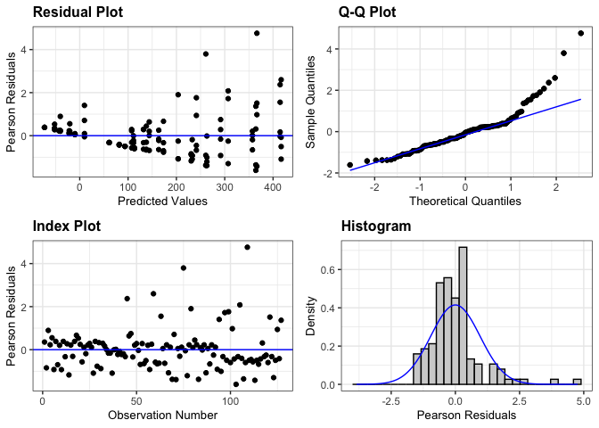
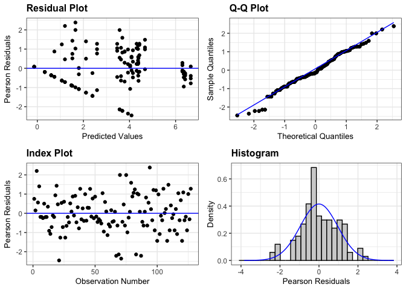
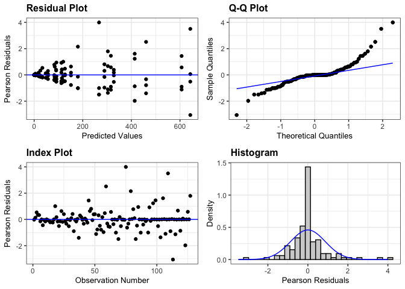
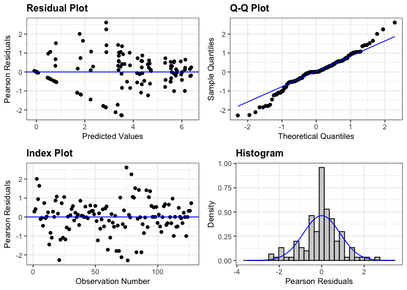

intrarow_weed_biomass_2023
================

# **Load libraries**

``` r
#Set work directory
setwd("/Users/ey239/Github/IMT/rmarkdowns")

#Load packages 
library(tidyverse) ##install.packages("tidyverse")
library(knitr)
library(patchwork) ##install.packages("patchwork")
library(skimr)     ##install.packages("skimr")
library(readxl)
library(janitor) ##install.packages("janitor")

library(kableExtra) ##install.packages("kableExtra")
library(webshot) ##install.packages("webshot")
webshot::install_phantomjs()
library(viridis) ##install.packages("viridis")
library(lme4) ##install.packages("lme4")
library(lmerTest) ##install.packages("lmerTest")
library(emmeans) ##install.packages("emmeans")
library(rstatix) ##install.packages("rstatix")
#library(Matrix) ##install.packages("Matrix")
library(multcomp) ##install.packages("multcomp")
library(multcompView) ##install.packages("multcompView")
library(ggResidpanel) ##install.packages("ggResidpanel")
#library(car)
#library(TMB)  ##install.packages("TMB")
#library(glmmTMB)  ##install.packages("glmmTMB")
#library(DHARMa)  ##install.packages("DHARMa")

#Load Functions
MeanPlusSe<-function(x) mean(x)+plotrix::std.error(x)

find_logw0=function(x){c=trunc(log(min(x[x>0],na.rm=T)))
d=exp(c)
return(d)}
```

<br>

# **Load and Clean Data**

### **Load individual datasets**

``` r
fh_raw_2023 <- read_excel("~/Github/IMT/raw-data/farmhub_raw_2023.xlsx")
kable(head(fh_raw_2023))
```

| ID | LOC | TRT | BLOCK | PLOT | MICROPLOT | EMERG | BBM | INTRAWBM | INTERWBM | WBM | DEN | BEANYD |
|:---|:---|:---|---:|---:|:---|---:|---:|---:|---:|---:|---:|---:|
| FH_B1_P101 | FH | EWC | 1 | 101 | M | 21 | 87.18 | 0.75 | 16.50 | 17.25 | 44 | 367.79 |
| FH_B1_P101_SW | FH | EWC | 1 | 101 | SW | 24 | 40.32 | 3.54 | 37.65 | 41.19 | 45 | 218.00 |
| FH_B1_P102 | FH | LWC | 1 | 102 | M | 24 | 72.37 | 6.47 | 12.71 | 19.18 | 52 | 268.00 |
| FH_B1_P102_SW | FH | LWC | 1 | 102 | SW | 24 | 63.33 | 7.54 | 11.33 | 18.87 | 49 | 177.30 |
| FH_B1_P103 | FH | AWC | 1 | 103 | M | 23 | 148.62 | 4.22 | 0.00 | 4.22 | 43 | 290.00 |
| FH_B1_P103_SW | FH | AWC | 1 | 103 | SW | 26 | 84.27 | 2.90 | 8.13 | 11.03 | 39 | 236.00 |

``` r
cu_raw_2023 <- read_excel("~/Github/IMT/raw-data/cornell_raw_2023.xlsx") |> 
   rename(WBM = TOTWBM, INTRAWBM = INTRABM, INTERWBM = INTERBM)
kable(head(cu_raw_2023))
```

| ID | LOC | TRT | BLOCK | PLOT | MICROPLOT | EMERG | BBM | INTRAWBM | INTERWBM | WBM | BEANDEN | BEANYD |
|:---|:---|:---|---:|---:|:---|---:|---:|---:|---:|---:|---:|---:|
| CU_B1_P101 | CU | EWC | 1 | 101 | M | 22 | 91.99 | 9.39 | 20.64 | 30.03 | 19.0 | 222 |
| CU_B1_P101_SW | CU | EWC | 1 | 101 | SW | 19 | 71.80 | 22.33 | 19.62 | 41.95 | 15.5 | 299 |
| CU_B1_P102 | CU | LWC | 1 | 102 | M | 22 | 83.84 | 7.23 | 14.75 | 21.98 | 22.0 | 472 |
| CU_B1_P102_SW | CU | LWC | 1 | 102 | SW | 26 | 81.23 | 13.07 | 9.65 | 22.72 | 16.5 | 307 |
| CU_B1_P103 | CU | AWC | 1 | 103 | M | 21 | 109.21 | 6.67 | 11.28 | 17.95 | 24.5 | 456 |
| CU_B1_P103_SW | CU | AWC | 1 | 103 | SW | 28 | 152.43 | 10.51 | 3.54 | 14.05 | 21.5 | 446 |

``` r
#me_raw_2023 <- read_excel("~/Github/IMT/raw-data/maine_raw_2023.xlsx", 
                          #na = c("na")) # convert na to NA
#kable(head(me_raw_2023))

vt_raw_2023 <- read_excel("~/Github/IMT/raw-data/vermont_raw_2023.xlsx")
kable(head(vt_raw_2023))
```

| ID | LOC | TRT | BLOCK | PLOT | MICROPLOT | EMERG | BBM | INTRAWBM | INTERWBM | WBM | DEN | BEANYD |
|:---|:---|:---|---:|---:|:---|---:|---:|---:|---:|---:|---:|---:|
| VT_B1_P101 | VT | LWC | 1 | 101 | M | 31 | 192.1 | 0.0 | 0.1 | 0.1 | 42 | 353.808 |
| VT_B1_P101_SW | VT | LWC | 1 | 101 | SW | 34 | 115.6 | 0.9 | 0.2 | 1.1 | 39 | 127.008 |
| VT_B1_P102 | VT | NWC | 1 | 102 | M | 23 | 234.9 | 0.0 | 0.9 | 0.9 | 64 | 317.520 |
| VT_B1_P102_SW | VT | NWC | 1 | 102 | SW | 30 | 177.3 | 0.0 | 21.5 | 21.5 | 65 | 285.768 |
| VT_B1_P102_WF | VT | NWC | 1 | 102 | WF | 24 | 316.1 | 0.0 | 0.0 | 0.0 | 40 | 535.248 |
| VT_B1_P103 | VT | EWC | 1 | 103 | M | 34 | 187.8 | 0.0 | 2.7 | 2.7 | 66 | 512.568 |

``` r
wi_raw_2023 <- read_excel("~/Github/IMT/raw-data/wisconsin_raw_2023.xlsx")
kable(head(wi_raw_2023))
```

| ID | LOC | TRT | BLOCK | PLOT | MICROPLOT | EMERG | BBM | INTRAWBM | INTERWBM | WBM | DEN | BEANYD |
|:---|:---|:---|---:|---:|:---|---:|---:|---:|---:|---:|---:|---:|
| WI_B1_P101 | WI | NWC | 1 | 101 | M | 23 | 233.3 | 0.00 | 2.00 | 1.84 | 38 | 295.66 |
| WI_B1_P101_SW | WI | NWC | 1 | 101 | SW | 24 | 61.7 | 31.66 | 155.90 | 187.56 | 28 | 88.81 |
| WI_B1_P101_WF | WI | NWC | 1 | 101 | WF | 14 | 210.3 | 0.00 | 0.00 | 0.00 | 38 | 273.51 |
| WI_B1_P102 | WI | LWC | 1 | 102 | M | 14 | 248.4 | 0.00 | 0.00 | 0.00 | 27 | 321.16 |
| WI_B1_P102_SW | WI | LWC | 1 | 102 | SW | 16 | 65.6 | 28.76 | 50.00 | 78.76 | 32 | 97.45 |
| WI_B1_P103 | WI | AWC | 1 | 103 | M | 17 | 279.3 | 0.00 | 0.21 | 0.21 | 34 | 302.72 |

### **Combine all datasets and clean**

``` r
# Main did not divided wbm into inter and intra row and so is excluded
#Standardaze column names, convert to factors, check for outliers of variable**
all_raw_2023 <- bind_rows(fh_raw_2023, cu_raw_2023, vt_raw_2023, wi_raw_2023)

#Standardaze column names, convert to factors, check for outliers of variable**
all_clean_2023 <- clean_names(all_raw_2023) |>  
  rename ('mowing'= trt,'weeds'= microplot) |> 
  mutate(across(c(mowing, block, plot, weeds, loc), as.factor)) #|> 
  #mutate(is_outlier = intrawbm < (quantile(intrawbm, 0.25) - 1.5 * IQR(intrawbm)) |
                       #intrawbm > (quantile(intrawbm, 0.75) + 1.5 * IQR(intrawbm)))

#select and convert data for wbm analysis
  
all_intrawbm_clean_2023 <-all_clean_2023 |>              
  #filter(is_outlier == FALSE) |>              # Keep rows where beanyd is not an outlier
  filter(weeds %in% c("SW", "M")) |>       # Keep rows where SW and M are microplots
  mutate(intrawbm_grams_meter = (intrawbm * 2)) |> 
  mutate(intrawbm_kg_ha = ((intrawbm/0.5) *(10000))/(1000)) |>
  mutate(intrawbm_lbs_ac = (((intrawbm/0.5) *(10000))/(1000))* 0.892179)
kable(head(all_intrawbm_clean_2023)) 
```

| id | loc | mowing | block | plot | weeds | emerg | bbm | intrawbm | interwbm | wbm | den | beanyd | beanden | intrawbm_grams_meter | intrawbm_kg_ha | intrawbm_lbs_ac |
|:---|:---|:---|:---|:---|:---|---:|---:|---:|---:|---:|---:|---:|---:|---:|---:|---:|
| FH_B1_P101 | FH | EWC | 1 | 101 | M | 21 | 87.18 | 0.75 | 16.50 | 17.25 | 44 | 367.79 | NA | 1.50 | 15.0 | 13.38269 |
| FH_B1_P101_SW | FH | EWC | 1 | 101 | SW | 24 | 40.32 | 3.54 | 37.65 | 41.19 | 45 | 218.00 | NA | 7.08 | 70.8 | 63.16627 |
| FH_B1_P102 | FH | LWC | 1 | 102 | M | 24 | 72.37 | 6.47 | 12.71 | 19.18 | 52 | 268.00 | NA | 12.94 | 129.4 | 115.44796 |
| FH_B1_P102_SW | FH | LWC | 1 | 102 | SW | 24 | 63.33 | 7.54 | 11.33 | 18.87 | 49 | 177.30 | NA | 15.08 | 150.8 | 134.54059 |
| FH_B1_P103 | FH | AWC | 1 | 103 | M | 23 | 148.62 | 4.22 | 0.00 | 4.22 | 43 | 290.00 | NA | 8.44 | 84.4 | 75.29991 |
| FH_B1_P103_SW | FH | AWC | 1 | 103 | SW | 26 | 84.27 | 2.90 | 8.13 | 11.03 | 39 | 236.00 | NA | 5.80 | 58.0 | 51.74638 |

<br>

# **Assumptions**

## **Levene’s test**

``` r
levene_test((intrawbm_kg_ha) ~ loc, data = all_intrawbm_clean_2023)
```

    ## # A tibble: 1 × 4
    ##     df1   df2 statistic       p
    ##   <int> <int>     <dbl>   <dbl>
    ## 1     3   123      4.15 0.00776

# **Model Testing**

### **location random**

``` r
#data should be log transformed due to zeroes

all_intrawbm_random_2023 <- lmer(intrawbm_kg_ha ~  mowing*weeds + (1|loc) + (1|loc:block)+  (1|loc:block:mowing)  , data = all_intrawbm_clean_2023)

resid_panel(all_intrawbm_random_2023)
```

<!-- -->

``` r
log_all_intrawbm_random_2023  <- lmer(log(intrawbm_kg_ha+1) ~  mowing*weeds + (1|loc) + (1|loc:block)+  (1|loc:block:mowing)  , data = all_intrawbm_clean_2023)

resid_panel(log_all_intrawbm_random_2023)
```

<!-- -->

### **location fixed**

``` r
all_intrawbm_fixed_2023 <- lmer(intrawbm_kg_ha ~ loc*mowing*weeds + (1|loc:block)+  (1|loc:block:mowing), data = all_intrawbm_clean_2023)
```

    ## boundary (singular) fit: see help('isSingular')

``` r
resid_panel(all_intrawbm_fixed_2023)
```

<!-- -->

``` r
log_all_intrawbm_fixed_2023 <- lmer(log(intrawbm_kg_ha+1) ~ loc*mowing*weeds + (1|loc:block)+  (1|loc:block:mowing), data = all_intrawbm_clean_2023)
```

    ## boundary (singular) fit: see help('isSingular')

``` r
resid_panel(log_all_intrawbm_fixed_2023)
```

<!-- -->
\#\*\*Anova

``` r
 log_all_intrawbm_fixed_2023 |> 
  joint_tests() |> 
  kable()  
```

|     | model term       | df1 |   df2 | F.ratio |   p.value |
|:----|:-----------------|----:|------:|--------:|----------:|
| 1   | loc              |   3 | 11.78 |  20.279 | 0.0000601 |
| 5   | mowing           |   3 | 35.39 |   2.368 | 0.0872415 |
| 7   | weeds            |   1 | 47.74 | 110.138 | 0.0000000 |
| 2   | loc:mowing       |   9 | 35.39 |   0.423 | 0.9138364 |
| 4   | loc:weeds        |   3 | 47.24 |   9.615 | 0.0000457 |
| 6   | mowing:weeds     |   3 | 47.24 |   1.586 | 0.2051549 |
| 3   | loc:mowing:weeds |   9 | 47.24 |   0.836 | 0.5872322 |

# **Interrow mowing has no effect on intrarow weed biomass**
