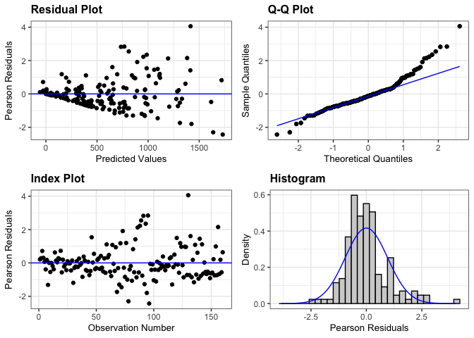
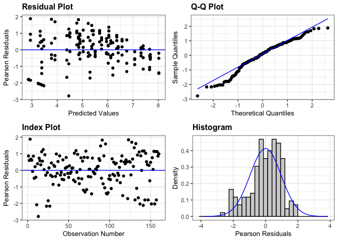
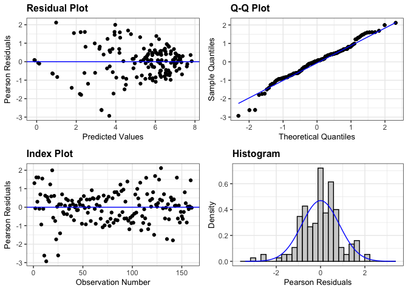
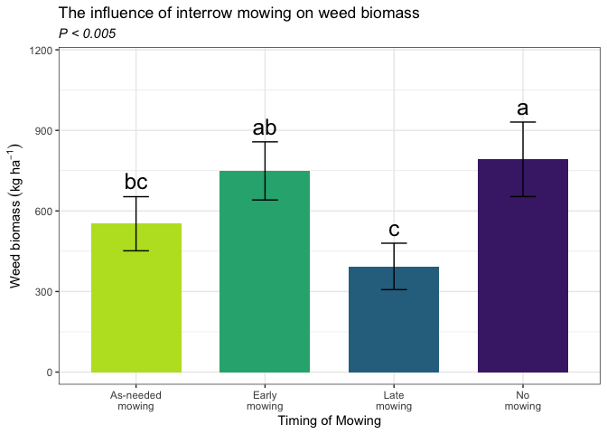

weed_biomass_2023
================

# **Load libraries**

``` r
#Set work directory
setwd("/Users/ey239/Github/IMT/rmarkdowns")

#Load packages 
library(tidyverse) ##install.packages("tidyverse")
library(knitr)
library(patchwork) ##install.packages("patchwork")
library(skimr)     ##install.packages("skimr")
library(readxl)
library(janitor) ##install.packages("janitor")

library(kableExtra) ##install.packages("kableExtra")
library(webshot) ##install.packages("webshot")
webshot::install_phantomjs()
library(viridis) ##install.packages("viridis")
library(lme4) ##install.packages("lme4")
library(lmerTest) ##install.packages("lmerTest")
library(emmeans) ##install.packages("emmeans")
library(rstatix) ##install.packages("rstatix")
#library(Matrix) ##install.packages("Matrix")
library(multcomp) ##install.packages("multcomp")
library(multcompView) ##install.packages("multcompView")
library(ggResidpanel) ##install.packages("ggResidpanel")
#library(car)
#library(TMB)  ##install.packages("TMB")
#library(glmmTMB)  ##install.packages("glmmTMB")
#library(DHARMa)  ##install.packages("DHARMa")

#Load Functions
MeanPlusSe<-function(x) mean(x)+plotrix::std.error(x)

find_logw0=function(x){c=trunc(log(min(x[x>0],na.rm=T)))
d=exp(c)
return(d)}
```

<br>

# **Load and Clean Data**

### **Load individual datasets**

``` r
fh_raw_2023 <- read_excel("~/Github/IMT/raw-data/farmhub_raw_2023.xlsx")
kable(head(fh_raw_2023))
```

| ID | LOC | TRT | BLOCK | PLOT | MICROPLOT | EMERG | BBM | INTRAWBM | INTERWBM | WBM | DEN | BEANYD |
|:---|:---|:---|---:|---:|:---|---:|---:|---:|---:|---:|---:|---:|
| FH_B1_P101 | FH | EWC | 1 | 101 | M | 21 | 87.18 | 0.75 | 16.50 | 17.25 | 44 | 367.79 |
| FH_B1_P101_SW | FH | EWC | 1 | 101 | SW | 24 | 40.32 | 3.54 | 37.65 | 41.19 | 45 | 218.00 |
| FH_B1_P102 | FH | LWC | 1 | 102 | M | 24 | 72.37 | 6.47 | 12.71 | 19.18 | 52 | 268.00 |
| FH_B1_P102_SW | FH | LWC | 1 | 102 | SW | 24 | 63.33 | 7.54 | 11.33 | 18.87 | 49 | 177.30 |
| FH_B1_P103 | FH | AWC | 1 | 103 | M | 23 | 148.62 | 4.22 | 0.00 | 4.22 | 43 | 290.00 |
| FH_B1_P103_SW | FH | AWC | 1 | 103 | SW | 26 | 84.27 | 2.90 | 8.13 | 11.03 | 39 | 236.00 |

``` r
cu_raw_2023 <- read_excel("~/Github/IMT/raw-data/cornell_raw_2023.xlsx") |> 
   rename(WBM = TOTWBM, INTRAWBM = INTRABM, INTERWBM = INTERBM)
kable(head(cu_raw_2023))
```

| ID | LOC | TRT | BLOCK | PLOT | MICROPLOT | EMERG | BBM | INTRAWBM | INTERWBM | WBM | BEANDEN | BEANYD |
|:---|:---|:---|---:|---:|:---|---:|---:|---:|---:|---:|---:|---:|
| CU_B1_P101 | CU | EWC | 1 | 101 | M | 22 | 91.99 | 9.39 | 20.64 | 30.03 | 19.0 | 222 |
| CU_B1_P101_SW | CU | EWC | 1 | 101 | SW | 19 | 71.80 | 22.33 | 19.62 | 41.95 | 15.5 | 299 |
| CU_B1_P102 | CU | LWC | 1 | 102 | M | 22 | 83.84 | 7.23 | 14.75 | 21.98 | 22.0 | 472 |
| CU_B1_P102_SW | CU | LWC | 1 | 102 | SW | 26 | 81.23 | 13.07 | 9.65 | 22.72 | 16.5 | 307 |
| CU_B1_P103 | CU | AWC | 1 | 103 | M | 21 | 109.21 | 6.67 | 11.28 | 17.95 | 24.5 | 456 |
| CU_B1_P103_SW | CU | AWC | 1 | 103 | SW | 28 | 152.43 | 10.51 | 3.54 | 14.05 | 21.5 | 446 |

``` r
me_raw_2023 <- read_excel("~/Github/IMT/raw-data/maine_raw_2023.xlsx", 
                          na = c("na")) # convert na to NA
kable(head(me_raw_2023))
```

| ID | LOC | TRT | BLOCK | PLOT | MICROPLOT | EMERG | BBM | INTRAWBM | INTERWBM | WBM | DEN | BEANYD |
|:---|:---|:---|---:|---:|:---|---:|---:|:---|:---|---:|---:|---:|
| ME_B1_P101 | ME | NWC | 1 | 101 | M | 16 | 140.8 | NA | NA | 31.2 | 16 | 224 |
| ME_B1_P101_SW | ME | NWC | 1 | 101 | SW | NA | 154.4 | NA | NA | 67.0 | 29 | 244 |
| ME_B1_P101_WF | ME | NWC | 1 | 101 | WF | NA | 166.4 | NA | NA | 47.6 | 13 | 212 |
| ME_B1_P102 | ME | EWC | 1 | 102 | M | 16 | 87.2 | NA | NA | 70.7 | 30 | 429 |
| ME_B1_P102_SW | ME | EWC | 1 | 102 | SW | NA | 144.6 | NA | NA | 15.5 | 28 | 257 |
| ME_B1_P103 | ME | LWC | 1 | 103 | M | 18 | 155.5 | NA | NA | 22.2 | 36 | 399 |

``` r
vt_raw_2023 <- read_excel("~/Github/IMT/raw-data/vermont_raw_2023.xlsx")
kable(head(vt_raw_2023))
```

| ID | LOC | TRT | BLOCK | PLOT | MICROPLOT | EMERG | BBM | INTRAWBM | INTERWBM | WBM | DEN | BEANYD |
|:---|:---|:---|---:|---:|:---|---:|---:|---:|---:|---:|---:|---:|
| VT_B1_P101 | VT | LWC | 1 | 101 | M | 31 | 192.1 | 0.0 | 0.1 | 0.1 | 42 | 353.808 |
| VT_B1_P101_SW | VT | LWC | 1 | 101 | SW | 34 | 115.6 | 0.9 | 0.2 | 1.1 | 39 | 127.008 |
| VT_B1_P102 | VT | NWC | 1 | 102 | M | 23 | 234.9 | 0.0 | 0.9 | 0.9 | 64 | 317.520 |
| VT_B1_P102_SW | VT | NWC | 1 | 102 | SW | 30 | 177.3 | 0.0 | 21.5 | 21.5 | 65 | 285.768 |
| VT_B1_P102_WF | VT | NWC | 1 | 102 | WF | 24 | 316.1 | 0.0 | 0.0 | 0.0 | 40 | 535.248 |
| VT_B1_P103 | VT | EWC | 1 | 103 | M | 34 | 187.8 | 0.0 | 2.7 | 2.7 | 66 | 512.568 |

``` r
wi_raw_2023 <- read_excel("~/Github/IMT/raw-data/wisconsin_raw_2023.xlsx")
kable(head(wi_raw_2023))
```

| ID | LOC | TRT | BLOCK | PLOT | MICROPLOT | EMERG | BBM | INTRAWBM | INTERWBM | WBM | DEN | BEANYD |
|:---|:---|:---|---:|---:|:---|---:|---:|---:|---:|---:|---:|---:|
| WI_B1_P101 | WI | NWC | 1 | 101 | M | 23 | 233.3 | 0.00 | 2.00 | 1.84 | 38 | 295.66 |
| WI_B1_P101_SW | WI | NWC | 1 | 101 | SW | 24 | 61.7 | 31.66 | 155.90 | 187.56 | 28 | 88.81 |
| WI_B1_P101_WF | WI | NWC | 1 | 101 | WF | 14 | 210.3 | 0.00 | 0.00 | 0.00 | 38 | 273.51 |
| WI_B1_P102 | WI | LWC | 1 | 102 | M | 14 | 248.4 | 0.00 | 0.00 | 0.00 | 27 | 321.16 |
| WI_B1_P102_SW | WI | LWC | 1 | 102 | SW | 16 | 65.6 | 28.76 | 50.00 | 78.76 | 32 | 97.45 |
| WI_B1_P103 | WI | AWC | 1 | 103 | M | 17 | 279.3 | 0.00 | 0.21 | 0.21 | 34 | 302.72 |

### **Combine all datasets and clean**

``` r
all_raw_2023 <- bind_rows(fh_raw_2023, cu_raw_2023, me_raw_2023, vt_raw_2023, wi_raw_2023)


#Standardaze column names, convert to factors, check for outliers of variable**
all_clean_2023 <- clean_names(all_raw_2023) |>  
  rename ('mowing'= trt,'weeds'= microplot) |> 
  mutate(across(c(mowing, block, plot, weeds, loc), as.factor)) |> 
  mutate(is_outlier = wbm < (quantile(wbm, 0.25) - 1.5 * IQR(beanyd)) |
                       wbm > (quantile(wbm, 0.75) + 1.5 * IQR(beanyd)))

#select and convert data for wbm analysis
  
all_wbm_clean_2023 <-all_clean_2023 |>              
  filter(is_outlier == FALSE) |>              # Keep rows where beanyd is not an outlier
  filter(weeds %in% c("SW", "M")) |>       # Keep rows where SW and M are microplots
  mutate(wbm_grams_meter = (wbm * 2)) |> 
  mutate(wbm_kg_ha = ((wbm/0.5) *(10000))/(1000)) |>
  mutate(wbm_lbs_ac = (((wbm/0.5) *(10000))/(1000))* 0.892179)
kable(head(all_wbm_clean_2023)) 
```

| id | loc | mowing | block | plot | weeds | emerg | bbm | intrawbm | interwbm | wbm | den | beanyd | beanden | is_outlier | wbm_grams_meter | wbm_kg_ha | wbm_lbs_ac |
|:---|:---|:---|:---|:---|:---|---:|---:|---:|---:|---:|---:|---:|---:|:---|---:|---:|---:|
| FH_B1_P101 | FH | EWC | 1 | 101 | M | 21 | 87.18 | 0.75 | 16.50 | 17.25 | 44 | 367.79 | NA | FALSE | 34.50 | 345.0 | 307.80176 |
| FH_B1_P101_SW | FH | EWC | 1 | 101 | SW | 24 | 40.32 | 3.54 | 37.65 | 41.19 | 45 | 218.00 | NA | FALSE | 82.38 | 823.8 | 734.97706 |
| FH_B1_P102 | FH | LWC | 1 | 102 | M | 24 | 72.37 | 6.47 | 12.71 | 19.18 | 52 | 268.00 | NA | FALSE | 38.36 | 383.6 | 342.23986 |
| FH_B1_P102_SW | FH | LWC | 1 | 102 | SW | 24 | 63.33 | 7.54 | 11.33 | 18.87 | 49 | 177.30 | NA | FALSE | 37.74 | 377.4 | 336.70835 |
| FH_B1_P103 | FH | AWC | 1 | 103 | M | 23 | 148.62 | 4.22 | 0.00 | 4.22 | 43 | 290.00 | NA | FALSE | 8.44 | 84.4 | 75.29991 |
| FH_B1_P103_SW | FH | AWC | 1 | 103 | SW | 26 | 84.27 | 2.90 | 8.13 | 11.03 | 39 | 236.00 | NA | FALSE | 22.06 | 220.6 | 196.81469 |

<br>

# **Assumptions**

## **Levene’s test**

``` r
levene_test((wbm_kg_ha) ~ loc, data = all_wbm_clean_2023)
```

    ## # A tibble: 1 × 4
    ##     df1   df2 statistic         p
    ##   <int> <int>     <dbl>     <dbl>
    ## 1     4   155      7.24 0.0000225

# **Model Testing**

### **location random**

``` r
#data needs to be log transformed due to zeroes

all_wbm_random_2023 <- lmer(wbm_kg_ha ~  mowing*weeds + (1|loc) + (1|loc:block)+  (1|loc:block:mowing)  , data = all_wbm_clean_2023)

resid_panel(all_wbm_random_2023)
```

<!-- -->

``` r
log_all_wbm_random_2023  <- lmer(log(wbm_kg_ha+1) ~  mowing*weeds + (1|loc) + (1|loc:block)+  (1|loc:block:mowing)  , data = all_wbm_clean_2023)

resid_panel(log_all_wbm_random_2023)
```

<!-- -->

### **location fixed**

``` r
all_wbm_fixed_2023 <- lmer(wbm_kg_ha ~ loc*mowing*weeds + (1|loc:block)+  (1|loc:block:mowing), data = all_wbm_clean_2023)
```

    ## boundary (singular) fit: see help('isSingular')

``` r
log_all_wbm_fixed_2023 <- lmer(log(wbm_kg_ha+1) ~ loc*mowing*weeds + (1|loc:block)+  (1|loc:block:mowing), data = all_wbm_clean_2023)
```

    ## boundary (singular) fit: see help('isSingular')

``` r
resid_panel(log_all_wbm_fixed_2023)
```

<!-- -->

``` r
 all_wbm_fixed_2023 |> 
  joint_tests() |> 
  kable()  
```

|     | model term       | df1 | df2 | F.ratio |   p.value |
|:----|:-----------------|----:|----:|--------:|----------:|
| 1   | loc              |   4 |  15 |   7.713 | 0.0013871 |
| 5   | mowing           |   3 |  45 |   4.978 | 0.0045600 |
| 7   | weeds            |   1 |  60 |  37.499 | 0.0000001 |
| 2   | loc:mowing       |  12 |  45 |   1.016 | 0.4509978 |
| 4   | loc:weeds        |   4 |  60 |   8.152 | 0.0000256 |
| 6   | mowing:weeds     |   3 |  60 |   3.667 | 0.0170660 |
| 3   | loc:mowing:weeds |  12 |  60 |   0.945 | 0.5093560 |

<br>

# **Means comparison of wbm**

``` r
all_wbm_means_2023 <- 
 emmeans(all_wbm_fixed_2023, ~ loc * mowing * weeds)
# Optional: Adjust for multiple comparisons (e.g., using Tukey's method)

pairwise_comparisons<- pairs(all_wbm_means_2023) 
kable(head(pairwise_comparisons))
```

| contrast            | estimate |       SE |       df |    t.ratio |   p.value |
|:--------------------|---------:|---------:|---------:|-----------:|----------:|
| CU AWC M - FH AWC M |   395.00 | 380.6147 | 117.5160 |  1.0377950 | 0.8838517 |
| CU AWC M - ME AWC M |  -620.25 | 380.6147 | 117.5160 | -1.6296009 | 0.4889977 |
| CU AWC M - VT AWC M |   188.25 | 380.6147 | 117.5160 |  0.4945947 | 0.9970741 |
| CU AWC M - WI AWC M |   401.50 | 380.6147 | 117.5160 |  1.0548726 | 0.8757979 |
| CU AWC M - CU EWC M |    21.70 | 370.0094 | 102.8571 |  0.0586472 | 1.0000000 |
| CU AWC M - FH EWC M |   175.05 | 380.6147 | 117.5160 |  0.4599140 | 0.9980462 |

<br>

### **Fisher’s method for comparing means**

``` r
#mowing
cld_mowing_fisher <-cld(emmeans(all_wbm_fixed_2023, ~  mowing), Letters = letters, sort = TRUE, adjust="none", reversed=TRUE)
```

    ## NOTE: Results may be misleading due to involvement in interactions

``` r
cld_mowing_fisher
```

    ##  mowing emmean   SE   df lower.CL upper.CL .group
    ##  NWC       792 87.4 58.1      617      967  a    
    ##  EWC       749 87.4 58.1      574      924  ab   
    ##  AWC       552 87.4 58.1      377      727   bc  
    ##  LWC       393 87.4 58.1      218      568    c  
    ## 
    ## Results are averaged over the levels of: loc, weeds 
    ## Degrees-of-freedom method: kenward-roger 
    ## Confidence level used: 0.95 
    ## significance level used: alpha = 0.05 
    ## NOTE: If two or more means share the same grouping symbol,
    ##       then we cannot show them to be different.
    ##       But we also did not show them to be the same.

``` r
#weeds
cld_weeds_fisher <- cld(emmeans(all_wbm_fixed_2023, ~  weeds, type = ""), Letters = letters, sort = FALSE, adjust="none", reversed=TRUE)
```

    ## NOTE: Results may be misleading due to involvement in interactions

``` r
cld_weeds_fisher
```

    ##  weeds emmean SE df lower.CL upper.CL .group
    ##  M        368 65 38      237      500   b   
    ##  SW       875 65 38      744     1007  a    
    ## 
    ## Results are averaged over the levels of: loc, mowing 
    ## Degrees-of-freedom method: kenward-roger 
    ## Confidence level used: 0.95 
    ## significance level used: alpha = 0.05 
    ## NOTE: If two or more means share the same grouping symbol,
    ##       then we cannot show them to be different.
    ##       But we also did not show them to be the same.

``` r
#mowing|weeds
cld_mowing_weeds_fisher <-cld(emmeans(all_wbm_fixed_2023, ~  mowing|weeds, 
                              type = "response"), Letters = letters, 
                              sort = FALSE, adjust="none", reversed=FALSE)
```

    ## NOTE: Results may be misleading due to involvement in interactions

``` r
cld_mowing_weeds_fisher
```

    ## weeds = M:
    ##  mowing emmean  SE  df lower.CL upper.CL .group
    ##  AWC       354 120 118    116.0      593  a    
    ##  EWC       530 120 118    291.8      769  a    
    ##  LWC       278 120 118     40.0      517  a    
    ##  NWC       311 120 118     72.6      549  a    
    ## 
    ## weeds = SW:
    ##  mowing emmean  SE  df lower.CL upper.CL .group
    ##  AWC       750 120 118    512.0      989  ab   
    ##  EWC       968 120 118    729.6     1206  a c  
    ##  LWC       509 120 118    270.2      747   b   
    ##  NWC      1274 120 118   1035.2     1512    c  
    ## 
    ## Results are averaged over the levels of: loc 
    ## Degrees-of-freedom method: kenward-roger 
    ## Confidence level used: 0.95 
    ## significance level used: alpha = 0.05 
    ## NOTE: If two or more means share the same grouping symbol,
    ##       then we cannot show them to be different.
    ##       But we also did not show them to be the same.

``` r
#mowing|weeds|loc
cld_mowing_weeds_loc_fisher <-cld(emmeans(all_wbm_fixed_2023, ~  mowing|weeds|loc, type = "respons"), Letters = letters, sort = TRUE, adjust="none", reversed=TRUE)
cld_mowing_weeds_loc_fisher
```

    ## weeds = M, loc = CU:
    ##  mowing emmean  SE  df lower.CL upper.CL .group
    ##  AWC     427.2 269 118   -105.7      960  a    
    ##  NWC     406.2 269 118   -126.7      939  a    
    ##  EWC     405.6 269 118   -127.4      939  a    
    ##  LWC     324.8 269 118   -208.2      858  a    
    ## 
    ## weeds = SW, loc = CU:
    ##  mowing emmean  SE  df lower.CL upper.CL .group
    ##  EWC    1365.1 269 118    832.1     1898  a    
    ##  NWC    1088.0 269 118    555.0     1621  ab   
    ##  LWC     562.8 269 118     29.8     1096   b   
    ##  AWC     552.8 269 118     19.8     1086   b   
    ## 
    ## weeds = M, loc = FH:
    ##  mowing emmean  SE  df lower.CL upper.CL .group
    ##  EWC     252.2 269 118   -280.8      785  a    
    ##  LWC     128.8 269 118   -404.2      662  a    
    ##  NWC      83.0 269 118   -450.0      616  a    
    ##  AWC      32.2 269 118   -500.7      565  a    
    ## 
    ## weeds = SW, loc = FH:
    ##  mowing emmean  SE  df lower.CL upper.CL .group
    ##  EWC     671.4 269 118    138.4     1204  a    
    ##  NWC     605.0 269 118     72.1     1138  a    
    ##  LWC     208.9 269 118   -324.0      742  a    
    ##  AWC     174.1 269 118   -358.9      707  a    
    ## 
    ## weeds = M, loc = ME:
    ##  mowing emmean  SE  df lower.CL upper.CL .group
    ##  EWC    1600.5 269 118   1067.5     2133  a    
    ##  AWC    1047.5 269 118    514.5     1580  ab   
    ##  LWC     903.0 269 118    370.0     1436  ab   
    ##  NWC     816.0 269 118    283.0     1349   b   
    ## 
    ## weeds = SW, loc = ME:
    ##  mowing emmean  SE  df lower.CL upper.CL .group
    ##  AWC    1310.5 269 118    777.5     1843  a    
    ##  NWC    1043.0 269 118    510.0     1576  a    
    ##  EWC    1022.5 269 118    489.5     1555  a    
    ##  LWC     834.5 269 118    301.5     1367  a    
    ## 
    ## weeds = M, loc = VT:
    ##  mowing emmean  SE  df lower.CL upper.CL .group
    ##  EWC     286.0 269 118   -247.0      819  a    
    ##  NWC     240.5 269 118   -292.5      773  a    
    ##  AWC     239.0 269 118   -294.0      772  a    
    ##  LWC      35.0 269 118   -498.0      568  a    
    ## 
    ## weeds = SW, loc = VT:
    ##  mowing emmean  SE  df lower.CL upper.CL .group
    ##  NWC    1252.5 269 118    719.5     1785  a    
    ##  AWC     639.0 269 118    106.0     1172  ab   
    ##  EWC     355.5 269 118   -177.5      888   b   
    ##  LWC     160.0 269 118   -373.0      693   b   
    ## 
    ## weeds = M, loc = WI:
    ##  mowing emmean  SE  df lower.CL upper.CL .group
    ##  EWC     106.8 269 118   -426.2      640  a    
    ##  AWC      25.8 269 118   -507.2      559  a    
    ##  NWC       9.2 269 118   -523.8      542  a    
    ##  LWC       0.0 269 118   -533.0      533  a    
    ## 
    ## weeds = SW, loc = WI:
    ##  mowing emmean  SE  df lower.CL upper.CL .group
    ##  NWC    2379.2 269 118   1846.2     2912  a    
    ##  EWC    1425.5 269 118    892.5     1958   b   
    ##  AWC    1075.3 269 118    542.3     1608   b   
    ##  LWC     776.6 269 118    243.6     1310   b   
    ## 
    ## Degrees-of-freedom method: kenward-roger 
    ## Confidence level used: 0.95 
    ## significance level used: alpha = 0.05 
    ## NOTE: If two or more means share the same grouping symbol,
    ##       then we cannot show them to be different.
    ##       But we also did not show them to be the same.

<br>

# **FIGURES**

## **Mowing**

``` r
all_wbm_clean_2023 |> 
  left_join(cld_mowing_fisher) |> 
  ggplot(aes(x = mowing, y = wbm_kg_ha, fill = mowing)) +
  stat_summary(geom = "bar", fun = "mean", width = 0.7) +
  stat_summary(geom = "errorbar", fun.data = "mean_se", width = 0.2) +
  stat_summary(geom="text", fun = "MeanPlusSe", aes(label= trimws(.group)),size=6.5,vjust=-0.5) +
  labs(
    x = "Timing of Mowing",
    y = expression("Weed biomass" ~ (kg ~ ha^{-1})),
    title = str_c("The influence of interrow mowing on weed biomass"),
    subtitle = expression(italic("P < 0.005"))) +
  
  scale_x_discrete(labels = c("As-needed\nmowing", "Early\nmowing", "Late\nmowing", "No\nmowing")) +
  scale_y_continuous(expand = expansion(mult = c(0.05, 0.3))) +
  scale_fill_viridis(discrete = TRUE, option = "D", direction = -1, end = 0.9, begin = 0.1) +
   theme_bw() +
  theme(
    legend.position = "none",
    strip.background = element_blank(),
    strip.text = element_text(face = "bold", size = 12)
  )
```

<!-- -->

``` r
ggsave("wbm_plot_mowing.png", width = 8, height = 6, dpi = 300)
```
