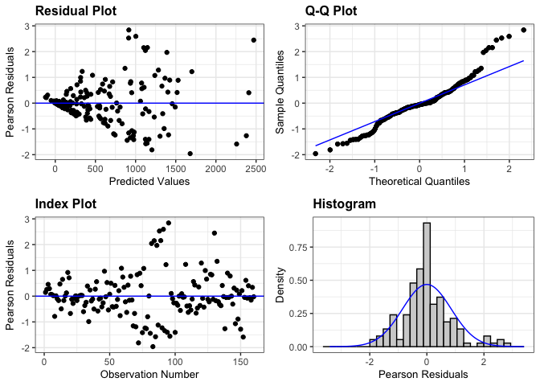
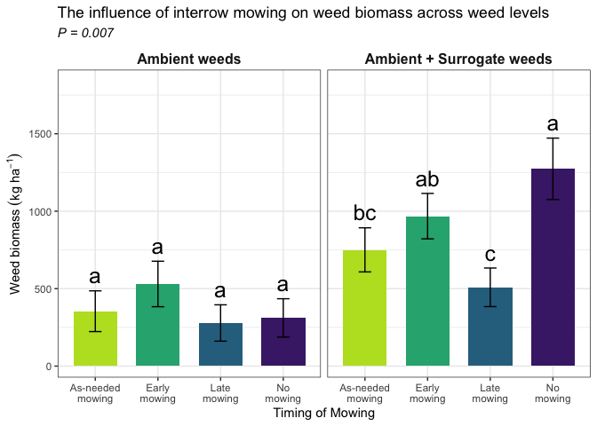

weed_biomass_2023
================

# **Load libraries**

``` r
#Set work directory
setwd("/Users/ey239/Github/IMT/rmarkdowns")

#Load packages 
library(tidyverse) ##install.packages("tidyverse")
library(knitr)
library(patchwork) ##install.packages("patchwork")
library(skimr)     ##install.packages("skimr")
library(readxl)
library(janitor) ##install.packages("janitor")

library(kableExtra) ##install.packages("kableExtra")
library(webshot) ##install.packages("webshot")
webshot::install_phantomjs()
library(viridis) ##install.packages("viridis")
library(lme4) ##install.packages("lme4")
library(lmerTest) ##install.packages("lmerTest")
library(emmeans) ##install.packages("emmeans")
library(rstatix) ##install.packages("rstatix")
#library(Matrix) ##install.packages("Matrix")
library(multcomp) ##install.packages("multcomp")
library(multcompView) ##install.packages("multcompView")
library(ggResidpanel) ##install.packages("ggResidpanel")
#library(car)
#library(TMB)  ##install.packages("TMB")
#library(glmmTMB)  ##install.packages("glmmTMB")
#library(DHARMa)  ##install.packages("DHARMa")

#Load Functions
MeanPlusSe<-function(x) mean(x)+plotrix::std.error(x)

find_logw0=function(x){c=trunc(log(min(x[x>0],na.rm=T)))
d=exp(c)
return(d)}
```

<br>

# **Load and Clean Data**

### **Load individual datasets**

``` r
fh_raw_2023 <- read_excel("~/Github/IMT/raw-data/farmhub_raw_2023.xlsx")
kable(head(fh_raw_2023))
```

| ID | LOC | TRT | BLOCK | PLOT | MICROPLOT | EMERG | BBM | INTRAWBM | INTERWBM | WBM | DEN | BEANYD |
|:---|:---|:---|---:|---:|:---|---:|---:|---:|---:|---:|---:|---:|
| FH_B1_P101 | FH | EWC | 1 | 101 | M | 21 | 87.18 | 0.75 | 16.50 | 17.25 | 44 | 367.79 |
| FH_B1_P101_SW | FH | EWC | 1 | 101 | SW | 24 | 40.32 | 3.54 | 37.65 | 41.19 | 45 | 218.00 |
| FH_B1_P102 | FH | LWC | 1 | 102 | M | 24 | 72.37 | 6.47 | 12.71 | 19.18 | 52 | 268.00 |
| FH_B1_P102_SW | FH | LWC | 1 | 102 | SW | 24 | 63.33 | 7.54 | 11.33 | 18.87 | 49 | 177.30 |
| FH_B1_P103 | FH | AWC | 1 | 103 | M | 23 | 148.62 | 4.22 | 0.00 | 4.22 | 43 | 290.00 |
| FH_B1_P103_SW | FH | AWC | 1 | 103 | SW | 26 | 84.27 | 2.90 | 8.13 | 11.03 | 39 | 236.00 |

``` r
cu_raw_2023 <- read_excel("~/Github/IMT/raw-data/cornell_raw_2023.xlsx") |> 
   rename(WBM = TOTWBM, INTRAWBM = INTRABM, INTERWBM = INTERBM)
kable(head(cu_raw_2023))
```

| ID | LOC | TRT | BLOCK | PLOT | MICROPLOT | EMERG | BBM | INTRAWBM | INTERWBM | WBM | BEANDEN | BEANYD |
|:---|:---|:---|---:|---:|:---|---:|---:|---:|---:|---:|---:|---:|
| CU_B1_P101 | CU | EWC | 1 | 101 | M | 22 | 91.99 | 9.39 | 20.64 | 30.03 | 19.0 | 222 |
| CU_B1_P101_SW | CU | EWC | 1 | 101 | SW | 19 | 71.80 | 22.33 | 19.62 | 41.95 | 15.5 | 299 |
| CU_B1_P102 | CU | LWC | 1 | 102 | M | 22 | 83.84 | 7.23 | 14.75 | 21.98 | 22.0 | 472 |
| CU_B1_P102_SW | CU | LWC | 1 | 102 | SW | 26 | 81.23 | 13.07 | 9.65 | 22.72 | 16.5 | 307 |
| CU_B1_P103 | CU | AWC | 1 | 103 | M | 21 | 109.21 | 6.67 | 11.28 | 17.95 | 24.5 | 456 |
| CU_B1_P103_SW | CU | AWC | 1 | 103 | SW | 28 | 152.43 | 10.51 | 3.54 | 14.05 | 21.5 | 446 |

``` r
me_raw_2023 <- read_excel("~/Github/IMT/raw-data/maine_raw_2023.xlsx", 
                          na = c("na")) # convert na to NA
kable(head(me_raw_2023))
```

| ID | LOC | TRT | BLOCK | PLOT | MICROPLOT | EMERG | BBM | INTRAWBM | INTERWBM | WBM | DEN | BEANYD |
|:---|:---|:---|---:|---:|:---|---:|---:|:---|:---|---:|---:|---:|
| ME_B1_P101 | ME | NWC | 1 | 101 | M | 16 | 140.8 | NA | NA | 31.2 | 16 | 224 |
| ME_B1_P101_SW | ME | NWC | 1 | 101 | SW | NA | 154.4 | NA | NA | 67.0 | 29 | 244 |
| ME_B1_P101_WF | ME | NWC | 1 | 101 | WF | NA | 166.4 | NA | NA | 47.6 | 13 | 212 |
| ME_B1_P102 | ME | EWC | 1 | 102 | M | 16 | 87.2 | NA | NA | 70.7 | 30 | 429 |
| ME_B1_P102_SW | ME | EWC | 1 | 102 | SW | NA | 144.6 | NA | NA | 15.5 | 28 | 257 |
| ME_B1_P103 | ME | LWC | 1 | 103 | M | 18 | 155.5 | NA | NA | 22.2 | 36 | 399 |

``` r
vt_raw_2023 <- read_excel("~/Github/IMT/raw-data/vermont_raw_2023.xlsx")
kable(head(vt_raw_2023))
```

| ID | LOC | TRT | BLOCK | PLOT | MICROPLOT | EMERG | BBM | INTRAWBM | INTERWBM | WBM | DEN | BEANYD |
|:---|:---|:---|---:|---:|:---|---:|---:|---:|---:|---:|---:|---:|
| VT_B1_P101 | VT | LWC | 1 | 101 | M | 31 | 192.1 | 0.0 | 0.1 | 0.1 | 42 | 353.808 |
| VT_B1_P101_SW | VT | LWC | 1 | 101 | SW | 34 | 115.6 | 0.9 | 0.2 | 1.1 | 39 | 127.008 |
| VT_B1_P102 | VT | NWC | 1 | 102 | M | 23 | 234.9 | 0.0 | 0.9 | 0.9 | 64 | 317.520 |
| VT_B1_P102_SW | VT | NWC | 1 | 102 | SW | 30 | 177.3 | 0.0 | 21.5 | 21.5 | 65 | 285.768 |
| VT_B1_P102_WF | VT | NWC | 1 | 102 | WF | 24 | 316.1 | 0.0 | 0.0 | 0.0 | 40 | 535.248 |
| VT_B1_P103 | VT | EWC | 1 | 103 | M | 34 | 187.8 | 0.0 | 2.7 | 2.7 | 66 | 512.568 |

``` r
wi_raw_2023 <- read_excel("~/Github/IMT/raw-data/wisconsin_raw_2023.xlsx")
kable(head(wi_raw_2023))
```

| ID | LOC | TRT | BLOCK | PLOT | MICROPLOT | EMERG | BBM | INTRAWBM | INTERWBM | WBM | DEN | BEANYD |
|:---|:---|:---|---:|---:|:---|---:|---:|---:|---:|---:|---:|---:|
| WI_B1_P101 | WI | NWC | 1 | 101 | M | 23 | 233.3 | 0.00 | 2.00 | 1.84 | 38 | 295.66 |
| WI_B1_P101_SW | WI | NWC | 1 | 101 | SW | 24 | 61.7 | 31.66 | 155.90 | 187.56 | 28 | 88.81 |
| WI_B1_P101_WF | WI | NWC | 1 | 101 | WF | 14 | 210.3 | 0.00 | 0.00 | 0.00 | 38 | 273.51 |
| WI_B1_P102 | WI | LWC | 1 | 102 | M | 14 | 248.4 | 0.00 | 0.00 | 0.00 | 27 | 321.16 |
| WI_B1_P102_SW | WI | LWC | 1 | 102 | SW | 16 | 65.6 | 28.76 | 50.00 | 78.76 | 32 | 97.45 |
| WI_B1_P103 | WI | AWC | 1 | 103 | M | 17 | 279.3 | 0.00 | 0.21 | 0.21 | 34 | 302.72 |

### **Combine all datasets and clean**

``` r
all_raw_2023 <- bind_rows(fh_raw_2023, cu_raw_2023, me_raw_2023, vt_raw_2023, wi_raw_2023)


#Standardaze column names, convert to factors, check for outliers of variable**
all_clean_2023 <- clean_names(all_raw_2023) |>  
  rename ('mowing'= trt,'weeds'= microplot) |> 
  mutate(across(c(mowing, block, plot, weeds, loc), as.factor)) |> 
  mutate(is_outlier = wbm < (quantile(wbm, 0.25) - 1.5 * IQR(wbm)) |
                       wbm > (quantile(wbm, 0.75) + 1.5 * IQR(wbm)))

#select and convert data for wbm analysis
  
all_wbm_clean_2023 <-all_clean_2023 |>              
  filter(is_outlier == FALSE) |>              # Keep rows where beanyd is not an outlier
  filter(weeds %in% c("SW", "M")) |>       # Keep rows where SW and M are microplots
  mutate(wbm_grams_meter = (wbm * 2)) |> 
  mutate(wbm_kg_ha = ((wbm/0.5) *(10000))/(1000)) |>
  mutate(wbm_lbs_ac = (((wbm/0.5) *(10000))/(1000))* 0.892179)
kable(head(all_wbm_clean_2023)) 
```

| id | loc | mowing | block | plot | weeds | emerg | bbm | intrawbm | interwbm | wbm | den | beanyd | beanden | is_outlier | wbm_grams_meter | wbm_kg_ha | wbm_lbs_ac |
|:---|:---|:---|:---|:---|:---|---:|---:|---:|---:|---:|---:|---:|---:|:---|---:|---:|---:|
| FH_B1_P101 | FH | EWC | 1 | 101 | M | 21 | 87.18 | 0.75 | 16.50 | 17.25 | 44 | 367.79 | NA | FALSE | 34.50 | 345.0 | 307.80176 |
| FH_B1_P101_SW | FH | EWC | 1 | 101 | SW | 24 | 40.32 | 3.54 | 37.65 | 41.19 | 45 | 218.00 | NA | FALSE | 82.38 | 823.8 | 734.97706 |
| FH_B1_P102 | FH | LWC | 1 | 102 | M | 24 | 72.37 | 6.47 | 12.71 | 19.18 | 52 | 268.00 | NA | FALSE | 38.36 | 383.6 | 342.23986 |
| FH_B1_P102_SW | FH | LWC | 1 | 102 | SW | 24 | 63.33 | 7.54 | 11.33 | 18.87 | 49 | 177.30 | NA | FALSE | 37.74 | 377.4 | 336.70835 |
| FH_B1_P103 | FH | AWC | 1 | 103 | M | 23 | 148.62 | 4.22 | 0.00 | 4.22 | 43 | 290.00 | NA | FALSE | 8.44 | 84.4 | 75.29991 |
| FH_B1_P103_SW | FH | AWC | 1 | 103 | SW | 26 | 84.27 | 2.90 | 8.13 | 11.03 | 39 | 236.00 | NA | FALSE | 22.06 | 220.6 | 196.81469 |

<br>

# **Assumptions**

## **Levene’s test**

``` r
levene_test((wbm_kg_ha) ~ loc, data = all_wbm_clean_2023)
```

    ## # A tibble: 1 × 4
    ##     df1   df2 statistic      p
    ##   <int> <int>     <dbl>  <dbl>
    ## 1     4   145      2.61 0.0380

# **Model Testing**

### **location random**

``` r
#data should be log transformed due to zeroes

all_wbm_random_2023 <- lmer(wbm_kg_ha ~  mowing*weeds + (1|loc) + (1|loc:block)+  (1|loc:block:mowing)  , data = all_wbm_clean_2023)

resid_panel(all_wbm_random_2023)
```

<!-- -->

``` r
log_all_wbm_random_2023  <- lmer(log(wbm_kg_ha+1) ~  mowing*weeds + (1|loc) + (1|loc:block)+  (1|loc:block:mowing)  , data = all_wbm_clean_2023)

resid_panel(log_all_wbm_random_2023)
```

<!-- -->

### **location fixed**

``` r
all_wbm_fixed_2023 <- lmer(wbm_kg_ha ~ loc*mowing*weeds + (1|loc:block)+  (1|loc:block:mowing), data = all_wbm_clean_2023)
```

    ## boundary (singular) fit: see help('isSingular')

``` r
resid_panel(all_wbm_fixed_2023)
```

<!-- -->

``` r
log_all_wbm_fixed_2023 <- lmer(log(wbm_kg_ha+1) ~ loc*mowing*weeds + (1|loc:block)+  (1|loc:block:mowing), data = all_wbm_clean_2023)
```

    ## boundary (singular) fit: see help('isSingular')

``` r
resid_panel(log_all_wbm_fixed_2023)
```

<!-- -->

``` r
 all_wbm_fixed_2023 |> 
  joint_tests() |> 
  kable()  
```

|     | model term       | df1 |   df2 | F.ratio |   p.value |
|:----|:-----------------|----:|------:|--------:|----------:|
| 1   | loc              |   4 | 13.59 |   3.971 | 0.0241923 |
| 5   | mowing           |   3 | 42.89 |   9.187 | 0.0000821 |
| 7   | weeds            |   1 | 58.36 |  64.757 | 0.0000000 |
| 2   | loc:mowing       |  12 | 39.33 |   1.627 | 0.1236247 |
| 4   | loc:weeds        |   4 | 52.31 |  10.953 | 0.0000016 |
| 6   | mowing:weeds     |   3 | 57.04 |   4.876 | 0.0043591 |
| 3   | loc:mowing:weeds |  12 | 52.31 |   1.570 | 0.1298184 |

<br>

# **Means comparison of wbm**

``` r
all_wbm_means_2023 <- 
 emmeans(all_wbm_fixed_2023, ~ loc * mowing * weeds)
# Optional: Adjust for multiple comparisons (e.g., using Tukey's method)

pairwise_comparisons<- pairs(all_wbm_means_2023) 
kable(head(pairwise_comparisons))
```

| contrast            |  estimate |       SE |        df |    t.ratio |   p.value |
|:--------------------|----------:|---------:|----------:|-----------:|----------:|
| CU AWC M - FH AWC M |  395.0000 | 258.2026 | 102.94873 |  1.5298065 | 0.5637705 |
| CU AWC M - ME AWC M | -191.0441 | 279.3444 | 104.93229 | -0.6839016 | 0.9835208 |
| CU AWC M - VT AWC M |  188.2500 | 258.2026 | 102.94873 |  0.7290787 | 0.9772289 |
| CU AWC M - WI AWC M |  401.5000 | 258.2026 | 102.94873 |  1.5549805 | 0.5450756 |
| CU AWC M - CU EWC M |   21.7000 | 244.6881 |  93.37742 |  0.0886843 | 0.9999999 |
| CU AWC M - FH EWC M |  175.0500 | 258.2026 | 102.94873 |  0.6779560 | 0.9842472 |

<br>

### **Fisher’s method for comparing means**

``` r
#mowing
cld_mowing_fisher <-cld(emmeans(all_wbm_fixed_2023, ~  mowing), Letters = letters, sort = TRUE, adjust="none", reversed=TRUE)
```

    ## NOTE: Results may be misleading due to involvement in interactions

``` r
cld_mowing_fisher
```

    ##  mowing emmean   SE   df lower.CL upper.CL .group
    ##  EWC       679 62.4 52.8      554      805  a    
    ##  NWC       620 65.0 57.7      490      750  ab   
    ##  AWC       470 62.4 52.8      344      595   b   
    ##  LWC       293 62.4 52.8      168      418    c  
    ## 
    ## Results are averaged over the levels of: loc, weeds 
    ## Degrees-of-freedom method: kenward-roger 
    ## Confidence level used: 0.95 
    ## significance level used: alpha = 0.05 
    ## NOTE: If two or more means share the same grouping symbol,
    ##       then we cannot show them to be different.
    ##       But we also did not show them to be the same.

``` r
#weeds
cld_weeds_fisher <- cld(emmeans(all_wbm_fixed_2023, ~  weeds, type = ""), Letters = letters, sort = FALSE, adjust="none", reversed=TRUE)
```

    ## NOTE: Results may be misleading due to involvement in interactions

``` r
cld_weeds_fisher
```

    ##  weeds emmean   SE   df lower.CL upper.CL .group
    ##  M        281 48.2 31.0      183      379   b   
    ##  SW       750 49.0 32.7      650      850  a    
    ## 
    ## Results are averaged over the levels of: loc, mowing 
    ## Degrees-of-freedom method: kenward-roger 
    ## Confidence level used: 0.95 
    ## significance level used: alpha = 0.05 
    ## NOTE: If two or more means share the same grouping symbol,
    ##       then we cannot show them to be different.
    ##       But we also did not show them to be the same.

``` r
#mowing|weeds
cld_mowing_weeds_fisher <-cld(emmeans(all_wbm_fixed_2023, ~  mowing|weeds, 
                              type = "response"), Letters = letters, 
                              sort = TRUE, adjust="none", reversed=TRUE)
```

    ## NOTE: Results may be misleading due to involvement in interactions

``` r
cld_mowing_weeds_fisher
```

    ## weeds = M:
    ##  mowing emmean   SE  df lower.CL upper.CL .group
    ##  EWC       477 84.4 104   309.61      644  a    
    ##  AWC       269 84.4 104   101.16      436  ab   
    ##  NWC       201 84.4 104    33.96      369   b   
    ##  LWC       177 84.4 104     9.89      345   b   
    ## 
    ## weeds = SW:
    ##  mowing emmean   SE  df lower.CL upper.CL .group
    ##  NWC      1039 92.1 107   856.36     1221  a    
    ##  EWC       882 84.4 104   714.41     1049  ab   
    ##  AWC       670 84.4 104   503.14      838   b   
    ##  LWC       409 84.4 104   241.91      577    c  
    ## 
    ## Results are averaged over the levels of: loc 
    ## Degrees-of-freedom method: kenward-roger 
    ## Confidence level used: 0.95 
    ## significance level used: alpha = 0.05 
    ## NOTE: If two or more means share the same grouping symbol,
    ##       then we cannot show them to be different.
    ##       But we also did not show them to be the same.

``` r
#mowing|weeds|loc
cld_mowing_weeds_loc_fisher <-cld(emmeans(all_wbm_fixed_2023, ~  mowing|weeds|loc, type = "respons"), Letters = letters, sort = TRUE, adjust="none", reversed=TRUE)
cld_mowing_weeds_loc_fisher
```

    ## weeds = M, loc = CU:
    ##  mowing emmean  SE  df lower.CL upper.CL .group
    ##  AWC     427.2 183 103     65.1      789  a    
    ##  NWC     406.2 183 103     44.1      768  a    
    ##  EWC     405.6 183 103     43.4      768  a    
    ##  LWC     324.8 183 103    -37.3      687  a    
    ## 
    ## weeds = SW, loc = CU:
    ##  mowing emmean  SE  df lower.CL upper.CL .group
    ##  EWC    1365.1 183 103   1003.0     1727  a    
    ##  NWC    1088.0 183 103    725.8     1450  a    
    ##  LWC     562.8 183 103    200.6      925   b   
    ##  AWC     552.8 183 103    190.6      915   b   
    ## 
    ## weeds = M, loc = FH:
    ##  mowing emmean  SE  df lower.CL upper.CL .group
    ##  EWC     252.2 183 103   -109.9      614  a    
    ##  LWC     128.8 183 103   -233.4      491  a    
    ##  NWC      83.0 183 103   -279.2      445  a    
    ##  AWC      32.2 183 103   -329.9      394  a    
    ## 
    ## weeds = SW, loc = FH:
    ##  mowing emmean  SE  df lower.CL upper.CL .group
    ##  EWC     671.4 183 103    309.3     1034  a    
    ##  NWC     605.0 183 103    242.9      967  ab   
    ##  LWC     208.9 183 103   -153.2      571  ab   
    ##  AWC     174.1 183 103   -188.0      536   b   
    ## 
    ## weeds = M, loc = ME:
    ##  mowing emmean  SE  df lower.CL upper.CL .group
    ##  EWC    1334.3 211 106    915.1     1753  a    
    ##  AWC     618.3 211 106    199.1     1037   b   
    ##  LWC     397.6 211 106    -21.5      817   b   
    ##  NWC     267.6 211 106   -151.5      687   b   
    ## 
    ## weeds = SW, loc = ME:
    ##  mowing emmean  SE  df lower.CL upper.CL .group
    ##  AWC     911.3 211 106    492.2     1330  a    
    ##  NWC     630.7 211 106    211.5     1050  ab   
    ##  EWC     591.3 211 106    172.2     1010  ab   
    ##  LWC     338.0 211 106    -81.2      757   b   
    ## 
    ## weeds = M, loc = VT:
    ##  mowing emmean  SE  df lower.CL upper.CL .group
    ##  EWC     286.0 183 103    -76.1      648  a    
    ##  NWC     240.5 183 103   -121.6      603  a    
    ##  AWC     239.0 183 103   -123.1      601  a    
    ##  LWC      35.0 183 103   -327.1      397  a    
    ## 
    ## weeds = SW, loc = VT:
    ##  mowing emmean  SE  df lower.CL upper.CL .group
    ##  NWC    1252.5 183 103    890.4     1615  a    
    ##  AWC     639.0 183 103    276.9     1001   b   
    ##  EWC     355.5 183 103     -6.6      718   b   
    ##  LWC     160.0 183 103   -202.1      522   b   
    ## 
    ## weeds = M, loc = WI:
    ##  mowing emmean  SE  df lower.CL upper.CL .group
    ##  EWC     106.8 183 103   -255.4      469  a    
    ##  AWC      25.8 183 103   -336.4      388  a    
    ##  NWC       9.2 183 103   -352.9      371  a    
    ##  LWC       0.0 183 103   -362.1      362  a    
    ## 
    ## weeds = SW, loc = WI:
    ##  mowing emmean  SE  df lower.CL upper.CL .group
    ##  NWC    1618.3 259 110   1104.5     2132  a    
    ##  EWC    1425.5 183 103   1063.4     1788  a    
    ##  AWC    1075.3 183 103    713.2     1437  ab   
    ##  LWC     776.6 183 103    414.5     1139   b   
    ## 
    ## Degrees-of-freedom method: kenward-roger 
    ## Confidence level used: 0.95 
    ## significance level used: alpha = 0.05 
    ## NOTE: If two or more means share the same grouping symbol,
    ##       then we cannot show them to be different.
    ##       But we also did not show them to be the same.

<br>

# **FIGURES**

## **Mowing**

``` r
all_wbm_clean_2023 |> 
  left_join(cld_mowing_fisher) |> 
  ggplot(aes(x = mowing, y = wbm_kg_ha, fill = mowing)) +
  stat_summary(geom = "bar", fun = "mean", width = 0.7) +
  stat_summary(geom = "errorbar", fun.data = "mean_se", width = 0.2) +
  stat_summary(geom="text", fun = "MeanPlusSe", aes(label= trimws(.group)),size=6.5,vjust=-0.5) +
  labs(
    x = "Timing of Mowing",
    y = expression("Weed biomass" ~ (kg ~ ha^{-1})),
    title = str_c("The influence of interrow mowing on weed biomass"),
    subtitle = expression(italic("P < 0.005"))) +
  
  scale_x_discrete(labels = c("As-needed\nmowing", "Early\nmowing", "Late\nmowing", "No\nmowing")) +
  scale_y_continuous(expand = expansion(mult = c(0.05, 0.3))) +
  scale_fill_viridis(discrete = TRUE, option = "D", direction = -1, end = 0.9, begin = 0.1) +
   theme_bw() +
  theme(
    legend.position = "none",
    strip.background = element_blank(),
    strip.text = element_text(face = "bold", size = 12)
  )
```

<!-- -->

``` r
ggsave("wbm_plot_mowing.png", width = 8, height = 6, dpi = 300)
```

## **Mowing**

``` r
all_wbm_clean_2023 |> 
  left_join(cld_mowing_weeds_fisher) |> 
  ggplot(aes(x = mowing, y = wbm_kg_ha, fill = mowing)) +
  facet_wrap(~weeds, labeller = labeller(weeds = c("M" = "Ambient weeds", "SW" = "Ambient + Surrogate weeds")))+
  stat_summary(geom = "bar", fun = "mean", width = 0.7) +
  stat_summary(geom = "errorbar", fun.data = "mean_se", width = 0.2) +
  stat_summary(geom="text", fun = "MeanPlusSe", aes(label= trimws(.group)),size=6.5,vjust=-0.5) +
  labs(
    x = "Timing of Mowing",
    y = expression("Weed biomass" ~ (kg ~ ha^{-1})),
    title = str_c("The influence of interrow mowing on weed biomass across weed levels"),
    subtitle = expression(italic("P = 0.017"))) +
  
  scale_x_discrete(labels = c("As-needed\nmowing", "Early\nmowing", "Late\nmowing", "No\nmowing")) +
  scale_y_continuous(expand = expansion(mult = c(0.05, 0.3))) +
  scale_fill_viridis(discrete = TRUE, option = "D", direction = -1, end = 0.9, begin = 0.1) +
   theme_bw() +
  theme(
    legend.position = "none",
    strip.background = element_blank(),
    strip.text = element_text(face = "bold", size = 12)
  )
```

<!-- -->

``` r
ggsave("wbm_plot_mowing_weeds.png", width = 8, height = 6, dpi = 300)
```
