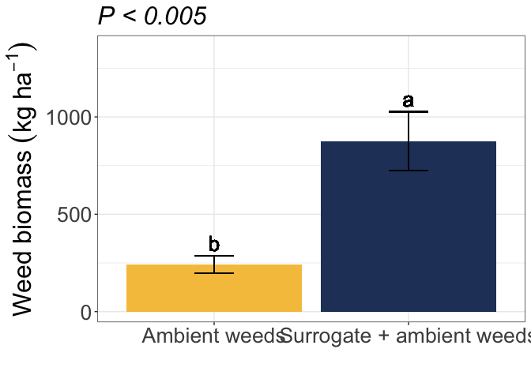
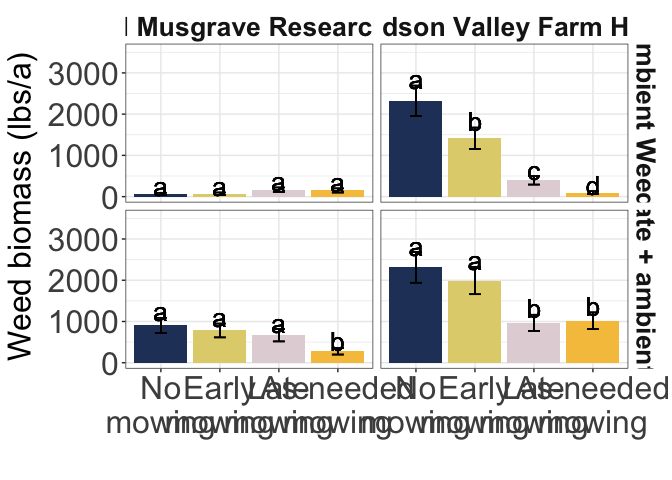

IMT Weed biomass
================

# Load libraries

``` r
#Set work directory
setwd("/Users/ey239/Github/IMT/rmarkdowns")

#Load packages 
library(tidyverse) ##install.packages("tidyverse")
library(knitr)
library(patchwork) ##install.packages("patchwork")
library(skimr)     ##install.packages("skimr")
library(readxl)
library(janitor) ##install.packages("janitor")

library(kableExtra) ##install.packages("kableExtra")
library(webshot) ##install.packages("webshot")
webshot::install_phantomjs()
library(viridis) ##install.packages("viridis")
library(lme4) ##install.packages("lme4")
library(lmerTest) ##install.packages("lmerTest")
library(emmeans) ##install.packages("emmeans")
library(rstatix) ##install.packages("rstatix")
#library(Matrix) ##install.packages("Matrix")
library(multcomp) ##install.packages("multcomp")
library(multcompView) ##install.packages("multcompView")
library(ggResidpanel) ##install.packages("ggResidpanel")
#library(car)
#library(TMB)  ##install.packages("TMB")
library(glmmTMB)  ##install.packages("glmmTMB")
library(DHARMa)  ##install.packages("DHARMa")
library(performance) ##install.packages("performance")
library(WrensBookshelf)##install.packages("WrensBookshelf")
#Load Functions
MeanPlusSe<-function(x) mean(x)+plotrix::std.error(x)

find_logw0=function(x){c=trunc(log(min(x[x>0],na.rm=T)))
d=exp(c)
return(d)}
```

<br>

# Load and clean data

## Load data

``` r
combined_raw <- read_excel("~/Github/IMT/raw-data/combined_raw.xlsx")
kable(head(combined_raw))
```

| id | year | location | site_year | treatment | block | plot | microplot | bean_emergence | bean_biomass | intrarow_weed_biomass | interrow_weed_biomass | weed_biomass | bean_population | bean_yield |
|:---|---:|:---|:---|:---|---:|---:|:---|:---|---:|:---|:---|---:|:---|:---|
| WI_B1_P101 | 2023 | WI | WI_2023 | NWC | 1 | 101 | M | 23 | 233.3 | 0 | 2 | 1.84 | 38 | 295.66000000000003 |
| WI_B1_P101_SW | 2023 | WI | WI_2023 | NWC | 1 | 101 | SW | 24 | 61.7 | 31.66 | 155.9 | 187.56 | 28 | 88.81 |
| WI_B1_P101_WF | 2023 | WI | WI_2023 | NWC | 1 | 101 | WF | 14 | 210.3 | 0 | 0 | 0.00 | 38 | 273.51 |
| WI_B1_P102 | 2023 | WI | WI_2023 | LWC | 1 | 102 | M | 14 | 248.4 | 0 | 0 | 0.00 | 27 | 321.16000000000003 |
| WI_B1_P102_SW | 2023 | WI | WI_2023 | LWC | 1 | 102 | SW | 16 | 65.6 | 28.76 | 50 | 78.76 | 32 | 97.45 |
| WI_B1_P103 | 2023 | WI | WI_2023 | AWC | 1 | 103 | M | 17 | 279.3 | 0 | 0.21 | 0.21 | 34 | 302.72000000000003 |

\##Clean data \##ECOBEAN (includes data from all sites through 2024)

``` r
# Standardize column names and convert variables
clean_combined <- combined_raw |>  
  clean_names() |>  
  rename(mowing = treatment, weeds = microplot) |> 
  mutate(across(c(year, location, site_year, mowing, block, plot, weeds), as.factor))

# Define constants for biomass conversion
sq_m_to_ha <- 10000  # Square meters per hectare
grams_to_kg <- 1000   # Grams per kilogram
kg_to_lbs_ac <- 0.893  # Kilograms per hectare to pounds per acre
half_meter_sq_m <- 0.5  # Sample area in square meters

# Filter relevant data and compute adjusted weed biomass
weed_biomass_clean <- clean_combined |>             
  filter(weeds %in% c("SW", "M")) |>  # Keep rows where SW and M are microplots
  mutate(
    weed_biomass_grams_meter = weed_biomass / half_meter_sq_m,
    weed_biomass_kg_ha = (weed_biomass_grams_meter * sq_m_to_ha) / grams_to_kg,
    weed_biomass_lbs_ac = weed_biomass_kg_ha * kg_to_lbs_ac)  # Updated conversion factor


# Display cleaned dataset
kable(head(weed_biomass_clean))
```

| id | year | location | site_year | mowing | block | plot | weeds | bean_emergence | bean_biomass | intrarow_weed_biomass | interrow_weed_biomass | weed_biomass | bean_population | bean_yield | weed_biomass_grams_meter | weed_biomass_kg_ha | weed_biomass_lbs_ac |
|:---|:---|:---|:---|:---|:---|:---|:---|:---|---:|:---|:---|---:|:---|:---|---:|---:|---:|
| WI_B1_P101 | 2023 | WI | WI_2023 | NWC | 1 | 101 | M | 23 | 233.3 | 0 | 2 | 1.84 | 38 | 295.66000000000003 | 3.68 | 36.8 | 32.8624 |
| WI_B1_P101_SW | 2023 | WI | WI_2023 | NWC | 1 | 101 | SW | 24 | 61.7 | 31.66 | 155.9 | 187.56 | 28 | 88.81 | 375.12 | 3751.2 | 3349.8216 |
| WI_B1_P102 | 2023 | WI | WI_2023 | LWC | 1 | 102 | M | 14 | 248.4 | 0 | 0 | 0.00 | 27 | 321.16000000000003 | 0.00 | 0.0 | 0.0000 |
| WI_B1_P102_SW | 2023 | WI | WI_2023 | LWC | 1 | 102 | SW | 16 | 65.6 | 28.76 | 50 | 78.76 | 32 | 97.45 | 157.52 | 1575.2 | 1406.6536 |
| WI_B1_P103 | 2023 | WI | WI_2023 | AWC | 1 | 103 | M | 17 | 279.3 | 0 | 0.21 | 0.21 | 34 | 302.72000000000003 | 0.42 | 4.2 | 3.7506 |
| WI_B1_P103_SW | 2023 | WI | WI_2023 | AWC | 1 | 103 | SW | 15 | 80.1 | 27.56 | 22.26 | 49.82 | 32 | 118.17 | 99.64 | 996.4 | 889.7852 |

\##FARMHUB 2024 REPORT (Musgrave and Farmhub only)

``` r
# Standardize column names and convert variables
clean_combined <- combined_raw |>  
  clean_names() |>  
  rename(mowing = treatment, weeds = microplot) |> 
  mutate(across(c(year, location, site_year, mowing, block, plot, weeds), as.factor))

# Define constants for biomass conversion
sq_m_to_ha <- 10000   # Square meters per hectare
grams_to_kg <- 1000    # Grams per kilogram
kg_to_lbs <- 2.20462   # Kilograms per pound
half_meter_sq_m <- 0.5 # Sample area in square meters
ha_to_acre <- 0.892179 # Hectares to acres conversion factor

# Filter relevant data and compute adjusted weed biomass
weed_biomass_clean_fh <- clean_combined |>             
  filter(
    weeds %in% c("SW", "M"),   # Keep rows where SW and M are microplots
    location %in% c("FH", "CU"), # Keep only specific locations
    year %in% c ("2024")
  ) |>  
  mutate(
    weed_biomass_grams_meter_fh = weed_biomass / half_meter_sq_m,
    weed_biomass_kg_ha_fh = (weed_biomass_grams_meter_fh * sq_m_to_ha) / grams_to_kg,
    weed_biomass_lbs_ac_fh = weed_biomass_kg_ha_fh * ha_to_acre
  )

# Display cleaned dataset
kable(head(weed_biomass_clean_fh))
```

| id | year | location | site_year | mowing | block | plot | weeds | bean_emergence | bean_biomass | intrarow_weed_biomass | interrow_weed_biomass | weed_biomass | bean_population | bean_yield | weed_biomass_grams_meter_fh | weed_biomass_kg_ha_fh | weed_biomass_lbs_ac_fh |
|:---|:---|:---|:---|:---|:---|:---|:---|:---|---:|:---|:---|---:|:---|:---|---:|---:|---:|
| FH_B1_P101 | 2024 | FH | FH_2024 | EWC | 1 | 101 | M | 32 | 120.37 | 10.08 | 68.430000000000007 | 78.51 | 18 | 139.85 | 157.02 | 1570.2 | 1400.8995 |
| FH_B1_P101_SW | 2024 | FH | FH_2024 | EWC | 1 | 101 | SW | 29 | 104.44 | 20.56 | 89.6 | 110.16 | na | na | 220.32 | 2203.2 | 1965.6488 |
| FH_B1_P102 | 2024 | FH | FH_2024 | LWC | 1 | 102 | M | 31 | 193.20 | 0 | 10.130000000000001 | 10.13 | 23 | 192.95 | 20.26 | 202.6 | 180.7555 |
| FH_B1_P102_SW | 2024 | FH | FH_2024 | LWC | 1 | 102 | SW | 21 | 75.42 | 5.49 | 58.71 | 64.20 | 24 | 217.43 | 128.40 | 1284.0 | 1145.5578 |
| FH_B1_P103 | 2024 | FH | FH_2024 | AWC | 1 | 103 | M | 20 | 185.88 | 0.05 | 14.08 | 14.13 | 21 | 276.42 | 28.26 | 282.6 | 252.1298 |
| FH_B1_P103_SW | 2024 | FH | FH_2024 | AWC | 1 | 103 | SW | 24 | 85.61 | 41.91 | 38.229999999999997 | 80.14 | 17 | 73.44 | 160.28 | 1602.8 | 1429.9845 |

# Model testing

\##ECOBEAN (includes data from all sites through 2024) \### Glmm

``` r
model_tweedie_log <- glmmTMB(weed_biomass_lbs_ac ~ mowing*weeds  
                    + (1|site_year) 
                    + (1|site_year:block)
                    + (1|site_year:block:mowing),  
  data = weed_biomass_clean, 
  family = tweedie(link = "log")

)

###It assumes that mowing effects may vary by block, in addition to site-year and block-level variation.
#This would be useful if you suspect that mowing impacts weed biomass differently in different blocks.
#The model accounts for hierarchical structure down to the mowing level within blocks.

### Two checks specifically for a generalize linear approach
simulateResiduals(model_tweedie_log,plot = TRUE) # Residuals and normality look good
```

<!-- -->

    ## Object of Class DHARMa with simulated residuals based on 250 simulations with refit = FALSE . See ?DHARMa::simulateResiduals for help. 
    ##  
    ## Scaled residual values: 0.192 0.916 0.03947989 0.844 0.116 0.688 0.072 0.752 0.03064029 0.624 0.212 0.756 0.06318126 0.812 0.0732246 0.484 0.308 0.36 0.03574465 0.204 ...

``` r
check_model(model_tweedie_log) #Perfect, preditions match real data
```

    ## `check_outliers()` does not yet support models of class `glmmTMB`.

<!-- -->

``` r
summary(model_tweedie_log )
```

    ##  Family: tweedie  ( log )
    ## Formula:          
    ## weed_biomass_lbs_ac ~ mowing * weeds + (1 | site_year) + (1 |  
    ##     site_year:block) + (1 | site_year:block:mowing)
    ## Data: weed_biomass_clean
    ## 
    ##      AIC      BIC   logLik deviance df.resid 
    ##   4518.3   4567.3  -2246.2   4492.3      307 
    ## 
    ## Random effects:
    ## 
    ## Conditional model:
    ##  Groups                 Name        Variance  Std.Dev. 
    ##  site_year              (Intercept) 2.572e-01 5.072e-01
    ##  site_year:block        (Intercept) 1.685e-02 1.298e-01
    ##  site_year:block:mowing (Intercept) 4.482e-09 6.695e-05
    ## Number of obs: 320, groups:  
    ## site_year, 10; site_year:block, 40; site_year:block:mowing, 160
    ## 
    ## Dispersion parameter for tweedie family (): 9.15 
    ## 
    ## Conditional model:
    ##                   Estimate Std. Error z value Pr(>|z|)    
    ## (Intercept)        5.31993    0.23047  23.083  < 2e-16 ***
    ## mowingEWC          0.47568    0.21944   2.168   0.0302 *  
    ## mowingLWC         -0.21183    0.23387  -0.906   0.3651    
    ## mowingNWC          0.42084    0.22171   1.898   0.0577 .  
    ## weedsSW            1.20112    0.20684   5.807 6.36e-09 ***
    ## mowingEWC:weedsSW  0.02394    0.27805   0.086   0.9314    
    ## mowingLWC:weedsSW  0.10104    0.29538   0.342   0.7323    
    ## mowingNWC:weedsSW  0.20375    0.27849   0.732   0.4644    
    ## ---
    ## Signif. codes:  0 '***' 0.001 '**' 0.01 '*' 0.05 '.' 0.1 ' ' 1

``` r
VarCorr(model_tweedie_log )
```

    ## 
    ## Conditional model:
    ##  Groups                 Name        Std.Dev.  
    ##  site_year              (Intercept) 5.0715e-01
    ##  site_year:block        (Intercept) 1.2981e-01
    ##  site_year:block:mowing (Intercept) 6.6951e-05

### Joint test (anova)

``` r
model_tweedie_log |> 
  joint_tests() |> 
  kable()  
```

|     | model term   | df1 | df2 | F.ratio |   Chisq |   p.value |
|:----|:-------------|----:|----:|--------:|--------:|----------:|
| 1   | mowing       |   3 | Inf |  11.863 |  35.589 | 0.0000001 |
| 3   | weeds        |   1 | Inf | 154.587 | 154.587 | 0.0000000 |
| 2   | mowing:weeds |   3 | Inf |   0.229 |   0.687 | 0.8761435 |

### Anova table

``` r
options(contrasts = c("contr.sum", "contr.poly"))
Anova(model_tweedie_log, type = 3)
```

    ## Analysis of Deviance Table (Type III Wald chisquare tests)
    ## 
    ## Response: weed_biomass_lbs_ac
    ##                 Chisq Df Pr(>Chisq)    
    ## (Intercept)  532.8294  1  < 2.2e-16 ***
    ## mowing        13.0400  3   0.004551 ** 
    ## weeds         33.7203  1  6.363e-09 ***
    ## mowing:weeds   0.6875  3   0.876144    
    ## ---
    ## Signif. codes:  0 '***' 0.001 '**' 0.01 '*' 0.05 '.' 0.1 ' ' 1

### Fisher compact letter display

#### Weed control (Significant)

``` r
cld_mowing_fisher <-cld(emmeans(model_tweedie_log, ~  mowing, type = "response"), Letters = letters,adjust = "none", sort = TRUE, reversed=TRUE)
```

    ## NOTE: Results may be misleading due to involvement in interactions

``` r
cld_mowing_fisher
```

    ##  mowing response    SE  df asymp.LCL asymp.UCL .group
    ##  NWC         628 118.0 Inf       435       908  a    
    ##  EWC         607 114.0 Inf       421       876  a    
    ##  AWC         373  71.7 Inf       256       543   b   
    ##  LWC         317  61.7 Inf       217       464   b   
    ## 
    ## Results are averaged over the levels of: weeds 
    ## Confidence level used: 0.95 
    ## Intervals are back-transformed from the log scale 
    ## Tests are performed on the log scale 
    ## significance level used: alpha = 0.05 
    ## NOTE: If two or more means share the same grouping symbol,
    ##       then we cannot show them to be different.
    ##       But we also did not show them to be the same.

#### Weed level (Significant)

``` r
cld_weeds_fisher <-cld(emmeans(model_tweedie_log, ~  weeds, type = "response"), Letters = letters,adjust = "none", sort = TRUE, reversed=TRUE)
```

    ## NOTE: Results may be misleading due to involvement in interactions

``` r
cld_weeds_fisher
```

    ##  weeds response    SE  df asymp.LCL asymp.UCL .group
    ##  SW         875 151.0 Inf       623      1228  a    
    ##  M          243  44.2 Inf       170       347   b   
    ## 
    ## Results are averaged over the levels of: mowing 
    ## Confidence level used: 0.95 
    ## Intervals are back-transformed from the log scale 
    ## Tests are performed on the log scale 
    ## significance level used: alpha = 0.05 
    ## NOTE: If two or more means share the same grouping symbol,
    ##       then we cannot show them to be different.
    ##       But we also did not show them to be the same.

\##FARMHUB 2024 REPORT (Musgrave and Farmhub only) \### Glmm

``` r
model_tweedie_log_fh <- glmmTMB(weed_biomass_lbs_ac_fh ~ mowing*weeds*location  + (1|location:block)+ (1|location:block:mowing), 
  data = weed_biomass_clean_fh, 
  family = tweedie(link = "log")


)
```

    ## Warning in finalizeTMB(TMBStruc, obj, fit, h, data.tmb.old): Model convergence
    ## problem; non-positive-definite Hessian matrix. See vignette('troubleshooting')

``` r
###It assumes that mowing effects may vary by block, in addition to site-year and block-level variation.
#This would be useful if you suspect that mowing impacts weed biomass differently in different blocks.
#The model accounts for hierarchical structure down to the mowing level within blocks.

### Two checks specifically for a generalize linear approach
simulateResiduals(model_tweedie_log_fh,plot = TRUE) # Residuals and normality look good
```

<!-- -->

    ## Object of Class DHARMa with simulated residuals based on 250 simulations with refit = FALSE . See ?DHARMa::simulateResiduals for help. 
    ##  
    ## Scaled residual values: 0.528 0.556 0.148 0.72 0.964 0.856 0.848 0.596 0.228 0.52 0.084 0.504 0.96 0.624 0.316 0.52 0.888 0.432 0.172 0.408 ...

``` r
check_model(model_tweedie_log_fh) #Perfect, preditions match real data
```

    ## `check_outliers()` does not yet support models of class `glmmTMB`.

<!-- -->

``` r
summary(model_tweedie_log_fh )
```

    ##  Family: tweedie  ( log )
    ## Formula:          
    ## weed_biomass_lbs_ac_fh ~ mowing * weeds * location + (1 | location:block) +  
    ##     (1 | location:block:mowing)
    ## Data: weed_biomass_clean_fh
    ## 
    ##      AIC      BIC   logLik deviance df.resid 
    ##       NA       NA       NA       NA       44 
    ## 
    ## Random effects:
    ## 
    ## Conditional model:
    ##  Groups                Name        Variance  Std.Dev. 
    ##  location:block        (Intercept) 1.246e-17 3.530e-09
    ##  location:block:mowing (Intercept) 2.695e-09 5.192e-05
    ## Number of obs: 64, groups:  location:block, 8; location:block:mowing, 32
    ## 
    ## Dispersion parameter for tweedie family (): 6.74 
    ## 
    ## Conditional model:
    ##                          Estimate Std. Error z value Pr(>|z|)    
    ## (Intercept)               6.18030    0.06800   90.88  < 2e-16 ***
    ## mowing1                  -0.65023    0.12805   -5.08 3.81e-07 ***
    ## mowing2                   0.26399    0.11507    2.29 0.021784 *  
    ## mowing3                  -0.06124    0.11347   -0.54 0.589381    
    ## weeds1                   -0.66239    0.06800   -9.74  < 2e-16 ***
    ## location1                -0.65545    0.06800   -9.64  < 2e-16 ***
    ## mowing1:weeds1           -0.08378    0.12805   -0.65 0.512916    
    ## mowing2:weeds1           -0.02251    0.11507   -0.20 0.844922    
    ## mowing3:weeds1            0.09255    0.11347    0.82 0.414699    
    ## mowing1:location1         0.44287    0.12805    3.46 0.000543 ***
    ## mowing2:location1        -0.32616    0.11507   -2.83 0.004591 ** 
    ## mowing3:location1         0.34756    0.11347    3.06 0.002191 ** 
    ## weeds1:location1         -0.21240    0.06800   -3.12 0.001788 ** 
    ## mowing1:weeds1:location1  0.64827    0.12805    5.06 4.13e-07 ***
    ## mowing2:weeds1:location1 -0.30182    0.11507   -2.62 0.008720 ** 
    ## mowing3:weeds1:location1  0.09183    0.11347    0.81 0.418352    
    ## ---
    ## Signif. codes:  0 '***' 0.001 '**' 0.01 '*' 0.05 '.' 0.1 ' ' 1

``` r
VarCorr(model_tweedie_log_fh )
```

    ## 
    ## Conditional model:
    ##  Groups                Name        Std.Dev.  
    ##  location:block        (Intercept) 3.5295e-09
    ##  location:block:mowing (Intercept) 5.1915e-05

### Joint test (anova)

``` r
model_tweedie_log_fh |> 
  joint_tests() |> 
  kable()  
```

|     | model term            | df1 | df2 | F.ratio |  Chisq |   p.value |
|:----|:----------------------|----:|----:|--------:|-------:|----------:|
| 1   | mowing                |   3 | Inf |  11.229 | 33.687 | 0.0000002 |
| 5   | weeds                 |   1 | Inf |  94.881 | 94.881 | 0.0000000 |
| 7   | location              |   1 | Inf |  92.904 | 92.904 | 0.0000000 |
| 2   | mowing:weeds          |   3 | Inf |   0.282 |  0.846 | 0.8382387 |
| 4   | mowing:location       |   3 | Inf |  11.504 | 34.512 | 0.0000002 |
| 6   | weeds:location        |   1 | Inf |   9.756 |  9.756 | 0.0017878 |
| 3   | mowing:weeds:location |   3 | Inf |  11.543 | 34.629 | 0.0000001 |

### Anova table

``` r
options(contrasts = c("contr.sum", "contr.poly"))
Anova(model_tweedie_log_fh, type = 3)
```

    ## Analysis of Deviance Table (Type III Wald chisquare tests)
    ## 
    ## Response: weed_biomass_lbs_ac_fh
    ##                           Chisq Df Pr(>Chisq)    
    ## (Intercept)           8259.7911  1  < 2.2e-16 ***
    ## mowing                  33.6879  3  2.306e-07 ***
    ## weeds                   94.8809  1  < 2.2e-16 ***
    ## location                92.9040  1  < 2.2e-16 ***
    ## mowing:weeds             0.8468  3   0.838239    
    ## mowing:location         34.5124  3  1.544e-07 ***
    ## weeds:location           9.7555  1   0.001788 ** 
    ## mowing:weeds:location   34.6303  3  1.458e-07 ***
    ## ---
    ## Signif. codes:  0 '***' 0.001 '**' 0.01 '*' 0.05 '.' 0.1 ' ' 1

### Fisher compact letter display

weeds\|location\|mowing (Significant)

``` r
cld_mowing_weeds_location_fisher_fh <-cld(emmeans(model_tweedie_log_fh, ~  mowing|weeds|location, type = "response"), Letters = letters,adjust = "none", sort = TRUE, reversed=TRUE)
cld_mowing_weeds_location_fisher_fh
```

    ## weeds = M, location = CU:
    ##  mowing response    SE  df asymp.LCL asymp.UCL .group
    ##  LWC       167.5  54.5 Inf      88.5       317  a    
    ##  AWC       149.5  50.2 Inf      77.4       289  a    
    ##  EWC        71.1  29.2 Inf      31.8       159  a    
    ##  NWC        67.3  28.0 Inf      29.7       152  a    
    ## 
    ## weeds = SW, location = CU:
    ##  mowing response    SE  df asymp.LCL asymp.UCL .group
    ##  NWC       904.5 187.0 Inf     603.5      1356  a    
    ##  EWC       782.0 168.0 Inf     513.3      1191  a    
    ##  LWC       666.2 149.0 Inf     429.3      1034  a    
    ##  AWC       278.0  78.9 Inf     159.4       485   b   
    ## 
    ## weeds = M, location = FH:
    ##  mowing response    SE  df asymp.LCL asymp.UCL .group
    ##  NWC      2320.5 371.0 Inf    1695.6      3176  a    
    ##  EWC      1415.5 259.0 Inf     989.0      2026   b   
    ##  LWC       394.5 102.0 Inf     237.8       655    c  
    ##  AWC        95.6  36.2 Inf      45.5       201     d 
    ## 
    ## weeds = SW, location = FH:
    ##  mowing response    SE  df asymp.LCL asymp.UCL .group
    ##  NWC      2311.1 370.0 Inf    1688.2      3164  a    
    ##  EWC      1991.4 332.0 Inf    1436.0      2762  a    
    ##  AWC      1017.1 203.0 Inf     687.2      1505   b   
    ##  LWC       969.0 196.0 Inf     651.3      1441   b   
    ## 
    ## Confidence level used: 0.95 
    ## Intervals are back-transformed from the log scale 
    ## Tests are performed on the log scale 
    ## significance level used: alpha = 0.05 
    ## NOTE: If two or more means share the same grouping symbol,
    ##       then we cannot show them to be different.
    ##       But we also did not show them to be the same.

``` r
cld_mowing_fisher_fh <-cld(emmeans(model_tweedie_log_fh, ~  mowing, type = "response"), Letters = letters,adjust = "none", sort = TRUE, reversed=TRUE)
```

    ## NOTE: Results may be misleading due to involvement in interactions

``` r
cld_mowing_fisher_fh
```

    ##  mowing response   SE  df asymp.LCL asymp.UCL .group
    ##  NWC         756 97.7 Inf       587       974  a    
    ##  EWC         629 82.6 Inf       486       814  ab   
    ##  LWC         454 58.4 Inf       353       585   b   
    ##  AWC         252 38.7 Inf       187       341    c  
    ## 
    ## Results are averaged over the levels of: weeds, location 
    ## Confidence level used: 0.95 
    ## Intervals are back-transformed from the log scale 
    ## Tests are performed on the log scale 
    ## significance level used: alpha = 0.05 
    ## NOTE: If two or more means share the same grouping symbol,
    ##       then we cannot show them to be different.
    ##       But we also did not show them to be the same.

``` r
cld_location_fisher_fh <-cld(emmeans(model_tweedie_log_fh, ~  location, type = "response"), Letters = letters,adjust = "none", sort = TRUE, reversed=TRUE)
```

    ## NOTE: Results may be misleading due to involvement in interactions

``` r
cld_location_fisher_fh
```

    ##  location response   SE  df asymp.LCL asymp.UCL .group
    ##  FH            931 73.9 Inf       796      1087  a    
    ##  CU            251 27.7 Inf       202       311   b   
    ## 
    ## Results are averaged over the levels of: mowing, weeds 
    ## Confidence level used: 0.95 
    ## Intervals are back-transformed from the log scale 
    ## Tests are performed on the log scale 
    ## significance level used: alpha = 0.05 
    ## NOTE: If two or more means share the same grouping symbol,
    ##       then we cannot show them to be different.
    ##       But we also did not show them to be the same.

``` r
cld_weeds_fisher_fh <-cld(emmeans(model_tweedie_log_fh, ~  weeds, type = "response"), Letters = letters,adjust = "none", sort = TRUE, reversed=TRUE)
```

    ## NOTE: Results may be misleading due to involvement in interactions

``` r
cld_weeds_fisher_fh
```

    ##  weeds response   SE  df asymp.LCL asymp.UCL .group
    ##  SW         937 69.7 Inf       810      1084  a    
    ##  M          249 28.4 Inf       199       311   b   
    ## 
    ## Results are averaged over the levels of: mowing, location 
    ## Confidence level used: 0.95 
    ## Intervals are back-transformed from the log scale 
    ## Tests are performed on the log scale 
    ## significance level used: alpha = 0.05 
    ## NOTE: If two or more means share the same grouping symbol,
    ##       then we cannot show them to be different.
    ##       But we also did not show them to be the same.

\#Figures \##ECOBEAN \### Mowing (lbs/a)

``` r
weed_biomass_clean |> 
  left_join(cld_mowing_fisher) |> 
  ggplot(aes(x = factor(mowing, levels = c("NWC", "EWC", "LWC", "AWC")), y = response, fill = mowing)) +
  #stat_summary(geom = "bar", fun = "mean", width = 0.7) +
  #stat_summary(geom = "errorbar", fun.data = "mean_se", width = 0.2) +
  #stat_summary(geom="text", fun = "MeanPlusSe", aes(label= trimws(.group)),size=6.5,vjust=-0.5) +
  geom_bar(stat="identity", position=position_dodge()) + 
  geom_errorbar(aes(ymin=response-SE, ymax=response+SE), width=.2,
                 position=position_dodge(.9))+
geom_text(aes(label = trimws(.group), y = response + (SE + 50)), size = 7) +
  labs(
    x = "",
     y = expression("Weed biomass" ~ (lbs/a)),
    #title = str_c("Influence of interrow weed control on weed biomass"),
    subtitle = expression(italic("P < 0.001"))) +
  
  scale_x_discrete(labels = c("No\nmowing", "Early\nmowing", "Late\nmowing", "As-needed\nmowing")) +
  scale_y_continuous(expand = expansion(mult = c(0.05, 0.3))) +
  scale_fill_WB_d(name = "BlueberriesForSal", direction = 1) +
   theme_bw() +
  theme(
    legend.position = "none",
    strip.background = element_blank(),
    strip.text = element_text(face = "bold", size = 12),
    axis.title = element_text(size = 24),  # Increase font size of axis titles
    axis.text = element_text(size = 24),   # Increase font size of axis labels
    plot.title = element_text(size = 24, face = "bold"),  # Increase font size of title
    plot.subtitle = element_text(size = 24, face = "italic")  # Increase font size of subtitle
  )
```

<!-- -->

``` r
ggsave("weed_biomass_mowing_lb_a_eco.png", width = 10, height = 8, dpi = 300)
```

``` r
emmeans_summary <- summary(emmeans(model_tweedie_log, ~ mowing, type = "response"))
```

    ## NOTE: Results may be misleading due to involvement in interactions

### Mowing (kg/ha)

``` r
weed_biomass_clean |> 
  left_join(cld_mowing_fisher) |> 
  ggplot(aes(x = factor(mowing, levels = c("NWC", "EWC", "LWC", "AWC")), y = response, fill = mowing)) +
  #stat_summary(geom = "bar", fun = "mean", width = 0.7) +
  #stat_summary(geom = "errorbar", fun.data = "mean_se", width = 0.2) +
  #stat_summary(geom="text", fun = "MeanPlusSe", aes(label= trimws(.group)),size=6.5,vjust=-0.5) +
  geom_bar(stat="identity", position=position_dodge()) + 
  geom_errorbar(aes(ymin=response-SE, ymax=response+SE), width=.2,
                 position=position_dodge(.9))+
geom_text(aes(label = trimws(.group), y = response + (SE + 50)), size = 7) +
  labs(
    x = "",
     y = expression("Weed biomass" ~ (lbs/a)),
    #title = str_c("Influence of interrow weed control on weed biomass"),
    subtitle = expression(italic("P < 0.001"))) +
  
  scale_x_discrete(labels = c("No\nmowing", "Early\nmowing", "Late\nmowing", "As-needed\nmowing")) +
  scale_y_continuous(expand = expansion(mult = c(0.05, 0.3))) +
  scale_fill_WB_d(name = "BlueberriesForSal", direction = 1) +
   theme_bw() +
  theme(
    legend.position = "none",
    strip.background = element_blank(),
    strip.text = element_text(face = "bold", size = 12),
    axis.title = element_text(size = 24),  # Increase font size of axis titles
    axis.text = element_text(size = 24),   # Increase font size of axis labels
    plot.title = element_text(size = 24, face = "bold"),  # Increase font size of title
    plot.subtitle = element_text(size = 24, face = "italic")  # Increase font size of subtitle
  )
```

<!-- -->

``` r
ggsave("weed_biomass_mowing_lb_a_eco.png", width = 10, height = 8, dpi = 300)
```

### Weed level of weed biomass (significant)

``` r
weed_biomass_clean |> 
  left_join(cld_weeds_fisher) |> 
  ggplot(aes(x = weeds, y = response, fill = weeds)) +  # Fill added
  #stat_summary(geom = "bar", fun = "mean", width = 0.6, position = position_dodge(width = 0.7)) +
  #stat_summary(geom = "errorbar", fun.data = "mean_se", width = 0.2, position = position_dodge(width = 0.7)) +
  #stat_summary(geom = "text", fun = "MeanPlusSe", aes(label = trimws(.group)), 
               #size = 6.5, vjust = -0.5, position = position_dodge(width = 0.7)) +
  geom_bar(stat="identity", position=position_dodge()) + 
  geom_errorbar(aes(ymin=response-SE, ymax=response+SE), width=.2,
                 position=position_dodge(.9))+
geom_text(aes(label = trimws(.group), y = response + (SE + 65)), size = 7) +
  labs(
    x = "",
    y = expression("Weed biomass" ~ (kg~ha^{-1})),
  subtitle = expression(italic("P < 0.005"))
  ) +
  scale_x_discrete(labels = c("Ambient weeds", "Surrogate + ambient weeds")) +
  scale_y_continuous(expand = expansion(mult = c(0.05, 0.3))) +
  scale_fill_WB_d(name = "BlueberriesForSal", direction = 1) +  # Ensure correct function use
  theme_bw() +
  theme(
    legend.position = "none",
    strip.background = element_blank(),
    strip.text = element_text(face = "bold", size = 20),
    axis.title = element_text(size = 24),
    axis.text = element_text(size = 20),
    plot.title = element_text(size = 24, face = "bold"),
    plot.subtitle = element_text(size = 24, face = "italic")
  )
```

<!-- -->

``` r
ggsave("weed_biomass_weeds_kg_ha_eco.png", width = 10, height = 8, dpi = 300)
```

\#Figures \##FARMHUB REPORT (2024 Musgrave and Farmhub) \### Mowing
(Significant)

## Weed level on weed biomass (significant)

### mowing\|weeds\|location (Significant)

``` r
weed_biomass_clean_fh |> 
  left_join(cld_mowing_weeds_location_fisher_fh) |> 
  mutate(response = as.numeric(response)) |>  # Convert response to numeric
  ggplot(aes(x = factor(mowing, levels = c("NWC", "EWC", "LWC", "AWC")), y = response, fill = mowing)) +
   facet_grid(weeds ~ location, labeller = labeller(
    location = c("CU" = "Cornell Musgrave Research Farm", "FH" = "Hudson Valley Farm Hub"),
    weeds = c("M" = "Ambient Weeds", "SW" = "Surrogate +\ ambient weeds")
  )) +
  #stat_summary(geom = "bar", fun = "mean", width = 0.7) +
  #tat_summary(geom = "errorbar", fun.data = "mean_se", width = 0.2) +
  #stat_summary(geom="text", fun = "MeanPlusSe", aes(label= trimws(.group)),size=6.5,vjust=-0.5) +
  geom_bar(stat="identity", position=position_dodge()) + 
  geom_errorbar(aes(ymin=response-SE, ymax=response+SE), width=.2,
                 position=position_dodge(.9))+
geom_text(aes(label = trimws(.group), y = response + (SE + 160)), size = 7) +
  labs(
    x = "",
     y = expression("Weed biomass (lbs/a)")) +
    #title = str_c("Influence of interrow weed control on weed biomass"),
    
  
  scale_x_discrete(labels = c("No\nmowing", "Early\nmowing", "Late\nmowing", "As-needed\nmowing")) +
  scale_y_continuous(expand = expansion(mult = c(0.05, 0.3))) +
  scale_fill_WB_d(name = "BlueberriesForSal", direction = 1) +
   theme_bw() +
  theme(
    legend.position = "none",
    strip.background = element_blank(),
    strip.text = element_text(face = "bold", size = 20),
    axis.title = element_text(size = 24),  # Increase font size of axis titles
    axis.text = element_text(size = 24),   # Increase font size of axis labels
    plot.title = element_text(size = 24, face = "bold"),  # Increase font size of title
    plot.subtitle = element_text(size = 24, face = "italic")  # Increase font size of subtitle
  )
```

<!-- -->

``` r
ggsave("weed_biomass_mowing_weeds_location_lbac_fh.png", width = 13, height = 10, dpi = 300)
```
