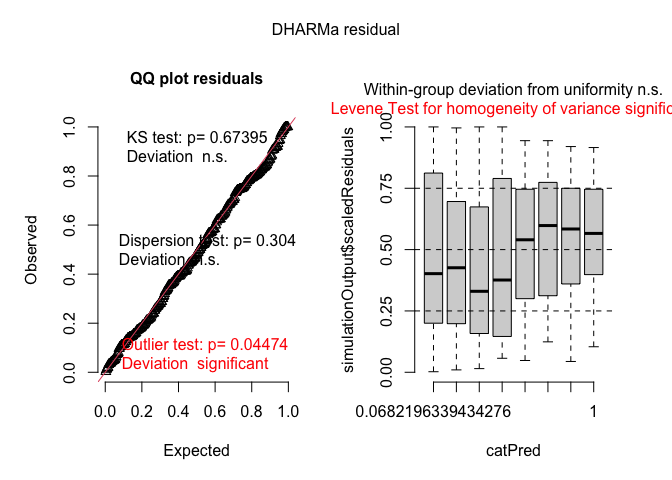

IMT Weed biomass
================

# Load libraries

``` r
#Set work directory
setwd("/Users/ey239/Github/IMT/rmarkdowns")

#Load packages 
library(tidyverse) ##install.packages("tidyverse")
library(knitr)
library(patchwork) ##install.packages("patchwork")
library(skimr)     ##install.packages("skimr")
library(readxl)
library(janitor) ##install.packages("janitor")

library(kableExtra) ##install.packages("kableExtra")
library(webshot) ##install.packages("webshot")
webshot::install_phantomjs()
library(viridis) ##install.packages("viridis")
library(lme4) ##install.packages("lme4")
library(lmerTest) ##install.packages("lmerTest")
library(emmeans) ##install.packages("emmeans")
library(rstatix) ##install.packages("rstatix")
#library(Matrix) ##install.packages("Matrix")
library(multcomp) ##install.packages("multcomp")
library(multcompView) ##install.packages("multcompView")
library(ggResidpanel) ##install.packages("ggResidpanel")
#library(car)
#library(TMB)  ##install.packages("TMB")
library(glmmTMB)  ##install.packages("glmmTMB")
library(DHARMa)  ##install.packages("DHARMa")
library(performance) ##install.packages("performance")
library(WrensBookshelf)##install.packages("WrensBookshelf")
#Load Functions
MeanPlusSe<-function(x) mean(x)+plotrix::std.error(x)

find_logw0=function(x){c=trunc(log(min(x[x>0],na.rm=T)))
d=exp(c)
return(d)}
```

<br>

# Load and clean data

## Load data

``` r
combined_raw <- read_excel("~/Github/IMT/raw-data/combined_raw.xlsx")
kable(head(combined_raw))
```

| id | year | location | site_year | treatment | block | plot | microplot | bean_emergence | bean_biomass | intrarow_weed_biomass | interrow_weed_biomass | weed_biomass | bean_population | bean_yield |
|:---|---:|:---|:---|:---|---:|---:|:---|:---|---:|:---|:---|---:|:---|:---|
| WI_B1_P101 | 2023 | WI | WI_2023 | NWC | 1 | 101 | M | 23 | 233.3 | 0 | 2 | 1.84 | 38 | 295.66000000000003 |
| WI_B1_P101_SW | 2023 | WI | WI_2023 | NWC | 1 | 101 | SW | 24 | 61.7 | 31.66 | 155.9 | 187.56 | 28 | 88.81 |
| WI_B1_P101_WF | 2023 | WI | WI_2023 | NWC | 1 | 101 | WF | 14 | 210.3 | 0 | 0 | 0.00 | 38 | 273.51 |
| WI_B1_P102 | 2023 | WI | WI_2023 | LWC | 1 | 102 | M | 14 | 248.4 | 0 | 0 | 0.00 | 27 | 321.16000000000003 |
| WI_B1_P102_SW | 2023 | WI | WI_2023 | LWC | 1 | 102 | SW | 16 | 65.6 | 28.76 | 50 | 78.76 | 32 | 97.45 |
| WI_B1_P103 | 2023 | WI | WI_2023 | AWC | 1 | 103 | M | 17 | 279.3 | 0 | 0.21 | 0.21 | 34 | 302.72000000000003 |

\##Clean data \##ECOBEAN

``` r
#Standardaze column names, convert to factors, check for outliers of variable**
clean_combined <- clean_names(combined_raw) |>  
  rename ('mowing'= treatment,'weeds'= microplot) |> 
  mutate(across(c(year, location, site_year, mowing, block, plot, weeds, ), as.factor)) 

#select and convert data for wbm analysis
weed_biomass_clean <-clean_combined |>             
  filter(weeds %in% c("SW", "M")) |>  # Keep rows where SW and M are microplots
  mutate(weed_biomass_grams_meter = (weed_biomass /0.5)) |> 
  mutate(weed_biomass_kg_ha = (weed_biomass_grams_meter *(10000))/(1000)) |>
  mutate(weed_biomass_lbs_ac = ((weed_biomass_grams_meter *(10000))/(1000))* 0.892179)
kable(head(weed_biomass_clean)) 
```

| id | year | location | site_year | mowing | block | plot | weeds | bean_emergence | bean_biomass | intrarow_weed_biomass | interrow_weed_biomass | weed_biomass | bean_population | bean_yield | weed_biomass_grams_meter | weed_biomass_kg_ha | weed_biomass_lbs_ac |
|:---|:---|:---|:---|:---|:---|:---|:---|:---|---:|:---|:---|---:|:---|:---|---:|---:|---:|
| WI_B1_P101 | 2023 | WI | WI_2023 | NWC | 1 | 101 | M | 23 | 233.3 | 0 | 2 | 1.84 | 38 | 295.66000000000003 | 3.68 | 36.8 | 32.832187 |
| WI_B1_P101_SW | 2023 | WI | WI_2023 | NWC | 1 | 101 | SW | 24 | 61.7 | 31.66 | 155.9 | 187.56 | 28 | 88.81 | 375.12 | 3751.2 | 3346.741865 |
| WI_B1_P102 | 2023 | WI | WI_2023 | LWC | 1 | 102 | M | 14 | 248.4 | 0 | 0 | 0.00 | 27 | 321.16000000000003 | 0.00 | 0.0 | 0.000000 |
| WI_B1_P102_SW | 2023 | WI | WI_2023 | LWC | 1 | 102 | SW | 16 | 65.6 | 28.76 | 50 | 78.76 | 32 | 97.45 | 157.52 | 1575.2 | 1405.360361 |
| WI_B1_P103 | 2023 | WI | WI_2023 | AWC | 1 | 103 | M | 17 | 279.3 | 0 | 0.21 | 0.21 | 34 | 302.72000000000003 | 0.42 | 4.2 | 3.747152 |
| WI_B1_P103_SW | 2023 | WI | WI_2023 | AWC | 1 | 103 | SW | 15 | 80.1 | 27.56 | 22.26 | 49.82 | 32 | 118.17 | 99.64 | 996.4 | 888.967156 |

\##FARMHUB REPORT

``` r
#Standardaze column names, convert to factors, check for outliers of variable**
clean_combined <- clean_names(combined_raw) |>  
  rename ('mowing'= treatment,'weeds'= microplot) |> 
  mutate(across(c(year, location, site_year, mowing, block, plot, weeds, ), as.factor)) 

#select and convert data for wbm analysis
weed_biomass_clean_fh <-clean_combined |>             
  filter(weeds %in% c("SW", "M")) |>  # Keep rows where SW and M are microplots
   filter(location %in% c("FH", "CU")) |>
  mutate(weed_biomass_grams_meter = (weed_biomass /0.5)) |> 
  mutate(weed_biomass_kg_ha = (weed_biomass_grams_meter *(10000))/(1000)) |>
  mutate(weed_biomass_lbs_ac = ((weed_biomass_grams_meter *(10000))/(1000))* 0.892179)
kable(head(weed_biomass_clean_fh)) 
```

| id | year | location | site_year | mowing | block | plot | weeds | bean_emergence | bean_biomass | intrarow_weed_biomass | interrow_weed_biomass | weed_biomass | bean_population | bean_yield | weed_biomass_grams_meter | weed_biomass_kg_ha | weed_biomass_lbs_ac |
|:---|:---|:---|:---|:---|:---|:---|:---|:---|---:|:---|:---|---:|:---|:---|---:|---:|---:|
| FH_B1_P101 | 2023 | FH | FH_2023 | EWC | 1 | 101 | M | 21 | 87.18 | 0.75 | 16.5 | 17.25 | 22 | 367.79 | 34.50 | 345.0 | 307.80176 |
| FH_B1_P101_SW | 2023 | FH | FH_2023 | EWC | 1 | 101 | SW | 24 | 40.32 | 3.54 | 37.65 | 41.19 | 23 | 218 | 82.38 | 823.8 | 734.97706 |
| FH_B1_P102 | 2023 | FH | FH_2023 | LWC | 1 | 102 | M | 24 | 72.37 | 6.47 | 12.71 | 19.18 | 26 | 268 | 38.36 | 383.6 | 342.23986 |
| FH_B1_P102_SW | 2023 | FH | FH_2023 | LWC | 1 | 102 | SW | 24 | 63.33 | 7.54 | 11.33 | 18.87 | 25 | 177.3 | 37.74 | 377.4 | 336.70835 |
| FH_B1_P103 | 2023 | FH | FH_2023 | AWC | 1 | 103 | M | 23 | 148.62 | 4.22 | 0 | 4.22 | 22 | 290 | 8.44 | 84.4 | 75.29991 |
| FH_B1_P103_SW | 2023 | FH | FH_2023 | AWC | 1 | 103 | SW | 26 | 84.27 | 2.9 | 8.1300000000000008 | 11.03 | 20 | 236 | 22.06 | 220.6 | 196.81469 |

# Model testing

\##ECOBEAN \### Glmm

``` r
model_tweedie_log <- glmmTMB(weed_biomass_kg_ha ~ mowing*weeds + (1|site_year) + (1|site_year:block)+ (1|site_year:block:mowing), 
  data = weed_biomass_clean, 
  family = tweedie(link = "log")

)

###It assumes that mowing effects may vary by block, in addition to site-year and block-level variation.
#This would be useful if you suspect that mowing impacts weed biomass differently in different blocks.
#The model accounts for hierarchical structure down to the mowing level within blocks.

### Two checks specifically for a generalize linear approach
simulateResiduals(model_tweedie_log,plot = TRUE) # Residuals and normality look good
```

<!-- -->

    ## Object of Class DHARMa with simulated residuals based on 250 simulations with refit = FALSE . See ?DHARMa::simulateResiduals for help. 
    ##  
    ## Scaled residual values: 0.156 0.904 0.05048307 0.832 0.12 0.64 0.076 0.716 0.03671421 0.592 0.224 0.664 0.07983672 0.836 0.03441097 0.536 0.244 0.332 0.07823883 0.224 ...

``` r
check_model(model_tweedie_log) #Perfect, preditions match real data
```

    ## `check_outliers()` does not yet support models of class `glmmTMB`.

<!-- -->

``` r
summary(model_tweedie_log )
```

    ##  Family: tweedie  ( log )
    ## Formula:          weed_biomass_kg_ha ~ mowing * weeds + (1 | site_year) + (1 |  
    ##     site_year:block) + (1 | site_year:block:mowing)
    ## Data: weed_biomass_clean
    ## 
    ##      AIC      BIC   logLik deviance df.resid 
    ##   4587.4   4636.4  -2280.7   4561.4      307 
    ## 
    ## Random effects:
    ## 
    ## Conditional model:
    ##  Groups                 Name        Variance  Std.Dev. 
    ##  site_year              (Intercept) 2.621e-01 0.5119177
    ##  site_year:block        (Intercept) 1.709e-02 0.1307162
    ##  site_year:block:mowing (Intercept) 5.506e-09 0.0000742
    ## Number of obs: 320, groups:  
    ## site_year, 10; site_year:block, 40; site_year:block:mowing, 160
    ## 
    ## Dispersion parameter for tweedie family (): 9.57 
    ## 
    ## Conditional model:
    ##                   Estimate Std. Error z value Pr(>|z|)    
    ## (Intercept)        5.43305    0.23147  23.472  < 2e-16 ***
    ## mowingEWC          0.47221    0.21934   2.153   0.0313 *  
    ## mowingLWC         -0.21338    0.23379  -0.913   0.3614    
    ## mowingNWC          0.41593    0.22166   1.876   0.0606 .  
    ## weedsSW            1.20082    0.20675   5.808 6.32e-09 ***
    ## mowingEWC:weedsSW  0.02726    0.27794   0.098   0.9219    
    ## mowingLWC:weedsSW  0.10251    0.29527   0.347   0.7285    
    ## mowingNWC:weedsSW  0.22576    0.27811   0.812   0.4169    
    ## ---
    ## Signif. codes:  0 '***' 0.001 '**' 0.01 '*' 0.05 '.' 0.1 ' ' 1

``` r
VarCorr(model_tweedie_log )
```

    ## 
    ## Conditional model:
    ##  Groups                 Name        Std.Dev.  
    ##  site_year              (Intercept) 5.1192e-01
    ##  site_year:block        (Intercept) 1.3072e-01
    ##  site_year:block:mowing (Intercept) 7.4204e-05

### Joint test (anova)

``` r
model_tweedie_log |> 
  joint_tests() |> 
  kable()  
```

|     | model term   | df1 | df2 | F.ratio |   Chisq |   p.value |
|:----|:-------------|----:|----:|--------:|--------:|----------:|
| 1   | mowing       |   3 | Inf |  11.983 |  35.949 | 0.0000001 |
| 3   | weeds        |   1 | Inf | 156.425 | 156.425 | 0.0000000 |
| 2   | mowing:weeds |   3 | Inf |   0.279 |   0.837 | 0.8404495 |

### Anova table

``` r
options(contrasts = c("contr.sum", "contr.poly"))
Anova(model_tweedie_log, type = 3)
```

    ## Analysis of Deviance Table (Type III Wald chisquare tests)
    ## 
    ## Response: weed_biomass_kg_ha
    ##                 Chisq Df Pr(>Chisq)    
    ## (Intercept)  550.9343  1  < 2.2e-16 ***
    ## mowing        12.9105  3   0.004834 ** 
    ## weeds         33.7340  1  6.319e-09 ***
    ## mowing:weeds   0.8376  3   0.840449    
    ## ---
    ## Signif. codes:  0 '***' 0.001 '**' 0.01 '*' 0.05 '.' 0.1 ' ' 1

### Fisher compact letter display

#### Weed control (Significant)

``` r
cld_mowing_fisher <-cld(emmeans(model_tweedie_log, ~  mowing, type = "response"), Letters = letters,adjust = "none", sort = TRUE, reversed=TRUE)
```

    ## NOTE: Results may be misleading due to involvement in interactions

``` r
cld_mowing_fisher
```

    ##  mowing response    SE  df asymp.LCL asymp.UCL .group
    ##  NWC         708 134.0 Inf       489      1025  a    
    ##  EWC         678 128.0 Inf       469       981  a    
    ##  AWC         417  80.8 Inf       285       610   b   
    ##  LWC         355  69.5 Inf       242       521   b   
    ## 
    ## Results are averaged over the levels of: weeds 
    ## Confidence level used: 0.95 
    ## Intervals are back-transformed from the log scale 
    ## Tests are performed on the log scale 
    ## significance level used: alpha = 0.05 
    ## NOTE: If two or more means share the same grouping symbol,
    ##       then we cannot show them to be different.
    ##       But we also did not show them to be the same.

#### Weed level (Significant)

``` r
cld_weeds_fisher <-cld(emmeans(model_tweedie_log, ~  weeds, type = "response"), Letters = letters,adjust = "none", sort = TRUE, reversed=TRUE)
```

    ## NOTE: Results may be misleading due to involvement in interactions

``` r
cld_weeds_fisher
```

    ##  weeds response    SE  df asymp.LCL asymp.UCL .group
    ##  SW         984 172.0 Inf       699      1385  a    
    ##  M          271  49.7 Inf       189       388   b   
    ## 
    ## Results are averaged over the levels of: mowing 
    ## Confidence level used: 0.95 
    ## Intervals are back-transformed from the log scale 
    ## Tests are performed on the log scale 
    ## significance level used: alpha = 0.05 
    ## NOTE: If two or more means share the same grouping symbol,
    ##       then we cannot show them to be different.
    ##       But we also did not show them to be the same.

\##FARMHUB REPORT \### Glmm

``` r
model_tweedie_log_fh <- glmmTMB(weed_biomass_kg_ha ~ mowing*weeds + (1|site_year) + (1|site_year:block)+ (1|site_year:block:mowing), 
  data = weed_biomass_clean_fh, 
  family = tweedie(link = "log")

)

###It assumes that mowing effects may vary by block, in addition to site-year and block-level variation.
#This would be useful if you suspect that mowing impacts weed biomass differently in different blocks.
#The model accounts for hierarchical structure down to the mowing level within blocks.

### Two checks specifically for a generalize linear approach
simulateResiduals(model_tweedie_log_fh,plot = TRUE) # Residuals and normality look good
```

<!-- -->

    ## Object of Class DHARMa with simulated residuals based on 250 simulations with refit = FALSE . See ?DHARMa::simulateResiduals for help. 
    ##  
    ## Scaled residual values: 0.432 0.436 0.772 0.364 0.412 0.272 0.136 0.056 0.304 0.188 0.0166004 0.4 0.03598974 0.484 0.188 0.204 0.208 0.484 0.692 0.16 ...

``` r
check_model(model_tweedie_log_fh) #Perfect, preditions match real data
```

    ## `check_outliers()` does not yet support models of class `glmmTMB`.

<!-- -->

``` r
summary(model_tweedie_log_fh )
```

    ##  Family: tweedie  ( log )
    ## Formula:          weed_biomass_kg_ha ~ mowing * weeds + (1 | site_year) + (1 |  
    ##     site_year:block) + (1 | site_year:block:mowing)
    ## Data: weed_biomass_clean_fh
    ## 
    ##      AIC      BIC   logLik deviance df.resid 
    ##   1816.5   1853.6   -895.3   1790.5      115 
    ## 
    ## Random effects:
    ## 
    ## Conditional model:
    ##  Groups                 Name        Variance  Std.Dev. 
    ##  site_year              (Intercept) 4.130e-01 6.426e-01
    ##  site_year:block        (Intercept) 7.258e-35 8.519e-18
    ##  site_year:block:mowing (Intercept) 5.165e-08 2.273e-04
    ## Number of obs: 128, groups:  
    ## site_year, 4; site_year:block, 16; site_year:block:mowing, 64
    ## 
    ## Dispersion parameter for tweedie family (): 12.3 
    ## 
    ## Conditional model:
    ##                 Estimate Std. Error z value Pr(>|z|)    
    ## (Intercept)     6.179563   0.327945  18.843  < 2e-16 ***
    ## mowing1        -0.576445   0.119078  -4.841 1.29e-06 ***
    ## mowing2         0.366019   0.100694   3.635 0.000278 ***
    ## mowing3        -0.283931   0.112553  -2.523 0.011648 *  
    ## weeds1         -0.446712   0.062429  -7.156 8.33e-13 ***
    ## mowing1:weeds1 -0.034887   0.119443  -0.292 0.770225    
    ## mowing2:weeds1 -0.018731   0.100701  -0.186 0.852441    
    ## mowing3:weeds1  0.006707   0.112247   0.060 0.952351    
    ## ---
    ## Signif. codes:  0 '***' 0.001 '**' 0.01 '*' 0.05 '.' 0.1 ' ' 1

``` r
VarCorr(model_tweedie_log_fh )
```

    ## 
    ## Conditional model:
    ##  Groups                 Name        Std.Dev.  
    ##  site_year              (Intercept) 6.4264e-01
    ##  site_year:block        (Intercept) 8.5194e-18
    ##  site_year:block:mowing (Intercept) 2.2726e-04

### Joint test (anova)

``` r
model_tweedie_log_fh |> 
  joint_tests() |> 
  kable()  
```

|     | model term   | df1 | df2 | F.ratio |  Chisq |   p.value |
|:----|:-------------|----:|----:|--------:|-------:|----------:|
| 1   | mowing       |   3 | Inf |  16.292 | 48.876 | 0.0000000 |
| 3   | weeds        |   1 | Inf |  51.202 | 51.202 | 0.0000000 |
| 2   | mowing:weeds |   3 | Inf |   0.091 |  0.273 | 0.9652579 |

### Anova table

``` r
options(contrasts = c("contr.sum", "contr.poly"))
Anova(model_tweedie_log_fh, type = 3)
```

    ## Analysis of Deviance Table (Type III Wald chisquare tests)
    ## 
    ## Response: weed_biomass_kg_ha
    ##                 Chisq Df Pr(>Chisq)    
    ## (Intercept)  355.0694  1  < 2.2e-16 ***
    ## mowing        48.8765  3  1.386e-10 ***
    ## weeds         51.2020  1  8.334e-13 ***
    ## mowing:weeds   0.2717  3     0.9653    
    ## ---
    ## Signif. codes:  0 '***' 0.001 '**' 0.01 '*' 0.05 '.' 0.1 ' ' 1

### Fisher compact letter display

#### Weed control (Significant)

``` r
cld_mowing_fisher_fh <-cld(emmeans(model_tweedie_log_fh, ~  mowing, type = "response"), Letters = letters,adjust = "none", sort = TRUE, reversed=TRUE)
```

    ## NOTE: Results may be misleading due to involvement in interactions

``` r
cld_mowing_fisher_fh
```

    ##  mowing response    SE  df asymp.LCL asymp.UCL .group
    ##  NWC         791 269.0 Inf       406      1542  a    
    ##  EWC         696 237.0 Inf       357      1358  a    
    ##  LWC         363 126.0 Inf       184       719   b   
    ##  AWC         271  95.6 Inf       136       541   b   
    ## 
    ## Results are averaged over the levels of: weeds 
    ## Confidence level used: 0.95 
    ## Intervals are back-transformed from the log scale 
    ## Tests are performed on the log scale 
    ## significance level used: alpha = 0.05 
    ## NOTE: If two or more means share the same grouping symbol,
    ##       then we cannot show them to be different.
    ##       But we also did not show them to be the same.

#### Weed level (Significant)

``` r
cld_weeds_fisher_fh <-cld(emmeans(model_tweedie_log_fh, ~  weeds, type = "response"), Letters = letters,adjust = "none", sort = TRUE, reversed=TRUE)
```

    ## NOTE: Results may be misleading due to involvement in interactions

``` r
cld_weeds_fisher_fh
```

    ##  weeds response  SE  df asymp.LCL asymp.UCL .group
    ##  SW         755 250 Inf       394      1444  a    
    ##  M          309 104 Inf       160       597   b   
    ## 
    ## Results are averaged over the levels of: mowing 
    ## Confidence level used: 0.95 
    ## Intervals are back-transformed from the log scale 
    ## Tests are performed on the log scale 
    ## significance level used: alpha = 0.05 
    ## NOTE: If two or more means share the same grouping symbol,
    ##       then we cannot show them to be different.
    ##       But we also did not show them to be the same.

\#Figures \##ECOBEAN \### Mowing (Significant)

``` r
weed_biomass_clean |> 
  left_join(cld_mowing_fisher) |> 
  ggplot(aes(x = factor(mowing, levels = c("NWC", "EWC", "LWC", "AWC")), y = response, fill = mowing)) +
  #stat_summary(geom = "bar", fun = "mean", width = 0.7) +
  #stat_summary(geom = "errorbar", fun.data = "mean_se", width = 0.2) +
  #stat_summary(geom="text", fun = "MeanPlusSe", aes(label= trimws(.group)),size=6.5,vjust=-0.5) +
  geom_bar(stat="identity", position=position_dodge()) + 
  geom_errorbar(aes(ymin=response-SE, ymax=response+SE), width=.2,
                 position=position_dodge(.9))+
geom_text(aes(label = trimws(.group), y = response + (SE + 35)), size = 7) +
  labs(
    x = "",
     y = expression("Weed biomass" ~ (kg~ha^{-1})),
    #title = str_c("Influence of interrow weed control on weed biomass"),
    subtitle = expression(italic("P < 0.005"))) +
  
  scale_x_discrete(labels = c("No\nmowing", "Early\nmowing", "Late\nmowing", "As-needed\nmowing")) +
  scale_y_continuous(expand = expansion(mult = c(0.05, 0.3))) +
  scale_fill_WB_d(name = "BlueberriesForSal", direction = 1) +
   theme_bw() +
  theme(
    legend.position = "none",
    strip.background = element_blank(),
    strip.text = element_text(face = "bold", size = 12),
    axis.title = element_text(size = 24),  # Increase font size of axis titles
    axis.text = element_text(size = 24),   # Increase font size of axis labels
    plot.title = element_text(size = 24, face = "bold"),  # Increase font size of title
    plot.subtitle = element_text(size = 24, face = "italic")  # Increase font size of subtitle
  )
```

<!-- -->

``` r
ggsave("weed_biomass_mowing_kgha_eco.png", width = 10, height = 8, dpi = 300)
```

### Weed level of weed biomass (significant)

``` r
weed_biomass_clean |> 
  left_join(cld_weeds_fisher) |> 
  ggplot(aes(x = weeds, y = response, fill = weeds)) +  # Fill added
  #stat_summary(geom = "bar", fun = "mean", width = 0.6, position = position_dodge(width = 0.7)) +
  #stat_summary(geom = "errorbar", fun.data = "mean_se", width = 0.2, position = position_dodge(width = 0.7)) +
  #stat_summary(geom = "text", fun = "MeanPlusSe", aes(label = trimws(.group)), 
               #size = 6.5, vjust = -0.5, position = position_dodge(width = 0.7)) +
  geom_bar(stat="identity", position=position_dodge()) + 
  geom_errorbar(aes(ymin=response-SE, ymax=response+SE), width=.2,
                 position=position_dodge(.9))+
geom_text(aes(label = trimws(.group), y = response + (SE + 40)), size = 7) +
  labs(
    x = "",
    y = expression("Weed biomass" ~ (kg~ha^{-1})),
  subtitle = expression(italic("P < 0.005"))
  ) +
  scale_x_discrete(labels = c("Ambient weeds", "Surrogate + ambient weeds")) +
  scale_y_continuous(expand = expansion(mult = c(0.05, 0.3))) +
  scale_fill_WB_d(name = "BlueberriesForSal", direction = 1) +  # Ensure correct function use
  theme_bw() +
  theme(
    legend.position = "none",
    strip.background = element_blank(),
    strip.text = element_text(face = "bold", size = 20),
    axis.title = element_text(size = 24),
    axis.text = element_text(size = 20),
    plot.title = element_text(size = 24, face = "bold"),
    plot.subtitle = element_text(size = 24, face = "italic")
  )
```

<!-- -->

``` r
ggsave("weed_biomass_weeds_kgha_eco.png", width = 10, height = 8, dpi = 300)
```

\#Figures \##FARMHUB REPORT \### Mowing (Significant)

``` r
weed_biomass_clean_fh |> 
  left_join(cld_mowing_fisher_fh) |> 
  ggplot(aes(x = factor(mowing, levels = c("NWC", "EWC", "LWC", "AWC")), y = response, fill = mowing)) +
  #stat_summary(geom = "bar", fun = "mean", width = 0.7) +
  #stat_summary(geom = "errorbar", fun.data = "mean_se", width = 0.2) +
  #stat_summary(geom="text", fun = "MeanPlusSe", aes(label= trimws(.group)),size=6.5,vjust=-0.5) +
  geom_bar(stat="identity", position=position_dodge()) + 
  geom_errorbar(aes(ymin=response-SE, ymax=response+SE), width=.2,
                 position=position_dodge(.9))+
geom_text(aes(label = trimws(.group), y = response + (SE + 35)), size = 7) +
  labs(
    x = "",
     y = expression("Weed biomass" ~ (kg~ha^{-1})),
    #title = str_c("Influence of interrow weed control on weed biomass"),
    subtitle = expression(italic("P < 0.005"))) +
  
  scale_x_discrete(labels = c("No\nmowing", "Early\nmowing", "Late\nmowing", "As-needed\nmowing")) +
  scale_y_continuous(expand = expansion(mult = c(0.05, 0.3))) +
  scale_fill_WB_d(name = "BlueberriesForSal", direction = 1) +
   theme_bw() +
  theme(
    legend.position = "none",
    strip.background = element_blank(),
    strip.text = element_text(face = "bold", size = 12),
    axis.title = element_text(size = 24),  # Increase font size of axis titles
    axis.text = element_text(size = 24),   # Increase font size of axis labels
    plot.title = element_text(size = 24, face = "bold"),  # Increase font size of title
    plot.subtitle = element_text(size = 24, face = "italic")  # Increase font size of subtitle
  )
```

<!-- -->

``` r
ggsave("weed_biomass_mowing_kgha_fh.png", width = 10, height = 8, dpi = 300)
```
