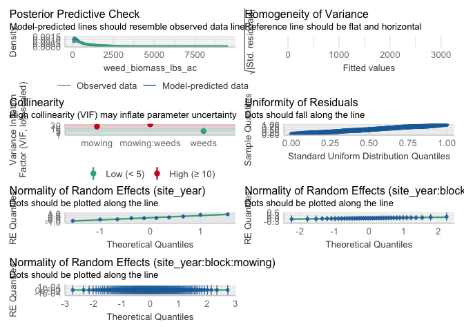
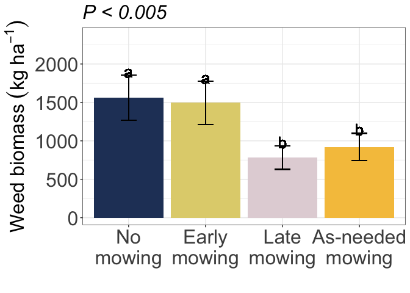
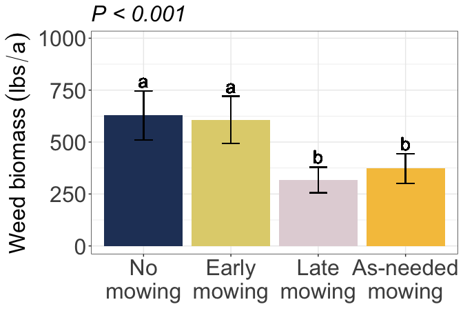

IMT Weed biomass
================

# Load libraries

``` r
#Set work directory
setwd("/Users/ey239/Github/IMT/rmarkdowns")

#Load packages 
library(tidyverse) ##install.packages("tidyverse")
library(knitr)
library(patchwork) ##install.packages("patchwork")
library(skimr)     ##install.packages("skimr")
library(readxl)
library(janitor) ##install.packages("janitor")

library(kableExtra) ##install.packages("kableExtra")
library(webshot) ##install.packages("webshot")
webshot::install_phantomjs()
library(viridis) ##install.packages("viridis")
library(lme4) ##install.packages("lme4")
library(lmerTest) ##install.packages("lmerTest")
library(emmeans) ##install.packages("emmeans")
library(rstatix) ##install.packages("rstatix")
#library(Matrix) ##install.packages("Matrix")
library(multcomp) ##install.packages("multcomp")
library(multcompView) ##install.packages("multcompView")
library(ggResidpanel) ##install.packages("ggResidpanel")
#library(car)
#library(TMB)  ##install.packages("TMB")
library(glmmTMB)  ##install.packages("glmmTMB")
library(DHARMa)  ##install.packages("DHARMa")
library(performance) ##install.packages("performance")
library(WrensBookshelf)##install.packages("WrensBookshelf")
#Load Functions
MeanPlusSe<-function(x) mean(x)+plotrix::std.error(x)

find_logw0=function(x){c=trunc(log(min(x[x>0],na.rm=T)))
d=exp(c)
return(d)}
```

<br>

# Load and clean data

## Load data

``` r
combined_raw <- read_excel("~/Github/IMT/raw-data/combined_raw.xlsx")
kable(head(combined_raw))
```

| id | year | location | site_year | treatment | block | plot | microplot | bean_emergence | bean_biomass | intrarow_weed_biomass | interrow_weed_biomass | weed_biomass | bean_population | bean_yield |
|:---|---:|:---|:---|:---|---:|---:|:---|:---|---:|:---|:---|---:|:---|:---|
| WI_B1_P101 | 2023 | WI | WI_2023 | NWC | 1 | 101 | M | 23 | 233.3 | 0 | 2 | 1.84 | 38 | 295.66000000000003 |
| WI_B1_P101_SW | 2023 | WI | WI_2023 | NWC | 1 | 101 | SW | 24 | 61.7 | 31.66 | 155.9 | 187.56 | 28 | 88.81 |
| WI_B1_P101_WF | 2023 | WI | WI_2023 | NWC | 1 | 101 | WF | 14 | 210.3 | 0 | 0 | 0.00 | 38 | 273.51 |
| WI_B1_P102 | 2023 | WI | WI_2023 | LWC | 1 | 102 | M | 14 | 248.4 | 0 | 0 | 0.00 | 27 | 321.16000000000003 |
| WI_B1_P102_SW | 2023 | WI | WI_2023 | LWC | 1 | 102 | SW | 16 | 65.6 | 28.76 | 50 | 78.76 | 32 | 97.45 |
| WI_B1_P103 | 2023 | WI | WI_2023 | AWC | 1 | 103 | M | 17 | 279.3 | 0 | 0.21 | 0.21 | 34 | 302.72000000000003 |

\##Clean data \##ECOBEAN (includes data from all sites through 2024)

``` r
# Standardize column names and convert variables
clean_combined <- combined_raw |>  
  clean_names() |>  
  rename(mowing = treatment, weeds = microplot) |> 
  mutate(across(c(year, location, site_year, mowing, block, plot, weeds), as.factor))

# Define constants for biomass conversion
sq_m_to_ha <- 10000  # Square meters per hectare
grams_to_kg <- 1000   # Grams per kilogram
kg_to_lbs <- 2.20462  # Kilograms per pound
half_meter_sq_m <- 0.5  # Sample area in square meters

# Filter relevant data and compute adjusted weed biomass
weed_biomass_clean <- clean_combined |>             
  filter(weeds %in% c("SW", "M")) |>  # Keep rows where SW and M are microplots
  mutate(
    weed_biomass_grams_meter = weed_biomass / half_meter_sq_m,
    weed_biomass_kg_ha = (weed_biomass_grams_meter * sq_m_to_ha) / grams_to_kg,
    weed_biomass_lbs_ac = weed_biomass_kg_ha * kg_to_lbs
  )

# Display cleaned dataset
kable(head(weed_biomass_clean))
```

| id | year | location | site_year | mowing | block | plot | weeds | bean_emergence | bean_biomass | intrarow_weed_biomass | interrow_weed_biomass | weed_biomass | bean_population | bean_yield | weed_biomass_grams_meter | weed_biomass_kg_ha | weed_biomass_lbs_ac |
|:---|:---|:---|:---|:---|:---|:---|:---|:---|---:|:---|:---|---:|:---|:---|---:|---:|---:|
| WI_B1_P101 | 2023 | WI | WI_2023 | NWC | 1 | 101 | M | 23 | 233.3 | 0 | 2 | 1.84 | 38 | 295.66000000000003 | 3.68 | 36.8 | 81.130016 |
| WI_B1_P101_SW | 2023 | WI | WI_2023 | NWC | 1 | 101 | SW | 24 | 61.7 | 31.66 | 155.9 | 187.56 | 28 | 88.81 | 375.12 | 3751.2 | 8269.970544 |
| WI_B1_P102 | 2023 | WI | WI_2023 | LWC | 1 | 102 | M | 14 | 248.4 | 0 | 0 | 0.00 | 27 | 321.16000000000003 | 0.00 | 0.0 | 0.000000 |
| WI_B1_P102_SW | 2023 | WI | WI_2023 | LWC | 1 | 102 | SW | 16 | 65.6 | 28.76 | 50 | 78.76 | 32 | 97.45 | 157.52 | 1575.2 | 3472.717424 |
| WI_B1_P103 | 2023 | WI | WI_2023 | AWC | 1 | 103 | M | 17 | 279.3 | 0 | 0.21 | 0.21 | 34 | 302.72000000000003 | 0.42 | 4.2 | 9.259404 |
| WI_B1_P103_SW | 2023 | WI | WI_2023 | AWC | 1 | 103 | SW | 15 | 80.1 | 27.56 | 22.26 | 49.82 | 32 | 118.17 | 99.64 | 996.4 | 2196.683368 |

\##FARMHUB 2024 REPORT (Musgrave and Farmhub only)

``` r
# Standardize column names and convert variables
clean_combined <- combined_raw |>  
  clean_names() |>  
  rename(mowing = treatment, weeds = microplot) |> 
  mutate(across(c(year, location, site_year, mowing, block, plot, weeds), as.factor))

# Define constants for biomass conversion
sq_m_to_ha <- 10000   # Square meters per hectare
grams_to_kg <- 1000    # Grams per kilogram
kg_to_lbs <- 2.20462   # Kilograms per pound
half_meter_sq_m <- 0.5 # Sample area in square meters
ha_to_acre <- 0.892179 # Hectares to acres conversion factor

# Filter relevant data and compute adjusted weed biomass
weed_biomass_clean_fh <- clean_combined |>             
  filter(
    weeds %in% c("SW", "M"),   # Keep rows where SW and M are microplots
    location %in% c("FH", "CU"), # Keep only specific locations
    year %in% c ("2024")
  ) |>  
  mutate(
    weed_biomass_grams_meter_fh = weed_biomass / half_meter_sq_m,
    weed_biomass_kg_ha_fh = (weed_biomass_grams_meter_fh * sq_m_to_ha) / grams_to_kg,
    weed_biomass_lbs_ac_fh = weed_biomass_kg_ha_fh * ha_to_acre
  )

# Display cleaned dataset
kable(head(weed_biomass_clean_fh))
```

| id | year | location | site_year | mowing | block | plot | weeds | bean_emergence | bean_biomass | intrarow_weed_biomass | interrow_weed_biomass | weed_biomass | bean_population | bean_yield | weed_biomass_grams_meter_fh | weed_biomass_kg_ha_fh | weed_biomass_lbs_ac_fh |
|:---|:---|:---|:---|:---|:---|:---|:---|:---|---:|:---|:---|---:|:---|:---|---:|---:|---:|
| FH_B1_P101 | 2024 | FH | FH_2024 | EWC | 1 | 101 | M | 32 | 120.37 | 10.08 | 68.430000000000007 | 78.51 | 18 | 139.85 | 157.02 | 1570.2 | 1400.8995 |
| FH_B1_P101_SW | 2024 | FH | FH_2024 | EWC | 1 | 101 | SW | 29 | 104.44 | 20.56 | 89.6 | 110.16 | na | na | 220.32 | 2203.2 | 1965.6488 |
| FH_B1_P102 | 2024 | FH | FH_2024 | LWC | 1 | 102 | M | 31 | 193.20 | 0 | 10.130000000000001 | 10.13 | 23 | 192.95 | 20.26 | 202.6 | 180.7555 |
| FH_B1_P102_SW | 2024 | FH | FH_2024 | LWC | 1 | 102 | SW | 21 | 75.42 | 5.49 | 58.71 | 64.20 | 24 | 217.43 | 128.40 | 1284.0 | 1145.5578 |
| FH_B1_P103 | 2024 | FH | FH_2024 | AWC | 1 | 103 | M | 20 | 185.88 | 0.05 | 14.08 | 14.13 | 21 | 276.42 | 28.26 | 282.6 | 252.1298 |
| FH_B1_P103_SW | 2024 | FH | FH_2024 | AWC | 1 | 103 | SW | 24 | 85.61 | 41.91 | 38.229999999999997 | 80.14 | 17 | 73.44 | 160.28 | 1602.8 | 1429.9845 |

# Model testing

\##ECOBEAN (includes data from all sites through 2024) \### Glmm

``` r
model_tweedie_log <- glmmTMB(weed_biomass_lbs_ac ~ mowing*weeds  
                    + (1|site_year) 
                    + (1|site_year:block)
                    + (1|site_year:block:mowing),  
  data = weed_biomass_clean, 
  family = tweedie(link = "log")

)

###It assumes that mowing effects may vary by block, in addition to site-year and block-level variation.
#This would be useful if you suspect that mowing impacts weed biomass differently in different blocks.
#The model accounts for hierarchical structure down to the mowing level within blocks.

### Two checks specifically for a generalize linear approach
simulateResiduals(model_tweedie_log,plot = TRUE) # Residuals and normality look good
```

<!-- -->

    ## Object of Class DHARMa with simulated residuals based on 250 simulations with refit = FALSE . See ?DHARMa::simulateResiduals for help. 
    ##  
    ## Scaled residual values: 0.156 0.904 0.05048307 0.832 0.12 0.64 0.076 0.716 0.03671421 0.592 0.224 0.664 0.07983672 0.836 0.03441097 0.536 0.244 0.332 0.07823883 0.224 ...

``` r
check_model(model_tweedie_log) #Perfect, preditions match real data
```

    ## `check_outliers()` does not yet support models of class `glmmTMB`.

<!-- -->

``` r
summary(model_tweedie_log )
```

    ##  Family: tweedie  ( log )
    ## Formula:          
    ## weed_biomass_lbs_ac ~ mowing * weeds + (1 | site_year) + (1 |  
    ##     site_year:block) + (1 | site_year:block:mowing)
    ## Data: weed_biomass_clean
    ## 
    ##      AIC      BIC   logLik deviance df.resid 
    ##   5064.9   5113.9  -2519.4   5038.9      307 
    ## 
    ## Random effects:
    ## 
    ## Conditional model:
    ##  Groups                 Name        Variance  Std.Dev. 
    ##  site_year              (Intercept) 2.621e-01 5.119e-01
    ##  site_year:block        (Intercept) 1.709e-02 1.307e-01
    ##  site_year:block:mowing (Intercept) 7.577e-09 8.704e-05
    ## Number of obs: 320, groups:  
    ## site_year, 10; site_year:block, 40; site_year:block:mowing, 160
    ## 
    ## Dispersion parameter for tweedie family (): 13.2 
    ## 
    ## Conditional model:
    ##                   Estimate Std. Error z value Pr(>|z|)    
    ## (Intercept)        6.22360    0.23147  26.887  < 2e-16 ***
    ## mowingEWC          0.47221    0.21934   2.153   0.0313 *  
    ## mowingLWC         -0.21338    0.23379  -0.913   0.3614    
    ## mowingNWC          0.41594    0.22166   1.876   0.0606 .  
    ## weedsSW            1.20082    0.20675   5.808 6.32e-09 ***
    ## mowingEWC:weedsSW  0.02726    0.27794   0.098   0.9219    
    ## mowingLWC:weedsSW  0.10251    0.29527   0.347   0.7285    
    ## mowingNWC:weedsSW  0.22576    0.27811   0.812   0.4169    
    ## ---
    ## Signif. codes:  0 '***' 0.001 '**' 0.01 '*' 0.05 '.' 0.1 ' ' 1

``` r
VarCorr(model_tweedie_log )
```

    ## 
    ## Conditional model:
    ##  Groups                 Name        Std.Dev.  
    ##  site_year              (Intercept) 5.1192e-01
    ##  site_year:block        (Intercept) 1.3071e-01
    ##  site_year:block:mowing (Intercept) 8.7044e-05

### Joint test (anova)

``` r
model_tweedie_log |> 
  joint_tests() |> 
  kable()  
```

|     | model term   | df1 | df2 | F.ratio |   Chisq |   p.value |
|:----|:-------------|----:|----:|--------:|--------:|----------:|
| 1   | mowing       |   3 | Inf |  11.983 |  35.949 | 0.0000001 |
| 3   | weeds        |   1 | Inf | 156.425 | 156.425 | 0.0000000 |
| 2   | mowing:weeds |   3 | Inf |   0.279 |   0.837 | 0.8404509 |

### Anova table

``` r
options(contrasts = c("contr.sum", "contr.poly"))
Anova(model_tweedie_log, type = 3)
```

    ## Analysis of Deviance Table (Type III Wald chisquare tests)
    ## 
    ## Response: weed_biomass_lbs_ac
    ##                 Chisq Df Pr(>Chisq)    
    ## (Intercept)  722.9305  1  < 2.2e-16 ***
    ## mowing        12.9105  3   0.004834 ** 
    ## weeds         33.7340  1  6.319e-09 ***
    ## mowing:weeds   0.8376  3   0.840451    
    ## ---
    ## Signif. codes:  0 '***' 0.001 '**' 0.01 '*' 0.05 '.' 0.1 ' ' 1

### Fisher compact letter display

#### Weed control (Significant)

``` r
cld_mowing_fisher <-cld(emmeans(model_tweedie_log, ~  mowing, type = "response"), Letters = letters,adjust = "none", sort = TRUE, reversed=TRUE)
```

    ## NOTE: Results may be misleading due to involvement in interactions

``` r
cld_mowing_fisher
```

    ##  mowing response  SE  df asymp.LCL asymp.UCL .group
    ##  NWC        1561 295 Inf      1077      2260  a    
    ##  EWC        1495 282 Inf      1033      2163  a    
    ##  AWC         920 178 Inf       629      1344   b   
    ##  LWC         782 153 Inf       533      1148   b   
    ## 
    ## Results are averaged over the levels of: weeds 
    ## Confidence level used: 0.95 
    ## Intervals are back-transformed from the log scale 
    ## Tests are performed on the log scale 
    ## significance level used: alpha = 0.05 
    ## NOTE: If two or more means share the same grouping symbol,
    ##       then we cannot show them to be different.
    ##       But we also did not show them to be the same.

#### Weed level (Significant)

``` r
cld_weeds_fisher <-cld(emmeans(model_tweedie_log, ~  weeds, type = "response"), Letters = letters,adjust = "none", sort = TRUE, reversed=TRUE)
```

    ## NOTE: Results may be misleading due to involvement in interactions

``` r
cld_weeds_fisher
```

    ##  weeds response  SE  df asymp.LCL asymp.UCL .group
    ##  SW        2169 378 Inf      1541      3053  a    
    ##  M          597 110 Inf       417       856   b   
    ## 
    ## Results are averaged over the levels of: mowing 
    ## Confidence level used: 0.95 
    ## Intervals are back-transformed from the log scale 
    ## Tests are performed on the log scale 
    ## significance level used: alpha = 0.05 
    ## NOTE: If two or more means share the same grouping symbol,
    ##       then we cannot show them to be different.
    ##       But we also did not show them to be the same.

\##FARMHUB 2024 REPORT (Musgrave and Farmhub only) \### Glmm

``` r
model_tweedie_log_fh <- glmmTMB(weed_biomass_lbs_ac_fh ~ mowing*weeds*location  + (1|location:block)+ (1|location:block:mowing), 
  data = weed_biomass_clean_fh, 
  family = tweedie(link = "log")


)
```

    ## Warning in finalizeTMB(TMBStruc, obj, fit, h, data.tmb.old): Model convergence
    ## problem; non-positive-definite Hessian matrix. See vignette('troubleshooting')

``` r
###It assumes that mowing effects may vary by block, in addition to site-year and block-level variation.
#This would be useful if you suspect that mowing impacts weed biomass differently in different blocks.
#The model accounts for hierarchical structure down to the mowing level within blocks.

### Two checks specifically for a generalize linear approach
simulateResiduals(model_tweedie_log_fh,plot = TRUE) # Residuals and normality look good
```

<!-- -->

    ## Object of Class DHARMa with simulated residuals based on 250 simulations with refit = FALSE . See ?DHARMa::simulateResiduals for help. 
    ##  
    ## Scaled residual values: 0.512 0.572 0.112 0.736 0.968 0.844 0.876 0.444 0.22 0.5 0.084 0.892 0.968 0.568 0.288 0.62 0.876 0.196 0.208 0.404 ...

``` r
check_model(model_tweedie_log_fh) #Perfect, preditions match real data
```

    ## `check_outliers()` does not yet support models of class `glmmTMB`.

<!-- -->

``` r
summary(model_tweedie_log_fh )
```

    ##  Family: tweedie  ( log )
    ## Formula:          
    ## weed_biomass_lbs_ac_fh ~ mowing * weeds * location + (1 | location:block) +  
    ##     (1 | location:block:mowing)
    ## Data: weed_biomass_clean_fh
    ## 
    ##      AIC      BIC   logLik deviance df.resid 
    ##       NA       NA       NA       NA       44 
    ## 
    ## Random effects:
    ## 
    ## Conditional model:
    ##  Groups                Name        Variance  Std.Dev. 
    ##  location:block        (Intercept) 4.483e-13 6.696e-07
    ##  location:block:mowing (Intercept) 1.889e-09 4.346e-05
    ## Number of obs: 64, groups:  location:block, 8; location:block:mowing, 32
    ## 
    ## Dispersion parameter for tweedie family (): 6.53 
    ## 
    ## Conditional model:
    ##                          Estimate Std. Error z value Pr(>|z|)    
    ## (Intercept)               6.18982    0.06900   89.70  < 2e-16 ***
    ## mowing1                  -0.65975    0.12989   -5.08 3.79e-07 ***
    ## mowing2                   0.25447    0.11682    2.18 0.029385 *  
    ## mowing3                  -0.07077    0.11540   -0.61 0.539701    
    ## weeds1                   -0.67192    0.06900   -9.74  < 2e-16 ***
    ## location1                -0.66498    0.06900   -9.64  < 2e-16 ***
    ## mowing1:weeds1           -0.07425    0.12989   -0.57 0.567542    
    ## mowing2:weeds1           -0.01298    0.11682   -0.11 0.911519    
    ## mowing3:weeds1            0.10208    0.11540    0.88 0.376391    
    ## mowing1:location1         0.45240    0.12989    3.48 0.000496 ***
    ## mowing2:location1        -0.31664    0.11682   -2.71 0.006718 ** 
    ## mowing3:location1         0.35709    0.11540    3.09 0.001972 ** 
    ## weeds1:location1         -0.20287    0.06900   -2.94 0.003282 ** 
    ## mowing1:weeds1:location1  0.63874    0.12989    4.92 8.76e-07 ***
    ## mowing2:weeds1:location1 -0.31135    0.11682   -2.67 0.007694 ** 
    ## mowing3:weeds1:location1  0.08230    0.11540    0.71 0.475729    
    ## ---
    ## Signif. codes:  0 '***' 0.001 '**' 0.01 '*' 0.05 '.' 0.1 ' ' 1

``` r
VarCorr(model_tweedie_log_fh )
```

    ## 
    ## Conditional model:
    ##  Groups                Name        Std.Dev.  
    ##  location:block        (Intercept) 6.6955e-07
    ##  location:block:mowing (Intercept) 4.3457e-05

### Joint test (anova)

``` r
model_tweedie_log_fh |> 
  joint_tests() |> 
  kable()  
```

|     | model term            | df1 | df2 | F.ratio |  Chisq |   p.value |
|:----|:----------------------|----:|----:|--------:|-------:|----------:|
| 1   | mowing                |   3 | Inf |  11.543 | 34.629 | 0.0000001 |
| 5   | weeds                 |   1 | Inf |  94.817 | 94.817 | 0.0000000 |
| 7   | location              |   1 | Inf |  92.869 | 92.869 | 0.0000000 |
| 2   | mowing:weeds          |   3 | Inf |   0.284 |  0.852 | 0.8372043 |
| 4   | mowing:location       |   3 | Inf |  11.842 | 35.526 | 0.0000001 |
| 6   | weeds:location        |   1 | Inf |   8.644 |  8.644 | 0.0032822 |
| 3   | mowing:weeds:location |   3 | Inf |  10.675 | 32.025 | 0.0000005 |

### Anova table

``` r
options(contrasts = c("contr.sum", "contr.poly"))
Anova(model_tweedie_log_fh, type = 3)
```

    ## Analysis of Deviance Table (Type III Wald chisquare tests)
    ## 
    ## Response: weed_biomass_lbs_ac_fh
    ##                           Chisq Df Pr(>Chisq)    
    ## (Intercept)           8046.5639  1  < 2.2e-16 ***
    ## mowing                  34.6300  3  1.458e-07 ***
    ## weeds                   94.8169  1  < 2.2e-16 ***
    ## location                92.8692  1  < 2.2e-16 ***
    ## mowing:weeds             0.8511  3   0.837204    
    ## mowing:location         35.5268  3  9.428e-08 ***
    ## weeds:location           8.6436  1   0.003282 ** 
    ## mowing:weeds:location   32.0256  3  5.169e-07 ***
    ## ---
    ## Signif. codes:  0 '***' 0.001 '**' 0.01 '*' 0.05 '.' 0.1 ' ' 1

### Fisher compact letter display

weeds\|location\|mowing (Significant)

``` r
cld_mowing_weeds_location_fisher_fh <-cld(emmeans(model_tweedie_log_fh, ~  mowing|weeds|location, type = "response"), Letters = letters,adjust = "none", sort = TRUE, reversed=TRUE)
cld_mowing_weeds_location_fisher_fh
```

    ## weeds = M, location = CU:
    ##  mowing response    SE  df asymp.LCL asymp.UCL .group
    ##  LWC       167.5  55.3 Inf      87.7       320  a    
    ##  AWC       149.5  50.8 Inf      76.7       291  a    
    ##  EWC        71.1  29.4 Inf      31.6       160  a    
    ##  NWC        67.3  28.3 Inf      29.5       153  a    
    ## 
    ## weeds = SW, location = CU:
    ##  mowing response    SE  df asymp.LCL asymp.UCL .group
    ##  NWC       904.5 191.0 Inf     597.7      1369  a    
    ##  EWC       782.0 172.0 Inf     508.4      1203  a    
    ##  LWC       666.2 153.0 Inf     425.2      1044  a    
    ##  AWC       278.0  80.3 Inf     157.9       490   b   
    ## 
    ## weeds = M, location = FH:
    ##  mowing response    SE  df asymp.LCL asymp.UCL .group
    ##  NWC      2320.5 382.0 Inf    1680.1      3205  a    
    ##  EWC      1415.5 266.0 Inf     979.7      2045   b   
    ##  LWC       394.5 104.0 Inf     235.5       661    c  
    ##  AWC        95.6  36.6 Inf      45.2       203     d 
    ## 
    ## weeds = SW, location = FH:
    ##  mowing response    SE  df asymp.LCL asymp.UCL .group
    ##  NWC      2691.7 426.0 Inf    1973.3      3672  a    
    ##  EWC      1991.4 342.0 Inf    1422.8      2787  a    
    ##  AWC      1017.1 208.0 Inf     680.7      1520   b   
    ##  LWC       969.0 201.0 Inf     645.1      1455   b   
    ## 
    ## Confidence level used: 0.95 
    ## Intervals are back-transformed from the log scale 
    ## Tests are performed on the log scale 
    ## significance level used: alpha = 0.05 
    ## NOTE: If two or more means share the same grouping symbol,
    ##       then we cannot show them to be different.
    ##       But we also did not show them to be the same.

\#Figures \##ECOBEAN \### Mowing (Significant)

``` r
weed_biomass_clean |> 
  left_join(cld_mowing_fisher) |> 
  ggplot(aes(x = factor(mowing, levels = c("NWC", "EWC", "LWC", "AWC")), y = response, fill = mowing)) +
  #stat_summary(geom = "bar", fun = "mean", width = 0.7) +
  #stat_summary(geom = "errorbar", fun.data = "mean_se", width = 0.2) +
  #stat_summary(geom="text", fun = "MeanPlusSe", aes(label= trimws(.group)),size=6.5,vjust=-0.5) +
  geom_bar(stat="identity", position=position_dodge()) + 
  geom_errorbar(aes(ymin=response-SE, ymax=response+SE), width=.2,
                 position=position_dodge(.9))+
geom_text(aes(label = trimws(.group), y = response + (SE + 50)), size = 7) +
  labs(
    x = "",
     y = expression("Weed biomass" ~ (kg ~ ha^{-1})),
    #title = str_c("Influence of interrow weed control on weed biomass"),
    subtitle = expression(italic("P < 0.005"))) +
  
  scale_x_discrete(labels = c("No\nmowing", "Early\nmowing", "Late\nmowing", "As-needed\nmowing")) +
  scale_y_continuous(expand = expansion(mult = c(0.05, 0.3))) +
  scale_fill_WB_d(name = "BlueberriesForSal", direction = 1) +
   theme_bw() +
  theme(
    legend.position = "none",
    strip.background = element_blank(),
    strip.text = element_text(face = "bold", size = 12),
    axis.title = element_text(size = 24),  # Increase font size of axis titles
    axis.text = element_text(size = 24),   # Increase font size of axis labels
    plot.title = element_text(size = 24, face = "bold"),  # Increase font size of title
    plot.subtitle = element_text(size = 24, face = "italic")  # Increase font size of subtitle
  )
```

<!-- -->

``` r
ggsave("weed_biomass_mowing_kg_ha_eco.png", width = 10, height = 8, dpi = 300)
```

``` r
emmeans_summary <- summary(emmeans(model_tweedie_log, ~ mowing, type = "response"))
```

    ## NOTE: Results may be misleading due to involvement in interactions

\`

### Weed level of weed biomass (significant)

``` r
weed_biomass_clean |> 
  left_join(cld_weeds_fisher) |> 
  ggplot(aes(x = weeds, y = response, fill = weeds)) +  # Fill added
  #stat_summary(geom = "bar", fun = "mean", width = 0.6, position = position_dodge(width = 0.7)) +
  #stat_summary(geom = "errorbar", fun.data = "mean_se", width = 0.2, position = position_dodge(width = 0.7)) +
  #stat_summary(geom = "text", fun = "MeanPlusSe", aes(label = trimws(.group)), 
               #size = 6.5, vjust = -0.5, position = position_dodge(width = 0.7)) +
  geom_bar(stat="identity", position=position_dodge()) + 
  geom_errorbar(aes(ymin=response-SE, ymax=response+SE), width=.2,
                 position=position_dodge(.9))+
geom_text(aes(label = trimws(.group), y = response + (SE + 65)), size = 7) +
  labs(
    x = "",
    y = expression("Weed biomass" ~ (kg~ha^{-1})),
  subtitle = expression(italic("P < 0.005"))
  ) +
  scale_x_discrete(labels = c("Ambient weeds", "Surrogate + ambient weeds")) +
  scale_y_continuous(expand = expansion(mult = c(0.05, 0.3))) +
  scale_fill_WB_d(name = "BlueberriesForSal", direction = 1) +  # Ensure correct function use
  theme_bw() +
  theme(
    legend.position = "none",
    strip.background = element_blank(),
    strip.text = element_text(face = "bold", size = 20),
    axis.title = element_text(size = 24),
    axis.text = element_text(size = 20),
    plot.title = element_text(size = 24, face = "bold"),
    plot.subtitle = element_text(size = 24, face = "italic")
  )
```

<!-- -->

``` r
ggsave("weed_biomass_weeds_kg_ha_eco.png", width = 10, height = 8, dpi = 300)
```

\#Figures \##FARMHUB REPORT (2024 Musgrave and Farmhub) \### Mowing
(Significant)

## Weed level on weed biomass (significant)

### mowing\|weeds\|location (Significant)

``` r
weed_biomass_clean_fh |> 
  left_join(cld_mowing_weeds_location_fisher_fh) |> 
  mutate(response = as.numeric(response)) |>  # Convert response to numeric
  ggplot(aes(x = factor(mowing, levels = c("NWC", "EWC", "LWC", "AWC")), y = response, fill = mowing)) +
   facet_grid(weeds ~ location, labeller = labeller(
    location = c("CU" = "Cornell Musgrave Research Farm", "FH" = "Hudson Valley Farm Hub"),
    weeds = c("M" = "Ambient Weeds", "SW" = "Surrogate +\ ambient weeds")
  )) +
  #stat_summary(geom = "bar", fun = "mean", width = 0.7) +
  #tat_summary(geom = "errorbar", fun.data = "mean_se", width = 0.2) +
  #stat_summary(geom="text", fun = "MeanPlusSe", aes(label= trimws(.group)),size=6.5,vjust=-0.5) +
  geom_bar(stat="identity", position=position_dodge()) + 
  geom_errorbar(aes(ymin=response-SE, ymax=response+SE), width=.2,
                 position=position_dodge(.9))+
geom_text(aes(label = trimws(.group), y = response + (SE + 160)), size = 7) +
  labs(
    x = "",
     y = expression("Weed biomass (lbs/a)")) +
    #title = str_c("Influence of interrow weed control on weed biomass"),
    
  
  scale_x_discrete(labels = c("No\nmowing", "Early\nmowing", "Late\nmowing", "As-needed\nmowing")) +
  scale_y_continuous(expand = expansion(mult = c(0.05, 0.3))) +
  scale_fill_WB_d(name = "BlueberriesForSal", direction = 1) +
   theme_bw() +
  theme(
    legend.position = "none",
    strip.background = element_blank(),
    strip.text = element_text(face = "bold", size = 20),
    axis.title = element_text(size = 24),  # Increase font size of axis titles
    axis.text = element_text(size = 24),   # Increase font size of axis labels
    plot.title = element_text(size = 24, face = "bold"),  # Increase font size of title
    plot.subtitle = element_text(size = 24, face = "italic")  # Increase font size of subtitle
  )
```

<!-- -->

``` r
ggsave("weed_biomass_mowing_weeds_location_lbac_fh.png", width = 13, height = 10, dpi = 300)
```
