IMT Weed seed production
================

<br>

``` r
#Set work directory
setwd("/Users/ey239/Github/IMT/rmarkdowns")

#Load packages 
library(tidyverse) ##install.packages("tidyverse")
library(knitr)
library(patchwork) ##install.packages("patchwork")
library(skimr)     ##install.packages("skimr")
library(readxl)
library(janitor) ##install.packages("janitor")

library(kableExtra) ##install.packages("kableExtra")
library(webshot) ##install.packages("webshot")
webshot::install_phantomjs()
library(viridis) ##install.packages("viridis")
library(lme4) ##install.packages("lme4")
library(lmerTest) ##install.packages("lmerTest")
library(emmeans) ##install.packages("emmeans")
library(rstatix) ##install.packages("rstatix")
#library(Matrix) ##install.packages("Matrix")
library(multcomp) ##install.packages("multcomp")
library(multcompView) ##install.packages("multcompView")
library(ggResidpanel) ##install.packages("ggResidpanel")
#library(car)
#library(TMB)  ##install.packages("TMB")
library(glmmTMB)  ##install.packages("glmmTMB")
library(DHARMa)  ##install.packages("DHARMa")
library(performance) ##install.packages("performance")
library(WrensBookshelf)##install.packages("WrensBookshelf")
#Load Functions
MeanPlusSe<-function(x) mean(x)+plotrix::std.error(x)

find_logw0=function(x){c=trunc(log(min(x[x>0],na.rm=T)))
d=exp(c)
return(d)}
```

<br>

# Load and clean data

## Load data

``` r
combined_weed_seeds <- read_excel("~/Github/IMT/raw-data/combined_weed_seeds.xlsx")
kable(head(combined_weed_seeds))
```

| sample_id | year | location | site_year | treatment | block | plot | week | data | seed_number |
|:---|---:|:---|:---|:---|---:|---:|---:|:---|---:|
| VT_B1_P101_A | 2023 | VT | VT_2023 | LWC | 1 | 101 | 1 | 2023-09-13 | 2 |
| VT_B1_P101_B | 2023 | VT | VT_2023 | LWC | 1 | 101 | 1 | 2023-09-13 | 2 |
| VT_B1_P101_C | 2023 | VT | VT_2023 | LWC | 1 | 101 | 1 | 2023-09-13 | 7 |
| VT_B1_P102_A | 2023 | VT | VT_2023 | NWC | 1 | 102 | 1 | 2023-09-13 | 4 |
| VT_B1_P102_B | 2023 | VT | VT_2023 | NWC | 1 | 102 | 1 | 2023-09-13 | 1 |
| VT_B1_P102_C | 2023 | VT | VT_2023 | NWC | 1 | 102 | 1 | 2023-09-13 | 0 |

\##Clean data \##ECOBEAN

``` r
#Standardaze column names, convert to factors, check for outliers of variable**
clean_combined <- clean_names(combined_weed_seeds) |>  
  rename ('mowing'= treatment) |> 
  mutate(across(c(year, location, site_year, mowing, block, plot ), as.factor)) 
#select and convert data for wbm analysis
weed_seeds_clean <-clean_combined |>             
  mutate(seed_number_meter = round(seed_number *(1/0.0078))) 
  
kable(head(weed_seeds_clean)) 
```

| sample_id | year | location | site_year | mowing | block | plot | week | data | seed_number | seed_number_meter |
|:---|:---|:---|:---|:---|:---|:---|---:|:---|---:|---:|
| VT_B1_P101_A | 2023 | VT | VT_2023 | LWC | 1 | 101 | 1 | 2023-09-13 | 2 | 256 |
| VT_B1_P101_B | 2023 | VT | VT_2023 | LWC | 1 | 101 | 1 | 2023-09-13 | 2 | 256 |
| VT_B1_P101_C | 2023 | VT | VT_2023 | LWC | 1 | 101 | 1 | 2023-09-13 | 7 | 897 |
| VT_B1_P102_A | 2023 | VT | VT_2023 | NWC | 1 | 102 | 1 | 2023-09-13 | 4 | 513 |
| VT_B1_P102_B | 2023 | VT | VT_2023 | NWC | 1 | 102 | 1 | 2023-09-13 | 1 | 128 |
| VT_B1_P102_C | 2023 | VT | VT_2023 | NWC | 1 | 102 | 1 | 2023-09-13 | 0 | 0 |

\##FARMHUB REPORT

``` r
#Standardaze column names, convert to factors, check for outliers of variable**
clean_combined_fh <- clean_names(combined_weed_seeds) |>  
  rename ('mowing'= treatment) |> 
  filter(location %in% c("FH", "CU")) |>
  mutate(across(c(year, location, site_year, mowing, block, plot ), as.factor)) 
#select and convert data for wbm analysis
weed_seeds_clean_fh <-clean_combined_fh |>             
  mutate(seed_number_meter = round(seed_number *(1/0.0078))) 
  
kable(head(weed_seeds_clean_fh)) 
```

| sample_id | year | location | site_year | mowing | block | plot | week | data | seed_number | seed_number_meter |
|:---|:---|:---|:---|:---|:---|:---|---:|:---|---:|---:|
| CU_B1_P101_A | 2023 | CU | CU_2023 | EWC | 1 | 101 | 1 | 2023-09-12 | 0 | 0 |
| CU_B1_P101_B | 2023 | CU | CU_2023 | EWC | 1 | 101 | 1 | 2023-09-12 | 1 | 128 |
| CU_B1_P101_C | 2023 | CU | CU_2023 | EWC | 1 | 101 | 1 | 2023-09-12 | 5 | 641 |
| CU_B1_P102_A | 2023 | CU | CU_2023 | LWC | 1 | 102 | 1 | 2023-09-12 | 1 | 128 |
| CU_B1_P102_B | 2023 | CU | CU_2023 | LWC | 1 | 102 | 1 | 2023-09-12 | 0 | 0 |
| CU_B1_P102_C | 2023 | CU | CU_2023 | LWC | 1 | 102 | 1 | 2023-09-12 | 0 | 0 |

# Model testing

\##ECOBEAN \### Glmm Poisson

``` r
model_poisson <- glmmTMB(seed_number_meter ~ mowing  + (1|site_year:block),  
                         data = weed_seeds_clean, 
                         family = poisson(link = "log"))

###It assumes that mowing effects may vary by block, in addition to site-year and block-level variation.
#This would be useful if you suspect that mowing impacts weed biomass differently in different blocks.
#The model accounts for hierarchical structure down to the mowing level within blocks.

### Two checks specifically for a generalize linear approach
simulateResiduals(model_poisson ,plot = TRUE) 
```

    ## DHARMa:testOutliers with type = binomial may have inflated Type I error rates for integer-valued distributions. To get a more exact result, it is recommended to re-run testOutliers with type = 'bootstrap'. See ?testOutliers for details

<!-- -->

    ## Object of Class DHARMa with simulated residuals based on 250 simulations with refit = FALSE . See ?DHARMa::simulateResiduals for help. 
    ##  
    ## Scaled residual values: 0.5272139 0.528 0.836 0.468 0.148 0 0.388 0 0.896 0.64 0.604 0.132 0 0 0 0.376 0.264 0.676 0.452 0 ...

``` r
testDispersion(model_poisson )
```

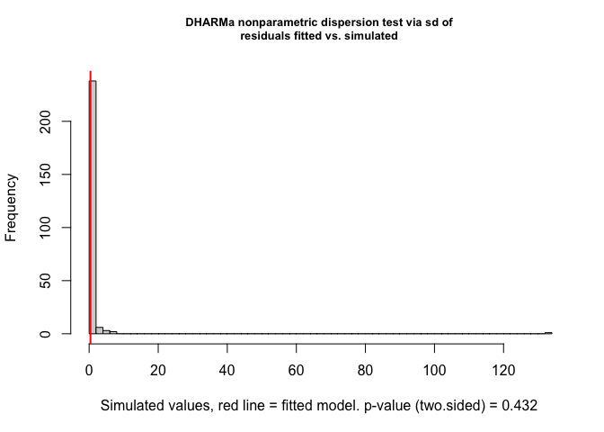<!-- -->

    ## 
    ##  DHARMa nonparametric dispersion test via sd of residuals fitted vs.
    ##  simulated
    ## 
    ## data:  simulationOutput
    ## dispersion = 0.92846, p-value = 0.344
    ## alternative hypothesis: two.sided

``` r
check_model(model_poisson ) #Perfect, preditions match real data
```

    ## `check_outliers()` does not yet support models of class `glmmTMB`.

<!-- -->

``` r
summary(model_poisson )
```

    ##  Family: poisson  ( log )
    ## Formula:          seed_number_meter ~ mowing + (1 | site_year:block)
    ## Data: weed_seeds_clean
    ## 
    ##       AIC       BIC    logLik  deviance  df.resid 
    ## 1451353.0 1451375.9 -725671.5 1451343.0       715 
    ## 
    ## Random effects:
    ## 
    ## Conditional model:
    ##  Groups          Name        Variance Std.Dev.
    ##  site_year:block (Intercept) 1.928    1.389   
    ## Number of obs: 720, groups:  site_year:block, 12
    ## 
    ## Conditional model:
    ##              Estimate Std. Error z value Pr(>|z|)    
    ## (Intercept)  6.558240   0.400853   16.36   <2e-16 ***
    ## mowingEWC   -0.117486   0.002566  -45.79   <2e-16 ***
    ## mowingLWC   -0.960814   0.003347 -287.11   <2e-16 ***
    ## mowingNWC   -0.122875   0.002570  -47.82   <2e-16 ***
    ## ---
    ## Signif. codes:  0 '***' 0.001 '**' 0.01 '*' 0.05 '.' 0.1 ' ' 1

``` r
VarCorr(model_poisson )
```

    ## 
    ## Conditional model:
    ##  Groups          Name        Std.Dev.
    ##  site_year:block (Intercept) 1.3886

``` r
outlier_test <- testOutliers(model_poisson, type = "bootstrap")
```

<!-- -->
\###Glmm negative binomial

``` r
model_nbinom <- glmmTMB(seed_number_meter ~ mowing + (1|site_year:block),  
                        data = weed_seeds_clean, 
                        family = nbinom2(link = "log"))

### Two checks specifically for a generalize linear approach
simulateResiduals(model_nbinom ,plot = TRUE) 
```

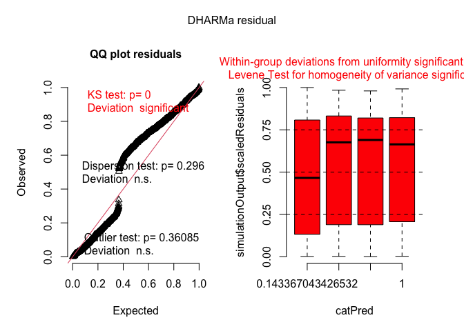<!-- -->

    ## Object of Class DHARMa with simulated residuals based on 250 simulations with refit = FALSE . See ?DHARMa::simulateResiduals for help. 
    ##  
    ## Scaled residual values: 0.788 0.772 0.924 0.78 0.62 0.06188157 0.708 0.01279765 0.892 0.76 0.792 0.652 0.1443288 0.2843129 0.1736346 0.716 0.692 0.836 0.744 0.0964957 ...

``` r
testDispersion(model_nbinom )
```

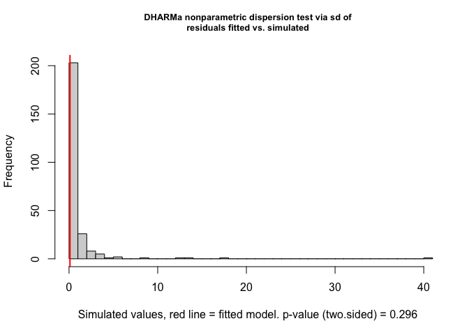<!-- -->

    ## 
    ##  DHARMa nonparametric dispersion test via sd of residuals fitted vs.
    ##  simulated
    ## 
    ## data:  simulationOutput
    ## dispersion = 0.11301, p-value = 0.512
    ## alternative hypothesis: two.sided

``` r
check_model(model_nbinom ) #Perfect, preditions match real data
```

    ## `check_outliers()` does not yet support models of class `glmmTMB`.

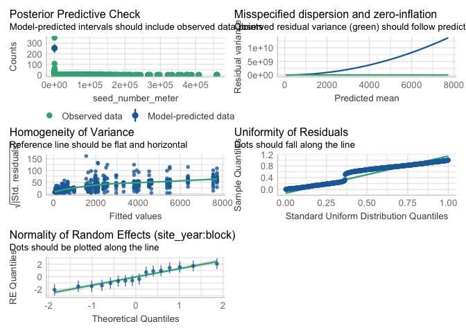<!-- -->

``` r
summary(model_nbinom )
```

    ##  Family: nbinom2  ( log )
    ## Formula:          seed_number_meter ~ mowing + (1 | site_year:block)
    ## Data: weed_seeds_clean
    ## 
    ##      AIC      BIC   logLik deviance df.resid 
    ##   8422.9   8450.4  -4205.4   8410.9      714 
    ## 
    ## Random effects:
    ## 
    ## Conditional model:
    ##  Groups          Name        Variance Std.Dev.
    ##  site_year:block (Intercept) 1.744    1.321   
    ## Number of obs: 720, groups:  site_year:block, 12
    ## 
    ## Dispersion parameter for nbinom2 family (): 0.145 
    ## 
    ## Conditional model:
    ##              Estimate Std. Error z value Pr(>|z|)    
    ## (Intercept)  6.555713   0.433101  15.137  < 2e-16 ***
    ## mowingEWC    0.030506   0.293332   0.104 0.917170    
    ## mowingLWC   -1.018357   0.295744  -3.443 0.000574 ***
    ## mowingNWC   -0.002824   0.287029  -0.010 0.992151    
    ## ---
    ## Signif. codes:  0 '***' 0.001 '**' 0.01 '*' 0.05 '.' 0.1 ' ' 1

``` r
VarCorr(model_nbinom )
```

    ## 
    ## Conditional model:
    ##  Groups          Name        Std.Dev.
    ##  site_year:block (Intercept) 1.3208

``` r
outlier_test <- testOutliers(model_nbinom, type = "bootstrap")
```

<!-- -->
\###Glmm Zero-inflated Poisson (mowing)

``` r
model_zip <- glmmTMB(seed_number_meter ~ mowing + (1|site_year:block),  
                     data = weed_seeds_clean, 
                     family = poisson(link = "log"), 
                     zi = ~ mowing)  # Zero inflation part modeled by 'mowing'

### Two checks specifically for a generalize linear approach
simulateResiduals(model_zip ,plot = TRUE) 
```

    ## DHARMa:testOutliers with type = binomial may have inflated Type I error rates for integer-valued distributions. To get a more exact result, it is recommended to re-run testOutliers with type = 'bootstrap'. See ?testOutliers for details

<!-- -->

    ## Object of Class DHARMa with simulated residuals based on 250 simulations with refit = FALSE . See ?DHARMa::simulateResiduals for help. 
    ##  
    ## Scaled residual values: 0.724 0.68 0.868 0.54 0.396 0.2681441 0.484 0.1098455 0.904 0.612 0.6265884 0.372 0.3408367 0.1515055 0.08689015 0.504 0.368 0.752 0.588 0.2755373 ...

``` r
testDispersion(model_zip )
```

<!-- -->

    ## 
    ##  DHARMa nonparametric dispersion test via sd of residuals fitted vs.
    ##  simulated
    ## 
    ## data:  simulationOutput
    ## dispersion = 3.0672, p-value = 0.112
    ## alternative hypothesis: two.sided

``` r
check_model(model_zip) #Perfect, preditions match real data
```

    ## `check_outliers()` does not yet support models of class `glmmTMB`.

<!-- -->

``` r
summary(model_zip)
```

    ##  Family: poisson  ( log )
    ## Formula:          seed_number_meter ~ mowing + (1 | site_year:block)
    ## Zero inflation:                     ~mowing
    ## Data: weed_seeds_clean
    ## 
    ##       AIC       BIC    logLik  deviance  df.resid 
    ## 1123048.7 1123089.9 -561515.4 1123030.7       711 
    ## 
    ## Random effects:
    ## 
    ## Conditional model:
    ##  Groups          Name        Variance Std.Dev.
    ##  site_year:block (Intercept) 1.114    1.056   
    ## Number of obs: 720, groups:  site_year:block, 12
    ## 
    ## Conditional model:
    ##              Estimate Std. Error z value Pr(>|z|)    
    ## (Intercept)  7.041769   0.304709   23.11   <2e-16 ***
    ## mowingEWC   -0.040945   0.002576  -15.89   <2e-16 ***
    ## mowingLWC   -0.704632   0.003357 -209.91   <2e-16 ***
    ## mowingNWC   -0.073988   0.002576  -28.73   <2e-16 ***
    ## ---
    ## Signif. codes:  0 '***' 0.001 '**' 0.01 '*' 0.05 '.' 0.1 ' ' 1
    ## 
    ## Zero-inflation model:
    ##             Estimate Std. Error z value Pr(>|z|)    
    ## (Intercept) -0.61909    0.15627  -3.962 7.44e-05 ***
    ## mowingEWC    0.16717    0.21862   0.765 0.444478    
    ## mowingLWC    0.81973    0.21649   3.787 0.000153 ***
    ## mowingNWC   -0.02447    0.22141  -0.111 0.911993    
    ## ---
    ## Signif. codes:  0 '***' 0.001 '**' 0.01 '*' 0.05 '.' 0.1 ' ' 1

``` r
VarCorr(model_zip )
```

    ## 
    ## Conditional model:
    ##  Groups          Name        Std.Dev.
    ##  site_year:block (Intercept) 1.0555

``` r
outlier_test <- testOutliers(model_zip, type = "bootstrap")
```

<!-- -->

\###Glmm Zero-inflated Poisson location

``` r
model_zip_location <- glmmTMB(seed_number_meter ~ mowing + (1|site_year:block),  data = weed_seeds_clean, 
                               family = poisson(link = "log"), 
                               zi = ~ location)

### Two checks specifically for a generalize linear approach
simulateResiduals(model_zip_location ,plot = TRUE) 
```

    ## DHARMa:testOutliers with type = binomial may have inflated Type I error rates for integer-valued distributions. To get a more exact result, it is recommended to re-run testOutliers with type = 'bootstrap'. See ?testOutliers for details

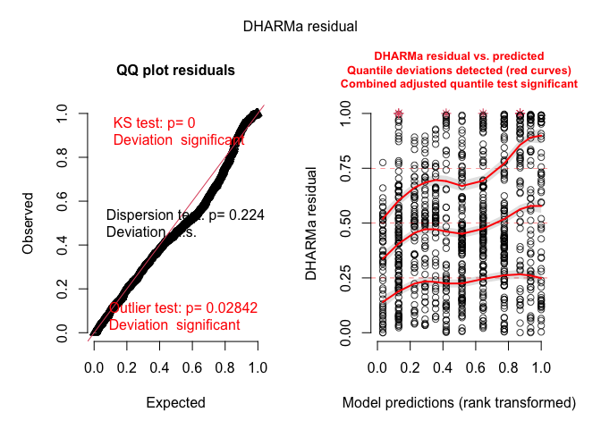<!-- -->

    ## Object of Class DHARMa with simulated residuals based on 250 simulations with refit = FALSE . See ?DHARMa::simulateResiduals for help. 
    ##  
    ## Scaled residual values: 0.344 0.351217 0.764 0.332 0.2 0.05730672 0.34 0.02866892 0.888 0.568 0.56 0.148 0.0168836 0.08126954 0.02020333 0.296 0.228 0.62 0.392 0.0882887 ...

``` r
testDispersion(model_zip_location )
```

<!-- -->

    ## 
    ##  DHARMa nonparametric dispersion test via sd of residuals fitted vs.
    ##  simulated
    ## 
    ## data:  simulationOutput
    ## dispersion = 3.2755, p-value = 0.12
    ## alternative hypothesis: two.sided

``` r
check_model(model_zip_location) #Perfect, preditions match real data
```

    ## `check_outliers()` does not yet support models of class `glmmTMB`.

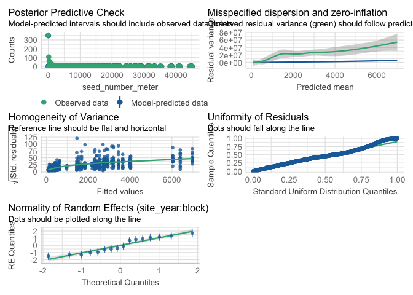<!-- -->

``` r
summary(model_zip_location)
```

    ##  Family: poisson  ( log )
    ## Formula:          seed_number_meter ~ mowing + (1 | site_year:block)
    ## Zero inflation:                     ~location
    ## Data: weed_seeds_clean
    ## 
    ##       AIC       BIC    logLik  deviance  df.resid 
    ## 1122940.7 1122977.3 -561462.3 1122924.7       712 
    ## 
    ## Random effects:
    ## 
    ## Conditional model:
    ##  Groups          Name        Variance Std.Dev.
    ##  site_year:block (Intercept) 1.115    1.056   
    ## Number of obs: 720, groups:  site_year:block, 12
    ## 
    ## Conditional model:
    ##              Estimate Std. Error z value Pr(>|z|)    
    ## (Intercept)  7.041657   0.304766   23.11   <2e-16 ***
    ## mowingEWC   -0.040945   0.002576  -15.89   <2e-16 ***
    ## mowingLWC   -0.704631   0.003357 -209.91   <2e-16 ***
    ## mowingNWC   -0.073988   0.002576  -28.73   <2e-16 ***
    ## ---
    ## Signif. codes:  0 '***' 0.001 '**' 0.01 '*' 0.05 '.' 0.1 ' ' 1
    ## 
    ## Zero-inflation model:
    ##             Estimate Std. Error z value Pr(>|z|)    
    ## (Intercept)  0.03332    0.12912   0.258   0.7963    
    ## locationFH   0.30314    0.18389   1.649   0.0992 .  
    ## locationVT  -1.90514    0.22963  -8.297   <2e-16 ***
    ## ---
    ## Signif. codes:  0 '***' 0.001 '**' 0.01 '*' 0.05 '.' 0.1 ' ' 1

``` r
VarCorr(model_zip_location )
```

    ## 
    ## Conditional model:
    ##  Groups          Name        Std.Dev.
    ##  site_year:block (Intercept) 1.0557

``` r
outlier_test <- testOutliers(model_zip_location, type = "bootstrap")
```

<!-- -->

\###Glmm zero-inflated negative bionomial (mowing)

``` r
# Run a Zero-Inflated Negative Binomial model
model_zinb<- glmmTMB(seed_number_meter ~ mowing+ (1|site_year:block),  
                       data = weed_seeds_clean, 
                       family = nbinom2(link = "log"), 
                       zi = ~ mowing)

### Two checks specifically for a generalize linear approach
simulateResiduals(model_zinb ,plot = TRUE) 
```

    ## DHARMa:testOutliers with type = binomial may have inflated Type I error rates for integer-valued distributions. To get a more exact result, it is recommended to re-run testOutliers with type = 'bootstrap'. See ?testOutliers for details

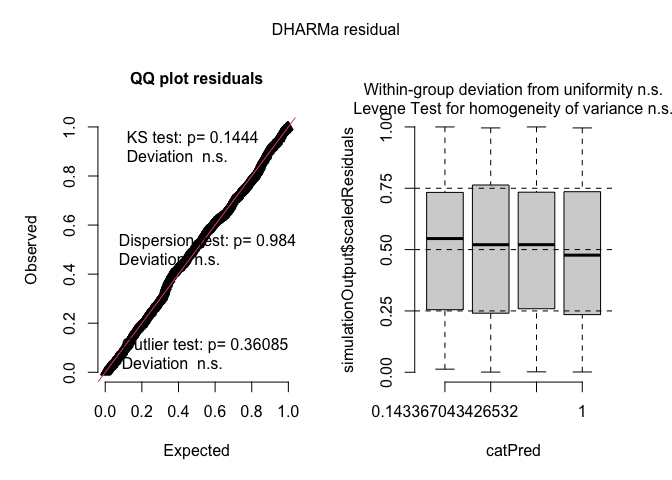<!-- -->

    ## Object of Class DHARMa with simulated residuals based on 250 simulations with refit = FALSE . See ?DHARMa::simulateResiduals for help. 
    ##  
    ## Scaled residual values: 0.728 0.772 0.896 0.628 0.496 0.09865843 0.624 0.09152104 0.912 0.72 0.752 0.448 0.5558199 0.1607951 0.3594592 0.604 0.544 0.832 0.64 0.2454435 ...

``` r
testDispersion(model_zinb )
```

<!-- -->

    ## 
    ##  DHARMa nonparametric dispersion test via sd of residuals fitted vs.
    ##  simulated
    ## 
    ## data:  simulationOutput
    ## dispersion = 1.3104, p-value = 0.432
    ## alternative hypothesis: two.sided

``` r
check_model(model_zinb) #Perfect, preditions match real data
```

    ## `check_outliers()` does not yet support models of class `glmmTMB`.

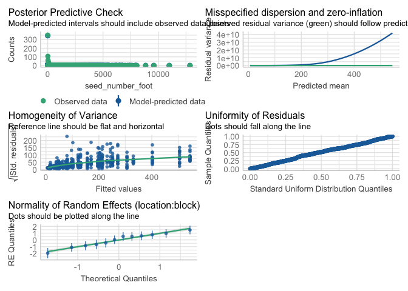<!-- -->

``` r
summary(model_zinb)
```

    ##  Family: nbinom2  ( log )
    ## Formula:          seed_number_meter ~ mowing + (1 | site_year:block)
    ## Zero inflation:                     ~mowing
    ## Data: weed_seeds_clean
    ## 
    ##      AIC      BIC   logLik deviance df.resid 
    ##   8051.2   8097.0  -4015.6   8031.2      710 
    ## 
    ## Random effects:
    ## 
    ## Conditional model:
    ##  Groups          Name        Variance Std.Dev.
    ##  site_year:block (Intercept) 1.046    1.023   
    ## Number of obs: 720, groups:  site_year:block, 12
    ## 
    ## Dispersion parameter for nbinom2 family (): 0.967 
    ## 
    ## Conditional model:
    ##             Estimate Std. Error z value Pr(>|z|)    
    ## (Intercept)  7.05247    0.31197  22.607  < 2e-16 ***
    ## mowingEWC    0.01300    0.14139   0.092    0.927    
    ## mowingLWC   -0.67519    0.15553  -4.341 1.42e-05 ***
    ## mowingNWC   -0.06907    0.13749  -0.502    0.615    
    ## ---
    ## Signif. codes:  0 '***' 0.001 '**' 0.01 '*' 0.05 '.' 0.1 ' ' 1
    ## 
    ## Zero-inflation model:
    ##             Estimate Std. Error z value Pr(>|z|)    
    ## (Intercept) -0.62576    0.15697  -3.986 6.71e-05 ***
    ## mowingEWC    0.16873    0.21945   0.769 0.441959    
    ## mowingLWC    0.81974    0.21730   3.772 0.000162 ***
    ## mowingNWC   -0.02467    0.22240  -0.111 0.911691    
    ## ---
    ## Signif. codes:  0 '***' 0.001 '**' 0.01 '*' 0.05 '.' 0.1 ' ' 1

``` r
outlier_test <- testOutliers(model_zinb, type = "bootstrap")
```

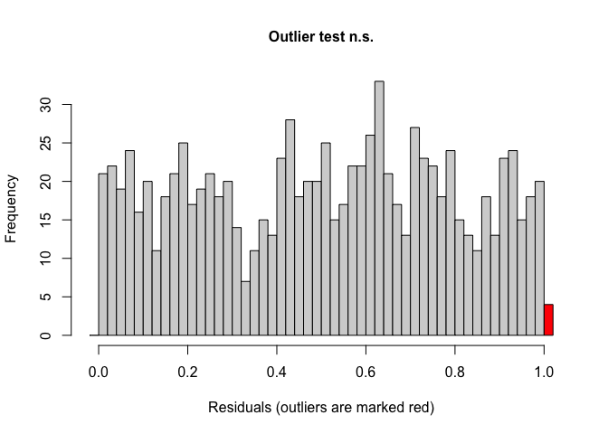<!-- -->

#### Joint test (anova)

``` r
model_zinb |> 
  joint_tests() |> 
  kable()  
```

| model term | df1 | df2 | F.ratio |  Chisq |  p.value |
|:-----------|----:|----:|--------:|-------:|---------:|
| mowing     |   3 | Inf |   8.145 | 24.435 | 2.03e-05 |

#### Anova table

``` r
options(contrasts = c("contr.sum", "contr.poly"))
Anova(model_zinb, type = 3)
```

    ## Analysis of Deviance Table (Type III Wald chisquare tests)
    ## 
    ## Response: seed_number_meter
    ##               Chisq Df Pr(>Chisq)    
    ## (Intercept) 511.055  1  < 2.2e-16 ***
    ## mowing       24.435  3  2.026e-05 ***
    ## ---
    ## Signif. codes:  0 '***' 0.001 '**' 0.01 '*' 0.05 '.' 0.1 ' ' 1

#### Fisher compact letter display

##### Weed control (Significant)

``` r
cld_mowing_fisher <-cld(emmeans(model_zinb, ~  mowing, type = "response"), Letters = letters,adjust = "none", sort = TRUE, reversed=TRUE)
cld_mowing_fisher
```

    ##  mowing response  SE  df asymp.LCL asymp.UCL .group
    ##  EWC        1171 365 Inf       635      2158  a    
    ##  AWC        1156 361 Inf       627      2130  a    
    ##  NWC        1079 336 Inf       586      1985  a    
    ##  LWC         588 188 Inf       315      1099   b   
    ## 
    ## Confidence level used: 0.95 
    ## Intervals are back-transformed from the log scale 
    ## Tests are performed on the log scale 
    ## significance level used: alpha = 0.05 
    ## NOTE: If two or more means share the same grouping symbol,
    ##       then we cannot show them to be different.
    ##       But we also did not show them to be the same.

\##FARMHUB REPORT \### Glmm Poisson

``` r
model_poisson_fh <- glmmTMB(seed_number_meter ~ mowing  + (1|site_year:block),  
                         data = weed_seeds_clean_fh, 
                         family = poisson(link = "log"))

###It assumes that mowing effects may vary by block, in addition to site-year and block-level variation.
#This would be useful if you suspect that mowing impacts weed biomass differently in different blocks.
#The model accounts for hierarchical structure down to the mowing level within blocks.

### Two checks specifically for a generalize linear approach
simulateResiduals(model_poisson_fh,plot = TRUE) 
```

<!-- -->

    ## Object of Class DHARMa with simulated residuals based on 250 simulations with refit = FALSE . See ?DHARMa::simulateResiduals for help. 
    ##  
    ## Scaled residual values: 0 0.08649119 0.876 0.7301609 0 0 0 0 0.1388218 0 0 0.03328265 0 0 0 0.94 0 0.096 0.4663659 0 ...

``` r
testDispersion(model_poisson_fh )
```

<!-- -->

    ## 
    ##  DHARMa nonparametric dispersion test via sd of residuals fitted vs.
    ##  simulated
    ## 
    ## data:  simulationOutput
    ## dispersion = 8.175, p-value = 0.008
    ## alternative hypothesis: two.sided

``` r
check_model(model_poisson_fh ) #Perfect, preditions match real data
```

    ## `check_outliers()` does not yet support models of class `glmmTMB`.

<!-- -->

``` r
summary(model_poisson_fh )
```

    ##  Family: poisson  ( log )
    ## Formula:          seed_number_meter ~ mowing + (1 | site_year:block)
    ## Data: weed_seeds_clean_fh
    ## 
    ##       AIC       BIC    logLik  deviance  df.resid 
    ##  265834.1  265854.9 -132912.0  265824.1       475 
    ## 
    ## Random effects:
    ## 
    ## Conditional model:
    ##  Groups          Name        Variance Std.Dev.
    ##  site_year:block (Intercept) 0.3955   0.6289  
    ## Number of obs: 480, groups:  site_year:block, 8
    ## 
    ## Conditional model:
    ##              Estimate Std. Error z value Pr(>|z|)    
    ## (Intercept)  5.307537   0.222370   23.87   <2e-16 ***
    ## mowing1      0.130956   0.004981   26.29   <2e-16 ***
    ## mowing2      0.292129   0.004754   61.45   <2e-16 ***
    ## mowing3     -0.908794   0.007206 -126.12   <2e-16 ***
    ## ---
    ## Signif. codes:  0 '***' 0.001 '**' 0.01 '*' 0.05 '.' 0.1 ' ' 1

``` r
VarCorr(model_poisson_fh )
```

    ## 
    ## Conditional model:
    ##  Groups          Name        Std.Dev.
    ##  site_year:block (Intercept) 0.62887

``` r
outlier_test <- testOutliers(model_poisson_fh, type = "bootstrap")
```

<!-- -->
\###Glmm negative binomial

``` r
model_nbinom_fh<- glmmTMB(seed_number_meter ~ mowing + (1|site_year:block),  
                        data = weed_seeds_clean_fh, 
                        family = nbinom2(link = "log"))

### Two checks specifically for a generalize linear approach
simulateResiduals(model_nbinom_fh ,plot = TRUE) 
```

<!-- -->

    ## Object of Class DHARMa with simulated residuals based on 250 simulations with refit = FALSE . See ?DHARMa::simulateResiduals for help. 
    ##  
    ## Scaled residual values: 0.02778849 0.7764772 0.86 0.876 0.008950803 0.03477422 0.2439087 0.1481833 0.756 0.4747605 0.03914392 0.736 0.4192839 0.4747565 0.2068334 0.88 0.3796904 0.788 0.852 0.2383981 ...

``` r
testDispersion(model_nbinom_fh)
```

<!-- -->

    ## 
    ##  DHARMa nonparametric dispersion test via sd of residuals fitted vs.
    ##  simulated
    ## 
    ## data:  simulationOutput
    ## dispersion = 0.31319, p-value = 0.088
    ## alternative hypothesis: two.sided

``` r
check_model(model_nbinom_fh ) #Perfect, preditions match real data
```

    ## `check_outliers()` does not yet support models of class `glmmTMB`.

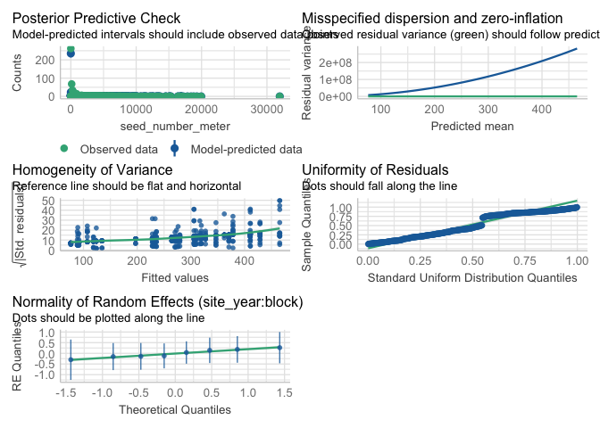<!-- -->

``` r
summary(model_nbinom_fh )
```

    ##  Family: nbinom2  ( log )
    ## Formula:          seed_number_meter ~ mowing + (1 | site_year:block)
    ## Data: weed_seeds_clean_fh
    ## 
    ##      AIC      BIC   logLik deviance df.resid 
    ##   4165.5   4190.5  -2076.7   4153.5      474 
    ## 
    ## Random effects:
    ## 
    ## Conditional model:
    ##  Groups          Name        Variance Std.Dev.
    ##  site_year:block (Intercept) 0.1005   0.3171  
    ## Number of obs: 480, groups:  site_year:block, 8
    ## 
    ## Dispersion parameter for nbinom2 family (): 0.0915 
    ## 
    ## Conditional model:
    ##             Estimate Std. Error z value Pr(>|z|)    
    ## (Intercept)   5.4622     0.1949  28.026  < 2e-16 ***
    ## mowing1       0.1208     0.2686   0.450  0.65285    
    ## mowing2       0.2902     0.2664   1.089  0.27593    
    ## mowing3      -0.8263     0.2850  -2.899  0.00375 ** 
    ## ---
    ## Signif. codes:  0 '***' 0.001 '**' 0.01 '*' 0.05 '.' 0.1 ' ' 1

``` r
VarCorr(model_nbinom_fh )
```

    ## 
    ## Conditional model:
    ##  Groups          Name        Std.Dev.
    ##  site_year:block (Intercept) 0.31707

``` r
outlier_test <- testOutliers(model_nbinom_fh, type = "bootstrap")
```

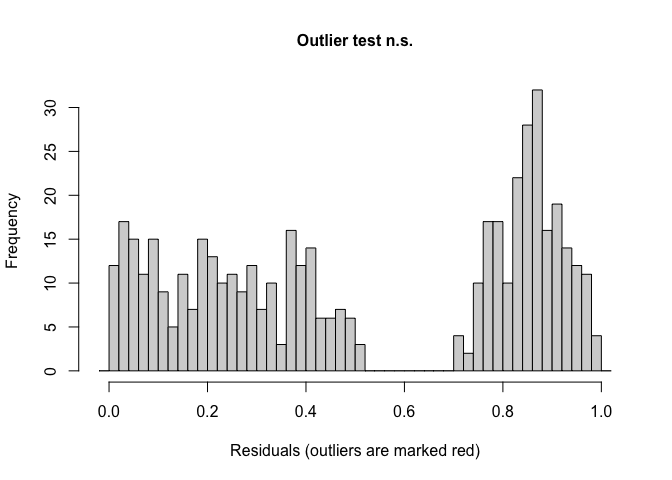<!-- -->
\###Glmm Zero-inflated Poisson (mowing)

``` r
model_zip_fh <- glmmTMB(seed_number_meter ~ mowing + (1|site_year:block),  
                     data = weed_seeds_clean_fh, 
                     family = poisson(link = "log"), 
                     zi = ~ mowing)  # Zero inflation part modeled by 'mowing'

### Two checks specifically for a generalize linear approach
simulateResiduals(model_zip_fh ,plot = TRUE) 
```

<!-- -->

    ## Object of Class DHARMa with simulated residuals based on 250 simulations with refit = FALSE . See ?DHARMa::simulateResiduals for help. 
    ##  
    ## Scaled residual values: 0.4431317 0.472 0.784 0.696 0.2086259 0.3115372 0.3991074 0.1091244 0.516 0.3373097 0.2415255 0.448 0.4032499 0.1183982 0.3984154 0.912 0.09179737 0.456 0.5762675 0.2985012 ...

``` r
testDispersion(model_zip_fh )
```

<!-- -->

    ## 
    ##  DHARMa nonparametric dispersion test via sd of residuals fitted vs.
    ##  simulated
    ## 
    ## data:  simulationOutput
    ## dispersion = 2.7583, p-value = 0.016
    ## alternative hypothesis: two.sided

``` r
check_model(model_zip_fh) #Perfect, preditions match real data
```

    ## `check_outliers()` does not yet support models of class `glmmTMB`.

<!-- -->

``` r
summary(model_zip_fh)
```

    ##  Family: poisson  ( log )
    ## Formula:          seed_number_meter ~ mowing + (1 | site_year:block)
    ## Zero inflation:                     ~mowing
    ## Data: weed_seeds_clean_fh
    ## 
    ##      AIC      BIC   logLik deviance df.resid 
    ##  96712.5  96750.1 -48347.3  96694.5      471 
    ## 
    ## Random effects:
    ## 
    ## Conditional model:
    ##  Groups          Name        Variance Std.Dev.
    ##  site_year:block (Intercept) 0.2258   0.4752  
    ## Number of obs: 480, groups:  site_year:block, 8
    ## 
    ## Conditional model:
    ##              Estimate Std. Error z value Pr(>|z|)    
    ## (Intercept)  6.161982   0.168035   36.67  < 2e-16 ***
    ## mowing1     -0.038914   0.005031   -7.73 1.04e-14 ***
    ## mowing2      0.273064   0.004888   55.87  < 2e-16 ***
    ## mowing3     -0.413841   0.007276  -56.88  < 2e-16 ***
    ## ---
    ## Signif. codes:  0 '***' 0.001 '**' 0.01 '*' 0.05 '.' 0.1 ' ' 1
    ## 
    ## Zero-inflation model:
    ##             Estimate Std. Error z value Pr(>|z|)    
    ## (Intercept)  0.19501    0.09358   2.084 0.037166 *  
    ## mowing1     -0.16167    0.15946  -1.014 0.310657    
    ## mowing2     -0.09492    0.15958  -0.595 0.551946    
    ## mowing3      0.65228    0.16911   3.857 0.000115 ***
    ## ---
    ## Signif. codes:  0 '***' 0.001 '**' 0.01 '*' 0.05 '.' 0.1 ' ' 1

``` r
VarCorr(model_zip_fh)
```

    ## 
    ## Conditional model:
    ##  Groups          Name        Std.Dev.
    ##  site_year:block (Intercept) 0.47516

``` r
outlier_test <- testOutliers(model_zip_fh, type = "bootstrap")
```

<!-- -->
\###Glmm zero-inflated negative bionomial (mowing)

``` r
# Run a Zero-Inflated Negative Binomial model
model_zinb_fh<- glmmTMB(seed_number_meter ~ mowing+ (1|site_year:block),  
                       data = weed_seeds_clean_fh, 
                       family = nbinom2(link = "log"), 
                       zi = ~ mowing)

### Two checks specifically for a generalize linear approach
simulateResiduals(model_zinb_fh ,plot = TRUE) 
```

<!-- -->

    ## Object of Class DHARMa with simulated residuals based on 250 simulations with refit = FALSE . See ?DHARMa::simulateResiduals for help. 
    ##  
    ## Scaled residual values: 0.124836 0.584 0.828 0.7559395 0.606137 0.6781624 0.4291923 0.02578756 0.564 0.1881146 0.3418972 0.5290754 0.07025936 0.5061723 0.3108996 0.896 0.4362233 0.524 0.644 0.1704318 ...

``` r
testDispersion(model_zinb_fh )
```

<!-- -->

    ## 
    ##  DHARMa nonparametric dispersion test via sd of residuals fitted vs.
    ##  simulated
    ## 
    ## data:  simulationOutput
    ## dispersion = 1.4082, p-value = 0.224
    ## alternative hypothesis: two.sided

``` r
check_model(model_zinb_fh) #Perfect, preditions match real data
```

    ## `check_outliers()` does not yet support models of class `glmmTMB`.

<!-- -->

``` r
summary(model_zinb_fh)
```

    ##  Family: nbinom2  ( log )
    ## Formula:          seed_number_meter ~ mowing + (1 | site_year:block)
    ## Zero inflation:                     ~mowing
    ## Data: weed_seeds_clean_fh
    ## 
    ##      AIC      BIC   logLik deviance df.resid 
    ##   3844.1   3885.8  -1912.0   3824.1      470 
    ## 
    ## Random effects:
    ## 
    ## Conditional model:
    ##  Groups          Name        Variance Std.Dev.
    ##  site_year:block (Intercept) 0.1911   0.4372  
    ## Number of obs: 480, groups:  site_year:block, 8
    ## 
    ## Dispersion parameter for nbinom2 family (): 1.51 
    ## 
    ## Conditional model:
    ##             Estimate Std. Error z value Pr(>|z|)    
    ## (Intercept)  6.20710    0.16515   37.58  < 2e-16 ***
    ## mowing1     -0.01899    0.10018   -0.19  0.84963    
    ## mowing2      0.24986    0.10126    2.47  0.01360 *  
    ## mowing3     -0.32101    0.12014   -2.67  0.00754 ** 
    ## ---
    ## Signif. codes:  0 '***' 0.001 '**' 0.01 '*' 0.05 '.' 0.1 ' ' 1
    ## 
    ## Zero-inflation model:
    ##             Estimate Std. Error z value Pr(>|z|)    
    ## (Intercept)  0.19461    0.09360   2.079 0.037597 *  
    ## mowing1     -0.16173    0.15950  -1.014 0.310590    
    ## mowing2     -0.09478    0.15960  -0.594 0.552588    
    ## mowing3      0.65224    0.16914   3.856 0.000115 ***
    ## ---
    ## Signif. codes:  0 '***' 0.001 '**' 0.01 '*' 0.05 '.' 0.1 ' ' 1

``` r
outlier_test <- testOutliers(model_zinb_fh, type = "bootstrap")
```

<!-- -->

#### Joint test (anova)

``` r
model_zinb_fh |> 
  joint_tests() |> 
  kable()  
```

| model term | df1 | df2 | F.ratio | Chisq |   p.value |
|:-----------|----:|----:|--------:|------:|----------:|
| mowing     |   3 | Inf |   3.278 | 9.834 | 0.0200177 |

#### Anova table

``` r
options(contrasts = c("contr.sum", "contr.poly"))
Anova(model_zinb_fh, type = 3)
```

    ## Analysis of Deviance Table (Type III Wald chisquare tests)
    ## 
    ## Response: seed_number_meter
    ##                 Chisq Df Pr(>Chisq)    
    ## (Intercept) 1412.5235  1    < 2e-16 ***
    ## mowing         9.8355  3    0.02002 *  
    ## ---
    ## Signif. codes:  0 '***' 0.001 '**' 0.01 '*' 0.05 '.' 0.1 ' ' 1

#### Fisher compact letter display

##### Weed control (Significant)

``` r
cld_mowing_fisher_fh <-cld(emmeans(model_zinb_fh, ~  mowing, type = "response"), Letters = letters,adjust = "none", sort = TRUE, reversed=TRUE)
cld_mowing_fisher_fh
```

    ##  mowing response    SE  df asymp.LCL asymp.UCL .group
    ##  EWC         637 122.0 Inf       438       927  a    
    ##  NWC         543 102.0 Inf       375       786  a    
    ##  AWC         487  93.3 Inf       335       709  ab   
    ##  LWC         360  75.9 Inf       238       544   b   
    ## 
    ## Confidence level used: 0.95 
    ## Intervals are back-transformed from the log scale 
    ## Tests are performed on the log scale 
    ## significance level used: alpha = 0.05 
    ## NOTE: If two or more means share the same grouping symbol,
    ##       then we cannot show them to be different.
    ##       But we also did not show them to be the same.

\#Figures \##ECOBEAN \### Mowing (Significant)

``` r
weed_seeds_clean |> 
  left_join(cld_mowing_fisher) |> 
  ggplot(aes(x = factor(mowing, levels = c("NWC", "EWC", "LWC", "AWC")), y = response, fill = mowing)) +
  #stat_summary(geom = "bar", fun = "mean", width = 0.7) +
  #stat_summary(geom = "errorbar", fun.data = "mean_se", width = 0.2) +
  #stat_summary(geom="text", fun = "MeanPlusSe", aes(label= trimws(.group)),size=6.5,vjust=-0.5) +
  geom_bar(stat="identity", position=position_dodge()) + 
  geom_errorbar(aes(ymin=response-SE, ymax=response+SE), width=.2,
                 position=position_dodge(.9))+
geom_text(aes(label = trimws(.group), y = response + (SE + 44)), size = 7) +
  labs(
    x = "",
      y = expression("Seed density" ~ (seeds~m^{-2})),
    #title = str_c("Influence of interrow weed control on weed biomass"),
    subtitle = expression(italic("P < 0.005"))) +
  
  scale_x_discrete(labels = c("No\nmowing", "Early\nmowing", "Late\nmowing", "As-needed\nmowing")) +
  scale_y_continuous(expand = expansion(mult = c(0.05, 0.3))) +
  scale_fill_WB_d(name = "BlueberriesForSal", direction = 1) +
   theme_bw() +
  theme(
    legend.position = "none",
    strip.background = element_blank(),
    strip.text = element_text(face = "bold", size = 12),
    axis.title = element_text(size = 24),  # Increase font size of axis titles
    axis.text = element_text(size = 24),   # Increase font size of axis labels
    plot.title = element_text(size = 24, face = "bold"),  # Increase font size of title
    plot.subtitle = element_text(size = 24, face = "italic")  # Increase font size of subtitle
  )
```

<!-- -->

``` r
ggsave("weed_seeds_mowing_meter_eco.png", width = 10, height = 8, dpi = 300)
```

\##FARMHUB REPORT \### Mowing (Significant)

``` r
weed_seeds_clean_fh |> 
  left_join(cld_mowing_fisher_fh) |> 
  ggplot(aes(x = factor(mowing, levels = c("NWC", "EWC", "LWC", "AWC")), y = response, fill = mowing)) +
  #stat_summary(geom = "bar", fun = "mean", width = 0.7) +
  #stat_summary(geom = "errorbar", fun.data = "mean_se", width = 0.2) +
  #stat_summary(geom="text", fun = "MeanPlusSe", aes(label= trimws(.group)),size=6.5,vjust=-0.5) +
  geom_bar(stat="identity", position=position_dodge()) + 
  geom_errorbar(aes(ymin=response-SE, ymax=response+SE), width=.2,
                 position=position_dodge(.9))+
geom_text(aes(label = trimws(.group), y = response + (SE + 26)), size = 7) +
  labs(
    x = "",
     y = expression("Seed density" ~ (seeds~m^{-2})),
    #title = str_c("Influence of interrow weed control on weed biomass"),
    subtitle = expression(italic("P < 0.05"))) +
  
  scale_x_discrete(labels = c("No\nmowing", "Early\nmowing", "Late\nmowing", "As-needed\nmowing")) +
  scale_y_continuous(expand = expansion(mult = c(0.05, 0.3))) +
  scale_fill_WB_d(name = "BlueberriesForSal", direction = 1) +
   theme_bw() +
  theme(
    legend.position = "none",
    strip.background = element_blank(),
    strip.text = element_text(face = "bold", size = 12),
    axis.title = element_text(size = 24),  # Increase font size of axis titles
    axis.text = element_text(size = 24),   # Increase font size of axis labels
    plot.title = element_text(size = 24, face = "bold"),  # Increase font size of title
    plot.subtitle = element_text(size = 24, face = "italic")  # Increase font size of subtitle
  )
```

<!-- -->

``` r
ggsave("weed_seeds_mowing_meter_fh.png", width = 10, height = 8, dpi = 300)
```
